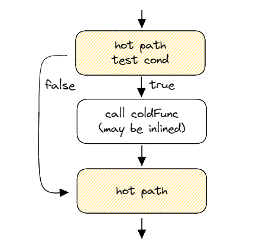
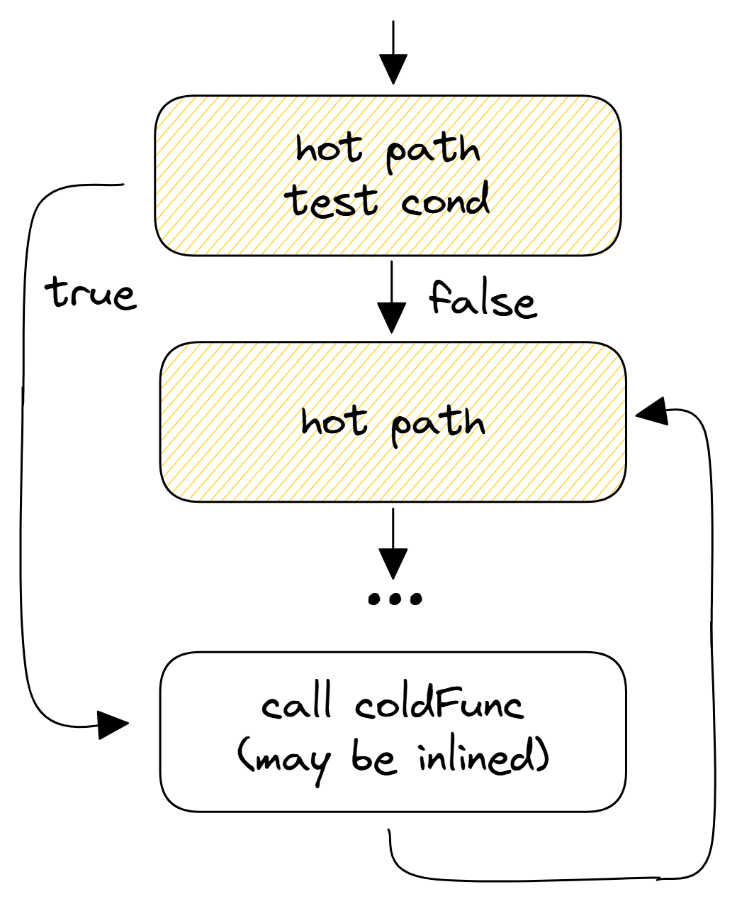

## Basic Block Placement {#sec:secLIKELY}

Suppose we have a hot path in the program that has some error handling code (`coldFunc`) in between:

```cpp
// hot path
if (cond)
  coldFunc();
// hot path again
```
Figure @fig:BBLayout shows two possible physical layouts for this snippet of code. Figure @fig:BB_default is the layout most compiler will emit by default, given no hints provided. The layout that is shown in Figure @fig:BB_better can be achieved if we invert the condition `cond` and place hot code as fall through.

<div id="fig:BBLayout">
{#fig:BB_default width=50%}
{#fig:BB_better width=50%}

Two versions of machine code layout for the snippet of code above.
</div>

Which layout is better? Well, it depends on whether `cond` is usually true or false. If `cond` is usually true, then we would better choose the default layout because otherwise, we would be doing two jumps instead of one. Also, in the general case, if `coldFunc` is a relatively small function, we would want to have it inlined. However, in this particular example, we know that `coldFunc` is an error handling function and is likely not executed very often. By choosing layout @fig:BB_better, we maintain fall through between hot pieces of the code and convert taken branch into not taken one.

There are a few reasons why the layout presented in Figure @fig:BB_better performs better. First of all, layout in Figure @fig:BB_better makes better use of the instruction and $\mu$op-cache (DSB, see [@sec:uarchFE]). With all hot code contiguous, there is no cache line fragmentation: all the cache lines in the L1I-cache are used by hot code. The same is true for the $\mu$op-cache since it caches based on the underlying code layout as well. Secondly, taken branches are also more expensive for the fetch unit. The Front-End of a CPU fetches contiguous chunks of bytes, so every taken jump means the bytes after the jump are useless. This reduces the maximum effective fetch throughput. Finally, on some architectures, not taken branches are fundamentally cheaper than taken. For instance, Intel Skylake CPUs can execute two untaken branches per cycle but only one taken branch every two cycles.[^2]

To suggest a compiler to generate an improved version of the machine code layout, one can provide a hint using `[[likely]]`	and `[[unlikely]]` attributes, which is available since C++20. The code that uses this hint will look like this:

```cpp
// hot path
if (cond) [[unlikely]] 
  coldFunc();
// hot path again
```

In the code above, `[[unlikely]]` hint will instruct the compiler that `cond` is unlikely to be true, so compiler should adjust the code layout accordingly. Prior to C++20, developers could have used [`__builtin_expect`](https://llvm.org/docs/BranchWeightMetadata.html#builtin-expect)[^3] construct and they usually created `LIKELY` wrapper hints themselves to make the code more readable. For example:

```cpp
#define LIKELY(EXPR)   __builtin_expect((bool)(EXPR), true)
#define UNLIKELY(EXPR) __builtin_expect((bool)(EXPR), false)
// hot path
if (UNLIKELY(cond)) // NOT 
  coldFunc();
// hot path again
```

Optimizing compilers will not only improve code layout when they encounter "likely/unlikely" hints. They will also leverage this information in other places. For example, when `[[unlikely]]` attribute is applied, the compiler will prevent inlining `coldFunc` since it now knows that it is unlikely to be executed often and it's more beneficial to optimize it for size, i.e., just leave a `CALL` to this function. Inserting `[[likely]]` attribute is also possible for a switch statement as presented in [@lst:BuiltinSwitch].

Listing: Likely attribute used in a switch statement

~~~~ {#lst:BuiltinSwitch .cpp}
for (;;) {
  switch (instruction) {
               case NOP: handleNOP(); break;
    [[likely]] case ADD: handleADD(); break;
               case RET: handleRET(); break;
    // handle other instructions
  }
}
~~~~~~~~~~~~~~~~~~~~~~~~~~~~~~~~~~~~~~~~~~~~~~~~~

Using this hint, a compiler will be able to reorder code a little bit differently and optimize the hot switch for faster processing of `ADD` instructions.

[^2]: Though, there is a special small loop optimization that allows very small loops to have one taken branch per cycle.
[^3]: More about builtin-expect here: [https://llvm.org/docs/BranchWeightMetadata.html#builtin-expect](https://llvm.org/docs/BranchWeightMetadata.html#builtin-expect).
[^10]: C++ standard `[[likely]]` attribute: [https://en.cppreference.com/w/cpp/language/attributes/likely](https://en.cppreference.com/w/cpp/language/attributes/likely).
