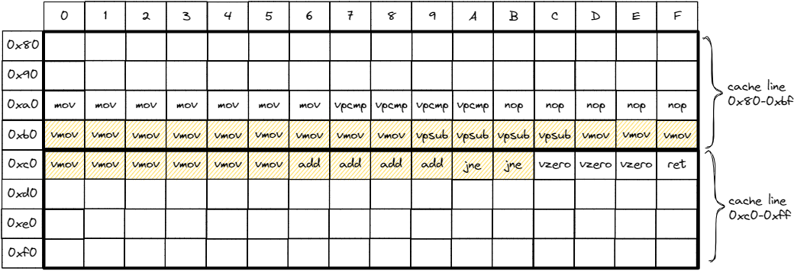
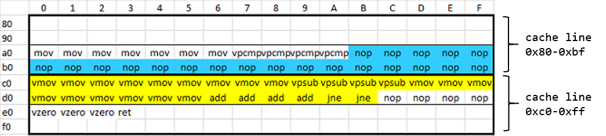

## Basic Block Alignment

Sometimes performance can significantly change depending on the offset at which instructions are laid out in memory. Consider a simple function presented in [@lst:LoopAlignment] along with a corresponding machine code when compiled with `-O3 -march=core-avx2 -fno-unroll-loops`. Loop unrolling is disabled for illustrating the idea.

Listing: Basic block alignment

~~~~ {#lst:LoopAlignment .cpp}
void benchmark_func(int* a) {    │ 00000000004046a0 <_Z14benchmark_funcPi>:
  for (int i = 0; i < 32; ++i)   │ 4046a0: mov rax,0xffffffffffffff80
    a[i] += 1;                   │ 4046a7: vpcmpeqd ymm0,ymm0,ymm0
}                                │ 4046ab: nop DWORD [rax+rax+0x0]
                                 │ 4046b0: vmovdqu ymm1,[rdi+rax+0x80] # loop begins
                                 │ 4046b9: vpsubd ymm1,ymm1,ymm0
                                 │ 4046bd: vmovdqu [rdi+rax+0x80],ymm1
                                 │ 4046c6: add rax,0x20
                                 │ 4046ca: jne 4046b0                  # loop ends
                                 │ 4046cc: vzeroupper 
                                 │ 4046cf: ret 
~~~~~~~~~~~~~~~~~~~~~~~~~~~~~~~~~~~~~~~~~~~~~~~~~

The code itself is pretty reasonable, but its layout is not perfect (see Figure @fig:Loop_default). Instructions that correspond to the loop are highlighted with yellow hachure. As well as for data caches, instruction cache lines are 64 bytes long. On Figure @fig:LoopLayout thick boxes denote cache line borders. Notice that the loop spans multiple cache lines: it begins on the cache line `0x80-0xBF` and ends in the cache-line `0xC0-0xFF`. To fetch instructions that are executed in the loop, a processor needs to read two cache lines. These kinds of situations usually cause performance problems for the CPU Front-End, especially for the small loops like presented above.

To fix this, we can shift the loop instructions forward by 16 bytes using NOPs so that the whole loop will reside in one cache line. Figure @fig:Loop_better shows the effect of doing this with NOP instructions highlighted in blue. Interestingly, the performance impact is visible even you run nothing but this hot loop in a microbenchmark. It is somewhat puzzling since the amount of code is tiny and it shouldn't saturate the L1I-cache size on any modern CPU. The reason for the better performance of the layout in Figure @fig:Loop_better is not trivial to explain and will involve a fair amount of microarchitectural details, which we don't discuss in this book. Interested readers can find more information in the article "[Code alignment issues](https://easyperf.net/blog/2018/01/18/Code_alignment_issues)" on the easyperf blog.[^1]

<div id="fig:LoopLayout">
{#fig:Loop_default width=90%}

{#fig:Loop_better width=90%}

Two different code layouts for the loop in [@lst:LoopAlignment].
</div>

By default, the LLVM compiler recognizes loops and aligns them at 16B boundaries, as we saw in Figure @fig:Loop_default. To reach the desired code placement for our example, as shown in Figure @fig:Loop_better, one can use the `-mllvm -align-all-blocks=5` option that will align every basic block in an object file at a 32 bytes boundary. However, be careful with using this option, as it can easily degrade performance in other places. This option inserts NOPs on the executed path, which can add overhead to the program, especially if they stand on a critical path. NOPs do not require execution; however, they still require to be fetched from memory, decoded, and retired. The latter additionally consumes space in FE data structures and buffers for bookkeeping, similar to all other instructions. There are other less intrusive options in the LLVM compiler that can be used to control basic block alignment, which you can check in the easyperf blog [post](https://easyperf.net/blog/2018/01/25/Code_alignment_options_in_llvm).[^6]

A recent addition to the LLVM compiler is the new `[[clang::code_align()]]` loop attribute, which allows developers to specify the alignment of a loop in the source code. This gives a very fine-grained control over machine code layout. Before this attribute was introduced, developers had to resort to some less practical solutions like injecting `asm(".align 64;")` statements of inline assembly in the source code. The following code shows how the new Clang attribute can be used to align a loop at a 64 bytes boundary: 

```cpp
void benchmark_func(int* a) {
  [[clang::code_align(64)]]
  for (int i = 0; i < 32; ++i)
    a[i] += 1;
}
```

Even though CPU architects work hard to minimize the impact of machine code layout, there are still cases when code placement (alignment) can make a difference in performance. Machine code layout is also one of the main sources of noise in performance measurements. It makes it harder to distinguish a real performance improvement or regression from the accidental one, that was caused by the change in the code layout.

[^1]: "Code alignment issues" - [https://easyperf.net/blog/2018/01/18/Code_alignment_issues](https://easyperf.net/blog/2018/01/18/Code_alignment_issues)
[^5]: x86 assembler directives manual - [https://docs.oracle.com/cd/E26502_01/html/E28388/eoiyg.html](https://docs.oracle.com/cd/E26502_01/html/E28388/eoiyg.html). This example uses MASM. Otherwise, you will see the `.align` directive.
[^6]: "Code alignment options in llvm" - [https://easyperf.net/blog/2018/01/25/Code_alignment_options_in_llvm](https://easyperf.net/blog/2018/01/25/Code_alignment_options_in_llvm)
