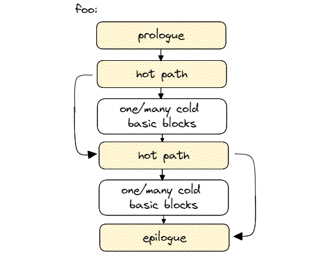
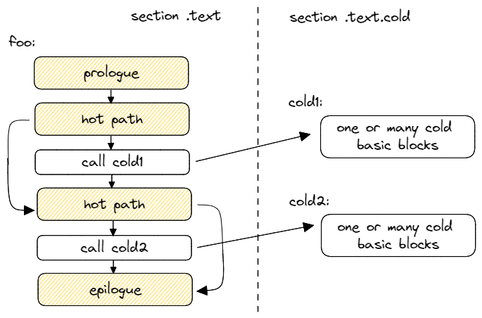

## Function Splitting 

The idea behind function splitting is to separate hot code from the cold. Such transformation is also often called *function outlining*. This optimization is beneficial for relatively big functions with complex control flow graph and large chunks of cold code inside a hot path. An example of code when such transformation might be profitable is shown in [@lst:FunctionSplitting1]. To remove cold basic blocks from the hot path, we cut and paste them into a new function and create a call to it.

Listing: Function splitting: cold code outlined to the new functions.

~~~~ {#lst:FunctionSplitting1 .cpp}
void foo(bool cond1,                void foo(bool cond1,
         bool cond2) {                       bool cond2) {
  // hot path                         // hot path
  if (cond1) {                        if (cond1) {
    /* cold code (1) */                 cold1(); 
  }                                   }
  // hot path                         // hot path
  if (cond2) {              =>        if (cond2) {
    /* cold code (2) */                 cold2(); 
  }                                   }
}                                   }
                                    void cold1() __attribute__((noinline)) 
                                    { /* cold code (1) */ }
                                    void cold2() __attribute__((noinline))
                                    { /* cold code (2) */ }
~~~~~~~~~~~~~~~~~~~~~~~~~~~~~~~~~~~~~~~~~~~~~~~~~

Notice, we disable inlining of cold functions by using `noinline` attribute. Because without it, a compiler may decide to inline it, which will effectively undo our transformation. Alternatively, we could apply the `[[unlikely]]` macro (see [@sec:secLIKELY]) on both `cond1` and `cond2` branches to convey to the compiler that inlining `cold1` and `cold2` functions is not desired.

Figure @fig:FunctionSplitting gives a graphical representation of this transformation. Because we left just a `CALL` instruction inside the hot path, it's likely that the next hot instruction will reside in the same cache line as the previous one. This improves the utilization of CPU Front-End data structures such as I-cache and DSB.

{#fig:FuncSplit_default width=50%}
{#fig:FuncSplit_better width=50%}

Splitting cold code into a separate function.

Outlined functions should be created outside of `.text` segment, for example in `.text.cold`. This improves memory footprint if the function is never called since it won't be loaded into memory at runtime.
