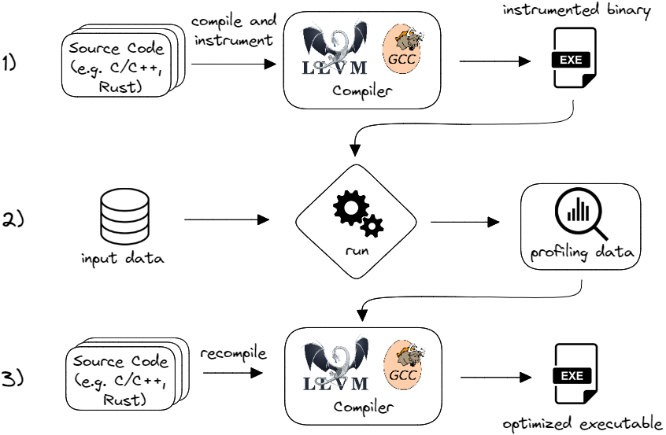

## Profile Guided Optimizations {#sec:secPGO}	

Compiling a program and generating optimal assembly is all about heuristics. Code transformation algorithms have many corner cases that aim for optimal performance in specific situations. For a lot of decisions that a compiler makes, it tries to guess the best choice based on some typical cases. For example, when deciding whether a particular function should be inlined, the compiler could take into account the number of times this function will be called. The problem is that the compiler doesn't know that beforehand. It first needs to run the program to find out. Without any runtime information, the compiler will have to make a guess.

Here is when profiling information becomes handy. Given profiling information, the compiler can make better optimization decisions. There is a set of transformations in most compilers that can adjust their algorithms based on profiling data fed back to them. This set of transformations is called Profile Guided Optimizations (PGO). When profiling data is available, a compiler can use it to direct optimizations. Otherwise, it will fall back to using its standard algorithms and heuristics. Sometimes in literature, you can find the term Feedback Directed Optimizations (FDO), which refers to the same thing as PGO.

Figure @fig:PGO_flow shows a traditional workflow of using PGO, also called *instrumented PGO*. First, you compile your program and tell the compiler to automatically instrument the code. This will insert some bookkeeping code into functions to collect runtime statistics. The second step is to run the instrumented binary with input data that represents a typical workload for your application. This will generate the profiling data, a new file with runtime statistics. It is a raw dump file with information about function call counts, loop iteration counts, and other basic block hit counts. The final step in this workflow is to recompile the program with the profiling data to produce the optimized executable.

{#fig:PGO_flow width=100% }

Developers can enable PGO instrumentation (step 1) in the LLVM compiler by building the program with the `-fprofile-instr-generate` option. This will instruct the compiler to instrument the code, which will collect profiling information at runtime. After that, the LLVM compiler can consume profiling data with the `-fprofile-instr-use` option to recompile the program and output a PGO-tuned binary. The guide for using PGO in Clang is described in the [documentation](https://clang.llvm.org/docs/UsersManual.html#profiling-with-instrumentation).[^7] GCC compiler uses a different set of options: `-fprofile-generate` and `-fprofile-use` as described in the [documentation](https://gcc.gnu.org/onlinedocs/gcc/Optimize-Options.html#Optimize-Options).[^10]

PGO helps the compiler to improve function inlining, code placement, register allocation, and other code transformations. PGO is primarily used in projects with a large codebase, for example, Linux kernel, compilers, databases, web browsers, video games, productivity tools, and others. For applications with millions of lines of code, it is the only practical way to improve machine code layout. 

Not all workloads benefit from PGO. Workloads with severe Frontend bottlenecks, may see speedups of up to 30% from using PGO. However, compute-bound workloads, such as scientific computing, may not see any benefit at all. 

While many software projects adopted instrumented PGO as a part of their build process, the rate of adoption is still very low. There are a few reasons for that. The primary reason is the huge runtime overhead of instrumented executables. Running an instrumented binary and collecting profiling data frequently incurs a 5-10x slowdown, which makes the build step longer and prevents profile collection directly from production systems, whether on client devices or in the cloud. Unfortunately, you cannot collect the profiling data once and use it for all future builds. As the source code of an application evolves, the profile data becomes stale (out of sync) and needs to be recollected.

Another caveat in the PGO flow is that a compiler should only be trained using representative scenarios of how your application will be used. Otherwise, you may end up degrading the program's performance. The compiler "blindly" uses the profile data that you provided. It assumes that the program will always behave the same no matter what the input data is. Users of PGO should be careful about choosing the input data they will use for collecting profiling data (step 2) because while improving one use case of the application, others may be pessimized. Luckily, it doesn't have to be exactly a single workload since profile data from different workloads can be merged to represent a set of use cases for the application.

An alternative solution was pioneered by Google in 2016 with sample-based PGO. [@AutoFDO] Instead of instrumenting the code, the profiling data can be obtained from the output of a standard profiling tool such as Linux `perf`. Google developed an open-source tool called [AutoFDO](https://github.com/google/autofdo)[^8] that converts sampling data generated by Linux `perf` into a format that compilers like GCC and LLVM can understand.

This approach has a few advantages over instrumented PGO. First of all, it eliminates one step from the PGO build workflow, namely step 1 since there is no need to build an instrumented binary. Secondly, profiling data collection runs on an already optimized binary, thus it has a much lower runtime overhead. This makes it possible to collect profiling data in a production environment for a longer time. Since this approach is based on hardware collection, it also enables new kinds of optimizations that are not possible with instrumented PGO. One example is branch-to-cmov conversion, which is a transformation that replaces conditional jumps with conditional moves to avoid the cost of a branch misprediction (see [@sec:BranchlessSelection]). To effectively perform this transformation, a compiler needs to know how frequently the original branch was mispredicted. This information is available with sample-based PGO on modern CPUs (Intel Skylake+).

In mid-2018, Meta open-sourced its binary optimization tool called [BOLT](https://code.fb.com/data-infrastructure/accelerate-large-scale-applications-with-bolt/)[^9] that works on the already compiled binary. It first disassembles the code, then it uses the profile information collected by a sampling profiler, such as Linux `perf`, to do various layout transformations and then relinks the binary again. [@BOLT] As of today, BOLT has more than 15 optimization passes, including basic block reordering, function splitting and reordering, and others. Similar to traditional PGO, primary candidates for BOLT optimizations are programs that suffer from instruction cache and ITLB misses. Since January 2022, BOLT has been a part of the LLVM project and is available as a standalone tool.

A few years after BOLT was introduced, Google open-sourced its binary relinking tool called [Propeller](https://github.com/google/llvm-propeller/blob/plo-dev/Propeller_RFC.pdf). It serves a similar purpose but instead of disassembling the original binary, it relies on linker input and thus can be distributed across several machines for better scaling and less memory consumption. Post-link optimizers such as BOLT and Propeller can be used in combination with traditional PGO (and Link-Time Optimizations) and often provide an additional 5-10% performance speedup. Such techniques open up new kinds of binary rewriting optimizations that are based on hardware telemetry.

[^7]: PGO in Clang - [https://clang.llvm.org/docs/UsersManual.html#profiling-with-instrumentation](https://clang.llvm.org/docs/UsersManual.html#profiling-with-instrumentation)
[^8]: AutoFDO - [https://github.com/google/autofdo](https://github.com/google/autofdo)
[^9]: BOLT - [https://code.fb.com/data-infrastructure/accelerate-large-scale-applications-with-bolt/](https://code.fb.com/data-infrastructure/accelerate-large-scale-applications-with-bolt/)
[^10]: PGO in GCC - [https://gcc.gnu.org/onlinedocs/gcc/Optimize-Options.html#Optimize-Options](https://gcc.gnu.org/onlinedocs/gcc/Optimize-Options.html#Optimize-Options)
