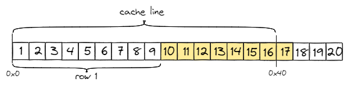
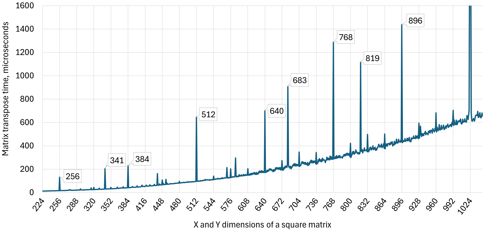

## Microarchitecture-Specific Performance Issues {#sec:UarchSpecificIssues}

In this section, we will discuss some common microarchitecture-specific issues that can be attributed to the majority of modern processors. We call them microarchitecture-specific because they are caused by the way a particular microarchitecture feature is implemented. These issues are very specific and do not frequently appear as a major performance bottleneck. Typically, they are diluted among other more significant performance problems. Thus, these microarchitecture-specific performance issues are considered corner cases and are less known than the other issues that we discussed in the book. Nevertheless, they can cause very undesirable performance penalties. Note that the impact of a particular problem can be more/less pronounced on one platform than another. Also, keep in mind, that there are other microarchitecture-specific issues that we don't cover in this book.

### Memory Order Violations {#sec:MemoryOrderViolations}

We introduced the concept of memory ordering in [@sec:uarchLSU]. Memory reordering is a crucial aspect of modern CPUs, as it enables them to execute memory requests in parallel and out-of-order. The key element in load/store reordering is memory disambiguation, which predicts if it is safe to let loads go ahead of earlier stores. Since memory disambiguation is speculative, it can lead to performance issues if not handled properly.

Consider an example in [@lst:MemOrderViolation], on the left. This code snippet calculates a histogram of an 8-bit grayscale image, i.e., calculate how many times a certain color appears in the image. Besides countless other places, this code can be found in Otsu's thresholding algorithm[^1] which is used to convert a grayscale image to a binary image. Since the input image is 8-bit grayscale, there are only 256 different colors.

For each pixel on an image, you need to read the current histogram count of the color of the pixel, increment it, and store it back. This is a classic read-modify-write dependency through the memory. Imagine we have the following consecutive pixels in the image: `0xFF 0xFF 0x00 0xFF 0xFF ...` and so on. The loaded value of the histogram count for pixel 1 comes from the result of the previous iteration. But the histogram count for pixel 2 comes from memory; it is independent and can be reordered. But then again, the histogram count for pixel 3 is dependent on the result of processing pixel 1, and so on. 

Listing: Memory Order Violation Example.

~~~~ {#lst:MemOrderViolation .cpp}
std::array<uint32_t, 256> hist;           std::array<uint32_t, 256> hist1;
hist.fill(0);                             std::array<uint32_t, 256> hist2;
int N = width * height;                   hist1.fill(0);         
for (int i = 0; i < N; ++i)       =>      hist2.fill(0);
  hist[image[i]]++;                       int N = width * height;         
                                          int i = 0;
                                          for (; i + 1 < N; i += 2) {
                                            hist1[image[i+0]]++;
                                            hist2[image[i+1]]++;
                                          }
                                          // remainder
                                          for (; i < N; ++i)
                                            hist1[image[i]]++;
                                          // combine partial histograms
                                          for (int i = 0; i < hist1.size(); ++i)
                                            hist1[i] += hist2[i];
~~~~~~~~~~~~~~~~~~~~~~~~~~~~~~~~~~~~~~~~~~~~~~~~~

Recall from [@sec:uarchLSU], that the processor doesn't necessarily know about a potential store-to-load forwarding, so it has to make a prediction. If it correctly predicts a memory order violation between two updates of color `0xFF`, then these accesses will be serialized. The performance will not be great, but it is the best we could hope for with the initial code. On the contrary, if the processor predicts that there is no memory order violation, it will speculatively let the two updates run in parallel. Later it will recognize the mistake, flush the pipeline, and re-execute the youngest of the two updates. This is very hurtful for performance.

Performance will greatly depend on the color patterns of the input image. Images with long sequences of pixels with the same color will have worse performance than images where colors don't repeat often. The performance of the initial version will be good as long as the distance between two pixels of the same color is long enough. The phrase "long enough" in this context is determined by the size of the out-of-order instruction window. Repeating read-modify-writes of the same color may trigger ordering violations if they occur within a few loop iterations of each other, but not if they occur more than a hundred loop iterations apart.

A cure for the memory order violation problem is shown in [@lst:MemOrderViolation], on the right. As you can see, we duplicated the histogram and now alternate processing of pixels between two partial histograms. In the end, we combine the two partial histograms to get a final result. This new version with two partial histograms is still prone to potentially problematic patterns, such as `0xFF 0x00 0xFF 0x00 0xFF ...` However, with this change, the worst-case scenario, e.g., `0xFF 0xFF 0xFF ...`  will run twice as fast as before. It may be beneficial to create four or eight partial histograms depending on the color pattern of input images. This exact code is featured in the [mem_order_violation_1](https://github.com/dendibakh/perf-ninja/tree/main/labs/memory_bound/mem_order_violation_1)[^2] lab assignment of the Performance Ninja course, so feel free to experiment. On a small set of input images, we observed from 10% to 50% speedup on various platforms. It is worth mentioning that the version on the left consumes 1 KB of additional memory, which may not be huge in this case but is something to watch out for.

### Misaligned Memory Accesses {#sec:MisalignedMemoryAccesses}

A variable is accessed most efficiently if it is stored at a memory address that is divisible by the size of the variable. For example, an `int` requires a 4-byte alignment, meaning its address should be a multiple of 4. In C++, it is called *natural alignment*, which occurs by default for fundamental data types, such as integer, float, or double. When you declare variables of these types, the compiler ensures that they are stored in memory at addresses that are multiples of their size. In contrast, arrays, structs, and classes may require special alignment as you'll learn in this section.

A typical case where data alignment is important is SIMD code, where loads and stores access large chunks of data with a single operation. In most processors, the L1 cache is designed to be able to read/write data at any alignment. Generally, even if a load/store is misaligned but does not cross the cache line boundary, it won't have any performance penalty. However, when a load or store crosses the cache line boundary, such access requires two cache line reads (*split load/store*). It requires using a *split register*, which keeps the two parts and once both parts are fetched, they are combined into a single register. The number of split registers is limited. When executed sporadically, split accesses complete without any observable performance impact on overall execution. However, if that happens frequently, misaligned memory accesses will suffer delays.

A memory address is said to be *aligned* if it is a multiple of a specific size. For example, when a 16-byte object is aligned on the 64-byte boundary, the low 6 bits of its address are zero. Otherwise, when a 16-byte object crosses the 64-byte boundary, it is said to be *misaligned*. In the literature, you can also encounter the term *split* load/store to describe such a situation. Split loads/stores may incur performance penalties if many of them in a row consume all available split registers. Intel's TMA methodology tracks this with the `Memory_Bound -> L1_Bound -> Split Loads` metric.

For instance, AVX2 memory operations can access up to 32 bytes. If an array starts at offset `0x30` (48 bytes), the first AVX2 load will fetch data from `0x30` to `0x4F`, the second load will fetch data from 0x50 to 0x6F, and so on. The first load crosses the cache line boundary (`0x40`). In fact, every second load will cross the cache line boundary which may slow down the execution. Figure @fig:SplitLoads illustrates this. Pushing the data forward by 16 bytes would align the array to the cache line boundary and eliminate the split loads. [@lst:AligningData] shows how to fix this example using the C++11 `alignas` keyword.

{#fig:SplitLoads width=50%}

Listing: Aligning data using the "alignas" keyword.

~~~~ {#lst:AligningData .cpp}
// Array of 16-bit integers aligned at 64-byte boundary
#define CACHELINE_ALIGN alignas(64) 
CACHELINE_ALIGN int16_t a[N];
~~~~~~~~~~~~~~~~~~~~~~~~~~~~~~~~~~~~~~~~~~~~~~~~~

When it comes to dynamic allocations, C++17 made it much easier. Operator `new` now takes an additional argument, which users can use to control the alignment of dynamically allocated memory. When using standard containers, such as `std::vector`, you can define a custom allocator. [@lst:AlignedStdVector] shows a minimal example of a custom allocator that aligns the memory buffer at the cache line boundary. Other options include C11's standard [aligned_alloc](https://en.cppreference.com/w/c/memory/aligned_alloc)[^12], OS-specific functions like POSIX's [`memalign`](https://linux.die.net/man/3/memalign)[^13], or rolling your own allocation routine as described [here](https://embeddedartistry.com/blog/2017/02/22/generating-aligned-memory/)[^14].

Listing: Defining std::vector aligned at the cache line boundary.

~~~~ {#lst:AlignedStdVector .cpp}
// Returns aligned pointers when allocations are requested. 
template <typename T>
class CacheLineAlignedAllocator {
public:
  using value_type = T;
  static std::align_val_t constexpr ALIGNMENT{64};
  [[nodiscard]] T* allocate(std::size_t N) {
    return reinterpret_cast<T*>(::operator new, ALIGNMENT));
  }
  void deallocate(T* allocPtr, [[maybe_unused]] std::size_t N) {
    ::operator delete;
  }
};
template<typename T> 
using AlignedVector = std::vector<T, CacheLineAlignedAllocator<T> >;
~~~~~~~~~~~~~~~~~~~~~~~~~~~~~~~~~~~~~~~~~~~~~~~~~

To demonstrate the effect of misaligned memory accesses, we created the [mem_alignment_1](https://github.com/dendibakh/perf-ninja/tree/main/labs/memory_bound/mem_alignment_1)[^2] lab assignment in the Performance Ninja online course. It features a very simple matrix multiplication example, where the initial version doesn't take any care of the alignment of the matrices. The assignment asks to align the matrices to the cache line boundary and measure the performance difference. Feel free to experiment with the code and measure the effect on your platform.

The first step to mitigate split loads/stores in this assignment is to align the starting offset of a matrix. The OS might allocate memory for the matrix in a way that it is already aligned to the cache line boundary. However, you should not rely on this behavior, as it is not guaranteed. A simple way to fix this is to use `AlignedVector` from [@lst:AlignedStdVector] to allocate memory for the matrices. 

However, it's not enough to only align the starting offset of a matrix. Consider an example of a `9x9` matrix of `float` values shown in Figure @fig:MemAlignment. If a cache line is 64 bytes, it can store 16 `float` values. When using AVX2 instructions, the program will load/store 8 elements (256 bits) at a time. In each row, the first eight elements will be processed in a SIMD way, while the last element will be processed in a scalar way by the loop remainder. The second vector load/store (elements 10-17) crosses the cache line boundary as many other subsequent vector loads/stores. The problem highlighted in Figure @fig:MemAlignment affects any matrix with the number of columns that is not a multiple of 8 (for AVX2 vectorization). The SSE and ARM Neon vectorization requires 16-byte alignment; AVX-512 requires 64-byte alignment.

{#fig:MemAlignment width=80%}

So, in addition to aligning the starting offset, each row of the matrix should be aligned as well. For example in Figure @fig:MemAlignment, it can be achieved by inserting seven dummy columns into the matrix, effectively making it a `9x16` matrix. This will align the second row (elements 10-18) at the offset `0x40`. Similarly, we need to align all other rows. The dummy columns will not be processed by the algorithm, but they will ensure that the actual data is aligned at the cache line boundary. In our testing, the performance impact of this change was up to 30%, depending on the matrix size and the platform configuration.

Alignment and padding often cause holes with unused bytes, which potentially decreases memory bandwidth utilization. For small matrices, like our 9x9 matrix, padding will cause almost half of each line to be unused. However, for large matrices, like 1025x1025 the impact of padding is not that big. Nevertheless, for some algorithms, like AI, memory bandwidth can be a bigger concern. Use these techniques with care and always measure to see if the performance gain from alignment is worth the cost of unused bytes.

Accesses that cross a 4 KB boundary introduce more complications because virtual to physical address translations are usually handled in 4 KB pages. Handling such access would require accessing two TLB entries as well. Unless a TLB supports multiple lookups per cycle, such loads can cause a significant slowdown.

### Cache Aliasing {#sec:CacheTrashing}

There are specific data access patterns that may cause unpleasant performance issues. These corner cases are tightly connected with cache organization, e.g., the number of sets and ways in the cache. We described cache organization in [@sec:CacheHierarchy], in case you want to revisit it. The placement of a memory location in the cache is determined by its address. Based on the address bits, the cache controller does set selection, i.e., it determines the set to which a cache line with the fetched memory location will go. 

If two memory locations map to the same set, they will compete for the limited number of available slots (ways) in a set. When a program repeatedly accesses memory locations that map to the same set, they will be constantly evicting each other. This may cause saturation of one set in the cache and underutilization of the other sets. This is known as *cache aliasing*, though you may find people use the terms *cache contention*, *cache conflicts*, or *cache trashing* to describe this effect.

A simple example of cache aliasing can be observed in matrix transposition as explained in detail in [@fogOptimizeCpp, section 9.10 Cache contentions in large data structures]. We encourage readers to study Agner's manual to learn more about why it happens. We repeated the experiment on a few modern processors and confirmed that it remains a relevant issue. Figure @fig:CacheAliasing shows the chart of the matrix transposition performance on Intel's 12th-gen core i7-1260P processor. There are several spikes in the chart, which correspond to the matrix sizes that cause cache aliasing. Performance drops significantly when the matrix size is a power of two (e.g., 256, 512) or is a multiple of 128 (e.g., 384, 640, 768, 896). Also, there are a few spikes at the sizes 341, 683, and 819, which also suffer from the cache aliasing effect.

{#fig:CacheAliasing width=100%}

On Intel's processors, this issue can be diagnosed with the help of the `L1D.REPLACEMENT` performance event, which counts L1 cache line replacements. For instance, there are 17 times more cache line replacements for the matrix size `256x256` than for the size `255x255`. We tested all sizes from `64x64` up to `10000x10000` and found that the pattern repeats very consistently. We also ran the same experiment on an Intel Skylake-based processor as well as an Apple M1 chip and confirmed that these chips are prone to cache aliasing effects. 

To mitigate cache aliasing, you can use cache blocking as we discussed in [@sec:LoopOptsHighLevel]. The idea is to process the matrix in smaller blocks that fit into the cache. That way you will avoid cache line eviction since there will be enough space in the cache. Another way to solve this is to pad the matrix with extra columns, e.g., instead of a `256x256` matrix, you would allocate a `256x264` matrix; in a similar way we did in the previous section. But be careful not to run into misaligned memory access issues.

### Slow Floating-Point Arithmetic {#sec:SlowFloatingPointArithmetic}

Some applications that do extensive computations with floating-point values are prone to one very subtle issue that can cause performance slowdown. This issue arises when an application hits a _subnormal_ FP value, which we will discuss in this section. You can also find a term *denormal* FP value, which refers to the same thing. According to the IEEE Standard 754,[^4] a subnormal is a non-zero number with an exponent smaller than the smallest normal number.[^3] [@lst:Subnormals] shows a very simple instantiation of a subnormal value. 

In real-world applications, a subnormal value usually represents a signal so small that it is indistinguishable from zero. In audio, it can mean a signal so quiet that it is out of the human hearing range. In image processing, it can mean any of the RGB color components of a pixel to be very close to zero, and so on. Interestingly, subnormal values are present in many production software packages, including weather forecasting, ray tracing, physics simulations, and others.

Listing: Instantiating a normal and subnormal FP value

~~~~ {#lst:Subnormals .cpp}
unsigned usub = 0x80200000; // -2.93873587706e-39 (subnormal)
unsigned unorm = 0x411a428e; // 9.641248703 (normal)
float sub = *((float*)&usub);
float norm = *((float*)&unorm);
assert(std::fpclassify(sub) == FP_SUBNORMAL);
assert(std::fpclassify(norm) != FP_SUBNORMAL);
~~~~~~~~~~~~~~~~~~~~~~~~~~~~~~~~~~~~~~~~~~~~~~~~~

Without subnormal values, the subtraction of two FP values `a - b` can underflow and produce zero even though the values are not equal. Subnormal values allow calculations to gradually lose precision without rounding the result to zero. Although, it comes with a cost as we shall see later. Subnormal values also may occur in production software when a value keeps decreasing in a loop with subtraction or division.

From the hardware perspective, handling subnormals is more difficult than handling normal FP values as it requires special treatment and generally, is considered as an exceptional situation. The application will not crash, but it will get a performance penalty. Calculations that produce or consume subnormal numbers are much slower than similar calculations on normal numbers and can run 10 times slower or more. For instance, Intel processors currently handle operations on subnormals with a microcode *assist*. When a processor recognizes a subnormal FP value, a Microcode Sequencer (MSROM) will provide the necessary microoperations ($\mu$ops) to compute the result.

In many cases, subnormal values are generated naturally by the algorithm and thus are unavoidable. Luckily, most processors give the option to flush subnormal values to zero and not generate subnormals in the first place. Developers of performance-critical applications would rather choose to have slightly less accurate results than slowing down the code.

Suppose you are OK without subnormal values, how do you detect and mitigate associated costs? While you can use runtime checks as shown in [@lst:Subnormals], inserting them all over the codebase is not practical. There is a better way to detect if your application is producing subnormal values using PMU (Performance Monitoring Unit). On Intel CPUs, you can collect the `FP_ASSIST.ANY` performance event, which gets incremented every time a subnormal value is used. TMA methodology classifies such bottlenecks under the `Retiring` category, and yes, this is one of the situations when a high `Retiring` doesn't mean a good thing.

Once you confirm subnormal values are there, you can enable the FTZ and DAZ modes:

* __DAZ__ (Denormals Are Zero). Any denormal inputs are replaced by zero before use.
* __FTZ__ (Flush To Zero). Any outputs that would be denormal are replaced by zero.

When they are enabled, there is no need for costly handling of subnormal values in a CPU floating-point arithmetic. In x86-based platforms, there are two separate bit fields in the `MXCSR`, global control and status register. In ARM Aarch64, two modes are controlled with `FZ` and `AH` bits of the `FPCR` control register. If you compile your application with `-ffast-math`, you have nothing to worry about, the compiler will automatically insert the required code to enable both flags at the start of the program. The `-ffast-math` compiler option is a little overloaded, so GCC developers created a separate `-mdaz-ftz` option that only controls the behavior of subnormal values. If you'd rather control it from the source code, [@lst:EnableFTZDAZ] shows an example that you can use. If you choose this option, avoid frequent changes to the `MXCSR` register because the operation is relatively expensive. A read of the MXCSR register has a fairly long latency, and a write to the register is a serializing instruction.

Listing: Enabling FTZ and DAZ modes manually

~~~~ {#lst:EnableFTZDAZ .cpp}
unsigned FTZ = 0x8000;
unsigned DAZ = 0x0040;
unsigned MXCSR = _mm_getcsr();
_mm_setcsr(MXCSR | FTZ | DAZ);
~~~~~~~~~~~~~~~~~~~~~~~~~~~~~~~~~~~~~~~~~~~~~~~~~

Keep in mind, that both `FTZ` and `DAZ` modes are incompatible with the IEEE Standard 754. They are implemented in hardware to improve performance for applications where underflow is common and generating a denormalized result is unnecessary. Usually, we have observed a 3%-5% speedup on some production floating-point applications that were using subnormal values and sometimes even up to 50%.

[^1]: Otsu's thresholding method - [https://en.wikipedia.org/wiki/Otsu%27s_method](https://en.wikipedia.org/wiki/Otsu%27s_method)
[^2]: Performance Ninja lab assignment: Memory Order Violation - [https://github.com/dendibakh/perf-ninja/tree/main/labs/memory_bound/mem_order_violation_1](https://github.com/dendibakh/perf-ninja/tree/main/labs/memory_bound/mem_order_violation_1)
[^3]: Subnormal number - [https://en.wikipedia.org/wiki/Subnormal_number](https://en.wikipedia.org/wiki/Subnormal_number)
[^4]: IEEE Standard 754 - [https://ieeexplore.ieee.org/document/8766229](https://ieeexplore.ieee.org/document/8766229)
[^5]: Performance Ninja lab assignment: Memory Alignment - [https://github.com/dendibakh/perf-ninja/tree/main/labs/memory_bound/mem_alignment_1](https://github.com/dendibakh/perf-ninja/tree/main/labs/memory_bound/mem_alignment_1)
