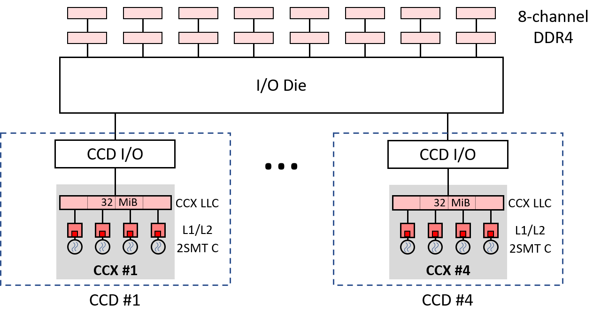

## Case Study: Sensitivity to Last Level Cache Size {#sec:Sensitivity2LLC}

In this case study, we run the same set of applications multiple times with varying LLC sizes. Modern server processors let users control the allocation of LLC space to processor threads. In this way, a user can limit each thread to only use its allocated amount of shared resources. Such facilities are often called Quality of Service (QoS) extensions. They can be used to prioritize performance-critical applications and to reduce interference with other threads in the same system. Besides LLC allocation, QoS extensions support limiting memory read bandwidth.

Our analysis will help us identify applications whose performance drops significantly when decreasing the size of the LLC. We say that such applications are sensitive to the size of the LLC. Also, we identified applications that are not sensitive, i.e., LLC size doesn't have an impact on performance. This result can be applied to properly size the processor LLC, especially considering the wide range available on the market. For example, we can determine that an application benefits from a larger LLC. Then perhaps an investment in new hardware is justified. Conversely, if the performance of an application doesn't improve from having a large LLC, then we can probably buy a cheaper processor.

For this case study, we use an AMD Milan processor, but other server processors such as Intel Xeon [@QoSXeon], and Arm ThunderX [@QoSThunderX], also include hardware support for users to control the allocation of both LLC space and memory read bandwidth to processor threads. Based on our tests, the method described in this section works equally well on AMD Zen4-based desktop processors, such as 7950X and 7950X3D.

### Target machine: AMD EPYC 7313P {.unlisted .unnumbered}

We have used a server system with a 16-core AMD EPYC 7313P processor, code-named Milan, which AMD launched in 2021. The main characteristics of this system are specified in table @tbl:experimental_setup. 

\small

---------------------------------------------------------------------------
Feature               Value
----------------      -----------------------------------------------------
Processor             AMD EPYC 7313P

Cores x threads       16 $\times$ 2
 
Configuration         4 CCX $\times$ 4 cores/CCX
 
Frequency             3.0/3.7 GHz, base/max

L1 cache (I, D)       8-ways, 32 KiB (per core), 64-byte lines

L2 cache              8-ways, 512 KiB (per core), 64-byte lines

LLC                   16-ways, 32 MB, non-inclusive (per CCX), 64-byte lines
 
Main Memory           512 GiB DDR4, 8 channels, nominal peak BW: 204.8 GB/s

TurboBoost            Disabled

Hyperthreading        Disabled (1 thread/core)

OS                    Ubuntu 22.04, kernel 5.15.0-76

---------------------------------------------------------------------------

Table: Main features of the server used in the experiments. {#tbl:experimental_setup}

\normalsize

Figure @fig:milan7313P shows the clustered memory hierarchy of an AMD Milan 7313P processor. It consists of four Core Complex Dies (CCDs) connected to each other and to off-chip memory via an I/O chiplet. Each CCD integrates a Core CompleX (CCX) and an I/O connection. In turn, each CCX has four Zen3 cores that share a 32 MB victim LLC.[^11]

{#fig:milan7313P width=80%}

Although there is a total of 128 MB of LLC (32 MB/CCX x 4 CCX), the four cores of a CCX cannot store cache lines in an LLC other than their own 32 MB LLC. Since we will be running single-threaded benchmarks, we can focus on a single CCX. The LLC size in our experiments will vary from 0 to 32 MB with steps of 2 MB. This is directly related to having a 16-way LLC: by disabling one of 16 ways, we reduce the LLC size by 2 MB.

### Workload: SPEC CPU2017 {.unlisted .unnumbered}

We use a subset of applications from the SPEC CPU2017 suite[^4]. SPEC CPU2017 contains a collection of industry-standardized workloads that benchmark the performance of the processor, memory subsystem, and compiler. It is widely used to compare the performance of high-performance systems and in computer architecture research. 

Specifically, we selected 15 memory-intensive benchmarks from SPEC CPU2017 (6 INT and 9 FP) as suggested in [@MemCharacterizationSPEC2006]. These applications have been compiled with GCC 6.3.1 and the following compiler options: `-O3 -march=native -fno-unsafe-math-optimizations`.

### Controlling and Monitoring LLC allocation {.unlisted .unnumbered}

To monitor and enforce limits on LLC allocation and memory _read_ bandwidth, we will use _AMD64 Technology Platform Quality of Service Extensions_ [@QoSAMD]. Users can manage this QoS extension through the banks of model-specific registers (MSRs). First, a thread or a group of threads must be assigned a resource management identifier (RMID), and a class of service (COS) by writing to the `PQR_ASSOC` register (MSR `0xC8F`). Here is a sample command for the hardware thread 1:

```bash
# write PQR_ASSOC (MSR 0xC8F): RMID=1, COS=2 -> (COS << 32) + RMID
$ wrmsr -p 1 0xC8F 0x200000001
```

where `-p 1` refers to the hardware thread 1. All `rdmsr` and `wrmsr` commands that we show require root access.

LLC space management is performed by writing to a 16-bit per-thread binary mask. Each bit of the mask allows a thread to use a given sixteenth fraction of the LLC (1/16 = 2 MB in the case of the AMD Milan 7313P). Multiple threads can use the same fraction(s), implying a competitive shared use of the same subset of LLC.

To set limits on the LLC usage by thread 1, we need to write to the `L3_MASK_n` register, where `n` is the COS, the cache partitions that can be used by the corresponding COS. For example, to limit thread 1 to use only half of the available space in the LLC, run the following command:

```bash
# write L3_MASK_2 (MSR 0xC92): 0x00FF (half of the LLC space)
$ wrmsr -p 1 0xC92 0x00FF
```

Similarly, the memory read bandwidth allocated to a thread can be limited. This is achieved by writing an unsigned integer to a specific MSR register, which sets a maximum read bandwidth in 1/8 GB/s increments. Interested readers are welcome to read [@QoSAMD] for more details. 

### Metrics {.unlisted .unnumbered}

The ultimate metric for quantifying the performance of an application is execution time. To analyze the impact of the memory hierarchy on system performance, we will also use the following three metrics: 1) CPI, cycles per instruction, 2) DMPKI, demand misses in the LLC per thousand instructions, and 3) MPKI, total misses (demand + prefetch) in the LLC per thousand instructions. While CPI has a direct correlation with the performance of an application, DMPKI and MPKI do not necessarily impact performance. Table @tbl:metrics shows the formulas used to calculate each metric from specific hardware counters. Detailed descriptions for each of the counters are available in AMD's Processor Programming Reference [@amd_ppr].

\small

------   ----------------------------------------------------------------------------
Metric                                     Formula                   
------   ----------------------------------------------------------------------------
CPI      Cycles not in Halt (PMCx076) / Retired Instructions (PMCx0C0)

DMPKI    Demand Data Cache Fills[^9] (PMCx043) / (Retired Instr (PMCx0C0) / 1000)

MPKI     L3 Misses[^8] (L3PMCx04) / (Retired Instructions (PMCx0C0) / 1000)

------   ----------------------------------------------------------------------------

Table: Formulas for calculating metrics used in the case study. {#tbl:metrics}

\normalsize

The methodology used in this case study is described in more detail in [@Balancer2023]. It also explains how we configured and read hardware counters. The code and the information necessary to reproduce the experiments can be found in the following public repository: [https://github.com/agusnt/BALANCER](https://github.com/agusnt/BALANCER).

### Results {.unlisted .unnumbered}

We run a set of SPEC CPU2017 benchmarks *alone* in the system using only one instance and a single hardware thread. We repeat those runs while changing the available LLC size from 0 to 32 MB in 2 MB steps. 

Figure @fig:characterization_llc shows in graphs, from left to right, CPI, DMPKI, and MPKI for each assigned LLC size. We only show three workloads, namely `503.bwaves` (blue), `520.omnetpp` (green), and `554.roms` (red). They cover the three main trends observed in all other applications. Thus, we do not show the rest of the benchmarks.

For the CPI chart, a lower value on the Y-axis means better performance. Also, since the frequency on the system is fixed, the CPI chart is reflective of absolute scores. For example, `520.omnetpp` (green line) with 32 MB LLC is 2.5 times faster than with 0 MB LLC. For the DMPKI and MPKI charts, the lower the value on the Y-axis, the better.

{#fig:characterization_llc width=100%}

Two different behaviors can be observed in the CPI and DMPKI graphs. On one hand, `520.omnetpp` takes advantage of its available space in the LLC: both CPI and DMPKI decrease significantly as the space allocated in the LLC increases. We can say that the behavior of `520.omnetpp` is sensitive to the size available in the LLC. Increasing the allocated LLC space improves performance because it avoids evicting cache lines that will be used in the future.

In contrast, `503.bwaves` and `554.roms` don't make use of all available LLC space. For both benchmarks, CPI and DMPKI remain roughly constant as the allocation limit in the LLC grows. We can say that the performance of these two applications is insensitive to their available space in the LLC.[^12] If your application shows similar behavior, you can buy a cheaper processor with a smaller LLC size without sacrificing performance.

Let's now analyze the MPKI graph, that combines both LLC demand misses and prefetch requests. First of all, we can see that the MPKI values are always much higher than the DMPKI values. That is, most of the blocks are loaded from memory into the on-chip hierarchy by the prefetcher. This behavior is due to the fact that the prefetcher is efficient in preloading the private caches with the data to be used, thus eliminating most of the demand misses.

For `503.bwaves`, we observe that MPKI remains roughly at the same level, similar to CPI and DMPKI charts. There is likely not much data reuse in the benchmark and/or the memory traffic is very low. The `520.omnetpp` workload behaves as we identified earlier: MPKI decreases as the available space increases. 

However, for `554.roms`, the MPKI chart shows a large drop in total misses as the available space increases while CPI and DMPKI remain unchanged. In this case, there is data reuse in the benchmark, but it is not consequential to the performance. The prefetcher can bring required data ahead of time, eliminating demand misses, regardless of the available space in the LLC. However, as the available space decreases, the probability that the prefetcher will not find the blocks in the LLC and will have to load them from memory increases. So, giving more LLC capacity to `554.roms` does not directly benefit its performance, but it does benefit the system since it reduces memory traffic. So, it is better not to limit available LLC space for `554.roms` as it may negatively affect the performance of other applications running on the system. [@Balancer2023]

[^4]: SPEC CPU® 2017 - [https://www.spec.org/cpu2017/](https://www.spec.org/cpu2017/).
[^8]: We used a mask to count only L3 Misses, specifically, `L3Event[0x0300C00000400104]`.
[^9]: We used subevents `MemIoRemote` and `MemIoLocal`, that count demand data cache fills from DRAM or IO connected in remote/local NUMA node.
[^11]: "Victim" means that the LLC is filled with the cache lines evicted from the four L2 caches of a CCX. 
[^12]: However, for `554.roms`, we can observe sensitivity to the available space in the LLC in the range 0-4 MB. Once the LLC size is 4 MB and above, the performance remains constant. That means that `554.roms` doesn't require more than 4 MB of LLC space to perform well.
