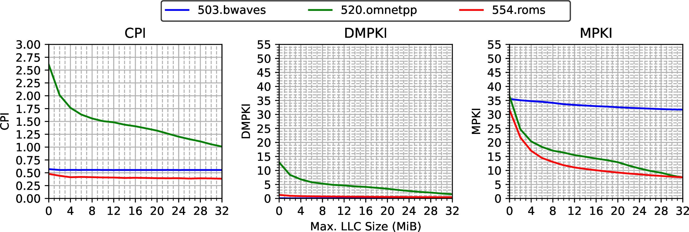

## Case Study: Sensitivity to Last Level Cache {#sec:Sensitivity2LLC}

The goal of this case study is to show how you can determine whether an applicatoin is sensitive to the size of last-level cache (LLC). Using this information, you can make educated decisions when buying HW components for your computing systems. In a similar manner, you can later determine sensitivity to other factors, such as memory bandwidth, core count, processor frequency, etc., and perhaps buy less expensive computers while maintaining the same level of performance.

In this case study, we run the same set of applications multiple times with varying LLC sizes. Modern server processors let users control the allocation of LLC space to processor threads. In this way, a user can limit each thread to only use its allocated amount of shared resources. Such facilities are often called Quality of Service (QoS) extensions. They can be used to prioritize performance-critical applications and to reduce interference with other threads in the same system. Besides LLC allocation, QoS extensions support limiting memory read bandwidth.

Our analysis will help us identify applications which performance drops significantly with decreasing the size of LLC. We say that such applications are sensitive to the size of LLC. Also, we identified applications that  are not sensitive, i.e., LLC size doesn't have impact on performance. This result can be applied to properly size the processor LLC, especially considering the wide range available on the market. For example, we can determine whether an application could benefit from a larger LLC, i.e., whether an investment in new hardware would be justified. Or conversely, if an application has enough with a tight cache size and therefore we can buy a cheaper processor.

For this case study, we use an AMD Milan processor, but other server processors such as Intel Xeon [@QoSXeon], ARM ThunderX [@QoSThunderX], also include hardware support for users to control the allocation of both LLC space and memory read bandwidth to processor threads.

### Target machine: AMD EPYC 7313P {.unlisted .unnumbered}

We have used a server system with a 16-core AMD EPYC 7313P processor, code-named Milan, which AMD launched in 2021. The main characteristics of this system are specified in table @tbl:experimental_setup.

----------------------------------------------------------------------------
 Feature               Value
----------------       ----------------------------------------------------
 Processor             AMD EPYC 7313P

 Cores x threads       16 $\times$ 2
 
 Configuration         4 CCX $\times$ 4 cores/CCX
 
 Frequency             3.0/3.7 GHz, base/max

 L1 cache (I, D)       8-ways, 32 KiB (per core)

 L2 cache              8-ways, 512 KiB (per core)

 LLC                   16-ways, 32 MiB, non-inclusive (per CCX)
 
 Main Memory           512 GiB DDR4, 8 channels, nominal peak BW: 204.8 GB/s,

 TurboBoost            Disabled

 Hyperthreading        Disabled (1 thread/core)

 OS                    Ubuntu 22.04, kernel 5.15.0-76

----------------------------------------------------------------------------

Table: Main features of the server used in the experiments. {#tbl:experimental_setup}

The 7313P processor consists of four Core Complex Dies (CCDs) connected to each other and to off-chip memory via an I/O chiplet. Each CCD integrates a Core CompleX (CCX) and an I/O connection. In turn, each CCX has four Zen3 cores capable of running eight threads that share a 32 MiB victim LLC, i.e., the LLC is filled with the cache blocks evicted from the four L2 caches of a CCX. 

Although there is a total of 128 MiB of LLC, the four cores of a CCX cannot store cache blocks in an LLC other than their own 32 MiB LLC (32 MiB/CCX x 4 CCX). Since we will be running single-threaded benchmarks, we can focus on a single CCX. The size of LLC in our experiments will vary from 0 to 32 Mib with steps of 2 Mib.

### Workload: SPEC CPU2017 {.unlisted .unnumbered}

We use a subset of benchmarks from the SPEC CPU2017[^4] suite. SPEC CPU2017 contains a collection of industry-standardized performance benchmarks that stress the processor, memory subsystem and compiler. It is widely used to compare the performance of high-performance systems. It is also extensively used in computer architecture research. 

Specifically, we selected 15 memory-intensive benchmarks from SPEC CPU2017 (6 INT and 9 FP) as suggested in [@MemCharacterizationSPEC2006]. These applications have been compiled with GCC 6.3.1 and the following compiler options: `-g -O3 -march=native -fno-unsafe-math-optimizations -fno-tree-loop-vectorize`, as specified by SPEC in the configuration file provided with the suite.

### Controlling and Monitoring LLC allocation {.unlisted .unnumbered}

To monitor and enforce limits on LLC allocation and memory _read_ bandwidth, we will use _AMD64 Technology Platform Quality of Service Extensions_ [@QoSAMD]. Users can manage this QoS extension through the specific banks of MSR registers. First, a thread or a group of threads must be assigned a resource management identifier (RMID), and a class of service (COS) by writing to the `PQR_ASSOC` register (MSR `0xC8F`). Here is a sample command for the hardware thread 1:

```bash
# write PQR_ASSOC (MSR 0xC8F): RMID=1, COS=2 -> (COS << 32) + RMID
$ wrmsr -p 1 0xC8F 0x200000001
```

where `-p 1` refers to the hardware thread 1. All `rdmsr` and `wrmsr` commands that we show require root access.

LLC space management is performed by writing to a 16-bit per-thread binary mask. Each bit of the mask allows a thread to use a given sixteenth fraction of the LLC (1/16 = 2 MiB in the case of the AMD Milan 7313P). Multiple threads can use the same fraction(s), implying a competitive shared use of the same subset of LLC.

To set limits on the LLC usage by thread 1, we need to write to the `L3_MASK_n` register, where `n` is the COS, the cache partitions that can be used by the corresponding COS. For example, to limit thread 1 to use only half of the available space in the LLC, run the following command:

```bash
# this command requires root access
# write L3_MASK_2 (MSR 0xC92): 0x00FF (half of the LLC space)
$ wrmsr -p 1 0xC92 0x00FF
```

Now, to monitor the LLC usage by the hardware thread 1, first we need to associate the monitoring identifier RMID with the LLC monitoring event (L3 Cache Occupancy Monitoring, `evtID 0x1`). We do so by writing to the `QM_EVTSEL` control register (MSR `0xC8D`). After that we should read the `QM_CTR` register (MSR `0xC8E`):

```bash
# write QM_EVTSEL (MSR 0xC8D): RMID=1, evtID=1 -> (RMID << 32) + evtID
$ wrmsr -p 1 0xC8D 0x100000001
# Read QM_CTR (MSR 0xC8E)
$ rdmsr -p 1 0xC8E 
```

This will give us the estimate of the LLC usage in cache lines. [^7] To convert this value to bytes, we need to multiply the value returned by the `rdmsr` command by the cache line size.

Similarly, the memory read bandwidth allocated to a thread can be limited. This is achieved by writing an unsigned integer to a specific MSR register, which sets a maximum read bandwidth in 1/8 GB/s increments. Interested readers are welcome to read [@QoSAMD] for more details. 

### Metrics {.unlisted .unnumbered}

The ultimate metric for quantifying the performance of an application is execution time. To analyze the impact of the memory hierarchy on system performance, we will also use the following three metrics: 1) CPI, cycles per instruction[^6], 2) DMPKI, demand misses in the LLC per thousand instructions, and 3) MPKI, total misses (demand + prefetch) in the LLC per thousand instructions. While CPI has direct correlation with performance of an application, DMPKI and MPKI do not necessary impact performance. Table @tbl:metrics shows the formulas used to calculate each metric from specific hardware counters. Detailed description for each of the counters is available in AMD's Processor Programming Reference [@amd_ppr].

------   ----------------------------------------------------------------------------
Metric                                     Formula                   
------   ----------------------------------------------------------------------------
CPI      Cycles not in Halt (PMCx076) / Retired Instructions (PMCx0C0)

DMPKI    Demand Data Cache Fills (PMCx043) / (Retired Instructions (PMCx0C0) / 1000)

MPKI     L3 Miss (L3PMCx04) / (Retired Instructions (PMCx0C0) / 1000)

------   ----------------------------------------------------------------------------

Table: Formulas for calculating metrics used in the case study. {#tbl:metrics}

Hardware counters can be configured and read through the model-specific registers (MSR). The configuration consists of specifying the event to be monitored and how it will be monitored. In our system, this is done by writing to a `PERF_CTL[0-5]` control register (MSR `0xC001020[0,2,4,6,8,A]`). The `PERF_CTR[0-5]` registers (MSR `0xC001020[1,3,5,7,9,B]`) are the counters associated to the control registers. For example, for counter 0 to collect the number of instructions retired from an application running on hardware thread 1, the following commands are executed:

```bash
$ wrmsr -p 1 0xC0010200 0x5100C0
$ rdmsr -p 1 0xC0010201
```

where `-p 1` refers to the hardware thread 1, `0xC0010200` is the MSR for the control of counter 0 (`PERF_CTL[0]`), and `0x5100C0` specifies the identifier of the event to be measured (retired instructions, `PMCx0C0`) and the way in which it will be measured (user events). Once the configuration with `wrmsr` is done, the `rdmsr` command can be used to read the counter 0 that collects the number of retired instructions.

The methodology used in this case study is described in more details in [@Balancer2023]. The code and the information necessary to reproduce the experiments can be found in the following public repository: [https://github.com/agusnt/BALANCER](https://github.com/agusnt/BALANCER).

### Results {.unlisted .unnumbered}

We run a set of SPEC 2017 benchmarks *alone* in the system using only one instance and a single hardware thread. We repeat those runs while changing available LLC size from 0 to 32 MiB with 2 MiB steps. Figure @fig:characterization_llc shows in graphs, from left to right, CPI, DMPKI and MPKI for each assigned LLC size. For the CPI chart, lower value on the Y-axis means better performance. For the DMPKI and MPKI charts, the lower value on the Y-axis, the better. Three lines corresponding to `503.bwaves` (solid), `520.omnetpp` (dotted) and `554.roms` (dashed), represents the three main trends observed in all applications. We do not show the rest of benchmarks.

{#fig:characterization_llc width=95%}

Two behaviors can be distinguished in the CPI and DMPKI graphs. On one hand, `520.omnetpp` takes advantage of its available space in the LLC: both CPI and DMPKI decrease significantly as the space allocated in the LLC increases. We can say that the behavior of `520.omnetpp` is sensitive to the size available in the LLC. Increasing the allocated LLC space improves performance because it avoids evicting cache lines that will be used in the future.

In contrast, `503.bwaves` and `554.roms` don't make use of all available LLC space. For both benchmarks, CPI and DMPKI remain roughly constant as the allocation limit in the LLC grows. We would say that the performance of these two applications is insensitive to their available space in the LLC. If our applications show this behavior, we can select a processor with a smaller LLC size without sacrificing performance.

Let's now analyze the MPKI graph, that combines both LLC demand misses and prefetch requests. First of all, we can see that the MPKI values are always much higher than the DMPKI values. That is, most of the blocks are loaded from memory into the on-chip hierarchy by the prefetcher. This behavior is due to the fact that the prefetcher is efficient in preloading the private caches with the data to be used, thus eliminating most of the demand misses.

For `503.bwaves`, we observe that MPKI remains roughly at the same level, similar to CPI and DMPKI charts. It is likely that there is no much data reuse in the benchmark and/or the memory traffic is very low. The `520.omnetpp` workload behaves as we identified earlier: MPKI decreases as the available space increases. However for `554.roms`, the MPKI chart shows a large drop in total misses as the available space increases while CPI and DMPKI remained unchanged. In this case, there is data reuse in the benchmark, but it is not consequential to the performance. The prefetcher is able to bring required data ahead of time, eliminating demand misses, regardless of the available space in the LLC. However, as the available space decreases, the probability that the prefetcher will not find the blocks in the LLC and will have to load them from memory increases. So, giving more LLC capacity to this type of applications does not directly benefit their performance, but it does benefit the system since it reduces memory traffic.

By looking at the the CPI and DMPKI, we initially thought that `554.roms` is insensitive to the LLC size. But by analyzing the MPKI chart, we need to reconsider our statement and conclude that `554.roms` is sensitive to LLC size as well, and, therefore, it seems a good idea not to limit its available LLC space so as not to increase memory bandwidth consumption. Higher bandwidth consumption may increase memory access latency, which in turn implies a performance degradation of other applications running on the system [@Balancer2023].

[^4]: SPEC CPU® 2017 - [https://www.spec.org/cpu2017/](https://www.spec.org/cpu2017/).
[^6]: We use CPI instead of time per instruction since we assume that the CPU frequency does not change during the experiments.
[^7]: AMD documentation [@QoSAMD] rather uses the term L3 Cache Conversion Factor, which can be determined with the `cpuid` instruction.