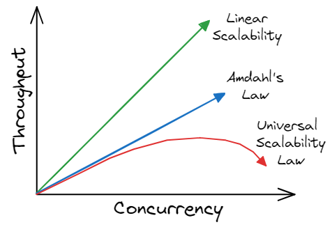

## Performance Scaling in Multithreaded Programs {#sec:secAmdahl}

When dealing with a single-threaded application, optimizing one portion of a program usually yields positive results on performance. However, this is not necessarily the case for multithreaded applications. There could be an application in which thread `A` executes a long-running operation, while thread `B` finishes its task early and just waits for thread `A` to finish. No matter how much we improve thread `B`,  application latency will not be reduced since it will be limited by a longer-running thread `A`. 

This effect is widely known as [Amdahl's law](https://en.wikipedia.org/wiki/Amdahl's_law),[^6] which constitutes that the speedup of a parallel program is limited by its serial part. Figure @fig:MT_AmdahlsLaw illustrates the theoretical speedup of the latency of the execution of a program as a function of the number of processors executing it. For a program, 75% of which is parallel, the speedup factor converges to 4.

{#fig:MT_AmdahlsLaw width=45%}
{#fig:MT_USL width=45%}

Amdahl's Law and Universal Scalability Law.

In reality, further adding computing nodes to the system may yield retrograde speed up. We will see examples of it in the next section. This effect is explained by Neil Gunther as [Universal Scalability Law](http://www.perfdynamics.com/Manifesto/USLscalability.html#tth_sEc1)[^8] (USL), which is an extension of Amdahl's law. USL describes communication between computing nodes (threads) as yet another gating factor against performance. As the system is scaled up, overheads start to hinder the gains. Beyond a critical point, the capability of the system starts to decrease (see Figure @fig:MT_USL). USL is widely used for modeling the capacity and scalability of the systems.

The slowdowns described by USL are driven by several factors. First, as the number of computing nodes increases, they start to compete for resources (contention). This results in additional time being spent on synchronizing those accesses. Another issue occurs with resources that are shared between many workers. We need to maintain a consistent state of the shared resources between many workers (coherence). For example, when multiple workers frequently change a globally visible object, those changes need to be broadcast to all nodes that use that object. Suddenly, usual operations start getting more time to finish due to the additional need to maintain coherence. Optimizing multithreaded applications not only involves all the techniques described in this book so far but also involves detecting and mitigating the aforementioned effects of contention and coherence.

[^6]: Amdahl's law - [https://en.wikipedia.org/wiki/Amdahl's_law](https://en.wikipedia.org/wiki/Amdahl's_law).
[^8]: USL law - [http://www.perfdynamics.com/Manifesto/USLscalability.html#tth_sEc1](http://www.perfdynamics.com/Manifesto/USLscalability.html#tth_sEc1).
