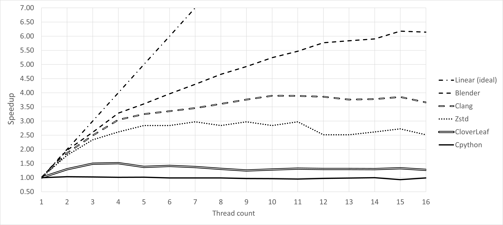
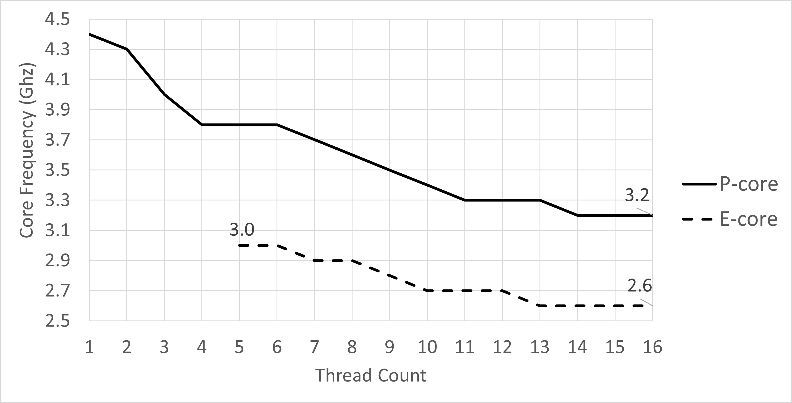
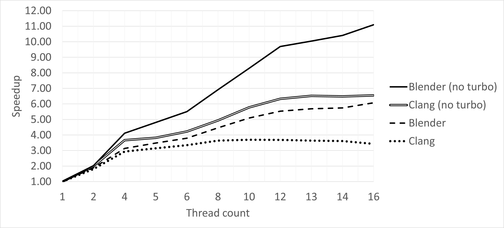
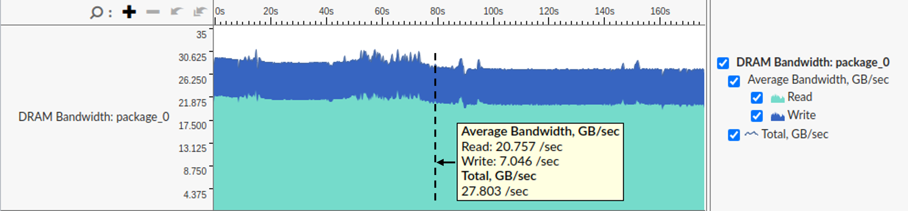
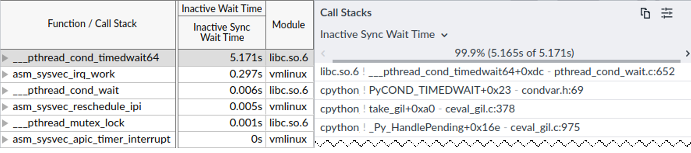

## Thread Count Scaling Case Study

Thread count scaling is perhaps the most valuable analysis you can perform on a multithreaded application. It shows how well the application can utilize modern multicore systems. As you will see, there is a ton of information you can learn along the way. Without further introduction, let's get started. In this case study, we will analyze the thread count scaling of the following benchmarks, some of which should be already familiar to you from the previous chapters:

1. Blender 3.4 - an open-source 3D creation and modeling software project. This test is of Blender's Cycles performance with the BMW27 blend file. URL: [https://download.blender.org/release](https://download.blender.org/release). Command line: `./blender -b bmw27_cpu.blend -noaudio --enable-autoexec -o output.test -x 1 -F JPEG -f 1 -t N`, where `N` is the number of threads. Clang 17 self-build - this test uses clang 17 to build the clang 17 compiler from sources. URL: [https://www.llvm.org](https://www.llvm.org). Command line: `ninja -jN clang`, where `N` is the number of threads.
3. Zstandard v1.5.5, a fast lossless compression algorithm. URL: [https://github.com/facebook/zstd](https://github.com/facebook/zstd). A dataset used for compression: [http://wanos.co/assets/silesia.tar](http://wanos.co/assets/silesia.tar). Command line: `./zstd -TN -3 -f -- silesia.tar`, where `N` is the number of compression worker threads.
4. CloverLeaf 2018 - a Lagrangian-Eulerian hydrodynamics benchmark. All HW threads are used. This test uses the input file `clover_bm.in` (Problem 5). URL: [http://uk-mac.github.io/CloverLeaf](http://uk-mac.github.io/CloverLeaf). Command line: `export OMP_NUM_THREADS=N; ./clover_leaf`, where `N` is the number of threads.
5. CPython 3.12, a reference implementation of the Python programming language. URL: [https://github.com/python/cpython](https://github.com/python/cpython). We run a simple multithreaded binary search script written in Python, which searches `10'000` random numbers (needles) in a sorted list of `1'000'000` elements (haystack). Command line: `./python3 binary_search.py N`, where `N` is the number of threads. Needles are divided equally between threads.

The benchmarks were executed on a machine with the configuration shown below:

* 12th Gen Alderlake Intel(R) Core(TM) i7-1260P CPU @ 2.10GHz (4.70GHz Turbo), 4P+8E cores, 18MB L3-cache.
* 16 GB RAM, DDR4 @ 2400 MT/s.
* Clang 15 compiler with the following options: `-O3 -march=core-avx2`.
* 256GB NVMe PCIe M.2 SSD.
* 64-bit Ubuntu 22.04.1 LTS (Jammy Jellyfish, Linux kernel 6.5).

This is clearly not the top-of-the-line hardware setup, but rather a mainstream computer, not necessarily designed to handle media, developer, or HPC workloads. However, for our case study, it is an excellent platform to demonstrate the various effects of thread count scaling. Because of the limited resources, applications start to hit performance roadblocks even with a small number of threads. Keep in mind, that on better hardware, the scaling results will be different.

Our processor has four P-cores and eight E-cores. P-cores are SMT-enabled, which means the total number of threads on this platform is sixteen. By default, the Linux scheduler will first try to use idle physical P-cores. The first four threads will utilize four threads on four idle P-cores. When they are fully utilized, it will start to schedule threads on E-cores. So, the next eight threads will be scheduled on eight E-cores. Finally, the remaining four threads will be scheduled on the 4 sibling SMT threads of P-cores. We've also run the benchmarks while affinitizing threads using the aforementioned scheme, except `Zstd` and `CPython`. Running without affinity does a better job of representing real-world scenarios, however, thread affinity makes thread count scaling analysis cleaner. Since performance numbers were very similar, in this case study we present the results when thread affinity is used.

The benchmarks do a fixed amount of work. The number of retired instructions is almost identical regardless of the thread count. In all of them, the largest portion of an algorithm is implemented using a divide-and-conquer paradigm, where work is split into equal parts, and each part can be processed independently. In theory, this allows applications to scale well with the number of cores. However, in practice, the scaling is often far from optimal. 

Figure @fig:ScalabilityMainChart shows the thread count scalability of the selected benchmarks. The x-axis represents the number of threads, and the y-axis shows the speedup relative to the single-threaded execution. The speedup is calculated as the execution time of the single-threaded execution divided by the execution time of the multi-threaded execution. The higher the speedup, the better the application scales with the number of threads. 

{#fig:ScalabilityMainChart width=100%}

As you can see, most of them are very far from the linear scaling, which is quite disappointing. The benchmark with the best scaling in this case study, Blender, achieves only 6x speedup while using 16x threads. CPython, for example, enjoys no thread count scaling at all. Performance of Clang and Zstd suddenly degrades when the number of threads goes beyond 11. To understand this and other issues, let's dive into the details of each benchmark.

### Blender {.unlisted .unnumbered}

Blender is the only benchmark in our suite that continues to scale up to all 16 threads in the system. The reason for this is that the workload is highly parallelizable. The rendering process is divided into small tiles, and each tile can be rendered independently. However, even with this high level of parallelism, the scaling is only `6.1x speedup / 16 threads = 38%`. What are the reasons for this suboptimal scaling?

From [@sec:PerfMetricsCaseStudy], we know that Blender's performance is bounded by floating-point computations. It has a relatively high percentage of SIMD instructions as well. P-cores are much better at handling such instructions than E-cores. This is why we see the slope of the speedup curve decrease after 4 threads as E-cores start getting used. Performance scaling continues at the same pace up until 12 threads, where it starts to degrade again. This is the effect of using SMT sibling threads. Two active sibling SMT threads compete for the limited number of FP/SIMD execution units. To measure SMT scaling, we need to divide performance of two SMT threads (2T1C - two threads one core) by performance of a single P-core (1T1C), also `4T2C/2T2C`, `6T3C/3T3C`, and so on. For Blender, SMT scaling is around `1.3x` in all configurations. Obviously, this is not a perfect scaling, but still, using sibling SMT threads on P-cores provides a performance boost for this workload.

There is another aspect of scaling degradation that we will talk about when discussing Clang's thread count scaling.

### Clang {.unlisted .unnumbered}

While Blender uses multithreading to exploit parallelism, concurrency in C++ compilation is usually achieved with multiprocessing. Clang 17 has more than `2'500` translation units, and to compile each of them, a new process is spawned. Similar to Blender, we classify Clang compilation as massively parallel, yet they scale differently. We recommend you revisit [@sec:PerfMetricsCaseStudy] for an overview of Clang compiler performance bottlenecks. In short, it has a large codebase, flat profile, many small functions, and "branchy" code. Its performance is affected by Dcache, Icache, and TLB misses, and branch mispredictions. Clang's thread count scaling is affected by the same scaling issues as Blender: P-cores are more effective than E-cores, and P-core SMT scaling is about `1.1x`. However, there is more. Notice that scaling stops at around 10 threads, and starts to degrade. Let's understand why that happens.

The problem is related to the frequency throttling. When multiple cores are utilized simultaneously, the processor generates more heat due to the increased workload on each core. To prevent overheating and maintain stability, CPUs often throttle down their clock speeds depending on how many cores are in use. Additionally, boosting all cores to their maximum turbo frequency simultaneously would require significantly more power, which might exceed the power delivery capabilities of the CPU. Our system doesn't possess an advanced liquid cooling solution and only has a single processor fan. That's why it cannot sustain high frequencies when many cores are utilized.

Figure @fig:FrequencyThrotlingClang shows the CPU frequency throttling on our platform while running the Clang C++ compilation. Notice that sustained frequency drops starting from a scenario when just two P-cores are used simultaneously. By the time you start using all 16 threads, the frequency of P-cores is throttled down to `3.2GHz`, while E-cores operate at `2.6GHz`. We used Intel Vtune's platform view to visualize CPU frequency as shown in [@sec:IntelVtuneOverview]. 

{#fig:FrequencyThrotlingClang width=100%}

Keep in mind that this frequency chart cannot be automatically applied to all other workloads. Applications that heavily use SIMD instructions typically operate on lower frequencies, so Blender, for example, may see slightly more frequency throttling than Clang. However, it can give you a good intuition about the frequency throttling issues that occur on your platform. 

To confirm that frequency throttling is one of the main reasons for performance degradation, we temporarily disabled Turbo Boost on our platform and repeated the scaling study for Blender and Clang. When Turbo Boost is disabled, all cores operate on their base frequencies, which are `2.1 Ghz` for P-cores and `1.5 Ghz` for E-cores. The results are shown in Figure @fig:ScalabilityNoTurboChart. As you can see, thread count scaling almost doubles when all 16 threads are used and TurboBoost is disabled, for both Blender (`38% -> 69%`) and Clang (`21% -> 41%`). It gives us an intuition of what the thread count scaling would look like if frequency throttling had not happened. In fact, frequency throttling accounts for a large portion of unrealized performance scaling in modern systems.

{#fig:ScalabilityNoTurboChart width=100%}

Going back to the main chart shown in Figure fig:ScalabilityMainChart, for the Clang workload, the tipping point of performance scaling is around 10 threads. This is the point where the frequency throttling starts to have a significant impact on performance, and the benefit of adding additional threads is smaller than the penalty of running at a lower frequency.

### Zstandard {.unlisted .unnumbered}

Next on our list is the Zstandard compression algorithm, or Zstd for short. When compressing data, Zstd divides the input into blocks, and each block can be compressed independently. This means that multiple threads can work on compressing different blocks simultaneously. Although it seems that Zstd should scale well with the number of threads, it doesn't. Performance scaling stops at around 5 threads, sooner than in the previous two benchmarks. As you will see, the dynamic interaction between Zstd worker threads is quite complicated.

First of all, performance of Zstd depends on the compression level. The higher the compression level, the more compact the result. Lower compression levels provide faster compression, while higher levels yield better compression ratios. In our case study, we used compression level 3 (which is also the default level) since it provides a good trade-off between speed and compression ratio.

Here is the high-level algorithm of Zstd compression:[^1]

* The input file is divided into blocks, whose size depends on the compression level. Each job is responsible for compressing a block of data. When Zstd receives some data to compress, it copies a small chunk into one of its internal buffers and posts a new compression job, which is picked up by one of the worker threads. The main thread fills all input buffers for all its workers and sends them to work in order.
* Jobs are always started in order, but they can be finished in any order. Compression speed can be variable and depends on the data to compress. Some blocks are easier to compress than others.
* After a worker finishes compressing a block, it signals the main thread that the compressed data is ready to be flushed to the output file. The main thread is responsible for flushing the compressed data to the output file. Note that flushing must be done in order, which means that the second job is allowed to be flushed only after the first one is entirely flushed. The main thread can "partially flush" an ongoing job, i.e., it doesn't have to wait for a job to be completely finished to start flushing it.

To visualize the work of the Zstd algorithm on a timeline, we instrumented the Zstd source code with Vtune's ITT markers.[^2] The timeline of compressing Silesia corpus using 8 threads is shown in Figure @fig:ZstdTimeline. Using 8 worker threads is enough to observe thread interaction in Zstd while keeping the image less noisy than when all 16 threads are active. The second half of the timeline was cut to make the image fit on the page.

{#fig:ZstdTimeline width=100%}

On the image, we have the main thread at the bottom (TID 913273), and eight worker threads at the top. The worker threads are created at the beginning of the compression process and are reused for multiple compressing jobs. 

On the worker thread timeline (top 8 rows) we have the following markers:

* 'job0' - 'job25' bars indicate the start and end of a job.
* 'ww' (short for "worker wait") bars indicate a period when a worker thread is waiting for a new job.
* Notches below job periods indicate that a thread has just finished compressing a portion of the input block and is signaling to the main thread that the data is available to be partially flushed.

On the main thread timeline (row 9, TID 913273) we have the following markers:

* 'p0' - 'p25' boxes indicate a period of preparing a new job. It starts when the main thread starts filling up the input buffer until it is full (but this new job is not necessarily posted on the worker queue immediately).
* 'fw' (short for "flush wait") markers indicate a period when the main thread waits for the produced data to start flushing it. During this time, the main thread is blocked.

With a quick glance at the image, we can tell that there are many `ww` periods when worker threads are waiting. This negatively affects performance of Zstandard compression. Let's progress through the timeline and try to understand what's going on.

1. First, when worker threads are created, there is no work to do, so they are waiting for the main thread to post a new job. 
2. Then the main thread starts to fill up the input buffers for the worker threads. It has prepared jobs 0 to 7 (see bars `p0` - `p7`), which were picked up by worker threads immediately. Notice, that the main thread also prepared `job8` (`p8`), but it hasn't posted it in the worker queue yet. This is because all workers are still busy.
3. After the main thread has finished `p8`, it flushed the data already produced by `job0`. Notice, that by this time, `job0` has already delivered five portions of compressed data (first five notches below `job0` bar). Now, the main thread enters its first `fw` period and starts to wait for more data from `job0`.
4. At the timestamp `45ms`, one more chunk of compressed data is produced by `job0`, and the main thread briefly wakes up to flush it, see \circled{1}. After that, it goes to sleep again.
5. `Job3` is the first to finish, but there is a couple of milliseconds delay before TID 913309 picks up the new job, see \circled{2}. This happens because `job8` was not posted in the queue by the main thread. Luckily, the new portion of compressed data comes from `job0`, so the main thread wakes up, flushes it, and notices that there are idle worker threads. So, it posts `job8` to the worker queue and starts preparing the next job (`p9`).
6. The same thing happens with TID 913313 (see \circled{3}) and TID 913314 (see \circled{4}). But this time the delay is bigger. Interestingly, `job10` could have been picked up by either TID 913314 or TID 913312 since they were both idle at the time `job10`` was pushed to the job queue.
7. We should have expected that the main thread would start preparing `job11` immediately after `job10` was posted in the queue as it did before. But it didn't. This happens because there are no available input buffers. We will discuss it in more detail shortly.
8. Only when `job0` finishes, the main thread was able to acquire a new input buffer and start preparing `job11` (see  \circled{5}). 

As we just said, the reason for the 20-40ms delays between jobs is the lack of input buffers, which are required to start preparing a new job. Zstd maintains a single memory pool, which allocates space for both input and output buffers. This memory pool is prone to fragmentation issues, as it has to provide contiguous blocks of memory. When a worker finishes a job, the output buffer is waiting to be flushed, but it still occupies memory. And to start working on another job, it will require another pair of buffers. 

Limiting the capacity of the memory pool is a design decision to reduce memory consumption. In the worst case, there could be many "run-away" buffers, left by workers that have completed their jobs very fast, and move on to process the next job; meanwhile, the flush queue is still blocked by one slow job. In such a scenario, the memory consumption would be very high, which is undesirable. However, the downside here is increased wait time between the jobs.

The Zstd compression algorithm is a good example of a complex interaction between threads. It is a good reminder that even if you have a parallelizable workload, performance of your application can be limited by the synchronization between threads and resource availability.

### CloverLeaf {.unlisted .unnumbered}

CloverLeaf is a hydrodynamics workload. We will not dig deep into the details of the underlying algorithm as it is not relevant to this case study. CloverLeaf uses OpenMP to parallelize the workload. Similar to other HPC workloads, we should expect CloverLeaf to scale well. However, on our platform performance stops growing after using 3 threads. What's going on?

To determine the root cause of poor scaling, we collected TMA metrics (see [@sec:TMA]) in four data points: running CloverLeaf with one, two, three, and four threads. Once we compared the performance characteristics of these profiles, one thing became clear immediately. CloverLeaf performance is bound by memory bandwidth. Table @tbl:CloverLeaf_metrics shows the relevant metrics from these profiles that highlight increasing memory bandwidth demand when using multiple threads.

-----------------------------------------------------------------------------
Metric                               1 thread  2 threads  3 threads 4 threads
------------------------------------ --------- ---------  --------- ---------
Memory Bound (% of pipeline slots)     34.6       53.7      59.0      65.4

DRAM Memory Bandwidth (% of cycles)    71.7       83.9      87.0      91.3

DRAM Mem BW Use (range, GB/s)          20-22      25-28     27-30     27-30
-----------------------------------------------------------------------------

Table: Performance metrics for CloverLeaf workload. {#tbl:CloverLeaf_metrics}

As you can see from those numbers, the pressure on the memory subsystem kept increasing as we added more threads. An increase in the *Memory Bound* metric indicates that threads increasingly spend more time waiting for data and do less useful work. An increase in the *DRAM Memory Bandwidth* metric further highlights that performance is hurt due to approaching bandwidth limits. The *DRAM Mem BW Use* metric indicates the range total of total memory bandwidth utilization while CloverLeaf was running. We captured these numbers by looking at the memory bandwidth utilization chart in VTune's platform view as shown in Figure @fig:CloverLeafMemBandwidth.

{#fig:CloverLeafMemBandwidth width=100%}

Let's put those numbers into perspective, the maximum theoretical memory bandwidth of our platform is `38.4 GB/s`. However, as we measured in [@sec:MemLatBw], the maximum memory bandwidth that can be achieved in practice is `35 GB/s`. With just a single thread, the memory bandwidth utilization reaches `2/3` of the practical limit. CloverLeaf fully saturates the memory bandwidth with three threads. Even when all 16 threads are active, *DRAM Mem BW Use* doesn't go above `30 GB/s`, which is `86%` of the practical limit.

To confirm our hypothesis, we swapped two `8 GB DDR4 2400 MT/s` memory modules with two DDR4 modules of the same capacity, but faster speed: `3200 MT/s`. This brings the theoretical memory bandwidth of the system to `51.2 GB/s` and the practical maximum to `45 GB/s`. The resulting performance boost grows with increasing number of threads used, and is in the range from 10% to 33%. When running CloverLeaf with 16 threads, faster memory modules provide the expected 33% performance as a ratio of the memory bandwidth increase (`3200 / 2400 = 1.33`). But even with a single thread, there is a 10% performance improvement. This means that there are moments when CloverLeaf fully saturates the memory bandwidth with a single thread.

Interestingly, for CloverLeaf, TurboBoost doesn't provide any performance benefit when all 16 threads are used, i.e., performance is the same regardless of whether you enable Turbo or let the cores run on their base frequency. How is that possible? The answer is: that having 16 active threads is enough to saturate two memory controllers even if CPU cores run at half the frequency. Since most of the time threads are just waiting for data, when you disable Turbo, they simply start to wait "slower".

### CPython {.unlisted .unnumbered}

The final benchmark in our case study is CPython. We wrote a simple multithreaded Python script that uses binary search to find numbers (needles) in a sorted list (haystack). Needles are divided equally between worker threads. Unfortunately, the script that we wrote doesn't scale at all. Can you guess why?

To solve this puzzle, we have built CPython 3.12 from sources with debug information and ran Intel VTune's *Threading Analysis* collection while using two threads. Figure @fig:CPythontimeline visualizes a small portion of the timeline of the Python script execution. As you can see, the CPU time alternates between two threads. They work for 5 ms, then yield to another thread. In fact, if you scroll left or right, you will see that they never run simultaneously.

{#fig:CPythontimeline width=100%}

Let's try to understand why two worker threads take turns instead of running together. Once a thread finishes its turn, the Linux kernel scheduler switches to another thread as highlighted in Figure @fig:CPythontimeline. It also gives the reason for a context switch. If we take a look at `pthread_cond_wait.c` source code[^3] at line 652, we would land on the function `___pthread_cond_timedwait64`, which waits for a condition variable to be signaled. Many other inactive wait periods wait for the same reason. 

On the *Bottom-up* page (see the left panel of Figure @fig:CPythonBottomUp), VTune reports that the `___pthread_cond_timedwait64` function is responsible for the majority of *Inactive Sync Wait Time*. On the right panel, you can see the corresponding call stack. Using this call stack we can tell what is the most frequently used code path that led to the `___pthread_cond_timedwait64` function and subsequent context switch.

{#fig:CPythonBottomUp width=100%}

This takes us to the `take_gil` function, which is responsible for acquiring the Global Interpreter Lock (GIL). The GIL is preventing our attempts at running worker threads in parallel by allowing only one thread to run at any given time, effectively turning our multithreaded program into a single-threaded one. If you take a look at the implementation of the `take_gil` function, you will find out that it uses a version of wait on a conditional variable with a timeout of 5 ms. Once the timeout is reached, the waiting thread asks the GIL-holding thread to drop it. Once another thread complies with the request, the waiting thread acquires the GIL and starts running. They keep switching roles until the very end of the execution.

Experienced Python programmers would immediately understand the problem, but in this example, we demonstrated how to find contested locks even without an extensive knowledge of CPython internals. CPython is the default and by far the most widely used Python interpreter. Unfortunately, it comes with GIL, which destroys performance of compute-bound multithreaded Python programs. Nevertheless, there are ways to bypass GIL, for example, by using GIL-immune libraries such as `NumPy`, writing performance-critical parts of the code as a C extension module, or using alternative runtime environments, such as `nogil`.[^4]

### Summary {.unlisted .unnumbered}

In the case study, we have analyzed several throughput-oriented applications with varying thread count scaling characteristics.

Here is a quick summary of our findings:

* Frequency throttling is a major roadblock to achieving good thread count scaling. Any application that makes use of multiple hardware threads suffers from frequency drop due to thermal limits. Platforms that have processors with higher TDP (Thermal Design Power) and advanced liquid cooling solutions are less prone to frequency throttling.
* Thread count scaling on hybrid processors (with performant and energy efficient cores) is penalized due to the fact that E-cores are less performant than P-cores. Once E-cores start being used, performance scaling is slowing down. Sibling SMT threads also don't provide good performance scaling.
* Worker threads in a throughput-oriented workload share the common set of resources, which may become a bottleneck. As we saw in CloverLeaf example, performance doesn't scale because of the memory bandwidth limitation. This is a common problem for many HPC and AI workloads. Once you hit that limitation, everything else becomes less important, including code optimizations and even CPU frequency. Another shared resource that often becomes a bottleneck is L3 cache.
* Finally, performance of a concurrent application may be limited by the synchronization between threads as we saw in Zstd and CPython examples. Some programs have a very complex interaction between threads, so it is very useful to visualize worker threads on a timeline. Also, you should know how to find contested locks using performance profiling tools.

In a latency-oriented application, you typically have a few performance-critical threads and the rest do background work that doesn't necessarily have to be fast. Many issues that we've discussed apply for latency-oriented applications as well. We covered some low-latency tuning techniques in [@sec:LowLatency].

[^1]: Huge thanks to Yann Collet, the author of Zstd, for providing us with the information about the internal workings of Zstd. [TODO]: move to the acknowledgments section.
[^2]: VTune ITT instrumentation - [https://www.intel.com/content/www/us/en/docs/vtune-profiler/user-guide/2023-1/instrumenting-your-application.html](https://www.intel.com/content/www/us/en/docs/vtune-profiler/user-guide/2023-1/instrumenting-your-application.html)
[^3]: Glibc source code - [https://sourceware.org/git/?p=glibc.git;a=tree](https://sourceware.org/git/?p=glibc.git;a=tree)
[^4]: Nogil - [https://github.com/colesbury/nogil](https://github.com/colesbury/nogil)