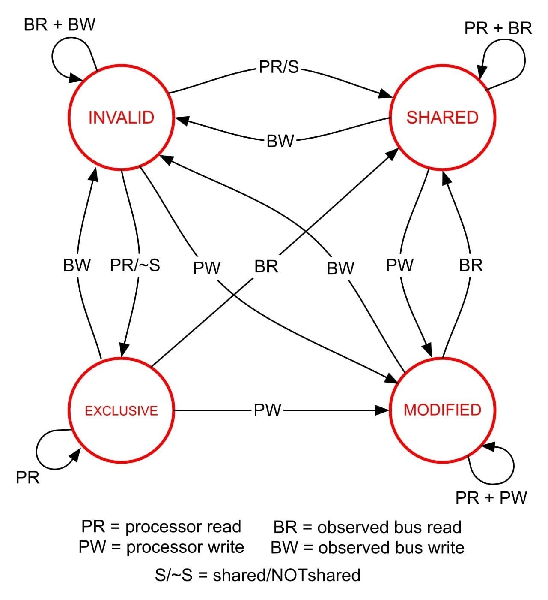
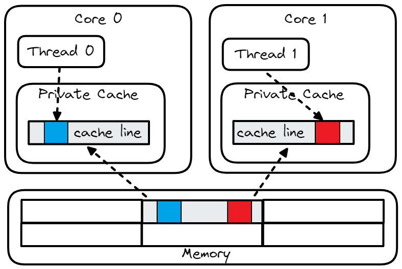

## Cache Coherence {#sec:TrueFalseSharing}

Multiprocessor systems incorporate means to ensure data coherence during shared usage of memory by each core containing its own, separate cache entity. Without such a protocol, if both CPU `A` and `B` read memory location `L` into their individual caches, and CPU `B` subsequently modifies its cached value for `L`, then the CPUs would have incoherent values of the same memory location `L`. Cache Coherency Protocols ensure that any updates to cached entries are dutifully updated or invalidated in any other cached entry of the same location.

### Cache Coherency Protocols

One of the most well-known cache coherency protocols is MESI (**M**odified **E**xclusive **S**hared **I**nvalid), which is used to support writeback caches like those used in modern CPUs. Its acronym denotes the four states with which a cache line can be marked (see Figure @fig:MESI):

* **Modified**: a cache line is present only in the current cache and has been modified from its value in RAM
* **Exclusive**: a cache line is present only in the current cache and matches its value in RAM
* **Shared**: a cache line is present here and in other cache lines and matches its value in RAM
* **Invalid**: a cache line is unused (i.e., does not contain any RAM location)

{#fig:MESI width=60%}

When fetched from memory, each cache line has one of the states encoded into its tag. Then the cache line state keeps transiting from one state to another.[^25] In reality, CPU vendors usually implement slightly improved variants of MESI. For example, Intel uses [MESIF](https://en.wikipedia.org/wiki/MESIF_protocol),[^26] which adds a Forwarding (F) state, while AMD employs [MOESI](https://en.wikipedia.org/wiki/MOESI_protocol),[^27] which adds the Owning (O) state. However, these protocols still maintain the essence of the base MESI protocol.

As an earlier example demonstrates, the cache coherency problem can cause sequentially inconsistent programs. This problem can be mitigated by having _snoop_ caches watch all memory transactions and cooperate with each other to maintain memory consistency. Unfortunately, it comes with a cost since modification done by one core invalidates the corresponding cache line in another core's cache. This causes memory stalls and wastes system bandwidth. In contrast to serialization and locking issues, which can only put a ceiling on the performance of the application, coherency issues can cause retrograde effects as attributed by USL in [@sec:secAmdahl]. Two widely known types of coherency problems are *true sharing* and *false sharing*, which we will explore next.

### True Sharing {#sec:secTrueSharing}

True sharing occurs when two different cores access the same variable (see [@lst:TrueSharing]).

Listing: True Sharing Example.

~~~~ {#lst:TrueSharing .cpp}
unsigned int sum; // shared between all threads
{ // code executed by thread A      │ { // code executed by thread B
  for (int i = 0; i < N; i++)       │   for (int i = 0; i < N; i++)
    sum += a[i];                    │     sum += b[i];
}                                   │ }
~~~~~~~~~~~~~~~~~~~~~~~~~~~~~~~~~~~~~~~~~~~~~~~~~

First of all, we have a bigger problem besides true sharing. We actually have a *data races*, which sometimes can be quite tricky to detect. Notice, we don't have a proper synchronization mechanisms in place, which can lead to unpredictable or incorrect program behavior, because the operations on the shared data might interfere with one another. Fortunately, there are tools that can help identify such issues. [Thread sanitizer](https://clang.llvm.org/docs/ThreadSanitizer.html)[^30] from Clang and [helgrind](https://www.valgrind.org/docs/manual/hg-manual.html)[^31] are among such tools. To prevent the data race in [@lst:TrueSharing], you should declare the `sum` variable as `std::atomic<unsigned int> sum`.

Using C++ atomics can help to solve data races when true sharing happens. However, it effectively serializes accesses to the atomic variable, which may hurt performance. A better way of solving our true sharing issue is by using Thread Local Storage (TLS). TLS is the method by which each thread in a given multithreaded process can allocate memory to store thread-specific data. By doing so, threads modify their local copies instead of contending for a globally available memory location. The example in [@lst:TrueSharing] can be fixed by declaring `sum` with a TLS class specifier: `thread_local unsigned int sum` (since C++11). The main thread should then incorporate results from all the local copies of each worker thread.

### False Sharing {#sec:secFalseSharing}

If not careful, you may attempt to solve the true sharing issue as shown in [@lst:FalseSharing]. However, this solution introduces another problem: false sharing. False sharing occurs when two different cores modify different variables that happen to reside on the same cache line. In the code sample shown in [@lst:FalseSharing], even though threads `A` and `B` update different fields of struct `S`, they are very likely to reside on the same cache line, which will trigger a false sharing issue. Figure @fig:FalseSharing illustrates this problem.

Listing: False Sharing Example.

~~~~ {#lst:FalseSharing .cpp}
struct S {
  int sumA; // sumA and sumB are likely to
  int sumB; // reside in the same cache line
};
S s;

{ // code executed by thread A     │     { // code executed by thread B
  for (int i = 0; i < N; i++)      │       for (int i = 0; i < N; i++)
    s.sumA += a[i];                │         s.sumB += b[i];
}                                  │     }
~~~~~~~~~~~~~~~~~~~~~~~~~~~~~~~~~~~~~~~~~~~~~~~~~

{#fig:FalseSharing width=60%}

False sharing is a frequent source of performance issues for multithreaded applications. Because of that, modern analysis tools have built-in support for detecting such cases. TMA characterizes applications that experience true/false sharing as `Memory Bound`. Typically, in such cases, you would see a high value for the `Contested Accesses` metric.[^18]

When using Intel VTune Profiler, we recommend running two types of analysis to find and eliminate false sharing issues. First, run a *Microarchitecture Exploration* analysis that implements TMA methodology to detect the presence of false sharing in an application. As noted before, the high value for the *Contested Accesses* metric prompts us to dig deeper and run the *Memory Access* analysis with the *Analyze dynamic memory objects* checkbox enabled. This analysis helps in finding out memory accesses to the data structure that caused contention issues. Typically, such memory accesses have high latency, which will be revealed by the analysis. See an example of using Intel VTune Profiler for fixing false sharing issues in [Intel Developer Zone](https://software.intel.com/en-us/vtune-cookbook-false-sharing).[^20]

Linux `perf` has support for finding false sharing as well. As with the Intel VTune profiler, run TMA first (see [@sec:secTMA_Intel]) to find out if the program experiences false/true sharing issues. If that's the case, use the `perf c2c` tool to detect memory accesses with high cache coherency costs. `perf c2c` matches store/load addresses for different threads and checks if the hit in a modified cache line occurred. Readers can find a detailed explanation of the process and how to use the tool in a dedicated [blog post](https://joemario.github.io/blog/2016/09/01/c2c-blog/).[^21]

It is possible to eliminate false sharing with the help of aligning/padding memory objects. Example in [@sec:secTrueSharing] can be fixed by ensuring `sumA` and `sumB` do not share the same cache line as shown in [@lst:PadFalseSharing].[^32]

Listing: Data padding to avoid false sharing.

~~~~ {#lst:PadFalseSharing .cpp}
                              #define CACHELINE_ALIGN alignas(64) 
struct S {                    struct S {
  int sumA;        =>           int sumA; 
  int sumB;                     CACHELINE_ALIGN int sumB;
};                            };
~~~~~~~~~~~~~~~~~~~~~~~~~~~~~~~~~~~~~~~~~~~~~~~~~

False sharing can not only be observed in low-level languages, like C and C++, but also in higher-level ones, like Java and C#. From a general performance perspective, the most important thing to consider is the cost of the possible state transitions. Of all cache states, the only ones that do not involve a costly cross-cache subsystem communication and data transfer during CPU read/write operations are the Modified (M) and Exclusive (E) states. Thus, the longer the cache line maintains the `M` or `E` states (i.e., the less sharing of data across caches), the lower the coherence cost incurred by a multithreaded application. An example demonstrating how this property has been employed can be found in Nitsan Wakart's blog post "[Diving Deeper into Cache Coherency](http://psy-lob-saw.blogspot.com/2013/09/diving-deeper-into-cache-coherency.html)".[^28]

[^18]: See the Intel VTune user guide for a description of the *Contested Accesses* metric.
[^20]: VTune cookbook: false-sharing - [https://software.intel.com/en-us/vtune-cookbook-false-sharing](https://software.intel.com/en-us/vtune-cookbook-false-sharing).
[^21]: An article on `perf c2c` - [https://joemario.github.io/blog/2016/09/01/c2c-blog/](https://joemario.github.io/blog/2016/09/01/c2c-blog/).
[^25]: There is an animated demonstration of the MESI protocol - [https://www.scss.tcd.ie/Jeremy.Jones/vivio/caches/MESI.htm](https://www.scss.tcd.ie/Jeremy.Jones/vivio/caches/MESI.htm).
[^26]: MESIF - [https://en.wikipedia.org/wiki/MESIF_protocol](https://en.wikipedia.org/wiki/MESIF_protocol)
[^27]: MOESI - [https://en.wikipedia.org/wiki/MOESI_protocol](https://en.wikipedia.org/wiki/MOESI_protocol)
[^28]: Blog post "Diving Deeper into Cache Coherency" - [http://psy-lob-saw.blogspot.com/2013/09/diving-deeper-into-cache-coherency.html](http://psy-lob-saw.blogspot.com/2013/09/diving-deeper-into-cache-coherency.html)
[^30]: Clang's thread sanitizer tool: [https://clang.llvm.org/docs/ThreadSanitizer.html](https://clang.llvm.org/docs/ThreadSanitizer.html).
[^31]: Helgrind, a thread error detector tool: [https://www.valgrind.org/docs/manual/hg-manual.html](https://www.valgrind.org/docs/manual/hg-manual.html).
[^32]: Do not take the size of a cache line as a constant value. For example, in Apple processors such as M1, M2, and later, the L2 cache operates on 128B cache lines.
