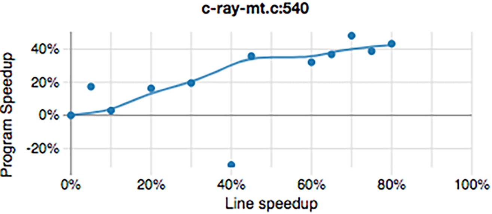

## Advanced Analysis Tools

Many tools have been developed to address specific use cases where traditional profilers don't provide enough visibility. In this section, we will introduce Coz and eBPF tools. We encourage you to do further research on these and other tools.

### Coz {#sec:COZ}

In [@sec:secAmdahl], we defined the challenge of identifying parts of code that affect the overall performance of a multithreaded program. Due to various reasons, optimizing one part of a multithreaded program might not always give visible results. Traditional sampling-based profilers only show code places where most of the time is spent. However, it does not necessarily correspond to where programmers should focus their optimization efforts. 

[Coz](https://github.com/plasma-umass/coz)[^16] is a profiler that addresses this problem. It uses a novel technique called *causal profiling*, whereby experiments are conducted during the runtime of an application by virtually speeding up segments of code to predict the overall effect of certain optimizations. It accomplishes these “virtual speedups” by inserting pauses that slow down all other concurrently running code. Also, Coz quantifies the potential impact of an optimization. [@CozPaper]

An example of applying the Coz profiler to the [C-Ray](https://github.com/jtsiomb/c-ray)[^15] benchmark is shown in @fig:CozProfile. According to the chart, if we improve the performance of line 540 in `c-ray-mt.c` by 20%, Coz expects a corresponding increase in application performance of the C-Ray benchmark overall of about 17%. Once we reach ~45% improvement on that line, the impact on the application begins to level off by Coz’s estimation. For more details on this example, see the [article](https://easyperf.net/blog/2020/02/26/coz-vs-sampling-profilers)[^17] on the Easyperf blog.

{#fig:CozProfile width=60%}

[^15]: C-Ray benchmark - [https://github.com/jtsiomb/c-ray](https://github.com/jtsiomb/c-ray).
[^16]: COZ source code - [https://github.com/plasma-umass/coz](https://github.com/plasma-umass/coz).
[^17]: Blog article "COZ vs Sampling Profilers" - [https://easyperf.net/blog/2020/02/26/coz-vs-sampling-profilers](https://easyperf.net/blog/2020/02/26/coz-vs-sampling-profilers).

### eBPF and GAPP {#sec:secEBPF}

Linux supports a variety of thread synchronization primitives: mutexes, semaphores, condition variables, etc. The kernel supports these thread primitives via the `futex` system call. Therefore, by tracing the execution of the `futex` system call in the kernel while gathering useful metadata from the threads involved, contention bottlenecks can be more readily identified. Linux provides kernel tracing and profiling tools that make this possible, none more powerful than [Extended Berkeley Packet Filter](https://prototype-kernel.readthedocs.io/en/latest/bpf/)[^22] (eBPF).

eBPF is based around a sandboxed virtual machine running in the kernel that allows the execution of user-defined programs safely and efficiently inside the kernel. The user-defined programs can be written in C and compiled into BPF bytecode by the [BCC compiler](https://github.com/iovisor/bcc)[^23] in preparation for loading into the kernel virtual machine. These BPF programs can be written to launch upon the execution of certain kernel events and communicate raw or processed data back to userspace via a variety of means. 

The open-source community has provided many eBPF programs for general use. One such tool is the [Generic Automatic Parallel Profiler](https://github.com/RN-dev-repo/GAPP/) (GAPP), which helps to track multithreaded contention issues. GAPP uses eBPF to track the contention overhead of a multithreaded application by ranking the criticality of identified serialization bottlenecks and it collects stack traces of threads that were blocked and the one that caused the blocking. The best thing about GAPP is that it does not require code changes, expensive instrumentation, or recompilation. Creators of the GAPP profiler were able to confirm known bottlenecks and also expose new, previously unreported bottlenecks in [Parsec 3.0 Benchmark Suite](https://parsec.cs.princeton.edu/index.htm)[^24] and some large open-source projects. [@GAPP]

As a closing thought, I would like to reemphasize the importance of optimizing multithreaded applications. From everything we have discussed in this book, advice from this chapter may bring the most significant performance improvements. In multithreaded applications, the devil is in the details. A subtle synchronization issue or a small inefficiency in data sharing can lead to significant performance degradation. As we look to the future, the trend toward many-core processors and parallel workloads will only accelerate. The complexity of multithreaded optimization will grow, but so will the opportunities for those who master it. 

[^22]: eBPF docs - [https://prototype-kernel.readthedocs.io/en/latest/bpf/](https://prototype-kernel.readthedocs.io/en/latest/bpf/)
[^23]: BCC compiler - [https://github.com/iovisor/bcc](https://github.com/iovisor/bcc)
[^24]: Parsec 3.0 Benchmark Suite - [https://parsec.cs.princeton.edu/index.htm](https://parsec.cs.princeton.edu/index.htm)
