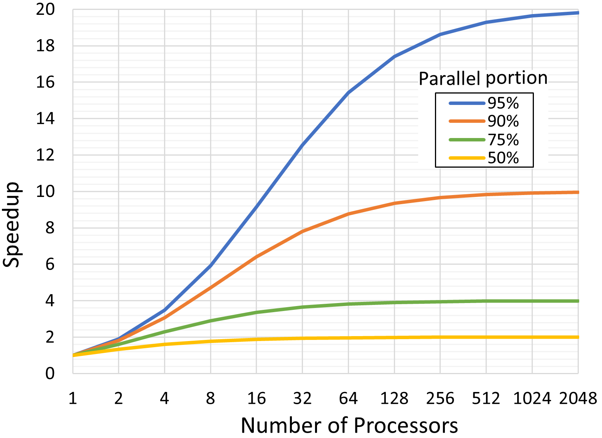
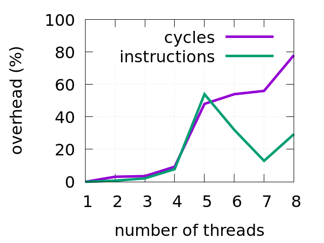

[TODO:] redo the scaling study

## Performance Scaling And Overhead {#sec:secAmdahl}

When dealing with a single-threaded application, optimizing one portion of the program usually yields positive results on performance. However, it's not necessarily the case for multithreaded applications. There could be an application in which thread `A` executes a long-running operation, while thread `B` finishes its task early and just waits for thread `A` to finish. No matter how much we improve thread `B`,  application latency will not be reduced since it will be limited by a longer-running thread `A`. 

This effect is widely known as [Amdahl's law](https://en.wikipedia.org/wiki/Amdahl's_law)[^6], which constitutes that the speedup of a parallel program is limited by its serial part. Figure @fig:MT_AmdahlsLaw illustrates the theoretical speedup limit as a function of the number of processors. For a program, 75% of which is parallel, the speedup factor converges to 4.

{#fig:MT_AmdahlsLaw width=70%}

Figure @fig:MT_Scaling shows performance scaling of the `h264dec` benchmark from [Starbench parallel benchmark suite](https://www.aes.tu-berlin.de/menue/research/projects/completed_projects/starbench_parallel_benchmark_suite/). I tested it on Intel Core i5-8259U, which has 4 cores/8 threads. Notice that after using 4 threads, performance doesn't scale much. Likely, getting a CPU with more cores won't improve performance. [^7]

{#fig:MT_Scaling width=45%}

{#fig:MT_cycles width=45%}

Performance scaling and overhead of h264dec benchmark on Intel Core i5-8259U.

In reality, further adding computing nodes to the system may yield retrograde speed up. This effect is explained by Neil Gunther as [Universal Scalability Law](http://www.perfdynamics.com/Manifesto/USLscalability.html#tth_sEc1)[^8] (USL), which is an extension of Amdahl's law. USL describes communication between computing nodes (threads) as yet another gating factor against performance. As the system is scaled up, overheads start to hinder the gains. Beyond a critical point, the capability of the system starts to decrease (see fig. @fig:MT_USL). USL is widely used for modeling the capacity and scalability of the systems.

.*](../../img/mt-perf/USL.jpg){#fig:MT_USL width=60%}

Slowdowns described by USL are driven by several factors. First, as the number of computing nodes increases, they start to compete for resources (contention). This results in additional time being spent on synchronizing those accesses. Another issue occurs with resources that are shared between many workers. We need to maintain a consistent state of the shared resource between many workers (coherence). For example, when multiple workers frequently change a globally visible object, those changes need to be broadcasted to all nodes that use that object. Suddenly, usual operations start getting more time to finish due to the additional need to maintain coherence. The communication overhead of the h264dec benchmark on Intel Core i5-8259U can be observed in Figure @fig:MT_cycles. Notice how the benchmark experience more overhead in terms of elapsed core cycles as we assign more than 4 threads to the task. [^9]

Optimizing multithreaded applications not only involves all the techniques described in this book so far but also involves detecting and mitigating the aforementioned effects of contention and coherence. The following subsections will describe techniques for addressing these additional challenges for tuning multithreaded programs.

[^4]: It may not always be the case. For example, resources that are shared between threads/cores (like caches) can limit scaling. Also, compute-bound benchmarks tend to scale only up to the number of physical (not logical) cores since two sibling HW threads share the same execution engine.
[^6]: Amdahl's law - [https://en.wikipedia.org/wiki/Amdahl's_law](https://en.wikipedia.org/wiki/Amdahl's_law).
[^7]: However, it will benefit from a CPU with a higher frequency.
[^8]: USL law - [http://www.perfdynamics.com/Manifesto/USLscalability.html#tth_sEc1](http://www.perfdynamics.com/Manifesto/USLscalability.html#tth_sEc1).
[^9]: There is an interesting spike in the number of retired instruction when using 5 and 6 worker threads. This should be investigated by profiling the workload.
