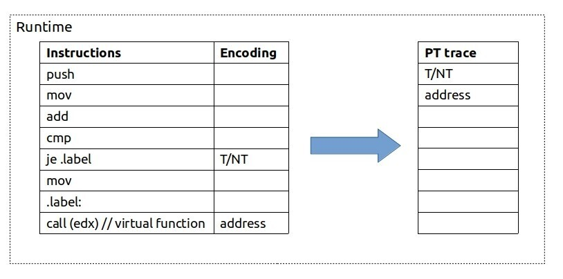
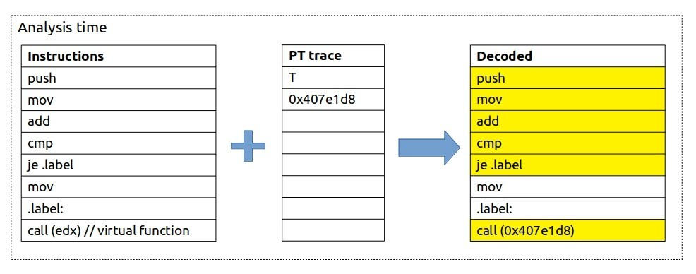
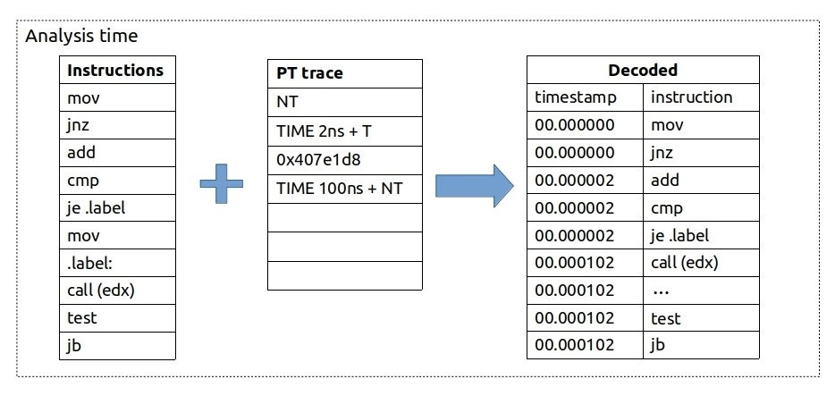

# Appendix D. Intel Processor Traces {.unnumbered}

\markright{Appendix C}

The Intel Processor Traces (PT) is a CPU feature that records the program execution by encoding packets in a highly compressed binary format that can be used to reconstruct execution flow with a timestamp on every instruction. PT has extensive coverage and relatively small overhead[^1], which is usually below `5%`. Its main usages are postmortem analysis and root-causing performance glitches.

## Workflow {.unnumbered .unlisted}

Similar to sampling techniques, PT does not require any modifications to the source code. All you need to collect traces is just to run the program under the tool that supports PT. Once PT is enabled and the benchmark launches, the analysis tool starts writing tracing packets to DRAM. 

Similar to LBR (Last Branch Records), Intel PT works by recording branches. At runtime, whenever a CPU encounters any branch instruction, PT will record the outcome of this branch. For a simple conditional jump instruction, a CPU will record whether it was taken (`T`) or not taken (`NT`) using just 1 bit. For an indirect call, PT will record the destination address. Note that unconditional branches are ignored since we statically know their targets. 

An example of encoding for a small instruction sequence is shown in Figure @fig:PT_encoding. Instructions like `PUSH`, `MOV`, `ADD`, and `CMP` are ignored because they don't change the control flow. However, `JE` instruction may jump to `.label`, so its result needs to be recorded. Later there is an indirect call for which destination address is saved.

{#fig:PT_encoding width=80%}

At the time of analysis, we bring together the application binary and collected PT trace. SW decoder needs the application binary file in order to reconstruct the execution flow of the program. It starts from the entry point and then uses collected traces as a lookup reference to determine the control flow. Figure @fig:PT_decoding shows an example of decoding Intel Processor Traces. Suppose that the `PUSH` instruction is an entry point of the application binary file. Then `PUSH`, `MOV`, `ADD`, and `CMP` are reconstructed as-is without looking into encoded traces. Later SW decoder encounters `JE` instruction, which is a conditional branch and for which we need to look up the outcome. According to the traces on fig. @fig:PT_decoding, `JE` was taken (`T`), so we skip the next `MOV` instruction and go to the `CALL` instruction. Again, `CALL(edx)` is an instruction that changes the control flow, so we look up the destination address in encoded traces, which is `0x407e1d8`. Instructions highlighted in yellow were executed when our program was running. Note that this is an *exact* reconstruction of program execution; we did not skip any instruction. Later we can map assembly instructions back to the source code by using debug information and have a log of source code that was executed line by line.

{#fig:PT_decoding width=90%}

## Timing Packets {.unnumbered .unlisted}

With Intel PT, not only execution flow can be traced but also timing information. In addition to saving jump destinations, PT can also emit timing packets. Figure @fig:PT_timings provides a visualization of how time packets can be used to restore timestamps for instructions. As in the previous example, we first see that `JNZ` was not taken, so we update it and all the instructions above with timestamp 0ns. Then we see a timing update of 2ns and `JE` being taken, so we update it and all the instructions above `JE` (and below `JNZ`) with timestamp 2ns. After that, there is an indirect call, but no timing packet is attached to it, so we do not update timestamps. Then we see that 100ns elapsed, and `JB` was not taken, so we update all the instructions above it with the timestamp of 102ns.

{#fig:PT_timings width=90%}

In the example shown in figure @fig:PT_timings, instruction data (control flow) is perfectly accurate, but timing information is less accurate. Obviously, `CALL(edx)`, `TEST`, and `JB` instructions were not happening at the same time, yet we do not have more accurate timing information for them. Having timestamps enables us to align the time interval of our program with another event in the system, and it's easy to compare to wall clock time. Trace timing in some implementations can further be improved by a cycle-accurate mode, in which the hardware keeps a record of cycle counts between normal packets (see more details in [@IntelSDM, Volume 3C, Chapter 36]).

## Collecting and Decoding Traces {.unnumbered .unlisted}

Intel PT traces can be easily collected with the Linux `perf` tool:

```bash
$ perf record -e intel_pt/cyc=1/u ./a.out
```

In the command line above, we asked the PT mechanism to update timing information every cycle. But likely, it will not increase our accuracy greatly since timing packets will only be sent when paired with another control flow packet.

After collecting, raw PT traces can be obtained by executing:

```bash
$ perf report -D > trace.dump
```

PT bundles up to 6 conditional branches before it emits a timing packet. Since the Intel Skylake CPU generation, timing packets have cycle count elapsed from the previous packet. If we then look into the `trace.dump`, we might see something like the following:

```
000073b3: 2d 98 8c  TIP 0x8c98     // target address (IP)
000073b6: 13        CYC 0x2        // timing update
000073b7: c0        TNT TNNNNN (6) // 6 conditional branches
000073b8: 43        CYC 0x8        // 8 cycles passed
000073b9: b6        TNT NTTNTT (6)
```

Above we showed the raw PT packets, which are not very useful for performance analysis. To decode processor traces to human-readable form, one can execute:

```bash
$ perf script --ns --itrace=i1t -F time,srcline,insn,srccode
```

Below is the example of decoded traces one might get:

```
timestamp       srcline   instruction      srccode
...
253.555413143:  a.cpp:24  call 0x35c       foo(arr, j);
253.555413143:  b.cpp:7   test esi, esi    for (int i = 0; i <= n; i++)
253.555413508:  b.cpp:7   js 0x1e
253.555413508:  b.cpp:7   movsxd rsi, esi
...
```

Above is shown just a small snippet from the long execution log. In this log, we have traces of *every* instruction executed while our program was running. We can literally observe every step that was made by the program. It is a very strong foundation for further functional and performance analysis.

## Use Cases {.unnumbered .unlisted}

1. **Analyze performance glitches**. Because PT captures the entire instruction stream, it is possible to analyze what was going on during the small-time period when the application was not responding. More detailed examples can be found in an [article](https://easyperf.net/blog/2019/09/06/Intel-PT-part3)[^2] on easyperf blog.
2. **Postmortem debugging**. PT traces can be replayed by traditional debuggers like `gdb`. In addition to that, PT provides call stack information, which is *always* valid even if the stack is corrupted[^3]. PT traces could be collected on a remote machine once and then analyzed offline. This is especially useful when the issue is hard to reproduce or access to the system is limited. 
3. **Introspect execution of the program**.
   - We can immediately tell if a code path was never executed. 
   - Thanks to timestamps, it's possible to calculate how much time was spent waiting while spinning on a lock attempt, etc.
   - Security mitigation by detecting specific instruction pattern.

## Disk Space and Decoding Time {.unnumbered .unlisted}

Even taking into account the compressed format of the traces, encoded data can consume a lot of disk space. Typically, it's less than 1 byte per instruction, however taking into account the speed at which CPU executes instructions, it is still a lot. Depending on a workload, it's very common for CPU to encode PT at a speed of 100 MB/s. Decoded traces might easily be ten times more (~1GB/s). This makes PT not practical for using on long-running workloads. But it is affordable to run it for a small period of time, even on a big workload. In this case, the user can attach to the running process just for the period of time when the glitch happened. Or they can use a circular buffer, where new traces will overwrite old ones, i.e., always having traces for the last 10 seconds or so.

Users can limit collection even further in several ways. They can limit collecting traces only on user/kernel space code. Also, there is an address range filter, so it's possible to opt-in and opt-out of tracing dynamically to limit the memory bandwidth. This allows us to trace just a single function or even a single loop.

Decoding PT traces can take a long time. On an Intel Core i5-8259U machine, for a workload that runs for 7 milliseconds, encoded PT trace consumes around 1MB of disk space. Decoding this trace using `perf script` takes ~20 seconds. The decoded output from `perf script -F time,ip,sym,symoff,insn` takes ~1.3GB of disk space. As of February 2020, decoding traces with `perf script -F` with `+srcline` or `+srccode` gets extremely slow and is not practical for daily usage. The implementation of Linux perf should be improved. 

[TODO]: Feb 2020: Intel VTune Profiler support for PT is still experimental. But today there is a dedicated analysis type that uses Intel PT.

## Intel PT References and links {.unnumbered .unlisted}

* Intel® 64 and IA-32 Architectures Software Developer Manuals [@IntelSDM, Volume 3C, Chapter 36].
* Whitepaper "Hardware-assisted instruction profiling and latency detection" [@IntelPTPaper].
* Andi Kleen article on LWN, URL: [https://lwn.net/Articles/648154](https://lwn.net/Articles/648154).
* Intel PT Micro Tutorial, URL: [https://sites.google.com/site/intelptmicrotutorial/](https://sites.google.com/site/intelptmicrotutorial/).
* simple_pt: Simple Intel CPU processor tracing on Linux, URL:
  [https://github.com/andikleen/simple-pt/](https://github.com/andikleen/simple-pt).
* Intel PT documentation in the Linux kernel, URL:
  [https://github.com/torvalds/linux/blob/master/tools/perf/Documentation/intel-pt.txt](https://github.com/torvalds/linux/blob/master/tools/perf/Documentation/intel-pt.txt).
* Cheatsheet for Intel Processor Trace, URL: [http://halobates.de/blog/p/410](http://halobates.de/blog/p/410).

[^1]: See more information about Intel PT overhead in [@IntelPTPaper].
[^2]: Analyze performance glitches with Intel PT - [https://easyperf.net/blog/2019/09/06/Intel-PT-part3](https://easyperf.net/blog/2019/09/06/Intel-PT-part3).
[^3]: Postmortem debugging with Intel PT - [https://easyperf.net/blog/2019/08/30/Intel-PT-part2](https://easyperf.net/blog/2019/08/30/Intel-PT-part2).
