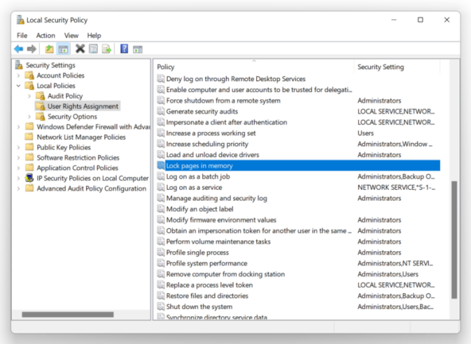

# Appendix C. Enable Huge Pages {.unnumbered}

\markright{Appendix C}

## Windows

 To utilize huge pages on Windows, one needs to enable `SeLockMemoryPrivilege` [security policy](https://docs.microsoft.com/en-us/windows/security/threat-protection/security-policy-settings/lock-pages-in-memory).
 This can be done programatically via the Windows API, or alternatively via the security policy GUI.

1. Hit start -> search "secpol.msc", launch it.
2. On the left select "Local Policies" -> "User Rights Assignment", then double-click on "Lock pages in memory".

{width=50%}

3. Add your user and reboot the machine.

4. Check that huge pages are used at runtime with [RAMMap](https://docs.microsoft.com/en-us/sysinternals/downloads/rammap) tool.

Use huge pages in the code with:

```cpp
void* p = VirtualAlloc(NULL, size, MEM_RESERVE | 
                                   MEM_COMMIT | 
                                   MEM_LARGE_PAGES,
                       PAGE_READWRITE);
...
VirtualFree(ptr, 0, MEM_RELEASE);
```

## Linux

On Linux OS, there are two ways of using large pages in an application: Explicit and Transparent Huge Pages.

### Explicit hugepages

**[TODO:] describe how to reserve at boot time.**

Explicit huge pages can be reserved at boot time or at run time. Exact instructions for reserving huge pages can be found in [Red Hat Performance Tuning Guide](https://access.redhat.com/documentation/en-us/red_hat_enterprise_linux/7/html/performance_tuning_guide/sect-red_hat_enterprise_linux-performance_tuning_guide-memory-configuring-huge-pages#sect-Red_Hat_Enterprise_Linux-Performance_tuning_guide-Memory-Configuring-huge-pages-at-run-time) [^22].

To explicitly allocate a fixed number of huge pages, one can use [libhugetlbfs](https://github.com/libhugetlbfs/libhugetlbfs). The following command preallocates 128 huge pages.

```bash
$ sudo apt install libhugetlbfs-bin
$ sudo hugeadm --create-global-mounts
$ sudo hugeadm --pool-pages-min 2M:128
```

This is roughly the equivalent of executing the following commands which do not require libhugetlbfs (see the [kernel docs](https://www.kernel.org/doc/Documentation/vm/hugetlbpage.txt)):

```bash
$ echo 128 > /proc/sys/vm/nr_hugepages
$ mount -t hugetlbfs                                                      \
    -o uid=<value>,gid=<value>,mode=<value>,pagesize=<value>,size=<value>,\
    min_size=<value>,nr_inodes=<value> none /mnt/huge
```

You should be able to observe the effect in `/proc/meminfo`:

```bash
$ watch -n1 "cat /proc/meminfo  | grep huge -i"
AnonHugePages:      2048 kB
ShmemHugePages:        0 kB
FileHugePages:         0 kB
HugePages_Total:     128    <== 128 huge pages allocated
HugePages_Free:      128
HugePages_Rsvd:        0
HugePages_Surp:        0
Hugepagesize:       2048 kB
Hugetlb:          262144 kB <== 256MB of space occupied
```

Use explicit huge pages in the code with:

```cpp
void ptr = mmap(nullptr, size, PROT_READ | PROT_WRITE,
                MAP_PRIVATE | MAP_ANONYMOUS | MAP_HUGETLB, -1, 0);
...
munmap(ptr, size);
```

### Transparent hugepages

To allow application use Transparent Huge Pages (THP) on Linux one should make sure that `/sys/kernel/mm/transparent_hugepage/enabled` is `always` or `madvise`. The former enables system wide usage of THPs, while the latter gives control to the user code which memory regions should use THPs, thus avoids the risk of consuming more memory resources. Below is the example of using the `madvise` approach:

```cpp
void ptr = mmap(nullptr, size, PROT_READ | PROT_WRITE | PROT_EXEC,
                MAP_PRIVATE | MAP_ANONYMOUS, -1 , 0);
madvise(ptr, size, MADV_HUGEPAGE);
...
munmap(ptr, size);
```

When applications are allocating huge pages via `madvise` and `mmap`, you can observe the effect in `/proc/meminfo` under `AnonHugePages`.

```bash
$ watch -n1 "cat /proc/meminfo  | grep huge -i" 
AnonHugePages:     61440 kB     <== 30 transparent huge pages are in use
HugePages_Total:     128
HugePages_Free:      128        <== explicit huge pages are not used
```