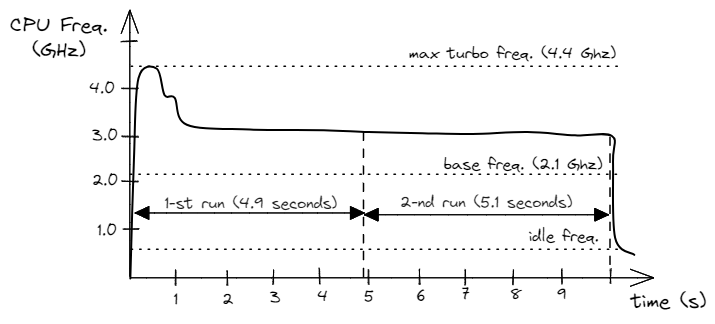

## Noise In Modern Systems {#sec:secFairExperiments}

There are many features in HW and SW that are intended to increase performance. But not all of them have deterministic behavior. Let's consider [Dynamic Frequency Scaling](https://en.wikipedia.org/wiki/Dynamic_frequency_scaling)[^11] (DFS): this is a feature that allows a CPU to increase its frequency for a short time interval, making it run significantly faster. However, the CPU can't stay in "overclocked" mode for a long time, so later, it decreases its frequency back to the base value. DFS usually depends a lot on a core temperature, which makes it hard to predict the impact on our experiments.

If we start two runs of the benchmark, one right after another on a "cold" processor[^1], the first run could possibly work for some time in "overclocked" mode and then decrease its frequency back to the base level. However, it's possible that the second run might not have this advantage and will operate at the base frequency without entering "turbo mode". Even though we run the exact same version of the program two times, the environment in which they run is not the same. Figure @fig:FreqScaling shows a situation where dynamic frequency scaling can cause variance in measurements. As you can see, the first run is 1 second faster than the second one due to the fact that it was running on a higher frequency. Such a scenario can frequently happen when benchmarking on laptops since they have limited heat dissipation.

{#fig:FreqScaling width=80%}

Frequency Scaling is a HW feature, but variations in measurements might also come from SW features. Let's consider the example of a filesystem cache. If we benchmark an application that does lots of file manipulation, e.g. `git status` command, the filesystem can play a big role in performance. When the first iteration of the benchmark runs, the required entries in the filesystem cache could be missing. However, the filesystem cache will be warmed-up when running the same benchmark the second time, making it noticeably faster than the first run.

Unfortunately, measurement bias does not only come from environment configuration. [@Mytkowicz] paper demonstrates that UNIX environment size (i.e., the total number of bytes required to store the environment variables) and link order (the order of object files that are given to the linker) can affect performance in unpredictable ways. Moreover, there are numerous other ways of affecting memory layout and potentially affecting performance measurements. One approach to enable statistically sound performance analysis of software on modern architectures was presented in [@Curtsinger13]. This work shows that it's possible to eliminate measurement bias that comes from memory layout by efficiently and repeatedly randomizing the placement of code, stack, and heap objects at runtime. Sadly, these ideas didn't go much further, and right now, this project is almost abandoned.

Remember that even running a task manager tool, like Linux top, can affect measurements since a CPU core will be activated and assigned to it. This might affect the frequency of the core that is running the actual benchmark.

Having consistent measurements requires running all iterations of the benchmark with the same conditions. However, it is not possible to replicate the exact same environment and eliminate bias completely: there could be different temperature conditions, power delivery spikes, neighbor processes running, etc. Chasing all potential sources of noise and variation in the system can be a never-ending story. Sometimes it cannot be achieved, for example, when benchmarking a large distributed cloud service.

So, eliminating non-determinism in a system is helpful for well-defined, stable performance tests, e.g., microbenchmarks. For instance, when you implement a code change and want to know the relative speedup ratio by benchmarking two different versions of the same program. This is a scenario where you can control most of the variables in the benchmark, including its input, environment configuration, etc. In this situation, eliminating non-determinism in a system helps to get a more consistent and accurate comparison. After finishing with local testing, remember to make sure projected performance improvements were mirrored in real-world measurements. Readers can find some examples of features that can bring noise into performance measurements and how to disable them in Appendix A. Also, there are tools that can set up the environment to ensure benchmarking results with a low variance; one of them is [temci](https://github.com/parttimenerd/temci)[^14].

It is not recommended to eliminate system non-deterministic behavior when estimating real-world performance improvements. Engineers should try to replicate the target system configuration, which they are optimizing for. Introducing any artificial tuning to the system under test will diverge results from what users of your service will see in practice. Also, any performance analysis work, including profiling (see [@sec:profiling]), should be done on a system that is configured similar to what will be used in a real deployment.

Finally, it's important to keep in mind that even if a particular HW or SW feature has non-deterministic behavior, that doesn't mean it is considered harmful. It could give an inconsistent result, but it is designed to improve the overall performance of the system. Disabling such a feature might reduce the noise in microbenchmarks but make the whole suite run longer. This might be especially important for CI/CD performance testing when there are time limits for how long it should take to run the whole benchmark suite.

[^1]: By cold processor, we mean the CPU that stayed in an idle mode for a while, allowing it to cool down its temperature. 
[^11]: Dynamic Frequency Scaling - [https://en.wikipedia.org/wiki/Dynamic_frequency_scaling](https://en.wikipedia.org/wiki/Dynamic_frequency_scaling).
[^14]: Temci - [https://github.com/parttimenerd/temci](https://github.com/parttimenerd/temci).
