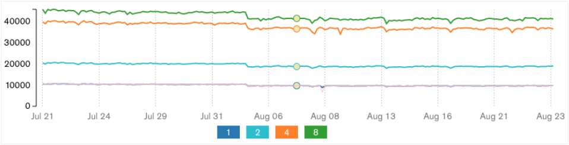

## Automated Detection of Performance Regressions

We just discussed why you should monitor performance in production. On the other hand, it is still beneficial to set up continuous "in-house" testing to catch performance problems early, even though not every performance regression can be caught in a lab.

Software vendors constantly seek ways to accelerate the pace of delivering their products to the market. Many companies deploy newly written code every couple of months or weeks. Unfortunately, software products don't get better performance with each new release. Performance defects tend to leak into production software at an alarming rate [@UnderstandingPerfRegress]. A large number of code changes pose a challenge to thorough analysis of their performance impact.

Performance regressions are defects that make the software run slower compared to the previous version. Catching performance regressions (or improvements) requires detecting the commit that has changed the performance of the program. From database systems to search engines to compilers, performance regressions are commonly experienced by almost all large-scale software systems during their continuous evolution and deployment life cycle. It may be impossible to entirely avoid performance regressions during software development, but with proper testing and diagnostic tools, the likelihood of such defects silently leaking into production code can be reduced significantly.

It is useful to track the performance of your application with charts, like the one shown in Figure @fig:PerfRegress. Using such a chart you can see historical trends and find moments where performance improved or degraded. Typically, you will have a separate line for each performance test you're tracking. Do not include too many benchmarks on a single chart as it will become very noisy.

{#fig:PerfRegress width=100%}

Let's consider some potential solutions for detecting performance regressions. The first option that comes to mind is: having humans look at the graphs. For the chart in Figure @fig:PerfRegress, humans will likely catch performance regression that happened on August 7th, but it's not obvious that they will detect later smaller regressions. People tend to lose focus quickly and can miss regressions, especially on a busy chart. In addition to that, it is a time-consuming and boring job that must be performed daily.

There is another interesting performance drop on August 3rd. A developer will also likely catch it, however, most of us would be tempted to dismiss it since performance recovered the next day. But are we sure that it was merely a glitch in measurements? What if this was a real regression that was compensated by an optimization on August 4th? If we could fix the regression *and* keep the optimization, we would have a performance score of around 4500. Do not dismiss such cases. One way to proceed here would be to repeat the measurements for the dates Aug 02--Aug 04 and inspect code changes during that period.

The second option is to have a threshold, say, 2%. Every code modification that has performance within that threshold is considered noise and everything above the threshold is considered a regression. It is somewhat better than the first option but still has its own drawbacks. Fluctuations in performance tests are inevitable: sometimes, even a harmless code change can trigger performance variation in a benchmark.[^3] Choosing the right value for the threshold is extremely hard and does not guarantee a low rate of false-positive as well as false-negative alarms. Setting the threshold too low might lead to analyzing a bunch of small regressions that were not caused by the change in source code but due to some random noise. Setting the threshold too high might lead to filtering out real performance regressions. 

Small regressions can pile up slowly into a bigger regression, which can be left unnoticed. Going back to Figure @fig:PerfRegress, notice a downward trend that lasted from Aug 11 to Aug 21. The period started with a score of 3000 and ended with 2600. That is roughly a 15% regression over 10 days or 1.5% per day on average. If we set a 2% threshold all regressions will be filtered out. However, as we can see, the accumulated regression is much bigger than the threshold. 

Nevertheless, this option works reasonably well for many projects, especially if the level of noise in the benchmark is very low. Also, you can adjust the threshold for each test. An example of a CI system where each test requires setting explicit threshold values for alerting a regression is [LUCI](https://chromium.googlesource.com/chromium/src.git/+/master/docs/tour_of_luci_ui.md),[^2] which is a part of the Chromium project.

It's worth mentioning that tracking performance results over time requires that you maintain the same configuration of the machine(s) that you use to run benchmarks. A change in the configuration may invalidate all the previous performance results. You may decide to recollect all historical measurements with a new configuration, but this is very expensive.

Another option that recently became popular uses a statistical approach to identify performance regressions. It leverages an algorithm called "Change Point Detection" (CPD, see [@ChangePointAnalysis]), which utilizes historical data and identifies points in time where performance has changed. Many performance monitoring systems embraced the CPD algorithm, including several open-source projects. You can search the web to find the one that better suits your needs.

The notable advantage of CPD is that it does not require setting thresholds. The algorithm evaluates a large window of recent results, which allows it to ignore outliers as noise and produce fewer false positives. The downside for CPD is the lack of immediate feedback. For example, consider a benchmark `B` that has the following historical measurements of running time: 5 sec, 6 sec, 5 sec, 5 sec, 7 sec. If the next benchmark result comes at 11 seconds, then the threshold would likely be exceeded and an alert would be generated immediately. However, in the case of using the CPD algorithm, it wouldn't do anything at this point. If in the next run, performance is restored to 5 seconds, then it would likely dismiss it as a false positive and not generate an alert. Conversely, if the next run or two resulted in 10 sec and 12 sec respectively, only then would the CPD algorithm trigger an alert.

There is no clear answer to which approach is better. If your development flow requires immediate feedback, e.g., evaluating a pull request before it gets merged, then using thresholds is a better choice. Also, if you can remove a lot of noise from your system and achieve stable performance results, then using thresholds is more appropriate. In a very quiet system, the 11 second measurement mentioned before likely indicates a real performance regression, thus we need to flag it as early as possible. In contrast, if you have a lot of noise in your system, e.g., you run distributed macro-benchmarks, then that 11 second result may just be a false positive. In this case, you may be better off using Change Point Detection.

A typical CI performance tracking system should automate the following actions:

1. Set up a system under test.
2. Run a benchmark suite.
3. Report the results.
4. Determine if performance has changed.
5. Alert on unexpected changes in performance.
6. Visualize the results for a human to analyze.

Another desirable feature of a CI performance tracking system is to allow developers to submit performance evaluation jobs for their patches before they commit them to the codebase. This greatly simplifies the developer's job and facilitates quicker turnaround of experiments. The performance impact of a code change is frequently included in the list of check-in criteria. 

If, for some reason, a performance regression has slipped into the codebase, it is very important to detect it promptly. First, because fewer changes were merged since it happened. This allows us to have a person responsible for the regression look into the problem before they move to another task. Also, it is a lot easier for a developer to approach the regression since all the details are still fresh in their head as opposed to several weeks after that.

Lastly, the CI system should alert, not just on software performance regressions, but on unexpected performance improvements, too. For example, someone may check in a seemingly innocuous commit which improves performance by 10% in the automated tracking harness. Your initial instinct may be to celebrate this fortuitous performance boost and proceed with your day. However, while this commit may have passed all functional tests in your CI pipeline, chances are that this unexpected improvement uncovered a gap in functional testing which only manifested itself in performance regression results. For instance, the change caused the application to skip some parts of work, which was not covered by functional tests. This scenario occurs often enough that it warrants explicit mention: treat the automated performance regression harness as part of a holistic software testing framework.

To wrap it up, we highly recommend setting up an automated statistical performance tracking system. Try using different algorithms and see which works best for your application. It will certainly take time, but it will be a solid investment in the future performance health of your project.

[^2]: LUCI - [https://chromium.googlesource.com/chromium/src.git/+/master/docs/tour_of_luci_ui.md](https://chromium.googlesource.com/chromium/src.git/+/master/docs/tour_of_luci_ui.md)
[^3]: The following article shows that changing the order of the functions or removing dead functions can cause variations in performance: [https://easyperf.net/blog/2018/01/18/Code_alignment_issues](https://easyperf.net/blog/2018/01/18/Code_alignment_issues)
