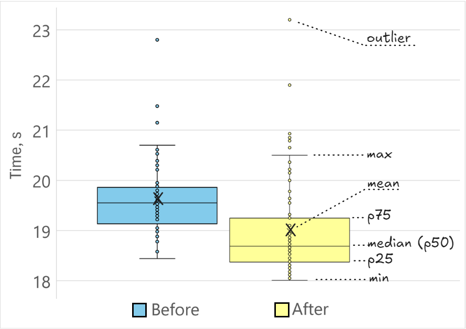

## Manual Performance Testing

In the previous section, we discussed how CI systems can help with evaluating the performance impact of a code change. However, it may not always be possible to leverage such a system due to reasons such as hardware unavailability, setup being too complicated for the testing infrastructure, a need to collect additional metrics, etc. In this section, we provide basic advice for local performance evaluations.

We typically measure the performance impact of our code change by 1) measuring the baseline performance, 2) measuring the performance of the modified program, and 3) comparing them with each other. For example, we had a program that calculates Fibonacci numbers recursively (baseline), and we decided to rewrite it with a loop (modified). Both versions are functionally correct and yield the same Fibonacci numbers. Now we need to compare the performance of the two versions of the program.

It is highly recommended to get not just a single measurement but to run the benchmark multiple times. If you make comparisons based on a single measurement, you're increasing the risk of having your numbers skewed by the measurement bias that we discussed in [@sec:secFairExperiments]. So, we collected `N` performance measurements for the baseline and `N` measurements for the modified version of the program. We call a set of performance measurements a *performance distribution*. Now we need to aggregate and compare those two distributions to decide which version of the program is faster.

The most straightforward way to compare two performance distributions is to take the average of `N` measurements from both distributions and calculate the ratio. For the types of code improvements we discuss in this book, this simple method works well in most cases. However, comparing performance distributions is quite nuanced, and there are many ways how you can be fooled by measurements and potentially derive wrong conclusions. We will not get into the details of statistical analysis, instead, we recommend you read a textbook on the subject. A good reference specifically for performance engineers is a book by Dror G. Feitelson, "Workload Modeling for Computer Systems Performance Evaluation",[^12] that has more information on modal distributions, skewness, and other related topics.

Data scientists often present measurements by plotting them. This eliminates biased conclusions and allows readers to interpret the data for themselves. One of the popular ways to plot distributions is by using box plots (also known as a box-and-whisker plot). In Figure @fig:BoxPlot, we visualized performance distributions of two versions of the same functional program ("before" and "after"). There are 70 performance data points in each distribution.

{#fig:BoxPlot width=90%}

Let's describe the terms indicated on the image:

* The *mean* (often referred to as the *average*) is the sum of all values in a dataset divided by the number of values. Indicated with X.
* The *median* is the middle value of a dataset when the values are sorted. The same as *50th percentile* (p50).
* The *25th percentile* (p25) divides the lowest 25% of the data from the highest 75%.
* The *75th percentile* (p75) divides the lowest 75% of the data from the highest 25%.
* An *outlier* is a data point that differs significantly from other samples in the dataset. Outliers can be caused by variability in the data or experimental errors.
* The *min* and *max* (whiskers) represent the most extreme data points that are not considered outliers. 

By looking at the box plot in Figure @fig:BoxPlot, we can sense that our code change has a positive impact on performance since "after" samples are generally faster than "before". However, there are some "before" measurements that are faster than "after". Box plots allow comparisons of multiple distributions on the same chart. The benefits of using box plots for visualizing performance distributions are described in a blog post by Stefan Marr.[^13]

Performance speedups can be calculated by taking a ratio between the two means. In some cases, you can use other metrics to calculate speedups, including median, min, and 95th percentile, depending on which one is more representative of your distribution.

*Standard deviation* quantifies how much the values in a dataset deviate from the mean on average. A low standard deviation indicates that the data points are close to the mean, while a high standard deviation indicates that they are spread out over a wider range. Unless distributions have low standard deviation, do not calculate speedups. If the standard deviation in the measurements is on the same order of magnitude as the mean, the average is not a representative metric. Consider taking steps to reduce noise in your measurements. If that is not possible, present your results as a combination of the key metrics such as mean, median, standard deviation, percentiles, min, max, etc.

Performance gains are usually represented in two ways: as a speedup factor or percentage improvement. If a program originally took 10 seconds to run, and you optimized it down to 1 second, that's a 10x speedup. We shaved off 9 seconds of running time from the original program, that's a 90% reduction in time. The formula to calculate percentage improvement is shown below. In the book, we will use both ways of representing speedups.
$$
\textrm{Percentage Speedup} = (1 - \frac{\textrm{New Time}}{\textrm{Old Time}}) ~\times~100\%
$$
One of the most important factors in calculating accurate speedup ratios is collecting a rich collection of samples, i.e., running a benchmark a large number of times. This may sound obvious, but it is not always achievable. For example, some of the [SPEC CPU 2017 benchmarks](http://spec.org/cpu2017/Docs/overview.html#benchmarks)[^1] run for more than 10 minutes on a modern machine. That means it would take 1 hour to produce just three samples: 30 minutes for each version of the program. Imagine that you have not just a single benchmark in your suite, but hundreds. It would become very expensive to collect statistically sufficient data even if you distribute the work across multiple machines.

If obtaining new measurements is expensive, don't rush to collect many samples. Often you can learn a lot from just three runs. If you see a very low standard deviation within those three samples, you will probably learn nothing new from collecting more measurements. This is very typical of programs with underlying consistency (e.g., static benchmarks). However, if you see an abnormally high standard deviation, I do not recommend launching new runs and hoping to have "better statistics". You should figure out what is causing performance variance and how to reduce it.

In an automated setting, you can implement an adaptive strategy by dynamically limiting the number of benchmark iterations based on standard deviation, i.e., you collect samples until you get a standard deviation that lies in a certain range. The lower the standard deviation in the distribution, the lower the number of samples you need. Once you have a standard deviation lower than the threshold, you can stop collecting measurements. This strategy is explained in more detail in [@Akinshin2019, Chapter 4].

An important thing to watch out for is the presence of outliers. It is OK to discard some samples (for example, cold runs) as outliers, but do not deliberately discard unwanted samples from the measurement set. Outliers can be one of the most important metrics for some types of benchmarks. For example, when benchmarking software that has real-time constraints, the 99 percentile could be very interesting.

I recommend using benchmarking tools as they automate performance measurements. For example, Hyperfine[^4] is a popular cross platform command-line benchmarking tool that automatically determines the number of runs, and can visualize the results as a table with mean, min, max, or as a box plot.

In the next two sections, we will discuss how to measure wall clock time (latency), which is the most common case. However, sometimes we also may want to measure other things, like the number of requests per second (throughput), heap allocations, context switches, etc.

[^1]: SPEC CPU 2017 benchmarks - [http://spec.org/cpu2017/Docs/overview.html#benchmarks](http://spec.org/cpu2017/Docs/overview.html#benchmarks)
[^12]: Book "Workload Modeling for Computer Systems Performance Evaluation" - [https://www.cs.huji.ac.il/~feit/wlmod/](http://cs.huji.ac.il/~feit/wlmod/)
[^13]: Stefan Marr's blog post about box plots - [https://stefan-marr.de/2024/06/5-reasons-for-box-plots-as-default/](https://stefan-marr.de/2024/06/5-reasons-for-box-plots-as-default/)
[^4]: hyperfine - [https://github.com/sharkdp/hyperfine](https://github.com/sharkdp/hyperfine)
