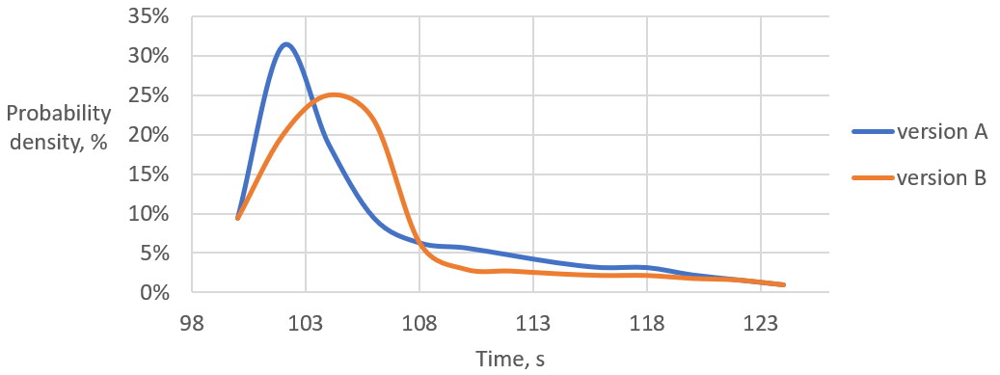
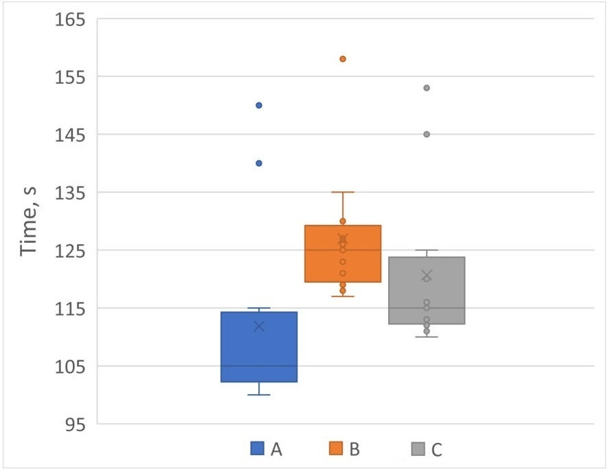
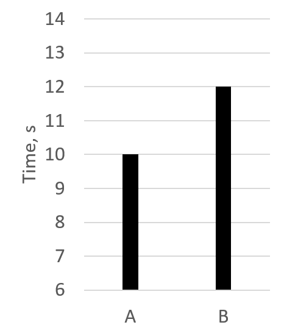
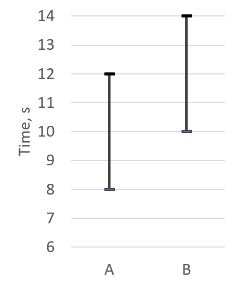

## Manual Performance Testing

It is great when engineers can leverage existing performance testing infrastructure during development. In the previous section, we discussed that one of the nice-to-have features of the CI system is the possibility to submit performance evaluation jobs to it. If this is supported, then the system would return the results of testing a patch that the developer wants to commit to the codebase. It may not always be possible due to various reasons, like hardware unavailability, setup is too complicated for testing infrastructure, a need to collect additional metrics. In this section, we provide basic advice for local performance evaluations.

When making performance improvements in our code, we need a way to prove that we actually made it better. Also, when we commit a regular code change, we want to make sure performance did not regress. Typically, we do this by 1) measuring the baseline performance, 2) measuring the performance of the modified program, and 3) comparing them with each other. The goal in such a scenario is to compare the performance of two different versions of the same functional program. For example, we have a program that recursively calculates Fibonacci numbers, and we decided to rewrite it in an iterative fashion. Both are functionally correct and yield the same numbers. Now we need to compare the performance of two programs.

It is highly recommended to get not just a single measurement but to run the benchmark multiple times. So, we have N measurements for the baseline and N measurements for the modified version of the program. Now we need a way to compare those two sets of measurements to decide which one is faster. This task is intractable by itself, and there are many ways to be fooled by the measurements and potentially derive wrong conclusions from them. If you ask any data scientist, they will tell you that you should not rely on a single metric (min/mean/median, etc.). 

Consider two distributions of performance measurements collected for two versions of a program in Figure @fig:CompDist. This chart displays the probability we get a particular timing for a given version of a program. For example, there is a ~32% chance the version `A` will finish in ~102 seconds. It's tempting to say that `A` is faster than `B`. However, it is true only with some probability `P`. This is because there are some measurements of `B` that are faster than `A`. Even in the situation when all the measurements of `B` are slower than every measurement of `A` probability `P` is not equal to `100%`. This is because we can always produce one additional sample for `B`, which may be faster than some samples of `A`.

{#fig:CompDist width=80%}

An interesting advantage of using distribution plots is that it allows you to spot unwanted behavior of the benchmark[^3]. If the distribution is bimodal, the benchmark likely experiences two different types of behavior. A common cause of bimodally distributed measurements is code that has both a fast and a slow path, such as accessing a cache (cache hit vs. cache miss) and acquiring a lock (contended lock vs. uncontended lock). To "fix" this, different functional patterns should be isolated and benchmarked separately.

Data scientists often present measurements by plotting the distributions and avoid calculating speedup ratios. This eliminates biased conclusions and allows readers to interpret the data themselves. One of the popular ways to plot distributions is by using box plots (see Figure @fig:BoxPlot), which allow comparisons of multiple distributions on the same chart.

{#fig:BoxPlot width=60%}

While visualizing performance distributions may help you discover certain anomalies, developers shouldn't use them for calculating speedups. In general, it's hard to estimate the speedup by looking at performance measurement distributions. Also, as discussed in the previous section, it doesn't work for automated benchmarking systems. Usually, we want to get a scalar value that will represent a speedup ratio between performance distributions of 2 versions of a program, for example, "version `A` is faster than version `B` by `X%`".

The statistical relationship between the two distributions is identified using Hypothesis Testing methods. A comparison is deemed *statistically significant* if the relationship between the data-sets would reject the [null hypothesis](https://en.wikipedia.org/wiki/Null_hypothesis)[^6] according to a threshold probability (the significance level). 

* If the distributions are Gaussian (normal distribution), then using a parametric hypothesis test (e.g., Student's T-test) to compare the distributions will suffice. Though it is worth to mention that Gaussian distributions are very rarely seen in performance data. So, be cautious using formulas from statistics textbooks assuming Gaussian distributions. 

* If the distributions being compared are not Gaussian (e.g., heavily skewed or multimodal), then it's possible to use non-parametric tests (e.g., [Mann-Whitney](https://en.wikipedia.org/wiki/Mann–Whitney_U_test)[^8], [Kruskal Wallis](https://en.wikipedia.org/wiki/Kruskal–Wallis_one-way_analysis_of_variance)[^9], etc.). 

Hypothesis Testing methods are great for determining whether a speedup (or slowdown) is random or not. Therefore, it is best used in Automated Testing Frameworks to verify that the commit didn't introduce any performance regressions. A good reference specifically about statistics for performance engineering is a book by Dror G. Feitelson, "Workload Modeling for Computer Systems Performance Evaluation"[^12], that has more information on modal distributions, skewness, and other related topics.

Once it has been determined that the difference is statistically significant via the hypothesis test, then the speedup can be calculated as a ratio between the means or geometric means, but there are caveats. On a small collection of samples, the mean and geometric mean can be affected by outliers. Unless distributions have low variance, do not consider averages alone. If the variance in the measurements is on the same order of magnitude as the mean, the average is not a representative metric. Figure @fig:Averages shows an example of 2 versions of the program. By looking only at averages (@fig:Averages1), it's tempting to say that version `A` is a 20% speedup over version `B`. However, taking into account the variance of the measurements (@fig:Averages2), we can see that it is not always the case. If we take the worse score for version `A` and the best score for version `B`, we can say that version `B` is a 20% speedup over version `A`. For normal distributions, a combination of mean, standard deviation, and standard error can be used to gauge a speedup between two versions of a program. Otherwise, for skewed or multimodal samples, one would have to use percentiles that are more appropriate for the benchmark, e.g., min, median, 90th, 95th, 99th, max, or some combination of these.

{#fig:Averages1 width=30%}

{#fig:Averages2 width=30%}

Two histograms showing how averages could be misleading.

One of the most important factors in calculating accurate speedup ratios is collecting a rich collection of samples, i.e., run the benchmark a large number of times. This may sound obvious, but it is not always achievable. For example, some of the [SPEC CPU 2017 benchmarks](http://spec.org/cpu2017/Docs/overview.html#benchmarks)[^1] run for more than 10 minutes on a modern machine. That means it would take 1 hour to produce just three samples: 30 minutes for each version of the program. Imagine that you have not just a single benchmark in your suite, but hundreds. It would become very expensive to collect statistically sufficient data even if you distribute the work across multiple machines.

How do you know how many samples are required to reach statistically sufficient distribution? The answer to this question again depends on how much accuracy you want your comparison to have. The lower the variance between the samples in the distribution, the lower number of samples you need. Standard deviation is the metric that tells you how consistent the measurements in the distribution are. One can implement an adaptive strategy by dynamically limiting the number of benchmark iterations based on standard deviation, i.e., you collect samples until you get a standard deviation that lies in a certain range. This approach requires the number of measurements to be more than one. Otherwise, the algorithm will stop after the first sample because a single run of a benchmark has `std.dev.` equals to zero. Once you have a standard deviation lower than the threshold, you could stop collecting measurements. This strategy is explained in more detail in [@Akinshin2019, Chapter 4].

Another important thing to watch out for is the presence of outliers. It is OK to discard some samples (for example, cold runs) as outliers by using confidence intervals, but do not deliberately discard unwanted samples from the measurement set. For some types of benchmarks, outliers can be one of the most important metrics. For example, when benchmarking SW that has real-time constraints, 99-percentile could be very interesting. There is a series of talks about measuring latency by Gil Tene on [YouTube](https://www.youtube.com/watch?v=lJ8ydIuPFeU) that covers this topic well.

[^1]: SPEC CPU 2017 benchmarks - [http://spec.org/cpu2017/Docs/overview.html#benchmarks](http://spec.org/cpu2017/Docs/overview.html#benchmarks)
[^3]: Another way to check this is to run the normality test: [https://en.wikipedia.org/wiki/Normality_test](https://en.wikipedia.org/wiki/Normality_test).
[^6]: Null hypothesis - [https://en.wikipedia.org/wiki/Null_hypothesis](https://en.wikipedia.org/wiki/Null_hypothesis).
[^8]: Mann-Whitney U test - [https://en.wikipedia.org/wiki/Mann-Whitney_U_test](https://en.wikipedia.org/wiki/Mann-Whitney_U_test).
[^9]: Kruskal-Wallis analysis of variance - [https://en.wikipedia.org/wiki/Kruskal-Wallis_one-way_analysis_of_variance](https://en.wikipedia.org/wiki/Kruskal-Wallis_one-way_analysis_of_variance).
[^12]: Book "Workload Modeling for Computer Systems Performance Evaluation" - [https://www.cs.huji.ac.il/~feit/wlmod/](http://cs.huji.ac.il/~feit/wlmod/).

