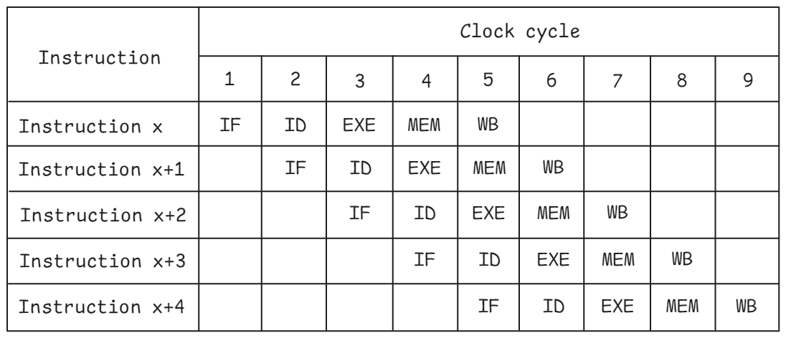

## Pipelining

Pipelining is the foundational technique used to make CPUs fast wherein multiple instructions are overlapped during their execution. Pipelining in CPUs drew inspiration from the automotive assembly lines. The processing of instructions is divided into stages. The stages operate in parallel, working on different parts of different instructions. DLX is an example of a simple 5-stage pipeline defined by [@Hennessy] and consists of:

1. Instruction fetch (IF)
2. Instruction decode (ID)
3. Execute (EXE)
4. Memory access (MEM)
5. Write back (WB)

{#fig:Pipelining width=70%}

Figure @fig:Pipelining shows an ideal pipeline view of the 5-stage pipeline CPU. In cycle 1, instruction x enters the IF stage of the pipeline. In the next cycle, as instruction x moves to the ID stage, the next instruction in the program enters the IF stage, and so on. Once the pipeline is full, as in cycle 5 above, all pipeline stages of the CPU are busy working on different instructions. Without pipelining, instruction `x+1` couldn't start its execution until instruction `x` finishes its work.

Most modern CPUs are deeply pipelined, also known as super pipelined. The throughput of a pipelined CPU is defined as the number of instructions that complete and exit the pipeline per unit of time. The latency for any given instruction is the total time through all the stages of the pipeline. Since all the stages of the pipeline are linked together, each stage must be ready to move to the next instruction in lockstep. The time required to move an instruction from one stage to the other defines the basic machine cycle or clock for the CPU. The value chosen for the clock for a given pipeline is defined by the slowest stage of the pipeline. CPU hardware designers strive to balance the amount of work that can be done in a stage as this directly defines the frequency of operation of the CPU. Increasing the frequency improves performance and typically involves balancing and re-pipelining to eliminate bottlenecks caused by the slowest pipeline stages. 

In an ideal pipeline that is perfectly balanced and doesn’t incur any stalls, the time per instruction in the pipelined machine is given by 
$$
\textrm{Time per instruction on pipelined machine} = \frac{\textrm{Time per instruction on nonpipelined machine}}{\textrm{Number of pipe stages}}
$$
In real implementations, pipelining introduces several constraints that limit the ideal model shown above. Pipeline hazards prevent the ideal pipeline behavior resulting in stalls. The three classes of hazards are structural hazards, data hazards, and control hazards. Luckily for the programmer, in modern CPUs, all classes of hazards are handled by the hardware.

* **Structural hazards**: are caused by resource conflicts. To a large extent, they could be eliminated by replicating the hardware resources, such as using multi-ported registers or memories. However, eliminating all such hazards could potentially become quite expensive in terms of silicon area and power.

* **Data hazards**: are caused by data dependencies in the program and are classified into three types:

  *Read-after-write* (RAW) hazard requires dependent read to execute after write. It occurs when an instruction x+1 reads a source before a previous instruction x writes to the source, resulting in the wrong value being read. CPUs implement data forwarding from a later stage of the pipeline to an earlier stage (called "*bypassing*") to mitigate the penalty associated with the RAW hazard. The idea is that results from instruction x can be forwarded to instruction x+1 before instruction x is fully completed. If we take a look at the example:

  ```
  R1 = R0 ADD 1
  R2 = R1 ADD 2
  ```

  There is a RAW dependency for register R1. If we take the value directly after addition `R0 ADD 1` is done (from the `EXE` pipeline stage), we don't need to wait until the `WB` stage finishes, and the value will be written to the register file. Bypassing helps to save a few cycles. The longer the pipeline, the more effective bypassing becomes.

  *Write-after-read* (WAR) hazard requires dependent write to execute after read. It occurs when an instruction x+1 writes a source before a previous instruction x reads the source, resulting in the wrong new value being read. WAR hazard is not a true dependency and is eliminated by a technique called [register renaming](https://en.wikipedia.org/wiki/Register_renaming)[^1]. It is a technique that abstracts logical registers from physical registers. CPUs support register renaming by keeping a large number of physical registers. Logical (architectural) registers, the ones that are defined by the ISA, are just aliases over a wider register file. With such decoupling of [architectural state](https://en.wikipedia.org/wiki/Architectural_state),[^3] solving WAR hazards is simple; we just need to use a different physical register for the write operation. For example:

  ```
  R1 = R0 ADD 1
  R0 = R2 ADD 2
  ```

  There is a WAR dependency for register R0. Since we have a large pool of physical registers, we can simply rename all the occurrences of `R0` register starting from the write operation and below. Once we eliminated WAR hazard by renaming register `R0`, we can safely execute the two operations in any order.

  *Write-after-write* (WAW) hazard requires dependent write to execute after write. It occurs when instruction x+1 writes a source before instruction x writes to the source, resulting in the wrong order of writes. WAW hazards are also eliminated by register renaming, allowing both writes to execute in any order while preserving the correct final result.

* **Control hazards**: are caused due to changes in the program flow. They arise from pipelining branches and other instructions that change the program flow. The branch condition that determines the direction of the branch (taken vs. not-taken) is resolved in the execute pipeline stage. As a result, the fetch of the next instruction cannot be pipelined unless the control hazard is eliminated. Techniques such as dynamic branch prediction and speculative execution described in the next section are used to overcome control hazards.

[^1]: Register renaming - [https://en.wikipedia.org/wiki/Register_renaming](https://en.wikipedia.org/wiki/Register_renaming).
[^3]: Architectural state - [https://en.wikipedia.org/wiki/Architectural_state](https://en.wikipedia.org/wiki/Architectural_state).