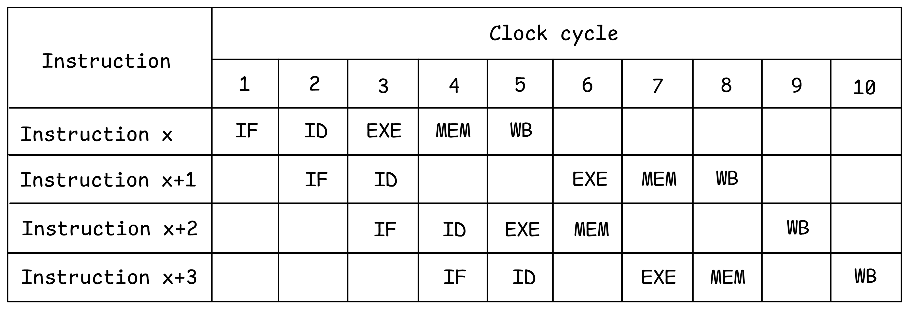
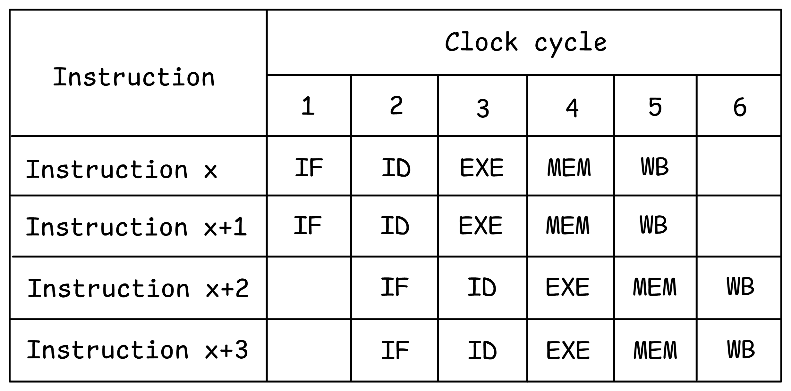
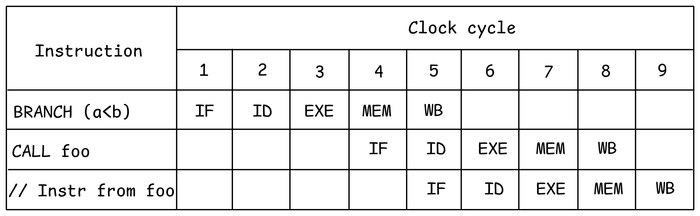
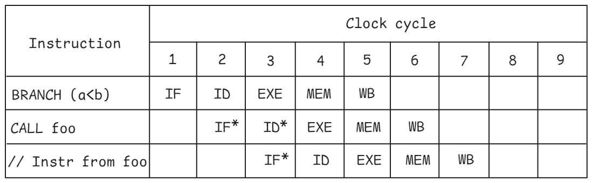

## Exploiting Instruction Level Parallelism (ILP)

Most instructions in a program lend themselves to be pipelined and executed in parallel, as they are independent. Modern CPUs implement a large menu of additional hardware features to exploit such instruction-level parallelism (ILP), i.e., parallelism within a single stream of instructions. Working in concert with advanced compiler techniques, these hardware features provide significant performance improvements. 

### Out-Of-Order (OOO) Execution

The pipeline example in Figure @fig:Pipelining shows all instructions moving through the different stages of the pipeline in order, i.e., in the same order as they appear in the program, also known as *program order*. Most modern CPUs support *out-of-order* (OOO) execution, where sequential instructions can enter the execution stage in any arbitrary order only limited by their dependencies and resource availability. CPUs with OOO execution must still give the same result as if all instructions were executed in the program order.

An instruction is called *retired* after it is finally executed, and its results are correct and visible in the architectural state. To ensure correctness, CPUs must retire all instructions in the program order. OOO execution is primarily used to avoid underutilization of CPU resources due to stalls caused by dependencies, especially in superscalar engines, which we will discuss shortly. 

{#fig:OOO width=80%}

Figure @fig:OOO details the concept underlying out-of-order execution with an example. Let's assume that instruction `x+1` cannot execute in cycles 4 and 5 due to some conflict. An in-order CPU would stall all subsequent instructions from entering the EXE pipeline stage. In a CPU with OOO execution, a subsequent instruction that does not have any conflicts (e.g., instruction `x+2`) can enter and complete its execution. All instructions still retire in order, i.e., the instructions complete the WB stage in the program order. 

[TODO]: explain why that would give more performance.

Scheduling of these instructions can be done at compile time (static scheduling), or at runtime (dynamic scheduling). Let's unpack both options.

#### Static scheduling

The Intel Itanium which was meant as a replacement for the x86, is an example of static scheduling. With static scheduling of a superscalar, multi-execution unit machine, the scheduling is moved from the hardware to the compiler using a technique known as VLIW - Very Long Instruction Word. The rationale is to simplify the hardware by requiring the compiler to choose the right mix of instructions to keep the machine fully utilized. Compilers can use techniques such as software pipelining and loop unrolling to look farther ahead than can be reasonably supported by hardware structures to find the right ILP. 

The Intel Itanium never managed to become a success for a few reasons. One of them was a lack of compatibility with x86 code. Another was the fact that it was very difficult for compilers to schedule instructions in such a way as to keep the CPU busy due to variable load latencies. The 64-bit extension of the x86 ISA (x86-64) was introduced in the same time window by AMD and was compatible with x86 and eventually became the real successor of the x86. The last Intel Itanium processors were shipped in 2021.

#### Dynamic scheduling

To overcome the problem with static scheduling, modern processors use dynamic scheduling. The two most important algorithms for dynamic scheduling are [Scoreboarding](https://en.wikipedia.org/wiki/Scoreboarding),[^4] and the [Tomasulo algorithm](https://en.wikipedia.org/wiki/Tomasulo_algorithm).[^5]

Scoreboarding was first implemented in the CDC6600 processor in the 1960s. Its main drawback is that it not only preserves true dependencies (RAW), but also false dependencies (WAW and WAR), and therefore it provides suboptimal ILP. False dependencies are caused by the small number of architectural registers, which is typically between 16 and 32 in modern ISAs. That is why all modern processors have adopted the Tomasulo algorithm for dynamic scheduling. The Tomasulo algorithm was invented in the 1960s by Robert Tomasulo and first implemented in the IBM360 model 91. 

To eliminate false dependencies, the Tomasulo algorithm makes use of register renaming, which we discussed in the previous section. Because of that, performance is greatly improved compared to scoreboarding. However, a sequence of instructions that carry a RAW dependency, also known as a *dependency chain*, is still problematic for OOO execution, because there is no increase in the ILP after register renaming since all the RAW dependencies are preserved. Dependency chains are often found in loops (loop carried dependency) where the current loop iteration depends on the results produced on the previous iteration.

Modern processors implement dynamic scheduling techniques that are derivatives of Tomasulo's original algorithm and include the Reorder Buffer (ROB) and the Reservation Station (RS). The ROB is a circular buffer that keeps track of the state of each instruction, and in modern processors, it has several hundred entries. Typically, the size of the ROB determines how far ahead the hardware can look for scheduling instructions independently. Instructions are inserted in the ROB in program order, can execute out of order, and retire in program order. Register renaming is done when instructions are placed in the ROB.

From the ROB, instructions are inserted in the RS, which has much fewer entries. Once instructions are in the RS, they wait for their input operands to become available. When inputs are available, instructions can be issued to the appropriate execution unit. So instructions can be executed in any order once their operands become available and are not tied to the program order any longer. Modern processors are becoming wider (can execute many instructions in one cycle) and deeper (larger ROB, RS, and other buffers), which demonstrates that there is a lot of potential to uncover more ILP in production applications.

### Superscalar Engines

Most modern CPUs are superscalar i.e., they can issue more than one instruction in a given cycle. Issue width is the maximum number of instructions that can be issued during the same cycle. The typical issue width of modern popular CPUs in 2024 ranges from 6 to 9. To ensure the right balance, such superscalar engines also have more than one execution unit and/or pipelined execution units. CPUs also combine superscalar capability with deep pipelines and out-of-order execution to extract the maximum ILP for a given piece of software. 

{#fig:SuperScalar width=55%}

[TODO]: give example of two instructions

Figure @fig:SuperScalar shows a CPU that supports 2-wide issue, i.e., in each cycle, two instructions are processed in each stage of the pipeline. Superscalar CPUs typically support multiple, independent execution units to keep the instructions in the pipeline flowing through without conflicts. In addition to pipelining, replicating execution units further increases the performance of a machine.

### Speculative Execution {#sec:SpeculativeExec}

As noted in the previous section, control hazards can cause significant performance loss in a pipeline if instructions are stalled until the branch condition is resolved. One technique to avoid this performance loss is hardware *branch prediction*. Using this technique, a CPU predicts the likely direction of branches and allow executing instructions from the predicted path (known as *speculative execution*).

Let's consider an example in @lst:Speculative. For a processor to understand which function it should execute next, it should know whether the condition `a < b` is false or true. Without knowing that, the CPU waits until the result of the branch instruction is determined, as shown in Figure @fig:NoSpeculation. 

Listing: Speculative execution

~~~~ {#lst:Speculative .cpp}
if (a < b)
  foo();
else
  bar();
~~~~~~~~~~~~~~~~~~~~~~~~~~~~~~~~~~~~~~~~~~~~~~~~~

{#fig:NoSpeculation width=60%}

{#fig:SpeculativeExec width=60%}

The concept of speculative execution.

With speculative execution, the CPU guesses an outcome of the branch and initiates processing instructions from the chosen path. Suppose a processor predicted that condition `a < b` will be evaluated as true. It proceeded without waiting for the branch outcome and speculatively called function `foo` (see Figure @fig:SpeculativeExec). State changes to the machine cannot be committed until the condition is resolved to ensure that the architectural state of the machine is never impacted by speculatively executing instructions.

[TODO]: maybe make example with `Load X; branch (x<0); Call foo; //instr from foo`

In the example above, the branch instruction compares two scalar values, which is fast. But in reality, a branch instruction can be dependent on a value loaded from memory, which can take hundreds of cycles. If the prediction turns out to be correct, it saves a lot of cycles. However, sometimes the prediction is incorrect, and the function `bar` should be called instead. In such a case, the results from the speculative execution must be squashed and thrown away. This is called the branch misprediction penalty, which we will discuss in [@sec:BbMisp].

An instruction that is executed speculatively is marked as such in the ROB. Once it is not speculative any longer, it can retire in program order. Here is where the architectural state is committed, and architectural registers are updated. Because the results of the speculative instructions are not committed, it is easy to roll back when a misprediction happens.

### Branch Prediction

As we just have seen, correct predictions greatly improve execution as they allow a CPU to make forward progress without having results of previous instructions available. However, bad speculation often incurs costly performance penalties. Modern CPUs employ sophisticated dynamic branch prediction mechanisms that provide very high accuracy and can adapt to dynamic changes in branch behavior. There are three types of branches which could be handled in a special way:

* **Unconditional jumps and direct calls**: they are the easiest to predict as they are always taken and go in the same direction every time.
* **Conditional branches**: they have two potential outcomes: taken or not taken. Taken branches can go forward or backward. Forward conditional branches are usually generated for `if-else` statements, which have a high chance of not being taken, as they frequently represent error-checking code. Backward conditional jumps are frequently seen in loops and are used to go to the next iteration of a loop; such branches are usually taken.
* **Indirect calls and jumps**: they have many targets. An indirect jump or indirect call can be generated for a `switch` statement, a function pointer, or a `virtual` function call. A return from a function deserves attention because it has many potential targets as well.

Most prediction algorithms are based on previous outcomes of the branch. The core of the branch prediction unit (BPU) is a branch target buffer (BTB), which caches the target addresses for every branch. Prediction algorithms consult the BTB every cycle to generate the next address from which to fetch instructions. The CPU uses that new address to fetch the next block of instructions. If no branches are identified in the current fetch block, the next address to fetch will be the next sequential aligned fetch block (fall through). 

Unconditional branches do not require prediction; we just need to look up the target address in the BTB. Every cycle the BPU needs to generate the next address from which to fetch instructions to avoid pipeline stalls. We could have extracted the address just from the instruction encoding itself, but then we have to wait until the decode stage is over, which will introduce a bubble in the pipeline and make things slower. So, the next fetch address has to be determined at the time when the branch is fetched. 

For conditional branches, we first need to predict whether the branch will be taken or not. If it is not taken, then we fall through and there is no need to look up the target. Otherwise, we look up the target address in the BTB. Conditional branches usually account for the biggest portion of total branches and are the main source of misprediction penalties in production software. For indirect branches, we need to select one of the possible targets, but the prediction algorithm can be very similar to conditional branches.

All prediction mechanisms try to exploit two important principles, which are similar to what we will discuss with caches later:

* **Temporal correlation**: the way a branch resolves may be a good predictor of the way it will resolve at the next execution. This is also known as local correlation.
* **Spatial correlation**: several adjacent branches may resolve in a highly correlated manner (a preferred path of execution). This is also known as global correlation.

The best accuracy is often achieved by leveraging local and global correlations together. So, not only do we look at the outcome history of the current branch, but also we correlate it with the outcomes of other branches. 

Another common technique used is called hybrid prediction. The idea is that some branches have biased behavior. For example, if a conditional branch goes in one direction 99.9% of the time, there is no need to use a complex predictor and pollute its data structures. A much simpler mechanism can be used instead. Another example is a loop branch. If a branch has loop behavior, then it can be predicted using a dedicated loop predictor, which will remember the number of iterations the loop typically executes.

Today, state-of-the-art prediction is dominated by TAGE-like [@Seznec2006] or perceptron-based [@Jimenez2001] predictors. Championship[^6] branch predictors make less than 3 mispredictions per 1000 instructions. Modern CPUs routinely reach a >95% prediction rate on most workloads.

[^4]: Scoreboarding - [https://en.wikipedia.org/wiki/Scoreboarding](https://en.wikipedia.org/wiki/Scoreboarding).
[^5]: Tomasulo algorithm - [https://en.wikipedia.org/wiki/Tomasulo_algorithm](https://en.wikipedia.org/wiki/Tomasulo_algorithm).
[^6]: 5th Championship Branch Prediction competition - [https://jilp.org/cbp2016](https://jilp.org/cbp2016).