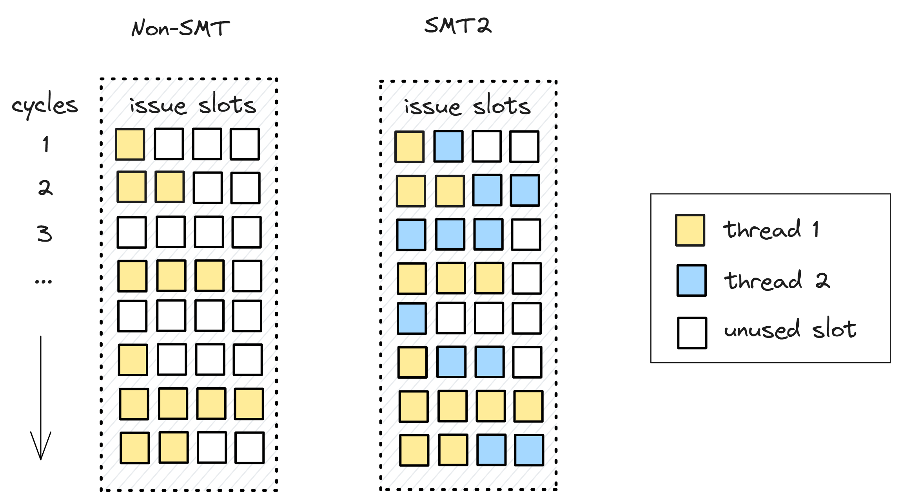

## Exploiting Thread Level Parallelism

Techniques described previously rely on the available parallelism in a program to speed up execution. In addition to that, CPUs support techniques to exploit parallelism across processes and/or threads executing on the CPU. Next, we will discuss three techniques to exploit Thread Level Parallelism (TLP): multicore systems, simultaneous multithreading and hybrid architectures. Such techniques allow to eke out the most efficiency from the available hardware resources and to improve the throughput of the system.

### Multicore systems

As processor architects began to reach the practical limitations of semiconductor design and fabrication, the GHz race slowed down and designers had to focus on other innovations to improve CPU performance. One of the key directions was the multicore design which attempted to increase core counts for each generation. The ideas is to replicate multiple processor cores on a single chip and let them serve different programs at the same time. As such, one of the cores can run the web browser, another core can render a video, yet another playing music, all at the same time. For a server machine, request from different clients can be served on separate cores, which greatly increases the throughput of such system.

The first consumer focused dual-core processor was Intel Core 2 Duo, released in 2005, that was followed by the AMD Athlon X2 architecture released later that same year. Multicore systems caused many software components to be redesigned and affected the way we write code. These days nearly all processors in consumer-facing devices are multicore CPUs. At the time of writing this book, high-end laptops have more than ten physical cores inside and server processors reaching almost 100 cores.

It may sound very impressive, but we cannot add cores infinetly. First of all, each core generates heat when it's working and safely dissipating that heat from the cores through the processor package remains a challenge. That means that when more cores are running, heat can quickly exceed the cooling capability. In such situation, multicore processors will reduce clock speeds. This is one of the reasons you can see server chips with a big number of cores having much lower frequencies than processors that go into laptops and desktops.

Cores in a multicore system are connected to each other and to the shared resources, such as last-level cache and memory controllers. Such communication channel is called *interconnect*, which frequently has either a ring or a mesh topology. Another challenge for CPU designers is to keep the machine balanced as the core counts gets higher. When you replicate cores, some resources remain shared, for example, memory buses and last-level cache. This results in diminishing returns to performance as cores are added, unless you also address throughput of other shared resources, e.g. interconnect bandwidth, last-level cache size and bandwidth, memory bandwidth, etc. Shared resources frequently become the source of performance issues in a multicore system.

### Simultaneous Multithreading

A more sophisticated approach to improve multithreaded performance is Simultaneous Multithreading (SMT). Very frequently people use the term *Hyperthreading* to describe the same thing. The goal of the technique it is to fully utilize the available width of the CPU pipeline. SMT allows multiple software threads to run simultaneously on the same physical core using shared resources. More precisely, instructions from multiple software threads execute concurrently in the same cycle. Those don't have to be threads from the same process, they can be completely different programs happened to be schedulled on the same physical core. 

An example of execution on a non-SMT and an SMT2 processor is shown in figure @fig:SMT. In both cases the width of the processor pipeline is four, each slot representing an opportunity to issue a new instruction. A 100% machine utilization is when there are no unused slots, which never happens in real workloads. It's easy to see that for the non-SMT case, there are many unused slot, the available resources are not utilized well. It may happen for a variety of reasons, one of the typical reason is a cache miss. At cycle 3, thread 1 cannot make forward progress because it is waiting for data to arrive. SMT processors take this opportunity to schedule useful work from another thread. The goal here is to occupy unused slots by another thread to hide memory latency, improve hardware utilization and multithreaded performance.

{#fig:SMT width=80%}

With a SMT2 implementation, each physical core is represented with two logical cores, which are visible to the operating system as two independent processors available to take work. Consider a situation when we have 16 software threads ready to run, and only 8 physical cores. In a non-SMT system, only 8 threads will run at the same time, while with SMT2 we can execute all 16 threads simultaneously. In another hypothetical situation, if two programs run on a SMT-enabled core and each consistently utilize only two out of four available slots, then there is a high chance they will run as fast as if they would be running alone on that physical core.

Although two programs run on the same processor core, they are completely separated from each other. In an SMT-enabled processor, even though instructions are mixed, they have different context which helps preserve correctness of the execution. To support SMT, a CPU must replicate architectural state (program counter, registers) to maintain thread context. Other CPU resources can be shared. In a typical implementation, cache resources are dynamically shared amongst the hardware threads. Resources to track OOO and speculative execution can either be replicated or partitioned.

In an SMT2 core, both logical cores are truly running at the same time. In the CPU front-end, they fetch instructions in an alternating order (every cycle or a few cycles). In the back-end, each cycle a processor selects instructions for execution from all threads. Instruction execution is mixed as the processor dynamically schedules execution ports among both threads.

So, SMT is a very flexible setup, that allows to recover unused CPU issue slots. SMT provides equal single-thread performance, in addition to its benefits for multiple threads. Modern multi-threaded CPUs support either two-way (SMT2) or four-way (SMT4).

SMT has its own disadvantages as well. Since some resources are shared among the logical cores, they could eventually compete to use those resources. The most typical example of SMT penalty is related to utilization of L1 and L2 caches. Since they are shared between two logical cores, they could lack space in caches and force eviction of the data that will be used by another thread in the future.

SMT brings a considerable burden on software developers as it makes harder to predict and measure performance of an application that runs on an SMT core. Imagine you're running a critical code on an SMT core, and suddenly the OS puts another demanding job on a sibling logical core. Your code nearly maxes out the resources of the machine, and now you need to share it with someone else. This problem is especially pronounced in a cloud environment when you cannot predict whether your application would have noisy neighbors or not.

There is also a security concern with certain simultaneous multithreading implementations. Researchers showed that some earlier implementations had a vulnerability through which it is possible for one application to steal critical information (like cryptographic keys) from another application that runs on the sibling logical core of the same processor by monitoring its cache use. We will not dig deeper into this since it is not a book about HW security.

### Hybrid Architectures

Computer architects also developed a hybrid CPU design, where two types of cores (or more) are put in the same processor. Typically, more powerful cores are coupled with relatively slower cores to address different goals. In such a system, big cores are used for latency-sensitive task and small cores are used for better battery-saving. But also, both types of cores can be utilized at the same time to improve multithreaded performance. All cores have access to the same memory, so workloads can migrate from big to small cores and back on the fly. The intention is to create a multicore processor that can adjust better to dynamic computing needs and use less power.

The first mainstream hybrid architecture was ARM's big.LITTLE, which was introduced in October 2011. Other vendors followed this approach. Apple introduced its M1 chip in 2020 that has four high-performance "Firestorm" and four energy-efficient "Icestorm" cores. Intel introduced its Alderlake hybrid architecture in 2021 with eight P- and eight E-cores in the top configuration.

Hybrid architectures combine the best sides of both core types, but it comes with its own set of challenges. First of all, it requires cores to be fully ISA-compatible, i.e. they should be able to execute the same set of instructions. Otherwise, the schedulling becomes restricted. For example, if a big core features some fancy instructions that are not available on small cores, than you can only assign big cores to run workloads that use such instructions. That's why usualy vendors use the "greatest common denominator" approach when choosing the ISA for a hybrid processor.

Even with ISA-compatible cores, schedulling becomes challenging. Different types of workloads call for specific schedulling scheme, e.g. bursty execution vs. steady execution, low IPC vs. high IPC, low improtance vs. high importance, etc. It becomes non-trivial very quickly. Here are a few considerations for optimal scheduling:

* Leverage small cores to conserve power. Do not wake up big cores for the background work.
* Recognize candidates (low importance, low IPC) for offloading to smaller cores. Similarly, promote high importance, high IPC tasks to big cores.
* When assigning a new task, use an idle big core first. In case SMT, use big cores with both logical threads idle. After that, use idle small cores. After that, use sibling logical threads of big cores.

From a programmer's perspective, no code changes are needed to make use of hybrid systems. This approach became very popular in client-facing devices, especially in smartphones. We will take a look at Intel's Alderlake design later in the book.
