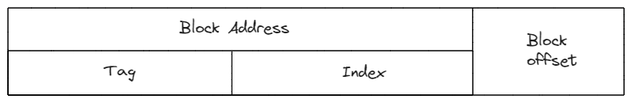
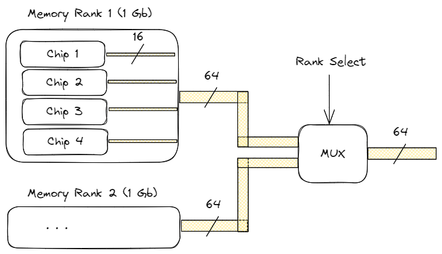
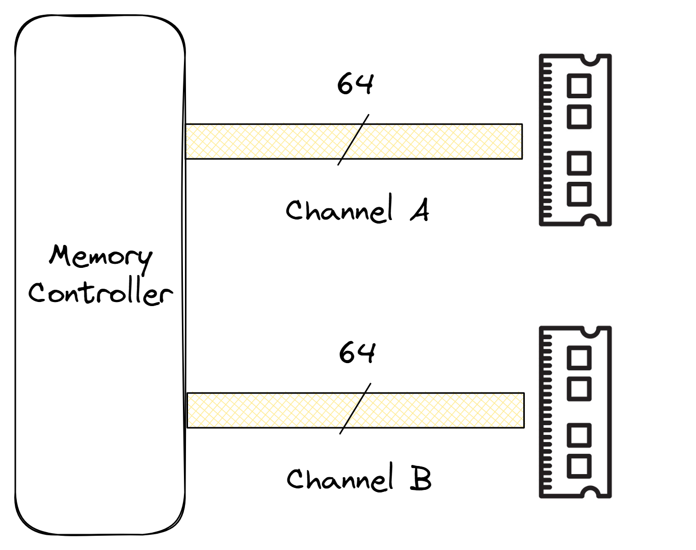
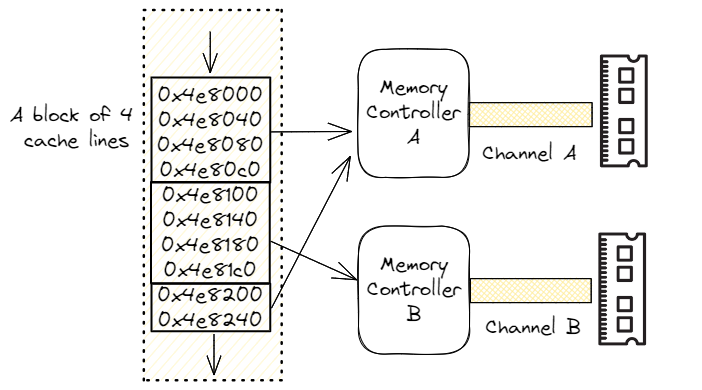

## Memory Hierarchy {#sec:MemHierar}

To effectively utilize all the hardware resources provisioned in a CPU, the machine needs to be fed with the right data at the right time. Failing to do so requires fetching a variable from main memory, which takes around 100 ns. From a CPU perspective is a very long time. Understanding the memory hierarchy is critically important to delivering the performance capabilities of a CPU. Most programs exhibit the property of locality: they don’t access all code or data uniformly. A CPU memory hierarchy is built on two fundamental properties:

* **Temporal locality**: when a given memory location is accessed, the same location will likely be accessed again soon. Ideally, we want this information to be in the cache next time we need it.
* **Spatial locality**: when a given memory location is accessed, nearby locations will likely be accessed soon. This refers to placing related data close to each other. When a program reads a single byte from memory, typically, a larger chunk of memory (a cache line) is fetched because very often, the program will require that data soon.

This section provides a summary of the key attributes of memory hierarchy systems supported on modern CPUs.

### Cache Hierarchy {#sec:CacheHierarchy}

A cache is the first level of the memory hierarchy for any request (for code or data) issued from the CPU pipeline. Ideally, the pipeline performs best with an infinite cache with the smallest access latency. In reality, the access time for any cache increases as a function of the size. Therefore, the cache is organized as a hierarchy of small, fast storage blocks closest to the execution units, backed up by larger, slower blocks. A particular level of the cache hierarchy can be used exclusively for code (instruction cache, I-cache) or for data (data cache, D-cache), or shared between code and data (unified cache). Furthermore, some levels of the hierarchy can be private to a particular core, while other levels can be shared among cores.

Caches are organized as blocks with a defined size, also known as *cache lines*. The typical cache line size in modern CPUs is 64 bytes. However, the notable exception here is the L2 cache in Apple processors (such as M1, M2 and later), which operates on 128B cache lines. Caches closest to the execution pipeline typically range in size from 32 KB to 128 KB. Mid-level caches tend to have 1MB and above. Last-level caches in modern CPUs can be tens or even hundreds of megabytes.

#### Placement of Data within the Cache.

The address for a request is used to access the cache. In *direct-mapped* caches, a given block address can appear only in one location in the cache and is defined by a mapping function shown below. Dirrect-mapped caches are relatively easy to build and have high access latency, however, they have high miss rate.
$$
\textrm{Number of Blocks in the Cache} = \frac{\textrm{Cache Size}}{\textrm{Cache Block Size}}
$$
$$
\textrm{Direct mapped location} = \textrm{(block address)  mod  (Number of Blocks in the Cache )}
$$

In a *fully associative* cache, a given block can be placed in any location in the cache. This approach involves high hardware complexity and slow access time, thus considered impractical for most use cases.

An intermediate option between direct mapping and fully associative mapping is a *set-associative* mapping. In such a cache, the blocks are organized as sets, typically each set containing 2, 4, 8 or 16 blocks. A given address is first mapped to a set. Within a set, the address can be placed anywhere, among the blocks in that set. A cache with m blocks per set is described as an m-way set-associative cache. The formulas for a set-associative cache are:
$$
\textrm{Number of Sets in the Cache} = \frac{\textrm{Number of Blocks in the Cache}}{\textrm{Number of Blocks per Set (associativity)}}
$$
$$
\textrm{Set (m-way) associative location} = \textrm{(block address)  mod  (Number of Sets in the Cache)}
$$

Consider an example of an L1 cache, whose size is 32 KB with 64 bytes cache lines, 64 sets and 8 ways. The total number of cache lines in such a cache is `32 KB / 64 bytes = 512 lines`. A new line can only be inserted in its appropriate set (one of the 64 sets). Once the set is determined, a new line can go to one of the 8 ways in this set. Similarly, when you later search for this cache line, you determine the set first, and then you only need to examine up to 8 ways in the set.

Here is another example of the cache organization of the Apple M1 processor. The L1 data cache inside each performance core can store 128 KB, has 256 sets with 8 ways in each set and operates on 64-byte lines. Performance cores form a cluster and share the L2 cache, which can keep 12 MB, is 12-way set-associative, and operates on 128-byte lines. [@AppleOptimizationGuide]

#### Finding Data in the Cache.

Every block in the m-way set-associative cache has an address tag associated with it. In addition, the tag also contains state bits such as valid bits to indicate whether the data is valid. Tags can also contain additional bits to indicate access information, sharing information, etc., that will be described in later sections of this chapter.

{#fig:CacheLookup width=90%}

Figure @fig:CacheLookup shows how the address generated from the pipeline is used to check the caches. The lowest order address bits define the offset within a given block; the block offset bits (5 bits for 32-byte cache lines, 6 bits for 64-byte cache lines). The set is selected using the index bits based on the formulas described above. Once the set is selected, the tag bits are used to compare against all the tags in that set. If one of the tags matches the tag of the incoming request and the valid bit is set, a cache hit results. The data associated with that block entry (read out of the data array of the cache in parallel to the tag lookup) is provided to the execution pipeline. A cache miss occurs in cases where the tag is not a match.

#### Managing Misses.

When a cache miss occurs, the controller must select a block in the cache to be replaced to allocate the address that incurred the miss. For a direct-mapped cache, since the new address can be allocated only in a single location, the previous entry mapping to that location is deallocated, and the new entry is installed in its place. In a set-associative cache, since the new cache block can be placed in any of the blocks of the set, a replacement algorithm is required. The typical replacement algorithm used is the LRU (least recently used) policy, where the block that was least recently accessed is evicted to make room for the new data. Another alternative is to randomly select one of the blocks as the victim block.

#### Managing Writes.

Write accesses to caches are less frequent than data reads. Handling writes in caches is harder, and CPU implementations use various techniques to handle this complexity. Software developers should pay special attention to the various write caching flows supported by the hardware to ensure the best performance of their code.

CPU designs use two basic mechanisms to handle writes that hit in the cache:

* In a write-through cache, hit data is written to both the block in the cache and to the next lower level of the hierarchy.
* In a write-back cache, hit data is only written to the cache. Subsequently, lower levels of the hierarchy contain stale data. The state of the modified line is tracked through a dirty bit in the tag. When a modified cache line is eventually evicted from the cache, a write-back operation forces the data to be written back to the next lower level.

Cache misses on write operations can be handled in two ways:

* In a *write-allocate or fetch on write miss* cache, the data for the missed location is loaded into the cache from the lower level of the hierarchy, and the write operation is subsequently handled like a write hit.
* If the cache uses a *no-write-allocate policy*, the cache miss transaction is sent directly to the lower levels of the hierarchy, and the block is not loaded into the cache.

Out of these options, most designs typically choose to implement a write-back cache with a write-allocate policy as both of these techniques try to convert subsequent write transactions into cache hits, without additional traffic to the lower levels of the hierarchy. Write-through caches typically use the no-write-allocate policy.

#### Other Cache Optimization Techniques.

For a programmer, understanding the behavior of the cache hierarchy is critical to extracting performance from any application. From the perspective of the CPU pipeline, the latency to access any request is given by the following formula that can be applied recursively to all the levels of the cache hierarchy up to the main memory:
$$
\textrm{Average Access Latency} = \textrm{Hit Time } + \textrm{ Miss Rate } \times \textrm{ Miss Penalty}
$$
Hardware designers take on the challenge of reducing the hit time and miss penalty through many novel micro-architecture techniques. Fundamentally, cache misses stall the pipeline and hurt performance. The miss rate for any cache is highly dependent on the cache architecture (block size, associativity) and the software running on the machine.

#### Hardware and Software Prefetching. {#sec:HwPrefetch}

One method to avoid cache misses and subsequent stalls is to prefetch data into caches prior to when the pipeline demands it. The assumption is the time to handle the miss penalty can be mostly hidden if the prefetch request is issued sufficiently ahead in the pipeline. Most CPUs provide implicit hardware-based prefetching that is complemented by explicit software prefetching that programmers can control.

Hardware prefetchers observe the behavior of a running application and initiate prefetching on repetitive patterns of cache misses. Hardware prefetching can automatically adapt to the dynamic behavior of an application, such as varying data sets, and does not require support from an optimizing compiler. Also, the hardware prefetching works without the overhead of additional address generation and prefetch instructions. However, hardware prefetching works for a limited set of commonly used data access patterns.

Software memory prefetching complements prefetching done by hardware. Developers can specify which memory locations are needed ahead of time via dedicated hardware instruction (see [@sec:memPrefetch]). Compilers can also automatically add prefetch instructions into the code to request data before it is required. Prefetch techniques need to balance between demand and prefetch requests to guard against prefetch traffic slowing down demand traffic.

### Main Memory {#sec:UarchMainmemory}

Main memory is the next level of the hierarchy, downstream from the caches. Requests to load and store data are initiated by the Memory Controller Unit (MCU). In the past, this circuit was located in the northbridge chip on the motherboard. But nowadays, most processors have this component embedded, so the CPU has a dedicated memory bus connecting it to the main memory.

Main memory uses DRAM (Dynamic Random Access Memory) technology that supports large capacities at reasonable cost points. When comparing DRAM modules, people usually look at memory density and memory speed, along with its price of course. Memory density defines how much memory the module has measured in GB. Obviously, the more available memory the better as it is a precious resource used by the OS and applications.

The performance of the main memory is described by latency and bandwidth. Memory latency is the time elapsed between the memory access request being issued and when the data is available to use by the CPU. Memory bandwidth defines how many bytes can be fetched per some period of time, and is usually measured in gigabytes per second.

#### DDR

(Double Data Rate) is the predominant DRAM technology supported by most CPUs. Historically, DRAM bandwidths have improved every generation while the DRAM latencies have stayed the same or increased. Table @tbl:mem_rate shows the top data rate, peak bandwidth, and the corresponding reading latency for the last three generations of DDR technologies. The data rate is measured in millions of transfers per second (MT/s). The latencies shown in this table correspond to the latency in the DRAM device itself. Typically, the latencies as seen from the CPU pipeline (cache miss on a load to use) are higher (in the 50ns-150ns range) due to additional latencies and queuing delays incurred in the cache controllers, memory controllers, and on-die interconnects. You can see an example of measuring observed memory latency and bandwidth in [@sec:MemLatBw].

-----------------------------------------------------------------
   DDR       Year   Highest Data   Peak Bandwidth  In-device Read
Generation           Rate(MT/s)       (GB/s)         Latency(ns)
----------  ------  ------------   --------------  --------------
  DDR3       2007      2133            17.1            10.3

  DDR4       2014      3200            25.6            12.5

  DDR5       2020      6400            51.2            14

-----------------------------------------------------------------

Table: Performance characteristics for the last three generations of DDR technologies. {#tbl:mem_rate}

It is worth mentioning that DRAM chips require their memory cells to be refreshed periodically. This is because the bit value is stored as the presence of an electric charge on a tiny capacitor, so it can lose its charge over time. To prevent this, there is special circuitry that reads each cell and writes it back, effectively restoring the capacitor's charge. While a DRAM chip is in its refresh procedure, it is not serving memory access requests.

A DRAM module is organized as a set of DRAM chips. Memory *rank* is a term that describes how many sets of DRAM chips exist on a module. For example, a single-rank (1R) memory module contains one set of DRAM chips. A dual-rank (2R) memory module has two sets of DRAM chips, therefore doubling the capacity of a single-rank module. Likewise, there are quad-rank (4R) and octa-rank (8R) memory modules available for purchase.

Each rank consists of multiple DRAM chips. Memory *width* defines how wide the bus of each DRAM chip is. And since each rank is 64 bits wide (or 72 bits wide for ECC RAM), it also defines the number of DRAM chips present within the rank. Memory width can be one of three values: `x4`, `x8` or `x16`, which define how wide the bus that goes to each chip. As an example, Figure @fig:Dram_ranks shows the organization of a 2Rx16 dual-rank DRAM DDR4 module, with a total of 2GB capacity. There are four chips in each rank, with a 16-bit wide bus. Combined, the four chips provide 64-bit output. The two ranks are selected one at a time through a rank-select signal.

{#fig:Dram_ranks width=90%}

There is no direct answer as to whether the performance of single-rank or dual-rank is better as it depends on the type of application. Single-rank modules generally produce less heat and are less likely to fail. Also, multi-rank modules require a rank select signal to switch from one rank to another, which needs additional clock cycles and may increase the access latency. On the other hand, if a rank is not accessed, it can go through its refresh cycles in parallel while other ranks are busy. As soon as the previous rank completes data transmission, the next rank can immediately start its transmission.

Going further, we can install multiple DRAM modules in a system to not only increase memory capacity but also memory bandwidth. Setups with multiple memory channels are used to scale up the communication speed between the memory controller and the DRAM.

A system with a single memory channel has a 64 bit wide data bus between the DRAM and memory controller. The multi-channel architectures increase the width of the memory bus, allowing DRAM modules to be accessed simultaneously. For example, the dual-channel architecture expands the width of the memory data bus from 64 bits to 128 bits, doubling the available bandwidth, see Figure @fig:Dram_channels. Notice, that each memory module, is still a 64-bit device, but we connect them differently. It is very typical nowadays for server machines to have four or eight memory channels.

{#fig:Dram_channels width=60%}

Alternatively, you could also encounter setups with duplicated memory controllers. For example, a processor may have two integrated memory controllers, each of them capable of supporting several memory channels. The two controllers are independent and only view their own slice of the total physical memory address space.

We can do a quick calculation to determine the maximum memory bandwidth for a given memory technology, using a simple formula below:
$$
\textrm{Max. Memory Bandwidth} = \textrm{Data Rate } \times \textrm{ Bytes per cycle }
$$

For example, for a single-channel DDR4 configuration with a data rate of 2400 MT/s and 64 bits (8 bytes) per transfer, the maximum bandwidth equals `2400 * 8 = 19.2 GB/s`. Dual-channel or dual memory controller setups double the bandwidth to 38.4 GB/s. Remember though, those numbers are theoretical maximums that assume that a data transfer will occur at each memory clock cycle, which in fact never happens in practice. So, when measuring actual memory speed, you will always see a value lower than the maximum theoretical transfer bandwidth.

To enable multi-channel configuration, you need to have a CPU and motherboard that support such an architecture and install an even number of identical memory modules in the correct memory slots on the motherboard. The quickest way to check the setup on Windows is by running a hardware identification utility like `CPU-Z` or `HwInfo`; on Linux, you can use the `dmidecode` command. Alternatively, you can run memory bandwidth benchmarks like Intel MLC or Stream.

To make use of multiple memory channels in a system, there is a technique called interleaving. It spreads adjacent addresses within a page across multiple memory devices. An example of a 2-way interleaving for sequential memory accesses is shown in Figure @fig:Dram_channel_interleaving. As before, we have a dual-channel memory configuration (channels A and B) with two independent memory controllers. Modern processors interleave per four cache lines (256 bytes), i.e., the first four adjacent cache lines go to channel A, and then the next set of four cache lines go to channel B.

{#fig:Dram_channel_interleaving width=80%}

Without interleaving, consecutive adjacent accesses would be sent to the same memory controller, not utilizing the second available controller. In contrast, interleaving enables hardware parallelism to better utilize available memory bandwidth. For most workloads, performance is maximized when all the channels are populated as it spreads a single memory region across as many DRAM modules as possible.

While increased memory bandwidth is generally good, it does not always translate into better system performance and is highly dependent on the application. On the other hand, it's important to watch out for available and utilized memory bandwidth, because once it becomes the primary bottleneck, the application stops scaling, i.e., adding more cores doesn't make it run faster.

#### GDDR and HBM

Besides multi-channel DDR, there are other technologies that target workloads where higher memory bandwidth is required to achieve greater performance. Technologies such as GDDR (Graphics DDR) and HBM (High Bandwidth Memory) are the most notable ones. They find their use in high-end graphics, high-performance computing such as climate modeling, molecular dynamics, and physics simulation, but also autonomous driving, and of course, AI/ML. They are a natural fit there because such applications require moving large amounts of data very quickly.

GDDR was primarily designed for graphics and nowadays it is used on virtually every high-performance graphics card. While GDDR shares some characteristics with DDR, it is also quite different. While DRAM DDR is designed for lower latencies, GDDR is built for much higher bandwidth, because it is located in the same package as the processor chip itself. Similar to DDR, the GDDR interface transfers two 32-bit words (64 bits in total) per clock cycle. The latest GDDR6X standard can achieve up to 168 GB/s bandwidth, operating at a relatively low 656 MHz frequency.

HBM is a new type of CPU/GPU memory that vertically stacks memory chips, also called 3D stacking. Similar to GDDR, HBM drastically shortens the distance data needs to travel to reach a processor. The main difference from DDR and GDDR is that the HBM memory bus is very wide: 1024 bits for each HBM stack. This enables HBM to achieve ultra-high bandwidth. The latest HBM3 standard supports up to 665 GB/s bandwidth per package. It also operates at a low frequency of 500 MHz and has a memory density of up to 48 GB per package.

A system with HBM onboard will be a good choice if you want to maximize data transfer throughput. However, at the time of writing, this technology is quite expensive. As GDDR is predominantly used in graphics cards, HBM may be a good option to accelerate certain workloads that run on a CPU. In fact, the first x86 general-purpose server chips with integrated HBM are now available.
