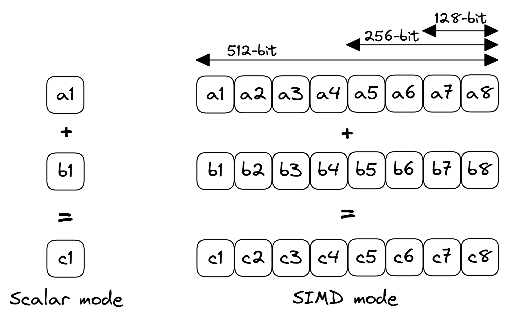

## SIMD Multiprocessors {#sec:SIMD}

Another variant of multiprocessing that is widely used for certain workloads is referred to as SIMD (Single Instruction, Multiple Data) multiprocessors, in contrast to the MIMD approach described in the previous section. As the name indicates, in SIMD processors, a single instruction typically operates on many data elements in a single cycle using many independent functional units. Scientific computations on vectors and matrices lend themselves well to SIMD architectures as every element of a vector or matrix needs to be processed using the same instruction. SIMD multiprocessors are used primarily for such special purpose tasks that are data-parallel and require only a limited set of functions and operations.

Figure @fig:SIMD shows scalar and SIMD execution modes for the code listed in @lst:SIMD. In a traditional SISD (Single Instruction, Single Data) mode, addition operation is separately applied to each element of array `a` and `b`. However, in SIMD mode, addition is applied to multiple elements at the same time. SIMD CPUs support execution units that are capable of performing different operations on vector elements. The data elements themselves can be either integers or floating-point numbers. SIMD architecture allows more efficient processing of a large amount of data and works best for data-parallel applications that involve vector operations.

Listing: SIMD execution

~~~~ {#lst:SIMD .cpp}
double *a, *b, *c;
for (int i = 0; i < N; ++i) {
  c[i] = a[i] + b[i];
}
~~~~~~~~~~~~~~~~~~~~~~~~~~~~~~~~~~~~~~~~~~~~~~~~~

{#fig:SIMD width=80%}

Most of the popular CPU architectures feature vector instructions, including x86, PowerPC, ARM, and RISC-V. In 1996 Intel released a new instruction set, MMX, which was a SIMD instruction set that was designed for multimedia applications. Following MMX, Intel introduced new instruction sets with added capabilities and increased vector size: SSE, AVX, AVX2, AVX512. As soon as the new instruction sets became available, work began to make them usable to software engineers. At first, the new SIMD instructions were programmed in assembly. Later, special compiler intrinsics were introduced. Today all of the major compilers support vectorization for the popular processors.
