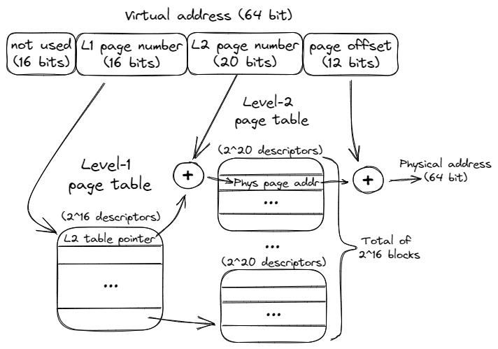

## Virtual Memory {#sec:VirtMem}

Virtual memory is the mechanism to share the physical memory attached to a CPU with all the processes executing on it. Virtual memory provides a protection mechanism that prevents access to the memory allocated to a given process from other processes. Virtual memory also provides relocation, which is the ability to load a program anywhere in physical memory without changing the addresses in the program. 

In a CPU that supports virtual memory, programs use virtual addresses for their accesses. But while user code operates on virtual addresses, retrieving data from memory requires physical addresses. Also, to effectively manage the scarce physical memory, it is divided into *pages*. Thus, applications operate on a set of pages that an operating system has provided.

{#fig:VirtualMem width=75%}

Virtual-to-physical address translation is required for accessing data as well as code (instructions). The translation mechanism for a system with a page size of 4KB is shown in Figure @fig:VirtualMem. The virtual address is split into two parts. The virtual page number (52 most significant bits) is used to index into the page table to produce a mapping between the virtual page number and the corresponding physical page. The 12 least significant bits are used to offset within a 4KB page. These bits do not require translation and are used "as-is" to access the physical memory location.

{#fig:L2PageTables width=90%}

The page table can be either single-level or nested. Figure @fig:L2PageTables shows one example of a 2-level page table. Notice how the address gets split into more pieces. The first thing to mention is that the 16 most significant bits are not used. This can seem like a waste of bits, but even with the remaining 48 bits we can address 256 TB of total memory (2^48^). Some applications use those unused bits to keep metadata, also known as *pointer tagging*.

A nested page table is a radix tree that keeps physical page addresses along with some metadata. To find a translation within a 2-level page table, we first use bits 32..47 as an index into the Level-1 page table also known as the *page table directory*. Every descriptor in the directory points to one of the 2^16^ blocks of Level-2 tables. Once we find the appropriate L2 block, we use bits 12..31 to find the physical page address. Concatenating it with the page offset (bits 0..11) gives us the physical address, which can be used to retrieve the data from the DRAM.

The exact format of the page table is dictated by the CPU for reasons we will discuss a few paragraphs later. Thus the variations of page table organization are limited by what a CPU supports. Modern CPUs support both 4-level page tables with 48-bit pointers (256 TB of total memory) and 5-level page tables with 57-bit pointers (128 PB of total memory).

Breaking the page table into multiple levels doesn't change the total addressable memory. However, a nested approach does not require storing the entire page table as a contiguous array and does not allocate blocks that have no descriptors. This saves memory space but adds overhead when traversing the page table.

Failure to provide a physical address mapping is called a *page fault*. It occurs if a requested page is invalid or is not currently in the main memory. The two most common reasons are: 1) the operating system committed to allocating a page but hasn't yet backed it with a physical page, and 2) an accessed page was swapped out to disk and is not currently stored in RAM.

### Translation Lookaside Buffer (TLB) {#sec:TLBs}

A search in a hierarchical page table could be expensive, requiring traversing through the hierarchy potentially making several indirect accesses. Such a traversal is called a *page walk*. To reduce the address translation time, CPUs support a hardware structure called a translation lookaside buffer (TLB) to cache the most recently used translations. Similar to regular caches, TLBs are often designed as a hierarchy of L1 ITLB (Instructions), and L1 DTLB (Data), followed by a shared (instructions and data) L2 STLB.

To lower memory access latency, the L1 cache lookup can be partially overlapped with the DTLB lookup thanks to a constraint on the cache associativity and size that allows the L1 set selection without the physical address.[^1] However, higher level caches (L2 and L3) - which are also typically Physically Indexed and Physically Tagged (PIPT) but cannot benefit from this optimization - therefore require the address translation before the cache lookup.

The TLB hierarchy keeps translations for a relatively large memory space. Still, misses in the TLB can be very costly. To speed up the handling of TLB misses, CPUs have a mechanism called a *hardware page walker*. Such a unit can perform a page walk directly in hardware by issuing the required instructions to traverse the page table, all without interrupting the kernel. This is the reason why the format of the page table is dictated by the CPU, to which operating systems must comply. High-end processors have several hardware page walkers that can handle multiple TLB misses simultaneously. However, even with all the acceleration offered by modern CPUs, TLB misses still cause performance bottlenecks for many applications.

### Huge Pages {#sec:ArchHugePages}

Having a small page size makes it possible to manage the available memory more efficiently and reduce fragmentation. The drawback though is that it requires having more page table entries to cover the same memory region. Consider two page sizes: 4KB, which is a default on x86, and a 2MB *huge page* size. For an application that operates on 10MB of data, we need 2560 entries in the first case, but just 5 entries if we would map the address space onto huge pages. Those are named *Huge Pages* on Linux, *Super Pages* on FreeBSD, and *Large Pages* on Windows, but they all mean the same thing. Throughout the rest of this book, we will refer to them as Huge Pages.

An example of an address that points to data within a huge page is shown in Figure @fig:HugePageVirtualAddress. Just like with a default page size, the exact address format when using huge pages is dictated by the hardware, but luckily we as programmers usually don't have to worry about it.

{#fig:HugePageVirtualAddress width=90%}

Using huge pages drastically reduces the pressure on the TLB hierarchy since fewer TLB entries are required. It greatly increases the chance of a TLB hit. We will discuss how to use huge pages to reduce the frequency of TLB misses in [@sec:secDTLB] and [@sec:FeTLB]. The downsides of using huge pages are memory fragmentation and, in some cases, nondeterministic page allocation latency because it is harder for the operating system to manage large blocks of memory and to ensure effective utilization of available memory. To satisfy a 2MB huge page allocation request at runtime, an OS needs to find a contiguous chunk of 2MB. If this cannot be found, the OS needs to reorganize the pages, resulting in a longer allocation latency.

[^1]: Minimum associativity for a PIPT L1 cache to also be VIPT, accessing a set without translating the index to physical - [https://stackoverflow.com/a/59288185](https://stackoverflow.com/a/59288185).
