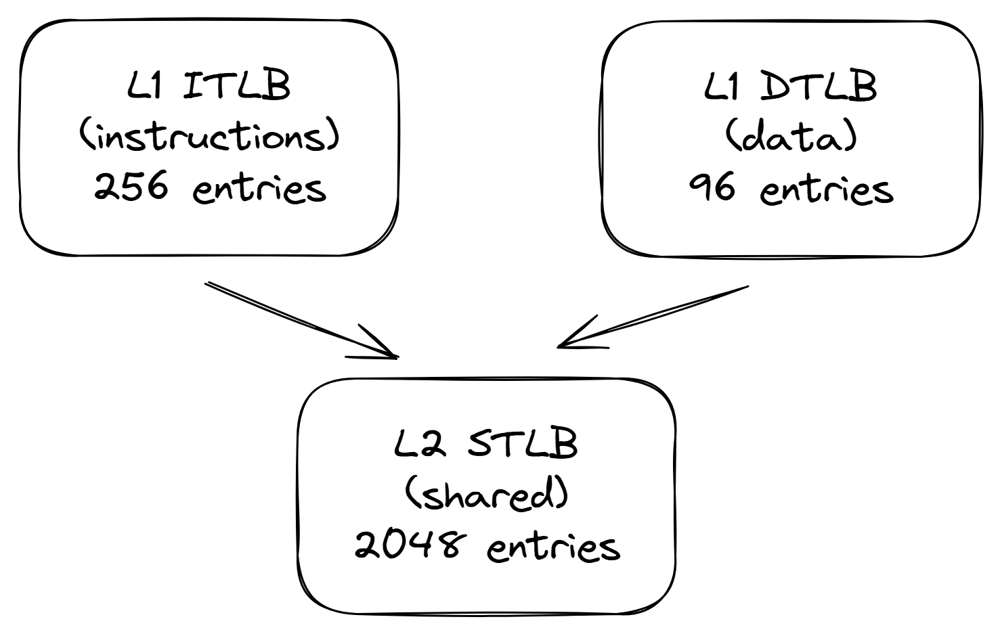

## Modern CPU Design

To see how all the concepts we talked about in this chapter are used in practice, let's take a look at the implementation of Intel’s 12th generation core, Goldencove, which became available in 2021. This core is used as P-core inside Alderlake and Sapphire Rapids platforms. Figure @fig:Goldencove_diag shows the block diagram of the Goldencove core. Notice, that this section only describes a single core, not the entire processor. So, we will skip discussion about frequencies, core counts, L3 caches, core interconnects, memory latency and bandwidth, and other things.

![Block diagram of a CPU Core in the Intel GoldenCove Microarchitecture. *© Image from [@IntelOptimizationManual].*](../../img/uarch/goldencove_block_diagram.png){#fig:Goldencove_diag width=100%}

The core is split into an in-order front-end that fetches and decodes x86 instructions into u-ops and a 6-wide superscalar, out-of-order backend. The Goldencove core supports 2-way SMT. It has a 32KB first-level instruction cache (L1 I-cache), and a 48KB first-level data cache (L1 D-cache). The L1 caches are backed up by a unified 1.25MB (2MB in server chips) second-level cache, the L2 cache. The L1 and L2 caches are private to each core. At the end of this section we also take a look at the TLB hierarchy.

### CPU Front-End {#sec:uarchFE}

The CPU Front-End consists of a number of data structures that serve the main goal to efficiently fetch and decode instructions from memory. Its main purpose is to feed prepared instructions to the CPU Back-End, which is responsible for the actual execution of instructions.

Technically, instruction fetch is the first stage to execute an instruction. But once a program reaches a steady state, branch predictor unit (BPU) steers the work of the CPU Front-End. That's the reason for the arrow that goes from the BPU to the instruction cache. The BPU predicts direction of all branch instructions and steers the next instruction fetch based on this prediction.

The heart of the BPU is a branch target buffer (BTB) with 12K entries, which keeps the information about branches and their targets which is used by the prediction algorithms. Every cycle, the BPU generates next address to fetch and passes it to the CPU Front-End.

The CPU Front-End fetches 32 bytes per cycle of x86 instructions from the L1 I-cache. This is shared among the two threads, so each thread gets 32 bytes every other cycle. These are complex, variable-length x86 instructions. First, the pre-decode determines and marks the boundaries of the variable instructions by inspecting the instruction. In x86, the instruction length can range from 1-byte to 15-bytes instructions. This stage also identifies branch instructions. The pre-decode stage moves up to 6 instructions (also referred to as Macro Instructions) to the instruction queue (not shown on the block diagram) that is split between the two threads. The instruction queue also supports a macro-op fusion unit that detects that two macroinstructions can be fused into a single micro operation (UOP). This optimization saves bandwidth in the rest of the pipeline.

Later, up to six pre-decoded instructions are sent from the instruction queue to the decoder unit every cycle. The two SMT threads alternate every cycle to access this interface. The 6-way decoder converts the complex macro-Ops into fixed-length UOPs. Decoded UOPs are queued into the Instruction Decode Queue (IDQ), labeled as "uop Queue" on the diagram.

A major performance-boosting feature of the front-end is the Decoded Stream Buffer (DSB) or the UOP Cache. The motivation is to cache the macro-ops to UOPs conversion in a separate structure that works in parallel with the L1 I-cache. When the BPU generates new address to fetch, the DSB is also checked to see if the UOPs translations are already available in the DSB. Frequently occurring macro-ops will hit in the DSB, and the pipeline will avoid repeating the expensive pre-decode and decode operations for the 32 bytes bundle. The DSB can provide eight UOPs per cycle and can hold up to 4K entries.

Some very complicated instructions may require more UOPs than decoders can handle. UOPs for such instruction are served from Microcode Sequencer (MSROM). Examples of such instructions include HW operation support for string manipulation, encryption, synchronization, and others. Also, MSROM keeps the microcode operations to handle exceptional situations like branch misprediction (which requires pipeline flush), floating-point assist (e.g., when an instruction operates with a denormal floating-point value), and others. MSROM can push up to 4 uops per cycle into the IDQ.

The Instruction Decode Queue (IDQ) provides the interface between the in-order front-end and the out-of-order backend. IDQ queues up the UOPs in order. The IDQ can hold 144 uops per logical processor in single thread mode, or 72 uops per thread when SMT is active. This is where the in-order CPU Front-End finishes and the out-of-order CPU Back-End starts.

### CPU Back-End {#sec:uarchBE}

The CPU Back-End employs an OOO engine that executes instructions and stores results. The heart of the CPU backend is the 512 entry ReOrder buffer (ROB). This unit is reffered as "Allocate / Rename" on the diagram. It serves a few purposes. First, it provides register renaming. There are only 16 general-purpose integer and 32 vector/SIMD architectural registers, however, the number of physical registers is much higher.[^1] Physical registers are located in a structure called physical register file (PRF). The mappings from architecture-visible registers to the physical registers are kept in the register alias table (RAT).

Second, ROB allocates execution resources. When an instruction enters the ROB, a new entry gets allocated and resources are assigned to it, mainly execution port and the output physical register. ROB can allocate up to 6 UOPs per cycle.

Third, ROB tracks the speculative execution. When the instruction finished its execution its status gets updated and it stays there until the previous instructions also finish. It' done that way because instructions are always retired in program order. Once the instruction retires, its ROB entry gets deallocated and results of the instruction become visible. The retiring stage is wider than the allocation: ROB can retire 8 instruction per cycle.

There are certain operations which processors handle in a specific manner, often called idioms, which require no or less costly execution. Processors recognize such cases and allow them to run faster then regular instructions. Here are some of such cases:

* **Zeroing**: to assign zero to a register, compilers often use `XOR / PXOR / XORPS / XORPD` instructions, e.g. `XOR RAX, RAX`, which are preferred by compilers instead of the equivalent `MOV RAX, 0x0` instruction as the XOR encoding uses fewer encoding bytes. Such zeroing idioms are not executed as any other regular instruction and are resolved in the CPU front-end, which saves execution resources. The instruction later retires as usual.
* **Move elimination**: similarly to the previous one, register-to-register mov operations, e.g. `MOV RAX, RBX`, are executed with zero cycle delay.
* **NOP instruction**: `NOP` is often used for padding or alignment purposes. It simply gets marked as completed without allocating it into the reservation station.
* **Other bypases**: CPU architects also optimized certain arithmetical operations. For example, multiplying any number by one will always gives the same number. The same goes for dividing any number by one. Multiplying any number by zero always gives the same number, etc. Some CPUs can recognize such cases in runtime and run them with shorter latency than regular multiplication or divide.

The "Scheduler / Reservation Station" (RS) is the structure that tracks the availability of all resources for a given UOP and dispatches the UOP to the assigned port once it is ready. When an instruction enters the RS, scheduler starts tracking its data dependencies. Once all the source operands become available, the RS tries to dispatch it to a free execution port. The RS has fewer entries than the ROB. It can dispatch up to 6 UOPs per cycle.

As shown in Figure @fig:Goldencove_diag, there are 12 execution ports:

* Ports 0, 1, 5, 6, and 10 provide all the integer, FP, and vector ALU. UOPs dispatched to those ports do not require memory operations.
* Ports 2, 3, and 11 are used for address generation (AGU) and for load operations. 
* Ports 4 and 9 are used for store operations (STD).
* Ports 7 and 8 are used for address generation.

A dispatched arithmetical operation can go to either INT or VEC execution port. Integer and Vector/FP register stacks are located separately. Operations that move values from Int stack to FP and vice-versa (e.g. convert, extraxt, insert) incur additional penalty.

### Load-Store Unit

The Goldencove core can execute up to three loads and up to two stores per cycle. Once a load or a store leaves the scheduler, the load-store (LS) unit is responsible for accessing the data and saving it in a register. The LS unit has a load queue (LDQ, labeled as "Load Buffer") and a store queue (STQ, labeled as "Store Buffer"), their sizes are not disclosed.[^2] Both LDQ and STQ receive operations at dispatch from the scheduler.

When a new memory load request comes, the LS queries the L1 cache using a virtual address and looks up the physical address translation in the TLB. Those two operations are initiated simultaneously. The size of L1 D-cache is 48KB. If both operations result in a hit, the load delivers data to the integer unit or the floating-point unit and leaves the LDQ. Similarly, a store would write the data to the data cache and exit the STQ.

In case of a L1 miss, the hardware initiates a query of the (private) L2 cache tags. The L2 cache comes in two variants: 1.25MB for client and 2MB for server processors. While the L2 cache is being queried, a fill buffer (FB) is allocated, which will keep the cache line once it arrives. The Goldencove core has 16 fill buffers. As a way to lower the latency, a speculative query is sent to the L3 cache in parallel with L2 cache lookup.

If two loads access the same cache line, they will hit the same FB. Such two loads will be "glued" together and only one memory request will be initiated. The LS unit dynamically reorders operations, supporting both loads bypassing older loads and loads bypassing older non-conflicting stores. Also, the LS unit supports store-to-load forwarding when there is an older store that contains all of the load's bytes, and the store's data has been produced and is available in the store queue.

In case the L2 miss is confirmed, the load continues to wait for the results of L3 cache, which incurs much higher latency. From that point, the request leaves the core and enters the "uncore", the term you may frequently see in profiling tools. The outstanding misses from the core are tracked in the Super Queue (SQ), which can track up to 48 uncore requests. In a scenario of L3 miss, the processor begins to set up a memory access. Further details are beyond the scope of this chapter.

When a store happens, in a general case, to modify a memory location, the processor needs to load the full cache line, change it, and then write it back to memory. If the address to write is not in the cache, it goes through a very similar mechanism as with loads to bring that data in. The store cannot be complete until the data is not written to the cache hierarchy.

Of course, there are a few optimizations done for store operations as well. First, if we're dealing with a store or multiple adjacent stores (aka *streaming stores*) that modify entire cache line, there is no need to read the data first as all of the bytes will be clobbered anyway. So, the processor will try to combine writes to fill entire cache lines. If this succeeds no memory read operation is needed at all.

Second, write combining allows multiple stores to be assembled and written further out in the cache hierarchy as a unit. So, if multiple stores modify the same cache line, only one memory write will be issued to the memory subsystem. Modern processors have a data structure called *store buffer* that tries to combine stores. A store instruction copies the data that will be written from a register into the store buffer. From there it may be written to the L1 cache or it may be combined with other stores to the same cache line. The store buffer capacity is limited, so it can hold requests for partial writing to a cache line only for some time. However, while the data sits in the store buffer waiting to be written, other load instructions can read the data straight from the store buffers (store-to-load forwarding).

Finally, if we happen to read the data before overwriting it, the cache line typically stays in the cache, displacing some other line. This behavior can be altered with the help of a *non-temporal* store, that will not keep the modified line in the cache. It is useful in situations when we know that we don't need the data once we have changed it. Non-temporal loads a stores help to utilize cache space more efficiently by not evicting other data that might be needed soon.

### TLB Hierarchy

Recall from the previous discussion, translations from virtual to physical addresses are cached in TLB. Golden Cove's TLB hierarchy is presented in Figure @fig:GLC_TLB. Similar to a regular data cache, it has two levels, where level 1 has separate instances for instructions (ITLB) and data (DTLB). L1 ITLB has 256 entries for regular 4K pages and covers the memory space of 256 * 4KB equals 1MB, while L1 DTLB has 96 entries that covers 384 KB. 

{#fig:GLC_TLB width=50%}

The second level of the hierarchy (STLB) caches translations for both instructions and data. It is a larger storage that serves requests that miss in the L1 TLBs. L2 STLB can accomdate 2048 most recent data and instruction page address translations, which covers a total of 8MB of memory space. There are fewer entries available for 2M huge pages: L1 ITLB has 32 entries, L1 DTLB has 32 entries, and L2 STLB can only use 1024 entries that are also shared regular 4K pages.

In case a translation was not found in the TLB hierarchy, it has to be retrieved from the DRAM by "walking" the kernel page tables. There is a mechanism for speeding up such scenarios, called HW page walker. Recall that the page table is built as a radix tree of sub-tables, with each entry of the sub-table holding a pointer to the next level of the tree. 

The key element to speed up the page walk procedure is a set of Paging-Structure Caches[^3] that caches the hot entries in the page table structure. For the 4-level page table, we have the least significant twelve bits (11:0) for page offset (not translated), and bits 47:12 for the page number. While each entry in a TLB is an individual complete translation, Paging-Structure Caches cover only the upper 3 levels (bits 47:21). The idea is to reduce the number of loads required to execute in case of a TLB miss. For example, without such caches we would have to execute 4 loads, which would add latency to the instruction completion. But with the help of the Paging-Structure Caches, if we find a translation for the levels 1 and 2 of the address (bits 47:30), we only have to do the remaining 2 loads.

The Goldencove microarchitectures has four dedicated page walkers, which allows it to process 4 page walks simultaneously. In the event of a TLB miss, these HW units will issue the required loads into the memory subsystem and populate the TLB hierarchy with new entries. The page-table loads generated by the page walkers can hit in L1, L2, or L3 caches (details are not disclosed). Finally, page walkers can anticipate a future TLB miss and speculatively do a page walk to update TLB entries before a miss actually happens.

[TODO]: SMT
Goldencove specification doesn't disclose how resources are shared between two SMT threads. But in general, caches, TLBs and execution units are fully shared to improve the dynamic utilization of those resources. On the other hand, buffers for staging instructions between major pipe stages are either replicated or partitioned. These buffers include IDQ, ROB, RAT, RS, LDQ and STQ. PRF is also replicated.

[^1]: Around 300 physical GPRs and a similar number of vector registers. The official number is not diclosed.
[^2]: LDQ and STQ sizes are not disclosed, but people have measured 192 and 114 entries respectively.
[^3]: AMD's equivalent is called Page Walk Caches.