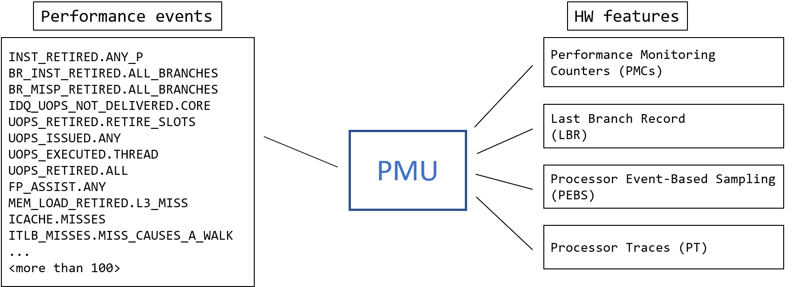
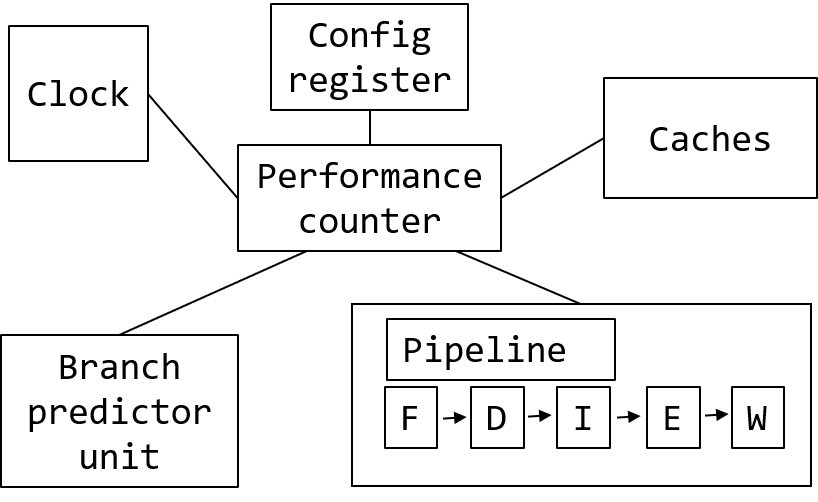

## Performance Monitoring Unit {#sec:PMU}

Every modern CPU provides means to monitor performance, which are aggregated into the Performance Monitoring Unit (PMU). It incorporates features that help developers in analyzing the performance of their applications. An example of a PMU in a modern Intel CPU is provided in Figure @fig:PMU. Most modern PMUs have a set of Performance Monitoring Counters (PMC) that can be used to collect various performance events that happen during the execution of a program. Later in [@sec:counting], we will discuss how PMCs can be used for performance analysis. Also, the PMU has other features that enhance performance analysis, like LBR, PEBS, and PT, for which entire chapter 6 is devoted.

{#fig:PMU width=70%}

As CPU design evolves with every new generation, so do their PMUs. It is possible to determine the version of the PMU in your CPU using the `cpuid` command, as shown in [@lst:QueryPMU]. A similar information can be extracted from the kernel message buffer by checking the output of `dmesg` command. Characteristics of each Intel PMU version, as well as changes to the previous version, can be found in [@IntelOptimizationManual, Volume 3B, Chapter 20].

Listing: Querying your PMU

~~~~ {#lst:QueryPMU .bash}
$ cpuid
...
Architecture Performance Monitoring Features (0xa/eax):
      version ID                               = 0x4 (4)
      number of counters per logical processor = 0x4 (4)
      bit width of counter                     = 0x30 (48)
...
Architecture Performance Monitoring Features (0xa/edx):
      number of fixed counters    = 0x3 (3)
      bit width of fixed counters = 0x30 (48)
...
~~~~~~~~~~~~~~~~~~~~~~~~~~~~~~~~~~~~~~~~~~~~~~~~~

### Performance Monitoring Counters {#sec:PMC}

If we imagine a simplified view of the processor, it may look something like what is shown in Figure @fig:PMC. As we discussed earlier in this chapter, a modern CPU has caches, a branch predictor, an execution pipeline, and other units. When connected to multiple units, a PMC can collect interesting statistics from them. For example, it can count how many clock cycles have passed, how many instructions executed, how many cache misses or branch mispredictions happened during that time, and other performance events.

{#fig:PMC width=60%}

Typically, PMCs are 48-bit wide, which enables analysis tools to run for a long time without interrupting a program's execution.[^2] Performance counter is a HW register implemented as a Model Specific Register (MSR). That means that the number of counters and their width can vary from model to model, and you can not rely on the same number of counters in your CPU. You should always query that first, using tools like `cpuid`, for example. PMCs are accessible via the `RDMSR` and `WRMSR` instructions, which can only be executed from kernel space. Luckily, you only have to care about this if you're a developer of a performance analysis tool, like Linux perf or Intel Vtune profiler. Those tools handle all the complexity of programming PMCs.

When engineers analyze their applications, it is common for them to collect the number of executed instructions and elapsed cycles. That is the reason why some PMUs have dedicated PMCs for collecting such events. Fixed counters always measure the same thing inside the CPU core. With programmable counters, it's up to the user to choose what they want to measure. 

For example, in the Intel Skylake architecture (PMU version 4, see [@lst:QueryPMU]), each physical core has three fixed and eight programmable counters. The three fixed counters are set to count core clocks, reference clocks, and instructions retired (see [@sec:secMetrics] for more details on these metrics). AMD Zen4 and ARM Neoverse V1 cores support 6 programmable performance monitoring counters per processor core, no fixed counters.

It's not unusual for a PMU to provide more than one hundred events available for monitoring. Figure @fig:PMU shows just a small part of all the performance events available for monitoring on a modern Intel CPU. It's not hard to notice that the number of available PMCs is much smaller than the number of performance events. It's not possible to count all the events at the same time, but analysis tools solve this problem by multiplexing between groups of performance events during the execution of a program (see [@sec:secMultiplex]).

- For Intel CPUs, the complete list of performance events can be found in [@IntelOptimizationManual, Volume 3B, Chapter 20] or at [perfmon-events.intel.com](https://perfmon-events.intel.com/). 
- ADM doesn't publish a list of performance monitoring events for every AMD processor. Curious readers may find some information in the Linux perf source [code](https://github.com/torvalds/linux/blob/master/arch/x86/events/amd/core.c)[^3]. General information about AMD performance counters can be found in [@AMDProgrammingManual, 13.2 Performance Monitoring Counters].
- For ARM chips, performance events are not strictly defined. Vendors implement cores following an ARM architecture, but performance events vary widely, both in what they mean and what events are supported. For the ARM Neoverse V1 processor, that ARM designs themselves, the list of performance events can be found in [@ARMNeoverseV1].

[^2]: When the value of PMCs overflows, the execution of a program must be interrupted. SW then should save the fact of an overflow. We will discuss it in more details later.
[^3]: Linux source code for AMD cores - [https://github.com/torvalds/linux/blob/master/arch/x86/events/amd/core.c](https://github.com/torvalds/linux/blob/master/arch/x86/events/amd/core.c)