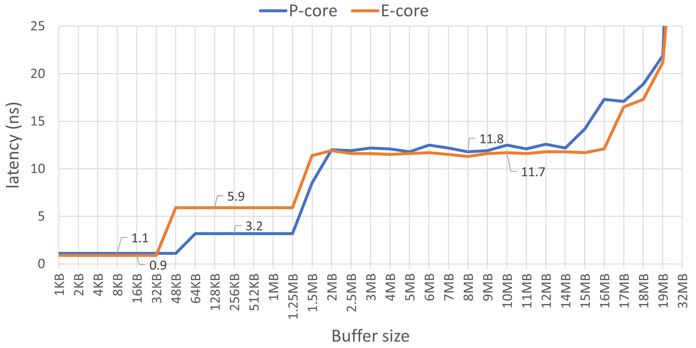
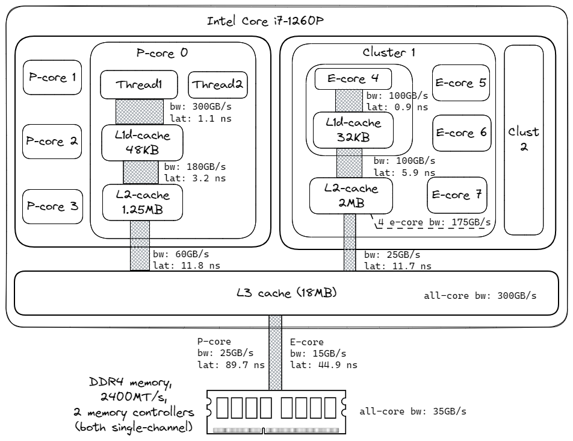

## Memory Latency and Bandwidth {#sec:MemLatBw}

Inefficient memory accesses are often a dominant performance bottleneck in modern environments. Thus, how quickly a processor can fetch data from the memory subsystem is a critical factor in determining application performance. There are two aspects of memory performance: 1) how fast a CPU can fetch a single byte from memory (latency), and 2) how many bytes it can fetch per second (bandwidth). Both are important in various scenarios; we will look at a few examples later. In this section, we will focus on measuring the peak performance of the memory subsystem components.

One of the tools that can become helpful on x86 platforms is Intel Memory Latency Checker (MLC),[^1] which is available for free on Windows and Linux. MLC can measure cache and memory latency and bandwidth using different access patterns and under load. On ARM-based systems there is no similar tool, however, users can download and build memory latency and bandwidth benchmarks from sources. Examples of such projects are [lmbench](https://sourceforge.net/projects/lmbench/)[^2], [bandwidth](https://zsmith.co/bandwidth.php)[^4] and [Stream](https://github.com/jeffhammond/STREAM).[^3]

We will only focus on a subset of metrics, namely idle read latency and read bandwidth. Let's start with the read latency. Idle means that while we do the measurements, the system is idle. This will give us the minimum time required to fetch data from memory system components, but when the system is loaded by other "memory-hungry" applications, this latency increases as there may be more queueing for resources at various points. MLC measures idle latency by doing dependent loads (also known as pointer chasing). A measuring thread allocates a very large buffer and initializes it so that each (64-byte) cache line within the buffer contains a pointer to another, but non-adjacent, cache line within the buffer. By appropriately sizing the buffer, we can ensure that almost all the loads are hitting a certain level of the cache or in the main memory. 

Our system under test is an Intel Alderlake box with a Core i7-1260P CPU and 16GB DDR4 @ 2400 MT/s dual-channel memory. The processor has 4P (Performance) hyperthreaded and 8E (Efficient) cores. Every P-core has 48 KB of L1 data cache and 1.25 MB of L2 cache. Every E-core has 32 KB of L1 data cache, and four E-cores form a cluster that has access to a shared 2 MB L2 cache. All cores in the system are backed by an 18 MB L3 cache. If we use a 10 MB buffer, we can be nearly certain that repeated accesses to that buffer would miss in L2 but hit in L3. Here is the example `mlc` command:

```bash
$ ./mlc --idle_latency -c0 -L -b10m
Intel(R) Memory Latency Checker - v3.10
Command line parameters: --idle_latency -c0 -L -b10m

Using buffer size of 10.000MiB
*** Unable to modify prefetchers (try executing 'modprobe msr')
*** So, enabling random access for latency measurements
Each iteration took 31.1 base frequency clocks (	12.5	ns)
```

The option `--idle_latency` measures read latency without loading the system. MLC has the `--loaded_latency` option to measure latency when there is memory traffic generated by other threads. The option `-c0` pins the measurement thread to logical CPU 0, which is on a P-core. The option `-L` enables large pages to limit TLB effects in our measurements. The option `-b10m` tells MLC to use a 10MB buffer, which will fit in the L3 cache on our system.

Figure @fig:MemoryLatenciesCharts shows the read latencies of L1, L2, and L3 caches. There are four different regions on the chart. The first region on the left from 1 KB to 48 KB buffer size corresponds to the L1 D-cache, which is private to each physical core. We can observe 0.9 ns latency for the E-core and a slightly higher 1.1 ns for the P-core. Also, we can use this chart to confirm the cache sizes. Notice how E-core latency starts climbing after a buffer size goes above 32 KB but E-core latency stays constant up to 48KB. That confirms that the L1 D-cache size in E-core is 32 KB, and in P-core it is 48 KB.

{#fig:MemoryLatenciesCharts width=100% }

The second region shows the L2 cache latencies, which for E-core is almost twice higher than for P-core (5.9 ns vs. 3.2 ns). For P-core, the latency increases after we cross the 1.25 MB buffer size, which is expected. But we expect E-core latency to stay the same until 2 MB, which is not happening in our measurements.

The third region from 2 MB up to 14 MB corresponds to L3 cache latency, which is roughly 12 ns for both types of cores. The total size of the L3 cache that is shared between all cores in the system is 18 MB. Interestingly, we start seeing some unexpected dynamics starting from 15 MB, not 18 MB. Most likely it has to do with some accesses missing in L3 and requiring a fetch from the main memory. 

We don't show the part of the chart that corresponds to memory latency, which begins after we cross the 18MB boundary. The latency starts climbing very steeply and levels off at 24 MB for E-core and 64 MB for P-core. With a much larger buffer size, e.g., 500 MB, E-core access latency is 45ns and P-core is 90ns. This measures the memory latency since almost no loads hit in the L3 cache.

Using a similar technique we can measure the bandwidth of various components of the memory hierarchy. For measuring bandwidth, MLC executes load requests which results are not used by any subsequent instructions. This allows MLC to generate the maximum possible bandwidth. MLC spawns one software thread on each of the configured logical processors. The addresses that each thread accesses are independent and there is no sharing of data between threads. As with the latency experiments, the buffer size used by the threads determines whether MLC is measuring L1/L2/L3 cache b/w or memory b/w.

```bash
./mlc --max_bandwidth -k0-15 -Y -L -b10m
Measuring Maximum Memory Bandwidths for the system
Bandwidths are in MB/sec (1 MB/sec = 1,000,000 Bytes/sec)
Using all the threads from each core if Hyper-threading is enabled
Using traffic with the following read-write ratios
ALL Reads        :      33691.53
3:1 Reads-Writes :      30352.45
2:1 Reads-Writes :      29722.28
1:1 Reads-Writes :      28382.45
Stream-triad like:      30503.68
```

There are a couple of new options here. The `-k` option specifies a list of CPU cores used for measurements. The `-Y` option tells MLC to use AVX2 loads, i.e., 32 bytes at a time. MLC measures bandwidth with different read-write ratios, but in the diagram below we only show all-read bandwidth as it gives us an intuition about peak memory bandwidth. But other ratios can also be important. Combined latency and bandwidth numbers for our system under test, as measured with Intel MLC, are shown in Figure @fig:MemBandwidthAndLatenciesDiagram.

{#fig:MemBandwidthAndLatenciesDiagram width=100% }

Cores can draw much higher bandwidth from lower-level caches like L1 and L2 than from shared L3 cache or main memory. Shared caches such as L3 and E-core L2, scale reasonably well to serve requests from multiple cores at the same time. For example, a single E-core L2 bandwidth is 100GB/s. With two E-cores from the same cluster, I measured 140 GB/s, three E-cores - 165 GB/s, and all four E-cores can draw 175 GB/s from the shared L2. The same goes for L3 cache, which allows for 60 GB/s for a single P-core and only 25 GB/s for a single E-core. But when all the cores are used, the L3 cache can sustain a bandwidth of 300 GB/s. Reading data from memory can be done at 33.7 GB/s, while theoretical maximum bandwidth is 38.4 GB/s on our platform.

Knowledge of the primary characteristics of a machine is fundamental to assessing how well a program utilizes available resources. We will return to this topic in [@sec:roofline] when discussing the Roofline performance model. If you constantly analyze performance on a single platform, it is a good idea to memorize the latencies and bandwidth of various components of the memory hierarchy or have them handy. It helps to establish the mental model for a system under test which will aid your further performance analysis as you will see next.

[^1]: Intel MLC tool - [https://www.intel.com/content/www/us/en/download/736633/intel-memory-latency-checker-intel-mlc.html](https://www.intel.com/content/www/us/en/download/736633/intel-memory-latency-checker-intel-mlc.html)
[^2]: lmbench - [https://sourceforge.net/projects/lmbench](https://sourceforge.net/projects/lmbench)
[^3]: Stream - [https://github.com/jeffhammond/STREAM](https://github.com/jeffhammond/STREAM)
[^4]: Memory bandwidth benchmark by Zack Smith - [https://zsmith.co/bandwidth.php](https://zsmith.co/bandwidth.php)
