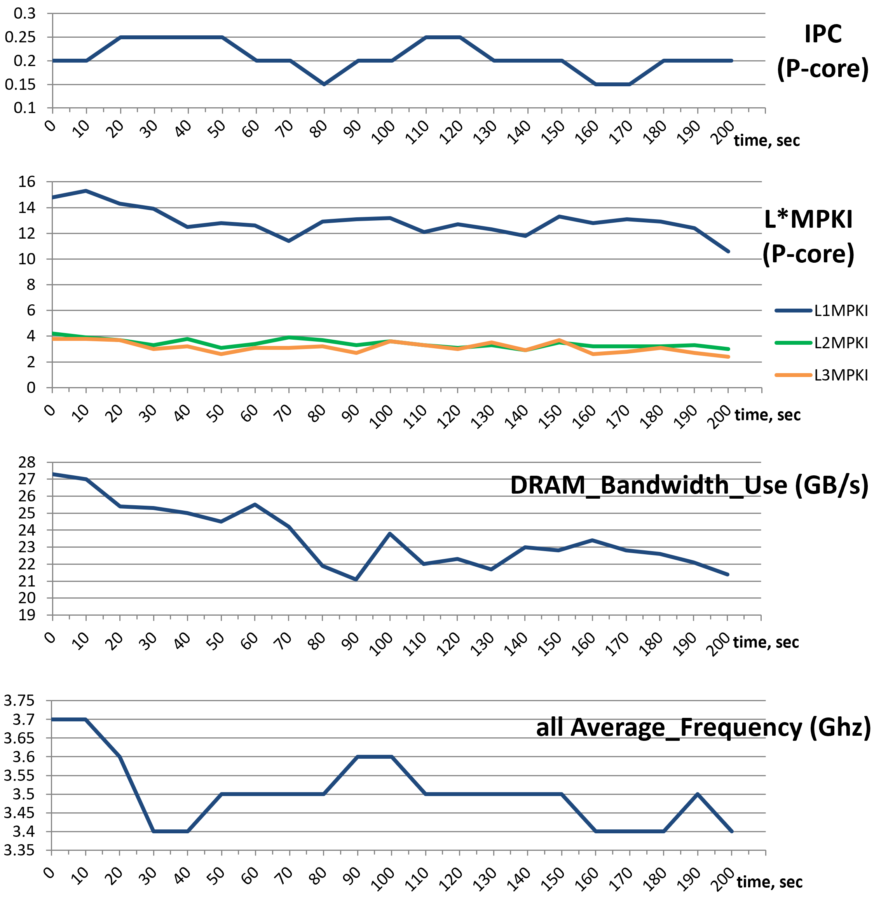

## Case Study: Analyzing Performance Metrics of Four Benchmarks {#sec:PerfMetricsCaseStudy}

Putting together everything we discussed so far in this chapter, we run four benchmarks from different domains and calculated their performance metrics. First of all, let's introduce the benchmarks.

1. Blender 3.4 - an open-source 3D creation and modeling software project. This test is of Blender's Cycles performance with BMW27 blend file. All HW threads are used. URL: [https://download.blender.org/release](https://download.blender.org/release). Command line: `./blender -b bmw27_cpu.blend -noaudio --enable-autoexec -o output.test -x 1 -F JPEG -f 1`.
2. Stockfish 15 - an advanced open-source chess engine. This test is a stockfish built-in benchmark. A single HW thread is used. URL: [https://stockfishchess.org](https://stockfishchess.org). Command line: `./stockfish bench 128 1 24 default depth`.
3. Clang 15 selfbuild - this test uses clang 15 to build clang 15 compiler from sources. All HW threads are used. URL: [https://www.llvm.org](https://www.llvm.org). Command line: `ninja -j16 clang`.
4. CloverLeaf 2018 - a Lagrangian-Eulerian hydrodynamics benchmark. All HW threads are used. This test uses clover_bm.in input file (Problem 5). URL: [http://uk-mac.github.io/CloverLeaf](http://uk-mac.github.io/CloverLeaf). Command line: `./clover_leaf`.

For the purpose of this exercise, we run all four benchmarks on the machine with the following characteristics:

* 12th Gen Alderlake Intel(R) Core(TM) i7-1260P CPU @ 2.10GHz (4.70GHz Turbo), 4P+8E cores, 18MB L3-cache
* 16 GB RAM, DDR4 @ 2400 MT/s
* 256GB NVMe PCIe M.2 SSD
* 64-bit Ubuntu 22.04.1 LTS (Jammy Jellyfish)

To collect performance metrics, we use `toplev.py` script that is a part of [pmu-tools](https://github.com/andikleen/pmu-tools)[^1] written by Andi Kleen:

```bash
$ ~/workspace/pmu-tools/toplev.py -m --global --no-desc -v -- <app with args>
```

The table {@tbl:perf_metrics_case_study} provides a side-by-side comparison of performance metrics for our four benchmarks. There is a lot we can learn about the nature of those workloads just by looking at the metrics. Here are the hypothesis we can make about the benchmarks before collecting performance profiles and diving deeper into the code of those applications.

* __Blender__. The work is split fairly equally between P-cores and E-cores, with a decent IPC on both core types. The number of cache misses per kilo instructions is pretty low (see `L*MPKI`). Branch misprediction contributes as a bottleneck: the `Br. Misp. Ratio` metric is at `2%`; we get 1 misprediction every `610` instructions (see `IpMispredict` metric), which is not bad, but is not perfect either. TLB is not a bottleneck as we very rarely miss in STLB. We ignore `Load Miss Latency` metric since the number of cache misses is very low. The ILP is reasonably high. Goldencove is a 6-wide architecture; ILP of `3.67` means that the algorithm utilizes almost `2/3` of the core resources every cycle. Memory bandwidth demand is low, it's only 1.58 GB/s, far from the theoretical maximum for this machine. Looking at the `Ip*` metrics we can tell that Blender is a floating point algorithm (see `IpFLOP` metric), large portion of which is vectorized FP operations (see `IpArith AVX128`). But also, some portions of the algorithm are non-vectorized scalar FP single precision instructions (`IpArith Scal SP`). Also, notice that every 90th instruction is an explicit software memory prefetch (`IpSWPF`); we expect to see those hints in the Blender's source code. Conclusion: Blender's performance is bound by FP compute with occasional branch mispredictions.

* __Stockfish__. We ran it using only one HW thread, so there is zero work on E-cores, as expected. The number of L1 misses is relatively high, but then most of them are contained in L2 and L3 caches. Branch misprediction ratio is high; we pay the misprediction penalty every `215` instructions. We can estimate that we get one mispredict every `215 (instructions) / 1.80 (IPC) = 120` cycles, which is very frequently. Similar to the Blender reasoning, we can say that TLB and DRAM bandwidth is not an issue for Stockfish. Going further, we see that there is almost no FP operations in the workload. Conclusion: Stockfish is an integer compute workload, which is heavily affected by branch mispredictions.

* __Clang 15 selfbuild__. Compilation of C++ code is one of the tasks which has a very flat performance profile, i.e. there are no big hotspots. Usually you will see that the running time is attributed to many different functions. First thing we spot is that P-cores are doing 68% more work than E-cores and have 42% better IPC. But both P- and E-cores have low IPC. The L*MPKI metrics doesn't look troubling at a first glance, however, in combination with the load miss real latency (`LdMissLat`, in core clocks), we can see that the average cost of a cache miss is quite high (~77 cycles). Now, when we look at the `*STLB_MPKI` metrics, we notice substantial difference with any other benchmark we test. This is another aspect of Clang compiler (and other compilers as well), is that the size of the binary is relatively big: it's more than 100 MB. The code constantly jumps to distant places causing high pressure on the TLB subsystem. As you can see the problem exists both for ITLB (instructions) and DTLB (data). Let's proceed with our analysis. DRAM bandwidth use is higher than for the two previous benchmarks, but still not reaching even half of the maximum memory bandwidth on our platform (which is ~25 GB/s). Another concern for us is the very small number of instruction per call (`IpCall`), only ~41 instruction per function call. This is unfortunately the nature of the compilation codebase: it has thousands of small functions. Compiler has to be very aggressive with inlining all those functions and wrappers. Yet, we suspect that the performance overhead associated with making a function call remains an issue. Also, one can spot the high `ipBranch` and `IpMispredict` metric. For Clang compilation, every fifth instruction is a branch and one of every ~35 branches gets mispredicted. There are almost no FP or vector instructions, but this is not surprising. Conclusion: Clang has a large codebase, flat profile, many small functions, "branchy" code; performance is affected by data cache and TLB misses and branch mispredictions.

* __CloverLeaf__. As before we start with analyzing instructions and core cycles. The amount of work done by P- and E-cores is roughly the same, but it takes P-cores more time to do this work, resulting in a lower IPC of one logical thread on P-core compared to one physical E-core. We don't have a good explanation to that just yet. The `L*MPKI` metrics is high, especially the number of L3 misses per kilo instructions. The load miss latency (`LdMissLat`) is off charts, suggesting an extremely high price of the average cache miss. Next, we take a look at the `DRAM BW use` metric and see that memory bandwidth is fully saturated. That's the problem: all the cores in the system share the same memory bus, they compete for the access to the memory, which effectively stalls the execution. CPUs are undersupplied with the data that they demand. Going further, we can see that CloverLeaf does not suffer from mispredictions or function call overhead. The instruction mix is dominated by FP double-precision scalar operations with some parts of the code being vectorized. Conclusion: multi-threaded CloverLeaf is bound by memory bandwidth.

--------------------------------------------------------------------------
Metric           Core        Blender     Stockfish   Clang15-   CloverLeaf
Name             Type                                selfbuild
---------------- ----------- ----------- ----------- ---------- ----------
Instructions     P-core      6.02E+12    6.59E+11    2.40E+13   1.06E+12

Core Cycles      P-core      4.31E+12    3.65E+11    3.78E+13   5.25E+12

IPC              P-core      1.40        1.80        0.64       0.20

CPI              P-core      0.72        0.55        1.57       4.96

Instructions     E-core      4.97E+12    0           1.43E+13   1.11E+12

Core Cycles      E-core      3.73E+12    0           3.19E+13   4.28E+12

IPC              E-core      1.33        0           0.45       0.26

CPI              E-core      0.75        0           2.23       3.85

L1MPKI           P-core      3.88        21.38       6.01       13.44

L2MPKI           P-core      0.15        1.67        1.09       3.58

L3MPKI           P-core      0.04        0.14        0.56       3.43

Br. Misp. Ratio  E-core      0.02        0.08        0.03       0.01

Code stlb MPKI   P-core      0           0.01        0.35       0.01

Ld stlb MPKI     P-core      0.08        0.04        0.51       0.03

St stlb MPKI     P-core      0           0.01        0.06       0.1
    
LdMissLat (Clk)  P-core      12.92       10.37       76.7       253.89

ILP              P-core      3.67        3.65        2.93       2.53

MLP              P-core      1.61        2.62        1.57       2.78

DRAM BW (GB/s)   All         1.58        1.42        10.67      24.57
     
IpCall           All         176.8       153.5       40.9       2,729

IpBranch         All         9.8         10.1        5.1        18.8

IpLoad           All         3.2         3.3         3.6        2.7

IpStore          All         7.2         7.7         5.9        22.0

IpMispredict     All         610.4       214.7       177.7      2,416

IpFLOP           All         1.1         1.82E+06    286,348    1.8

IpArith          All         4.5         7.96E+06    268,637    2.1

IpArith Scal SP  All         22.9        4.07E+09    280,583    2.60E+09

IpArith Scal DP  All         438.2       1.22E+07    4.65E+06   2.2

IpArith AVX128   All         6.9         0.0         1.09E+10   1.62E+09

IpArith AVX256   All         30.3        0.0         0.0        39.6

IpSWPF           All         90.2        2,565       105,933    172,348
--------------------------------------------------------------------------

Table: Performance Metrics of Four Benchmarks. {#tbl:perf_metrics_case_study}

As you can see from this study, there is a lot one can learn about behavior of a program just by looking at the metrics. It answers the "what?" question, but doesn't tell you the "why?". For that you will need to collect performance profile, which we will introduce in later chapters. In the second part of the book we discuss how to mitigate performance issues that we suspect in the four benchmarks that we analyzed.

Keep in mind that the summary of performance metrics in {@tbl:perf_metrics_case_study} only tells you about the *average* behavior of a program. For example, we might be looking at CloverLeaf's IPC of `0.2`, while in reality it may never run with such an IPC, instead it may have 2 phases of equal duration, one running with IPC of `0.1`, and the second with IPC of `0.3`. Performance tools tackle this by reporting statistical data for each metric along with the average value. Usually, having min, max, 95th percentile, and variation (stdev/avg) is enough to understand the distribution. Also, some tools allow plotting the data, so you can see how the value for a certain metric changed during the program running time. As an example, figure @fig:CloverMetricCharts shows the dynamics of IPC, L*MPKI, DRAM BW and average frequency for the CloverLeaf benchmark. The `pmu-tools` package can automatically build those charts once you add `--xlsx` and `--xchart` options.

```bash
$ ~/workspace/pmu-tools/toplev.py -m --global --no-desc -v --xlsx workload.xlsx –xchart -- ./clover_leaf
```

{#fig:CloverMetricCharts width=100% }

[TODO]: describe the charts.

Even though the deviation from the values reported in the summary is not very big, we can see that the workload is not always stable. After looking at the IPC chart we can hypothesize that there are no various phases in the workload and the variation is caused by multiplexing between performance events (discussed in [@sec:counting]). Yet, this is only a hypothesis that needs to be confirmed or disproved. Possible ways to proceed would be to collect more data points by running collection with higher granularity (in our case it's 10 sec) and study the source code. Be careful when drawing conclusions just from looking at the numbers, always obtain a second source of data that confirm your hypothesis.

In summary, looking at performance metrics helps building the right mental model about what is and what is *not* happening in a program. Going further into analysis, this data will serve you well.

[^1]: pmu-tools - [https://github.com/andikleen/pmu-tools](https://github.com/andikleen/pmu-tools).