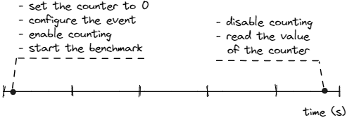
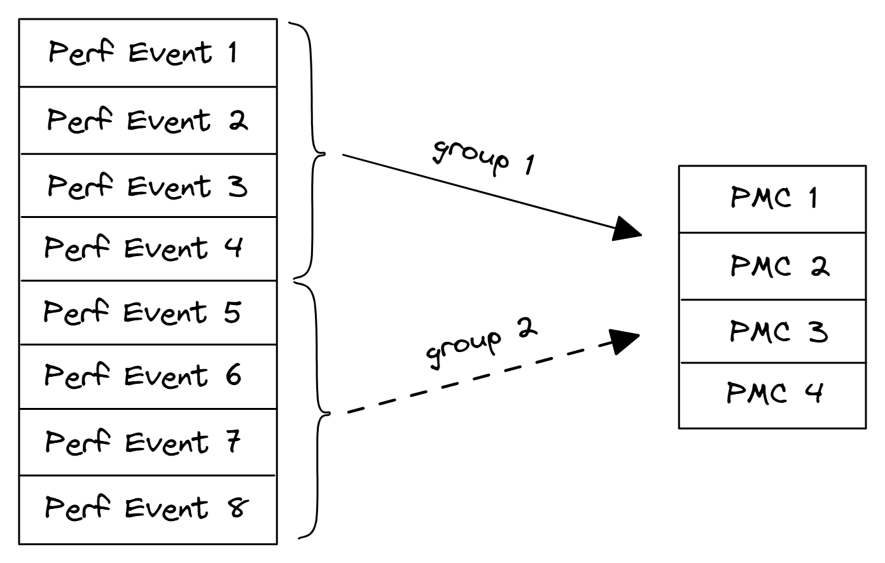
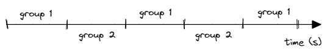

## Workload Characterization {#sec:counting}

Workload characterization is a process of describing a workload by means of quantitative parameters and functions. In simple words, it means counting an absolute number of certain performance events. The goal of characterization is to define the behavior of the workload and extract its most important features. On a high level, an application can belong to one or many of the following types: interactive, database, real-time, network-based, massively parallel, etc. Different workloads can be characterized using different metrics and parameters to address a particular application domain.

This is a book about low-level performance, remember? So, we will focus on extracting features related to the CPU and memory performance. The best example of a workload characterization from a CPU perspective is Top-Down Microarchitecture Analysis (TMA) methodology, which we will closely look at in [@sec:TMA]. TMA attempts to characterize an application by putting it into one of 4 buckets: CPU Front End, CPU Back End, Retiring, and Bad Speculation depending on what is causing the most performance issues. TMA uses Performance Monitoring Counters (PMCs) to collect the needed information and identify the inefficient use of CPU microarchitecture.

But even without a fully-fledged characterization methodology, collecting absolute number of certain performance events can be helpful. We hope that the case study in the previous chapter that examined performance metrics of four different benchmarks, proved that. PMCs are a very important instrument of low-level performance analysis. They can provide unique information about the execution of a program. PMCs are generally used in two modes: "Counting" and "Sampling". Counting mode is used for workload characterization, while sampling mode is used for finding hotspots, which we will discuss soon. 

### Counting Performance Events

The idea behind counting is very simple: we want to count the absolute number of certain performance events while our program is running. Figure @fig:Counting illustrates the process of counting performance events from the start to the end of a program.

{#fig:Counting width=60%}

The steps outlined in figure @fig:Counting roughly represent what a typical analysis tool will do to count performance events. This process is implemented in the `perf stat` tool, which can be used to count various HW events, like the number of instructions, cycles, cache-misses, etc. Below is the example of output from `perf stat`:

```bash
$ perf stat -- ./a.exe
 10580290629  cycles         #    3,677 GHz
  8067576938  instructions   #    0,76  insn per cycle
  3005772086  branches       # 1044,472 M/sec
   239298395  branch-misses  #    7,96% of all branches 
```

It is very informative to know this data. First of all, it allows us to quickly spot some anomalies like a high branch misprediction rate or low IPC. But also, it might come in handy when you've just made code improvement and you want to validate performance gain. Looking at absolute numbers might help you justify or reject the code change. The main author uses `perf stat` as a simple benchmark wrapper. Since the overhead of counting events is minimal, almost all benchmarks can be automatically ran under `perf stat`. It serves as a first step in performance investigation. Sometimes anomalies can be spotted right away, which can save you some analysis time.

### Manual performance counters collection

Modern CPUs have hundreds of countable performance events. It's very hard to remember all of them and their meanings. Understanding when to use a particular PMC is even harder. That is why generally, we don't recommend manually collecting specific PMCs unless you really know what you are doing. Instead, we recommend using tools like Intel Vtune Profiler that automate this process. Nevertheless, there are situations when you are interested in collecting specific PMCs.

A complete list of performance events for all Intel CPU generations can be found in [@IntelSDM, Volume 3B, Chapter 19]. PMCs description is also available at [perfmon-events.intel.com](https://perfmon-events.intel.com/). Every event is encoded with `Event` and `Umask` hexadecimal values. Sometimes performance events can also be encoded with additional parameters, like `Cmask` and `Inv` and others. An example of encoding two performance events for the Intel Skylake microarchitecture is shown in the table {@tbl:perf_count}.

--------------------------------------------------------------------------
Event  Umask Event Mask            Description
 Num.  Value Mnemonic              
------ ----- --------------------- ---------------------------------------
C0H     00H  INST_RETIRED.         Number of instructions at retirement. 
             ANY_P

C4H     00H  BR_INST_RETIRED.      Branch instructions that retired.
             ALL_BRANCHES                  
--------------------------------------------------------------------------

Table: Example of encoding Skylake performance events. {#tbl:perf_count}

Linux `perf` provides mappings for commonly used performance counters. They can be accessed via pseudo names instead of specifying `Event` and `Umask` hexadecimal values. For example, `branches` is just a synonym for `BR_INST_RETIRED.ALL_BRANCHES` and will measure the same thing. List of available mapping names can be viewed with `perf list`:

```bash
$ perf list
  branches          [Hardware event]
  branch-misses     [Hardware event]
  bus-cycles        [Hardware event]
  cache-misses      [Hardware event]
  cycles            [Hardware event]
  instructions      [Hardware event]
  ref-cycles        [Hardware event]
```

However, Linux `perf` doesn't provide mappings for all performance counters for every CPU architecture. If the PMC you are looking for doesn't have a mapping, it can be collected with the following syntax:

```bash
$ perf stat -e cpu/event=0xc4,umask=0x0,name=BR_INST_RETIRED.ALL_BRANCHES/ -- ./a.exe
```

Performance counters are not available in every environment since accessing PMCs requires root access, which applications running in a virtualized environment typically do not have. For programs executing in a public cloud, running a PMU-based profiler directly in a guest container does not result in useful output if a virtual machine (VM) manager does not expose the PMU programming interfaces properly to a guest. Thus profilers based on CPU performance counters do not work well in a virtualized and cloud environment [@PMC_virtual]. Although the situation is improving. VmWare® was one of the first VM managers to enable[^4] virtual CPU Performance Counters (vPMC). AWS EC2 cloud enabled[^5] PMCs for dedicated hosts.

### Multiplexing and scaling events {#sec:secMultiplex}

There are situations when we want to count many different events at the same time. But with only one counter, it's possible to count only one thing at a time. That's why PMUs have multiple counters in it (in recent Intel's Goldencove microarchitecture there are 12 programmable PMCs, 6 per HW thread). Even then, the number of fixed and programmable counter is not always sufficient. Top-Down Analysis Methodology (TMA) requires collecting up to 100 different performance events in a single execution of a program. Modern CPUs don't have that many counters, and here is when multiplexing comes into play.

If there are more events than counters, the analysis tool uses time multiplexing to give each event a chance to access the monitoring hardware. Figure @fig:Multiplexing1 shows an example of multiplexing between 8 performance events with only 4 PMCs available.

<div id="fig:Multiplexing">
{#fig:Multiplexing1 width=50%}

{#fig:Multiplexing2 width=60%}

Multiplexing between 8 performance events with only 4 PMCs available.
</div>

With multiplexing, an event is not measured all the time, but rather only during a portion of time. At the end of the run, a profiling tool needs to scale the raw count based on total time enabled:
$$
final~count = raw~count \times ( time~running / time~enabled )
$$
Let's take figure @fig:Multiplexing2 as an example. Say, during profiling, we were able to measure an event from group 1 during three time intervals. Each measurement interval lasted 100ms (`time enabled`). The program running time was 500ms (`time running`). The total number of events for this counter was measured as 10'000 (`raw count`). So, the final count needs to be scaled as follows:
$$
final~count = 10'000 \times ( 500ms / ( 100ms \times 3) ) = 16'666
$$
This provides an estimate of what the count would have been had the event been measured during the entire run. It is very important to understand that this is still an estimate, not an actual count. Multiplexing and scaling can be used safely on steady workloads that execute the same code during long time intervals. However, if the program regularly jumps between different hotspots, i.e. has different phases, there will be blind spots that can introduce errors during scaling. To avoid scaling, one can try to reduce the number of events to be not bigger than the number of physical PMCs available. However, this will require running the benchmark multiple times to measure all the counters one is interested in.

[^4]: VMWare PMCs - [https://www.vladan.fr/what-are-vmware-virtual-cpu-performance-monitoring-counters-vpmcs/](https://www.vladan.fr/what-are-vmware-virtual-cpu-performance-monitoring-counters-vpmcs/)
[^5]: Amazon EC2 PMCs - [http://www.brendangregg.com/blog/2017-05-04/the-pmcs-of-ec2.html](http://www.brendangregg.com/blog/2017-05-04/the-pmcs-of-ec2.html)