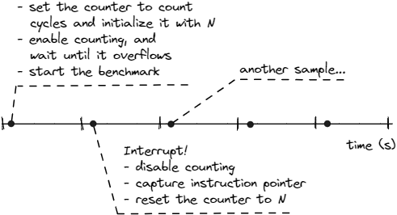
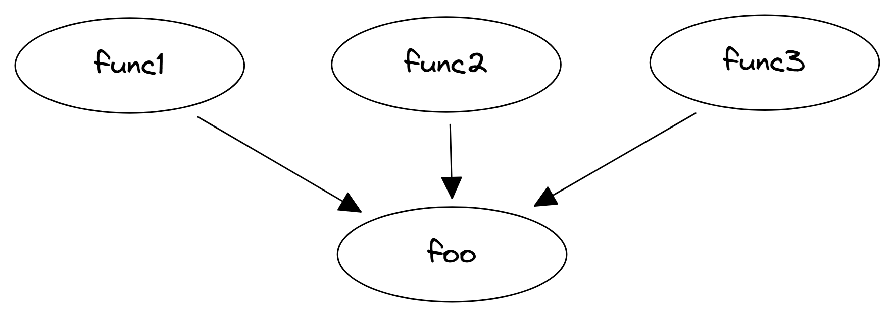

## Sampling {#sec:profiling}

Sampling is the most frequently used approach for doing performance analysis. People usually associate it with finding hotspots in a program. To put it more broadly, sampling helps to find places in the code that contribute to the highest number of certain performance events. If we want to find hotspots, the problem can be reformulated as: "find a place in the code that consumes the biggest number of CPU cycles". People often use the term *profiling* for what is technically called *sampling*. According to [Wikipedia](https://en.wikipedia.org/wiki/Profiling_(computer_programming)),[^1] profiling is a much broader term and includes a wide variety of techniques to collect data, including sampling, code instrumentation, tracing, and others.

It may come as a surprise, but the simplest sampling profiler one can imagine is a debugger. In fact, you can identify hotspots as follows: a) run the program under the debugger; b) pause the program every 10 seconds; and c) record the place where it stopped. If you repeat b) and c) many times, you can build a histogram from collected samples. The line of code where you stopped the most will be the hottest place in the program. Of course, this is not an efficient way to find hotspots, and we don't recommend doing this. It's just to illustrate the concept. Nevertheless, this is a simplified description of how real profiling tools work. Modern profilers are capable of collecting thousands of samples per second, which gives a pretty accurate estimate of the hottest places in a program.

As in the example with a debugger, the execution of the analyzed program is interrupted every time a new sample is captured. At the time of an interrupt, the profiler collects the snapshot of the program state, which constitutes one sample. Information collected for every sample may include an instruction address that was executed at the time of the interrupt, register state, call stack (see [@sec:secCollectCallStacks]), etc. Collected samples are stored in a dump file, which can be further used to display the most time-consuming parts of the program, a call graph, etc.

### User-Mode and Hardware Event-based Sampling

Sampling can be performed in 2 different modes, using user-mode or hardware event-based sampling (EBS). User-mode sampling is a pure software approach that embeds an agent library into the profiled application. The agent sets up an OS timer for each thread in the application. Upon timer expiration, the application receives the `SIGPROF` signal that is handled by the agent. EBS uses hardware PMCs to trigger interrupts. In particular, the counter overflow feature of the PMU is used, which we will discuss shortly.

User-mode sampling can only be used to identify hotspots, while EBS can be used for additional analysis types that involve PMCs, e.g., sampling on cache-misses, Top-down Microarchitecture Analysis (see [@sec:TMA]), etc.

User-mode sampling incurs higher runtime overhead than EBS. The average overhead of the user-mode sampling is about 5% when sampling with an interval of 10ms, while EBS has less than 1% overhead. Because of less overhead, you can use EBS with a higher sampling rate which will give more accurate data. However, user-mode sampling generates fewer data to analyze, and it takes less time to process it. 

### Finding Hotspots

In this section, we will discuss the mechanics of using PMCs with EBS. Figure @fig:Sampling illustrates the counter overflow feature of the PMU, which is used to trigger a Performance Monitoring Interrupt (PMI), also known as `SIGPROF`. At the start of a benchmark, we configure the event that we want to sample. Sampling on cycles is a default for many profiling tools since we are interested where the program spends most of the time. However, it is not necessarily a strict rule; we can sample on any performance event we want. For example, if we would like to know the place where the program experiences the biggest number of L3-cache misses, we would sample on the corresponding event, i.e., `MEM_LOAD_RETIRED.L3_MISS`.

{#fig:Sampling width=80%}

After we have initialized the register, we start counting and let the benchmark run. Since we have configured a PMC to count cycles, it will be incremented every cycle. Eventually, it will overflow. At the time the register overflows, the hardware will raise a PMI. The profiling tool is configured to capture PMIs and has an Interrupt Service Routine (ISR) for handling them. We do multiple steps inside the ISR: first of all, we disable counting; after that, we record the instruction that was executed by the CPU at the time the counter overflowed; then, we reset the counter to `N` and resume the benchmark.

Now, let us go back to the value `N`. Using this value, we can control how frequently we want to get a new interrupt. Say we want a finer granularity and have one sample every 1 million cycles. To achieve this, we can set the counter to `(unsigned) -1,000,000` so that it will overflow after every 1 million cycles. This value is also referred to as the *sample after* value.

We repeat the process many times to build a sufficient collection of samples. If we later aggregate those samples, we could build a histogram of the hottest places in our program, like the one shown in the output from Linux `perf record/report` below. This gives us the breakdown of the overhead for functions of a program sorted in descending order (hotspots). An example of sampling the [x264](https://openbenchmarking.org/test/pts/x264)[^7] benchmark from the [Phoronix test suite](https://www.phoronix-test-suite.com/)[^8] is shown below:

```bash
$ time -p perf record -F 1000 -- ./x264 -o /dev/null --slow --threads 1 ../Bosphorus_1920x1080_120fps_420_8bit_YUV.y4m
[ perf record: Captured and wrote 1.625 MB perf.data (35035 samples) ]
real 36.20 sec
$ perf report -n --stdio
# Samples: 35K of event 'cpu_core/cycles/'
# Event count (approx.): 156756064947
# Overhead  Samples  Shared Object  Symbol                                                     
# ........  .......  .............  ........................................
  7.50%     2620     x264           [.] x264_8_me_search_ref
  7.38%     2577     x264           [.] refine_subpel.lto_priv.0
  6.51%     2281     x264           [.] x264_8_pixel_satd_8x8_internal_avx2
  6.29%     2212     x264           [.] get_ref_avx2.lto_priv.0
  5.07%     1787     x264           [.] x264_8_pixel_avg2_w16_sse2
  3.26%     1145     x264           [.] x264_8_mc_chroma_avx2
  2.88%     1013     x264           [.] x264_8_pixel_satd_16x8_internal_avx2
  2.87%     1006     x264           [.] x264_8_pixel_avg2_w8_mmx2
  2.58%      904     x264           [.] x264_8_pixel_satd_8x8_avx2
  2.51%      882     x264           [.] x264_8_pixel_sad_16x16_sse2
  ...
```

Linux `perf` collected `35,035` samples, which means that there were the same number of process interrupts. We also used `-F 1000` which sets the sampling rate at 1000 samples per second. This roughly matches the overall runtime of 36.2 seconds. Notice, that Linux `perf` provided the approximate number of total cycles elapsed. If we divide it by the number of samples, we'll have `156756064947 cycles / 35035 samples = 4.5 million cycles` per sample. That means that Linux `perf` set the number `N` to roughly `4500000` to collect 1000 samples per second. The number `N` can be adjusted by Linux `perf` dynamically according to the actual CPU frequency.

And of course, most valuable for us is the list of hotspots sorted by the number of samples attributed to each function. After we know what are the hottest functions, we may want to look one level deeper: what are the hot parts of code inside every function? To see the profiling data for functions that were inlined as well as assembly code generated for a particular source code region, we need to build the application with debug information (`-g` compiler flag). 

Linux `perf` doesn't have rich graphic support, so viewing hot parts of source code is not very convenient, but doable. Linux `perf` intermixes source code with the generated assembly, as shown below:

```bash
# snippet of annotating source code of 'x264_8_me_search_ref' function
$ perf annotate x264_8_me_search_ref --stdio
Percent | Source code & Disassembly of x264 for cycles:ppp 
----------------------------------------------------------
  ...
        :                 bmx += square1[bcost&15][0];   <== source code
  1.43  : 4eb10d:  movsx  ecx,BYTE PTR [r8+rdx*2]        <== corresponding machine code
        :                 bmy += square1[bcost&15][1];
  0.36  : 4eb112:  movsx  r12d,BYTE PTR [r8+rdx*2+0x1]
        :                 bmx += square1[bcost&15][0];
  0.63  : 4eb118:  add    DWORD PTR [rsp+0x38],ecx
        :                 bmy += square1[bcost&15][1];
  ...
```

Most profilers with a Graphical User Interface (GUI), like Intel VTune Profiler, can show source code and associated assembly side-by-side. Also, there are tools that can visualize the output of Linux `perf` raw data with a rich graphical interface similar to Intel VTune and other tools. You'll see all that in more detail in [@sec:secOverviewPerfTools].

Sampling gives a good statistical representation of a program's execution, however, one of the downsides of this technique is that it has blind spots and is not suitable for detecting abnormal behaviors. Each sample represents an aggregated view of a portion of a program's execution. Aggregation doesn't give us enough details of what exactly happened during that time interval. We cannot zoom in to learn more about execution nuances. When we squash time intervals into samples, we lose valuable information and it becomes useless for analyzing events with a very short duration. For instance, profiling a program that reacts to network packets (such as stock trading software) may not be very informative as it will attribute most samples to the busy wait loop. Increasing the sampling interval, e.g., more than 1000 samples per second may give you a better picture, but may still not be enough. As a solution, you should use tracing as it doesn't skip events of interest.

### Collecting Call Stacks {#sec:secCollectCallStacks}

Often when sampling, we might encounter a situation when the hottest function in a program gets called from multiple functions. An example of such a scenario is shown in Figure @fig:CallStacks. The output from the profiling tool might reveal that `foo` is one of the hottest functions in the program, but if it has multiple callers, we would like to know which one of them calls `foo` the most number of times. It is a typical situation for applications that have library functions like `memcpy` or `sqrt` appear in the hotspots. To understand why a particular function appeared as a hotspot, we need to know which path in the Control Flow Graph (CFG) of the program is responsible for it.

{#fig:CallStacks width=70%}

Analyzing the source code of all the callers of `foo` might be very time-consuming. We want to focus only on those callers that caused `foo` to appear as a hotspot. In other words, we want to figure out the hottest path in the CFG of a program. Profiling tools achieve this by capturing the call stack of the process along with other information at the time of collecting performance samples. Then, all collected stacks are grouped, allowing us to see the hottest path that led to a particular function.

Collecting call stacks in Linux `perf` is possible with three methods:

1. Frame pointers (`perf record --call-graph fp`). It requires that the binary be built with `--fno-omit-frame-pointer`. Historically, the frame pointer (`RBP` register) was used for debugging since it enables us to get the call stack without popping all the arguments from the stack (also known as *stack unwinding*). The frame pointer can tell the return address immediately. It enables very cheap stack unwinding, which reduces profiling overhead, however, it consumes one additional register just for this purpose. At the time when the number of architectural registers was small, using frame pointers was expensive in terms of runtime performance. Nowadays, the Linux community is moving back to using frame pointers, because it provides better quality call stacks and low profiling overhead.
2. DWARF debug info (`perf record --call-graph dwarf`). It requires that the binary be built with DWARF debug information `-g` (`-gline-tables-only`). It also obtains call stacks through the stack unwinding procedure, but this method is more expensive than using frame pointers.
3. Intel Last Branch Record (LBR). This method makes use of a hardware feature, and is accessed with the following command: `perf record --call-graph lbr`. It obtains call stacks by parsing the LBR stack (a set of hardware registers). The resulting call graph is not as deep as those produced by the first two methods. See more information about the LBR call-stack mode in [@sec:lbr].

Below is an example of collecting call stacks in a program using LBR. By looking at the output, we know that 55% of the time `foo` was called from `func1`, 33% of the time from `func2`, and 11% from `fun3`. We can clearly see the distribution of the overhead between callers of `foo` and can now focus our attention on the hottest edge in the CFG of the program, which is `func1` &rarr; `foo`, but we should probably also pay attention to the edge `func2` &rarr; `foo`.

```bash
$ perf record --call-graph lbr -- ./a.out
$ perf report -n --stdio --no-children
# Samples: 65K of event 'cycles:ppp'
# Event count (approx.): 61363317007
# Overhead       Samples  Command  Shared Object     Symbol
# ........  ............  .......  ................  ......................
    99.96%         65217  a.out    a.out             [.] foo
            |
             --99.96%--foo
                       |
                       |--55.52%--func1
                       |          main
                       |          __libc_start_main
                       |          _start
                       |
                       |--33.32%--func2
                       |          main
                       |          __libc_start_main
                       |          _start
                       |
                        --11.12%--func3
                                  main
                                  __libc_start_main
                                  _start
```

When using Intel VTune Profiler, you can collect call stacks data by checking the corresponding "Collect stacks" box while configuring analysis. When using the command-line interface, specify the `-knob enable-stack-collection=true` option.

[^1]: Profiling(wikipedia) - [https://en.wikipedia.org/wiki/Profiling_(computer_programming)](https://en.wikipedia.org/wiki/Profiling_(computer_programming)).
[^7]: x264 benchmark - [https://openbenchmarking.org/test/pts/x264](https://openbenchmarking.org/test/pts/x264).
[^8]: Phoronix test suite - [https://www.phoronix-test-suite.com/](https://www.phoronix-test-suite.com/).
