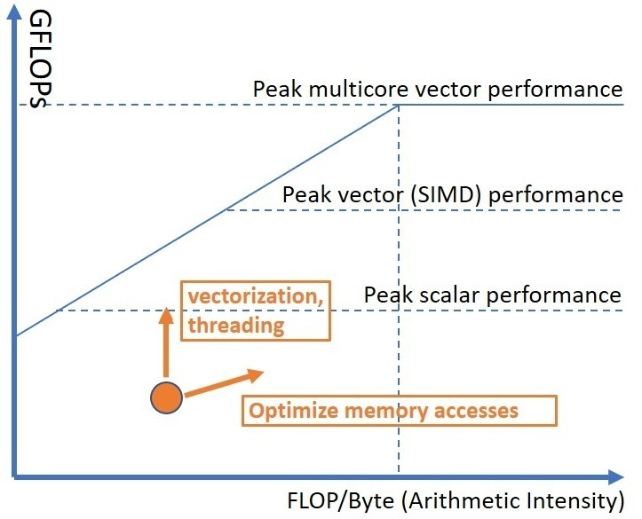

## Roofline Performance Model {#sec:roofline}

Roofline Performance Model is a throughput-oriented performance model that is heavily used in the HPC world. It was developed at the University of California, Berkeley, in 2009. The "roofline" in this model expresses the fact that the performance of an application cannot exceed the machine's capabilities. Every function and every loop in a program is limited by either compute or memory capacity of a machine. This concept is represented in figure @fig:RooflineIntro. The performance of an application will always be limited by a certain "roofline" function.

.*](../../img/perf-analysis/Roofline-intro.png){#fig:RooflineIntro width=80%}

Hardware has two main limitations: how fast it can make calculations (peak compute performance, FLOPS) and how fast it can move the data (peak memory bandwidth, GB/s). The maximum performance of an application is limited by the minimum between peak FLOPS (horizontal line) and the platform bandwidth multiplied by arithmetic intensity (diagonal line). A roofline chart that is shown in figure @fig:RooflineIntro plots the performance of two applications `A` and `B` against hardware limitations. Application `A` has lower arithmetic intensity and its performance is bound by the memory bandwidth, while application `B` is more compute intensive and doesn't suffer as much from memory bottlenecks.Similar to this, `A` and `B` could represent two different functions within a program and have different performance characteristics. Roofline model accounts for that and allows to display multiple functions and loops of an application on the same chart.

Arithmetic Intensity (AI) is a ratio between FLOPS and bytes and can be extracted for every loop in a program. Let's calculate the arithmetic intensity of code in [@lst:BasicMatMul]. In the innermost loop body, we have an addition and a multiplication; thus, we have 2 FLOPS. Also, we have three read operations and one write operation; thus, we transfer `4 ops * 4 bytes = 16` bytes. Arithmetic intensity of that code is `2 / 16 = 0.125`. AI serves as the value on the X-axis of a given performance point.

Listing: Naive parallel matrix multiplication.

~~~~ {#lst:BasicMatMul .cpp .numberLines}
void matmul(int N, float a[][2048], float b[][2048], float c[][2048]) {
    #pragma omp parallel for
    for(int i = 0; i < N; i++) {
        for(int j = 0; j < N; j++) {
            for(int k = 0; k < N; k++) {
                c[i][j] = c[i][j] + a[i][k] * b[k][j];
            }
        }
    }
}
~~~~~~~~~~~~~~~~~~~~~~~~~~~~~~~~~~~~~~~~~~~~~~~~~

Traditional ways to speed up an application's performance is to fully utilize the SIMD and multicore capabilities of a machine. Often times, we need to optimize for many aspects: vectorization, memory, threading. Roofline methodology can assist in assessing these characteristics of your application. On a roofline chart, we can plot theoretical maximums for scalar single-core, SIMD single-core, and SIMD multicore performance (see figure @fig:RooflineIntro2). This will give us an understanding of the room for improving the performance of an application. If we found that our application is compute-bound (i.e. has high arithmetic intensity) and is below the peak scalar single-core performance, we should consider forcing vectorization (see [@sec:Vectorization]) and distributing the work among multiple threads. Conversely, if an application has low arithmetic intensity, we should seek ways to improve memory accesses (see [@sec:MemBound]). The ultimate goal of optimizing performance using the Roofline model is to move the points up. Vectorization and threading move the dot up while optimizing memory accesses by increasing arithmetic intensity will move the dot to the right and also likely improve performance.

{#fig:RooflineIntro2 width=70%}

Theoretical maximums (roof lines) are often presented in a device specification and can be easily looked up. Also, theoretical maximums can be calculated based on the characteristics of the machine you are using. Usually, it is not hard to do once you know the parameters of your machine. For Intel Core i5-8259U processor, the maximum number of FLOPs (single-precision floats) with AVX2 and 2 Fused Multiply Add (FMA) units can be calculated as:
$$
\begin{aligned}
\textrm{Peak FLOPS} =& \textrm{ 8 (number of logical cores)}~\times~\frac{\textrm{256 (AVX bit width)}}{\textrm{32 bit (size of float)}} ~ \times ~ \\
& \textrm{ 2 (FMA)} \times ~ \textrm{3.8 GHz (Max Turbo Frequency)} \\
& = \textrm{486.4 GFLOPs}
\end{aligned}
$$

The maximum memory bandwidth of Intel NUC Kit NUC8i5BEH, which I used for experiments, can be calculated as shown below. Remember, that DDR technology allows transfers of 64 bits or 8 bytes per memory access.

$$
\begin{aligned}
\textrm{Peak Memory Bandwidth} = &~\textrm{2400 (DDR4 memory transfer rate)}~\times~ \textrm{2 (memory channels)} ~ \times \\ &~ \textrm{8 (bytes per memory access)} ~ \times \textrm{1 (socket)}= \textrm{38.4 GiB/s}
\end{aligned}
$$

Automated tools like [Empirical Roofline Tool](https://bitbucket.org/berkeleylab/cs-roofline-toolkit/src/master/)[^2]and [Intel Advisor](https://software.intel.com/content/www/us/en/develop/tools/advisor.html)[^3] are capable of empirically determining theoretical maximums by running a set of prepared benchmarks. If a calculation can reuse the data in cache, much higher FLOP rates are possible. Roofline can account for that by introducing a dedicated roofline for each level of the memory hierarchy (see figure @fig:RooflineMatrix).

After hardware limitations are determined, we can start assessing the performance of an application against the roofline. The two most frequently used methods for automated collection of Roofline data are sampling (used by [likwid](https://github.com/RRZE-HPC/likwid)[^4]tool) and binary instrumentation (used by Intel Software Development Emulator ([SDE](https://software.intel.com/content/www/us/en/develop/articles/intel-software-development-emulator.html)[^5])). Sampling incurs the lower overhead of collecting data, while binary instrumentation gives more accurate results[^6]. Intel Advisor automatically builds a Roofline chart and provides hints for performance optimization of a given loop. An example of a Roofline chart generated by Intel Advisor is presented in figure @fig:RooflineMatrix. Notice, Roofline charts have logarithmic scales.

Roofline methodology allows for tracking optimization progress by printing "before" and "after" points on the same chart. So, it is an iterative process that guides developers to help their applications to fully utilize HW capabilities. Figure @fig:RooflineMatrix reflects performance gains as a result of making two code transformations in code from [@lst:BasicMatMul]:

* Interchange two innermost loops (swap lines 4 and 5). This allows cache-friendly memory accesses (see [@sec:MemBound]).
* Enable autovectorization of the innermost loop using AVX2 instructions.

{#fig:RooflineMatrix width=90%}

In summary, the Roofline Performance Model can help to:

* Identify performance bottlenecks.
* Guide software optimizations.
* Determine when we’re done optimizing.
* Assess performance relative to machine capabilities.

**Additional resources and links:** 

* NERSC Documentation, URL: [https://docs.nersc.gov/development/performance-debugging-tools/roofline/](https://docs.nersc.gov/development/performance-debugging-tools/roofline/).
* Lawrence Berkeley National Laboratory research, URL: [https://crd.lbl.gov/departments/computer-science/par/research/roofline/](https://crd.lbl.gov/departments/computer-science/par/research/roofline/)
* Collection of video presentations about Roofline model and Intel Advisor, URL: [https://techdecoded.intel.io/](https://techdecoded.intel.io/) (search "Roofline").
* `Perfplot` is a collection of scripts and tools that allow a user to instrument performance counters on a recent Intel platform, measure them, and use the results to generate roofline and performance plots. URL: [https://github.com/GeorgOfenbeck/perfplot](https://github.com/GeorgOfenbeck/perfplot)

[^2]: Empirical Roofline Tool - [https://bitbucket.org/berkeleylab/cs-roofline-toolkit/src/master/](https://bitbucket.org/berkeleylab/cs-roofline-toolkit/src/master/).
[^3]: Intel Advisor - [https://software.intel.com/content/www/us/en/develop/tools/advisor.html](https://software.intel.com/content/www/us/en/develop/tools/advisor.html).
[^4]: Likwid - [https://github.com/RRZE-HPC/likwid](https://github.com/RRZE-HPC/likwid).
[^5]: Intel SDE - [https://software.intel.com/content/www/us/en/develop/articles/intel-software-development-emulator.html](https://software.intel.com/content/www/us/en/develop/articles/intel-software-development-emulator.html).
[^6]: See a more detailed comparison between methods of collecting roofline data in this presentation: [https://crd.lbl.gov/assets/Uploads/ECP20-Roofline-4-cpu.pdf](https://crd.lbl.gov/assets/Uploads/ECP20-Roofline-4-cpu.pdf).
