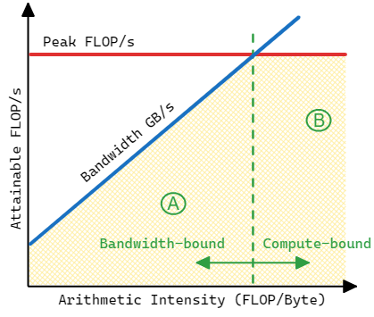

## The Roofline Performance Model {#sec:roofline}

The Roofline performance model is a throughput-oriented performance model that is heavily used in the HPC world. It was developed at the University of California, Berkeley, in 2009 [@RooflinePaper]. The term "roofline" in this model expresses the fact that the performance of an application cannot exceed the capabilities of a machine. Every function and every loop in a program is limited by either the computing or memory bandwidth capacity of a machine. This concept is represented in Figure @fig:RooflineIntro. The performance of an application will always be limited by a certain "roofline" function.

{#fig:RooflineIntro width=80%}

Hardware has two main limitations: how fast it can make calculations (peak compute performance, FLOPS) and how fast it can move the data (peak memory bandwidth, GB/s). The maximum performance of an application is limited by the minimum between peak FLOPS (horizontal line) and the platform bandwidth multiplied by arithmetic intensity (diagonal line). The roofline chart in Figure @fig:RooflineIntro plots the performance of two applications `A` and `B` against hardware limitations. Application `A` has lower arithmetic intensity and its performance is bound by the memory bandwidth, while application `B` is more compute intensive and doesn't suffer as much from memory bottlenecks. Similar to this, `A` and `B` could represent two different functions within a program and have different performance characteristics. The Roofline performance model accounts for that and can display multiple functions and loops of an application on the same chart. However, keep in mind that the Roofline performance model is mainly applicable for HPC applications that have few compute-intensive loops. I do not recommend using it for general-purpose applications, such as compilers, web browsers, or databases.

*Arithmetic Intensity* is a ratio between Floating-point operations (FLOPs)[^7] and bytes, and it can be calculated for every loop in a program. Let's calculate the arithmetic intensity of code in [@lst:BasicMatMul]. In the innermost loop body, we have a floating-point addition and a multiplication; thus, we have 2 FLOPs. Also, we have three read operations and one write operation; thus, we transfer `4 operations * 4 bytes = 16` bytes. The arithmetic intensity of that code is `2 / 16 = 0.125`. Arithmetic intensity is the X-axis on the Roofline chart, while the Y-axis measures the performance of a given program.

Listing: Naive parallel matrix multiplication.

~~~~ {#lst:BasicMatMul .cpp .numberLines}
void matmul(int N, float a[][2048], float b[][2048], float c[][2048]) {
    #pragma omp parallel for
    for(int i = 0; i < N; i++) {
        for(int j = 0; j < N; j++) {
            for(int k = 0; k < N; k++) {
                c[i][j] = c[i][j] + a[i][k] * b[k][j];
            }
        }
    }
}
~~~~~~~~~~~~~~~~~~~~~~~~~~~~~~~~~~~~~~~~~~~~~~~~~

Traditional ways to speed up an application's performance is to fully utilize the SIMD and multicore capabilities of a machine. Usually, we need to optimize for many aspects: vectorization, memory, and threading. Roofline methodology can assist in assessing these characteristics of your application. On a roofline chart, we can plot theoretical maximums for scalar single-core, SIMD single-core, and SIMD multicore performance (see Figure @fig:RooflineIntro2). This will give us an understanding of the scope for improving the performance of an application. If we find that our application is compute-bound (i.e., has high arithmetic intensity) and is below the peak scalar single-core performance, we should consider forcing vectorization (see [@sec:Vectorization]) and distributing the work among multiple threads. Conversely, if an application has low arithmetic intensity, we should seek ways to improve memory accesses (see [@sec:MemBound]). The ultimate goal of optimizing performance using the Roofline model is to move the points up on the chart. Vectorization and threading move the dot up while optimizing memory accesses by increasing arithmetic intensity will move the dot to the right, and also likely improve performance.

{#fig:RooflineIntro2 width=70%}

Theoretical maximums (rooflines) are often presented in a device specification and can be easily looked up. Also, theoretical maximums can be calculated based on the characteristics of the machine you are using. Usually, it is not hard to do once you know the parameters of your machine. For the Intel Core i5-8259U processor, the maximum number of FLOPS (single-precision floats) with AVX2 and 2 Fused Multiply Add (FMA) units can be calculated as:
$$
\begin{aligned}
\textrm{Peak FLOPS} =& \textrm{ 8 (number of logical cores)}~\times~\frac{\textrm{256 (AVX bit width)}}{\textrm{32 bit (size of float)}} ~ \times ~ \\
& \textrm{ 2 (FMA)} \times ~ \textrm{3.8 GHz (Max Turbo Frequency)} \\
& = \textrm{486.4 GFLOPS}
\end{aligned}
$$

The maximum memory bandwidth of Intel NUC Kit NUC8i5BEH, which I used for experiments, can be calculated as shown below. Remember, that DDR technology allows transfers of 64 bits or 8 bytes per memory access.

$$
\begin{aligned}
\textrm{Peak Memory Bandwidth} = &~\textrm{2400 (memory transfer rate)}~\times~ \textrm{2 (memory channels)} ~ \times \\ &~ \textrm{8 (bytes per memory access)} ~ \times \textrm{1 (socket)}= \textrm{38.4 GiB/s}
\end{aligned}
$$

Automated tools like [Empirical Roofline Tool](https://bitbucket.org/berkeleylab/cs-roofline-toolkit/src/master/)[^2] and [Intel Advisor](https://software.intel.com/content/www/us/en/develop/tools/advisor.html)[^3] are capable of empirically determining theoretical maximums by running a set of prepared benchmarks. If a calculation can reuse the data in the cache, much higher FLOP rates are possible. Roofline can account for that by introducing a dedicated roofline for each level of the memory hierarchy (see Figure @fig:RooflineMatrix).

After hardware limitations are determined, we can start assessing the performance of an application against the roofline. Intel Advisor automatically builds a Roofline chart and provides hints for performance optimization of a given loop. An example of a Roofline chart generated by Intel Advisor is presented in Figure @fig:RooflineMatrix. Notice, that Roofline charts have logarithmic scales.

{#fig:RooflineMatrix width=90%}

Roofline methodology enables tracking optimization progress by plotting "before" and "after" points on the same chart. So, it is an iterative process that guides developers to help their applications fully utilize hardware capabilities. Figure @fig:RooflineMatrix shows performance gains from making the following two changes to the code shown earlier in [@lst:BasicMatMul]:

* Interchange the two innermost loops (swap lines 4 and 5). This enables cache-friendly memory accesses (see [@sec:MemBound]).
* Enable autovectorization of the innermost loop using AVX2 instructions.

In summary, the Roofline performance model can help to:

* Identify performance bottlenecks.
* Guide software optimizations.
* Determine when we’re done optimizing.
* Assess performance relative to machine capabilities.

[^2]: Empirical Roofline Tool - [https://bitbucket.org/berkeleylab/cs-roofline-toolkit/src/master/](https://bitbucket.org/berkeleylab/cs-roofline-toolkit/src/master/).
[^3]: Intel Advisor - [https://software.intel.com/content/www/us/en/develop/tools/advisor.html](https://software.intel.com/content/www/us/en/develop/tools/advisor.html).
[^7]: The Roofline performance model is not only applicable to floating-point calculations but can be also used for integer operations. However, the majority of HPC applications involve floating-point calculations, thus the Roofline model is mostly used with FLOPs.
