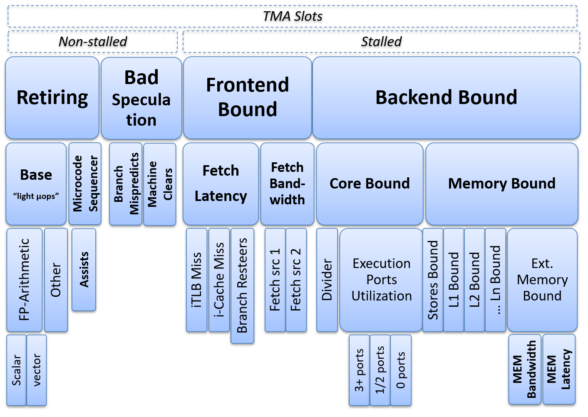

### TMA On X86 Platforms

[TODO]: move the common part between x86 and ARM up.

Figure @fig:TMA_concept gives a breakdown for every instruction in a program. However, analyzing every single instruction in the workload is definitely overkill, and of course, TMA doesn’t do that. Instead, we are usually interested in knowing what is stalling the program as a whole. To accomplish this goal, TMA observes the execution of the program by collecting specific metrics (ratios of PMCs). Based on those metrics, it characterizes application by relating it to one of the four high-level buckets. There are nested categories for each high-level bucket (see Figure @fig:TMA) that give a better breakdown of the CPU performance bottlenecks in the program. We run the workload several times[^14], each time focusing on specific metrics and drilling down until we get to the more detailed classification of performance bottleneck. For example, initially, we collect metrics for four main buckets: `Front End Bound`, `Back End Bound`, `Retiring`, `Bad Speculation`. Say, we found out that the big portion of the program execution was stalled by memory accesses (which is a `Back End Bound` bucket, see Figure @fig:TMA). The next step is to run the workload again and collect metrics specific for the `Memory Bound` bucket only (drilling down). The process is repeated until we know the exact root cause, for example, `L3 Bound`.

In a real-world application, performance could be limited by multiple factors. E.g., it can experience a large number of branch mispredicts (`Bad Speculation`) and cache misses (`Back End Bound`) at the same time. In this case, TMA will drill down into multiple buckets simultaneously and will identify the impact that each type of bottleneck makes on the performance of a program. Analysis tools such as Intel VTune Profiler, AMD uprof, and Linux `perf` can calculate all the metrics with a single run of the benchmark.[^15]

{#fig:TMA width=90%}

The top two-levels of TMA metrics are expressed in the percentage of all pipeline slots (see [@sec:PipelineSlot]) that were available during the execution of the program. It allows TMA to give an accurate representation of CPU microarchitecture utilization, taking into account the full bandwidth of the processor.

After we identified the performance bottleneck in the program, we would be interested to know where exactly in the code it is happening. The second stage of TMA is locating the source of the problem down to the exact line of code and assembly instruction. Analysis methodology provides exact PMC that one should use for each category of the performance problem. Then the developer can use this PMC to find the area in the source code that contributes to the most critical performance bottleneck identified by the first stage. This correspondence can be found in [TMA metrics](https://github.com/intel/perfmon/blob/main/TMA_Metrics.xlsx)[^2] table in "Locate-with" column. For example, to locate the bottleneck associated with a high `DRAM_Bound` metric in an application running on the Intel Skylake processor, one should sample on `MEM_LOAD_RETIRED.L3_MISS_PS` performance event.

### Case Study: Reduce The Number Of Cache Misses Using Linux Tools {#sec:secTMA_perf}

[TODO]: update

As of Linux kernel 4.8, `perf` has an option `--topdown` used in `perf stat` command[^5] that prints TMA level 1 metrics, i.e., only four high-level buckets:

```bash
$ perf stat --topdown -a -- taskset -c 0 ./7zip-benchmark b
       retiring  bad speculat  FE bound  BE bound
S0-C0    30.8%      41.8%        8.8%      18.6%  <==
S0-C1    17.4%       2.3%       12.0%      68.2%
S0-C2    10.1%       5.8%       32.5%      51.6%
S0-C3    47.3%       0.3%        2.9%      49.6%
...
```

To get values for high-level TMA metrics, Linux `perf` requires profiling the whole system (`-a`). This is why we see metrics for all cores. But since we pinned the benchmark to core0 with `taskset -c 0`, we can only focus on the first row that corresponds to `S0-C0`.

To get access to Top-Down metrics level 2, 3, etc. one can use [toplev](https://github.com/andikleen/pmu-tools/wiki/toplev-manual)[^6] tool that is a part of [pmu-tools](https://github.com/andikleen/pmu-tools)[^7] written by Andi Kleen. It is implemented in `Python` and invokes Linux `perf` under the hood. You will see examples of using it in the next section. Specific Linux kernel settings must be enabled to use `toplev`, check the documentation for more details. To better present the workflow, the next section provides a step-by-step example of using TMA to improve the performance of a memory-bound application.

\personal{Intel® VTune™ Profiler is an extremely powerful tool, no doubt about it. However, for quick experiments, I often use Linux perf that is available on every Linux distribution I’m working on. Thus, the motivation for the example in the next section being explored with Linux perf.}

#### Step1: Identify the bottleneck {.unlisted .unnumbered}

[TODO]: Pick a better example?

Suppose we have a tiny benchmark (`a.out`) that runs for 8.5 sec. The complete source code of the benchmark can be found on [github](https://github.com/dendibakh/dendibakh.github.io/tree/master/_posts/code/TMAM)[^8].

```bash
$ time -p ./a.out
real 8.53
```

As a first step, we run our application and collect specific metrics that will help us to characterize it, i.e., we try to detect to which category our application belongs. Below are level-1 metrics for our benchmark:[^9]

```bash
$ ~/pmu-tools/toplev.py --core S0-C0 -l1 -v --no-desc taskset -c 0 ./a.out
...
# Level 1
S0-C0  Frontend_Bound:   13.81 % Slots 
S0-C0  Bad_Speculation:   0.22 % Slots 
S0-C0  Backend_Bound:    53.43 % Slots <==
S0-C0  Retiring:         32.53 % Slots 
```
Notice, the process is pinned to CPU0 (using `taskset -c 0`), and the output of `toplev` is limited to this core only (`--core S0-C0`). By looking at the output, we can tell that performance of the application is bound by the CPU backend. Without trying to analyze it right now, let us drill one level down: [^16]
```bash
$ ~/pmu-tools/toplev.py --core S0-C0 -l2 -v --no-desc taskset -c 0 ./a.out
...
# Level 1
S0-C0  Frontend_Bound:                13.92 % Slots 
S0-C0  Bad_Speculation:                0.23 % Slots 
S0-C0  Backend_Bound:                 53.39 % Slots      
S0-C0  Retiring:                      32.49 % Slots   
# Level 2
S0-C0  Frontend_Bound.FE_Latency:     12.11 % Slots 
S0-C0  Frontend_Bound.FE_Bandwidth:    1.84 % Slots 
S0-C0  Bad_Speculation.Branch_Mispred: 0.22 % Slots 
S0-C0  Bad_Speculation.Machine_Clears: 0.01 % Slots 
S0-C0  Backend_Bound.Memory_Bound:    44.59 % Slots <==
S0-C0  Backend_Bound.Core_Bound:       8.80 % Slots 
S0-C0  Retiring.Base:                 24.83 % Slots 
S0-C0  Retiring.Microcode_Sequencer:   7.65 % Slots    
```
We see that the application’s performance is bound by memory accesses. Almost half of the CPU execution resources were wasted waiting for memory requests to complete. Now let us dig one level deeper: [^17]
```bash
$ ~/pmu-tools/toplev.py --core S0-C0 -l3 -v --no-desc taskset -c 0 ./a.out
...
# Level 1
S0-C0    Frontend_Bound:                 13.91 % Slots
S0-C0    Bad_Speculation:                 0.24 % Slots
S0-C0    Backend_Bound:                  53.36 % Slots
S0-C0    Retiring:                       32.41 % Slots
# Level 2
S0-C0    FE_Bound.FE_Latency:            12.10 % Slots
S0-C0    FE_Bound.FE_Bandwidth:           1.85 % Slots
S0-C0    BE_Bound.Memory_Bound:          44.58 % Slots
S0-C0    BE_Bound.Core_Bound:             8.78 % Slots
# Level 3
S0-C0-T0 BE_Bound.Mem_Bound.L1_Bound:     4.39 % Stalls
S0-C0-T0 BE_Bound.Mem_Bound.L2_Bound:     2.42 % Stalls
S0-C0-T0 BE_Bound.Mem_Bound.L3_Bound:     5.75 % Stalls
S0-C0-T0 BE_Bound.Mem_Bound.DRAM_Bound:  47.11 % Stalls <==
S0-C0-T0 BE_Bound.Mem_Bound.Store_Bound:  0.69 % Stalls
S0-C0-T0 BE_Bound.Core_Bound.Divider:     8.56 % Clocks
S0-C0-T0 BE_Bound.Core_Bound.Ports_Util: 11.31 % Clocks
```
We found the bottleneck to be in `DRAM_Bound`. This tells us that many memory accesses miss in all levels of caches and go all the way down to the main memory. We can also confirm this if we collect the absolute number of L3 cache misses (DRAM hit) for the program. For Skylake architecture, the `DRAM_Bound` metric is calculated using the `CYCLE_ACTIVITY.STALLS_L3_MISS` performance event. Let’s collect it:

```bash
$ perf stat -e cycles,cycle_activity.stalls_l3_miss -- ./a.out
  32226253316  cycles
  19764641315  cycle_activity.stalls_l3_miss
```

According to the definition of `CYCLE_ACTIVITY.STALLS_L3_MISS`, it counts cycles when execution stalls, while the L3 cache miss demand load is outstanding. We can see that there are ~60% of such cycles, which is pretty bad.

#### Step2: Locate the place in the code {#sec:secTMA_locate .unlisted .unnumbered}

As the second step in the TMA process, we would locate the place in the code where the bottleneck occurs most frequently. In order to do so, one should sample the workload using a performance event that corresponds to the type of bottleneck that was identified during Step 1.

A recommended way to find such an event is to run `toplev` tool with the `--show-sample` option that will suggest the `perf record` command line that can be used to locate the issue. For the purpose of understanding the mechanics of TMA, we also present the manual way to find an event associated with a particular performance bottleneck. Correspondence between performance bottlenecks and performance events that should be used for locating the place in the code where such bottlenecks take place can be done with the help of TMA metrics table introduced earlier in the chapter. The `Locate-with` column denotes a performance event that should be used to locate the exact place in the code where the issue occurs. For the purpose of our example, in order to find memory accesses that contribute to such a high value of the `DRAM_Bound` metric (miss in the L3 cache), we should sample on `MEM_LOAD_RETIRED.L3_MISS_PS` precise event as shown in the listing below:

```bash
$ perf record -e cpu/event=0xd1,umask=0x20,name=MEM_LOAD_RETIRED.L3_MISS/ppp ./a.out

$ perf report -n --stdio
...
# Samples: 33K of event ‘MEM_LOAD_RETIRED.L3_MISS’
# Event count (approx.): 71363893
# Overhead   Samples  Shared Object      Symbol
# ........  ......... .................  .................
#
    99.95%    33811   a.out     [.] foo                
     0.03%       52   [kernel]  [k] get_page_from_freelist
     0.01%        3   [kernel]  [k] free_pages_prepare
     0.00%        1   [kernel]  [k] free_pcppages_bulk
```
The majority of L3 misses are caused by memory accesses in function `foo` inside executable `a.out`. In order to avoid compiler optimizations, function `foo` is implemented in assembly language, which is presented in [@lst:TMA_asm]. The “driver” portion of the benchmark is implemented in the `main` function, as shown in [@lst:TMA_cpp]. We allocate a big enough array `a` to make it not fit in the L3 cache[^10]. The benchmark basically generates a random index to array `a` and passes it to the `foo` function along with the address of array `a`. Later `foo` function reads this random memory location. [^11]

Listing: Assembly code of function foo.

~~~~ {#lst:TMA_asm .bash}
$ perf annotate --stdio -M intel foo
Percent |  Disassembly of a.out for MEM_LOAD_RETIRED.L3_MISS
------------------------------------------------------------
        :  Disassembly of section .text:
        :
        :  0000000000400a00 <foo>:
        :  foo():
   0.00 :    400a00:  nop  DWORD PTR [rax+rax*1+0x0]
   0.00 :    400a08:  nop  DWORD PTR [rax+rax*1+0x0]
                 ...
 100.00 :    400e07:  mov  rax,QWORD PTR [rdi+rsi*1] <==
                 ...
   0.00 :    400e13:  xor  rax,rax
   0.00 :    400e16:  ret 
~~~~~~~~~~~~~~~~~~~~~~~~~~~~~~~~~~~~~~~~~~~~~~~~~

Listing: Source code of function main.

~~~~ {#lst:TMA_cpp .cpp}
extern "C" { void foo(char* a, int n); }
const int _200MB = 1024*1024*200;
int main() {
  char* a = (char*)malloc(_200MB); // 200 MB buffer
  ...
  for (int i = 0; i < 100000000; i++) {
    int random_int = distribution(generator);
    foo(a, random_int);
  }
  ...
}
~~~~~~~~~~~~~~~~~~~~~~~~~~~~~~~~~~~~~~~~~~~~~~~~~

By looking at [@lst:TMA_asm], we can see that all L3-Cache misses in function `foo` are tagged to a single instruction. Now that we know which instruction caused so many L3 misses, let’s fix it. 

#### Step3: Fix the issue {.unlisted .unnumbered}

Because there is a time window between the moment when we get the next address that will be accessed and actual load instruction, we can add a prefetch hint[^12] as shown on [@lst:TMA_prefetch]. More information about memory prefetching can be found in [@sec:memPrefetch].

Listing: Inserting memory prefetch into main.

~~~~ {#lst:TMA_prefetch .cpp}
  for (int i = 0; i < 100000000; i++) {
    int random_int = distribution(generator);
+   __builtin_prefetch ( a + random_int, 0, 1);
    foo(a, random_int);
  }
~~~~~~~~~~~~~~~~~~~~~~~~~~~~~~~~~~~~~~~~~~~~~~~~~

This hint improved execution time by 2 seconds, which is a 30% speedup. Notice 10x less value for `CYCLE_ACTIVITY.STALLS_L3_MISS` event:

```bash
$ perf stat -e cycles,cycle_activity.stalls_l3_miss -- ./a.out
  24621931288      cycles
   2069238765      cycle_activity.stalls_l3_miss
       6,498080824 seconds time elapsed
```

TMA is an iterative process, so we now need to repeat the process starting from the Step1. Likely it will move the bottleneck into another bucket, in this case, Retiring. This was an easy example demonstrating the workflow of TMA methodology. Analyzing real-world application is unlikely to be that easy. The next entire chapter in this book is organized in a way to be conveniently used with the TMA process. E.g., its sections are broken down to reflect each high-level category of performance bottlenecks. The idea behind such a structure is to provide a checklist that developers can use to drive code changes after a performance issue has been found. For instance, when developers see that the application they are working on is `Memory Bound`, they can look up [@sec:MemBound] for ideas.

#### Additional resources and links {.unlisted .unnumbered}

- Ahmad Yasin’s paper “A top-down method for performance analysis and counters architecture” [@TMA_ISPASS].
- Presentation "Software Optimizations Become Simple with Top-Down Analysis on Intel Skylake" by Ahmad Yasin at IDF'15, URL: [https://youtu.be/kjufVhyuV_A](https://youtu.be/kjufVhyuV_A).
- Andi Kleen's blog - pmu-tools, part II: toplev, URL: [http://halobates.de/blog/p/262](http://halobates.de/blog/p/262).
- Toplev manual, URL: [https://github.com/andikleen/pmu-tools/wiki/toplev-manual](https://github.com/andikleen/pmu-tools/wiki/toplev-manual).
- Understanding How General Exploration Works in Intel® VTune™ Profiler, URL: [https://software.intel.com/en-us/articles/understanding-how-general-exploration-works-in-intel-vtune-amplifier-xe](https://software.intel.com/en-us/articles/understanding-how-general-exploration-works-in-intel-vtune-amplifier-xe).

[TODO]: shave off the low-value footprints

[^2]: TMA metrics - [https://github.com/intel/perfmon/blob/main/TMA_Metrics.xlsx](https://github.com/intel/perfmon/blob/main/TMA_Metrics.xlsx).
[^5]: Linux `perf stat` manual page - [http://man7.org/linux/man-pages/man1/perf-stat.1.html#STAT_REPORT](http://man7.org/linux/man-pages/man1/perf-stat.1.html#STAT_REPORT).
[^6]: Toplev - [https://github.com/andikleen/pmu-tools/wiki/toplev-manual](https://github.com/andikleen/pmu-tools/wiki/toplev-manual)
[^7]: PMU tools - [https://github.com/andikleen/pmu-tools](https://github.com/andikleen/pmu-tools).
[^8]: Benchmark for TMA section - [https://github.com/dendibakh/dendibakh.github.io/tree/master/_posts/code/TMAM](https://github.com/dendibakh/dendibakh.github.io/tree/master/_posts/code/TMAM).
[^9]: Outputs in this section are trimmed to fit on the page. Do not rely on the exact format that is presented.
[^10]: L3 cache on the machine I was using is 38.5 MB - Intel(R) Xeon(R) Platinum 8180 CPU.
[^11]: According to x86 calling conventions ([https://en.wikipedia.org/wiki/X86_calling_conventions](https://en.wikipedia.org/wiki/X86_calling_conventions)), first 2 arguments land in `rdi` and `rsi` registers respectively.
[^12]:  Documentation about `__builtin_prefetch` can be found at [https://gcc.gnu.org/onlinedocs/gcc/Other-Builtins.html](https://gcc.gnu.org/onlinedocs/gcc/Other-Builtins.html).
[^14]: In reality, it is sufficient to run the workload once to collect all the metrics required for TMA. Profiling tools achieve that by multiplexing between different performance events during a single run (see [@sec:secMultiplex]).
[^15]: This only is acceptable if the workload is steady. Otherwise, you would better fall back to the original strategy of multiple runs and drilling down with each run.
[^16]: Alternatively, we could use `-l1 --nodes Core_Bound,Memory_Bound` instead of `-l2` to limit the collection of all the metrics since we know from the first level metrics that the application is bound by CPU Backend.
[^17]: Alternatively, we could use `-l2 --nodes L1_Bound,L2_Bound,L3_Bound,DRAM_Bound,Store_Bound,` `Divider,Ports_Utilization` option instead of `-l3` to limit collection, since we knew from the second level metrics that the application is bound by memory.
