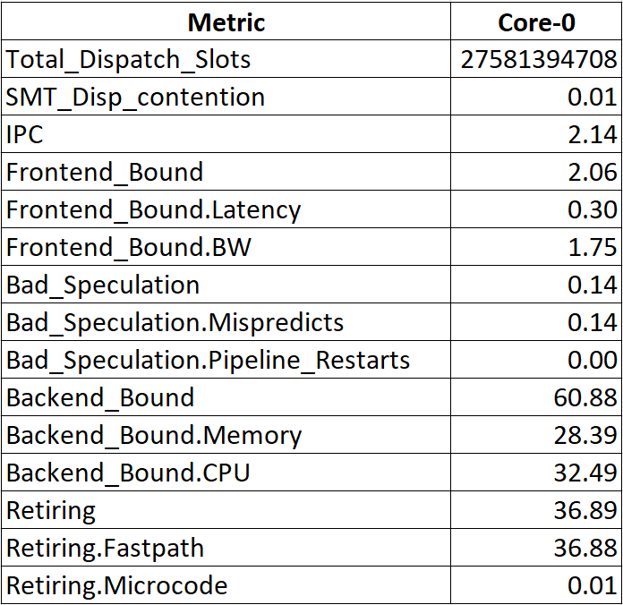

### TMA on AMD Platforms {#sec:secTMA_AMD}

Starting from Zen4 processors, AMD platforms support Level-1 and Level-2 TMA analysis but with some limitations. At the time of writing, it is only supported on server platforms (e.g., Genoa), and not on client (Ryzen). TMA support was added in AMD uProf version 4.1, but only in the command line tool `AMDuProfPcm` tool which is part of AMD uProf installation. Graphical version of the tool doesn't have the TMA analysis yet. Linux perf support is also ongoing.

Here is an example of runnning a classical matrix multiplication kernel on a Genoa system:

```bash
$ AMDuProfPcm -X -m pipeline_util -A core -C -o /tmp/plutil.csv -- taskset -c 0 ./AMDTClassicMatMul-bin
```

, where the `-X` option collects data using perf subsystem without root privileges, `-m pipeline_util` collects top-down metrics. The `-A core` option is used for aggregating all the samples at the core level, similarly using option `-A system` would generate system-wise aggregated report for a multithreaded application. `-C` option is used for generating cumulative report for the entire application runtime.

The report is captured in the CSV output file passed with `-o` option, which may look like the screenshot in @fig:AMD_TMA.

{#fig:AMD_TMA width=45%}

[TODO]: describe the output, suggest next analysis steps.