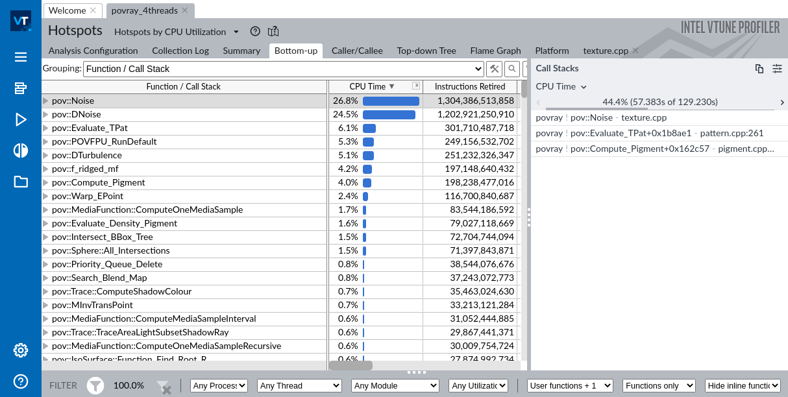
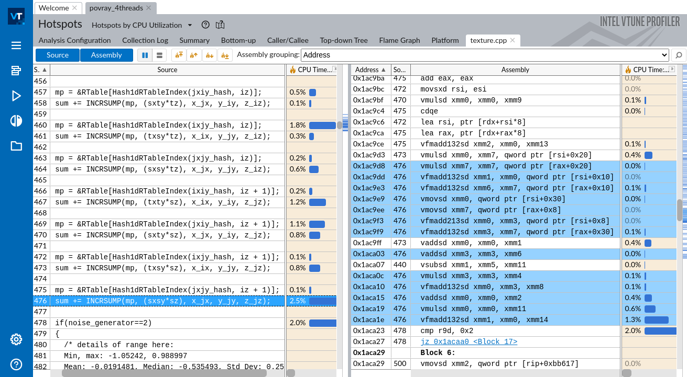

## Intel VTune Profiler {#sec:IntelVtuneOverview}

VTune Profiler (formerly VTune Amplifier) is a performance analysis tool for x86-based machines with a rich GUI. It can be run on Linux or Windows operating systems. We skip discussion about MacOS support for VTune since it doesn't work on Apple's chips (e.g., M1 and M2), and Intel-based Macbooks are quickly becoming obsolete.

VTune can be used on both Intel and AMD systems. However, advanced hardware-based sampling requires an Intel-manufactured CPU. For example, you won't be able to collect hardware performance counters on an AMD system with Intel VTune.

As of early 2023, VTune is available for free as a stand-alone tool or as part of the Intel oneAPI Base Toolkit.[^1]

### How to configure it {.unlisted .unnumbered}

On Linux, VTune can use two data collectors: Linux perf and VTune's own driver called SEP. The first type is used for user-mode sampling, but if you want to perform advanced analysis, you need to build and install the SEP driver, which is not too hard.

```bash
# go to the sepdk folder in vtune's installation
$ cd ~/intel/oneapi/vtune/latest/sepdk/src
# build the drivers
$ ./build-driver
# add vtune group and add your user to that group
# create a new shell, or reboot the system
$ sudo groupadd vtune
$ sudo usermod -a -G vtune `whoami`
# install sep driver
$ sudo ./insmod-sep -r -g vtune
```

After you've done with the steps above, you should be able to use advanced analysis types like Microarchitectural Exploration and Memory Access.

Windows does not require any additional configuration after you install VTune. Collecting hardware performance events requires administrator privileges.

### What you can do with it: {.unlisted .unnumbered}

- Find hotspots: functions, loops, statements.
- Monitor various CPU-specific performance events, e.g., branch mispredictions and L3 cache misses.
- Locate lines of code where these events happen.
- Characterize CPU performance bottlenecks with TMA methodology.
- Filter data for a specific function, process, time period, or logical core.
- Observe the workload behavior over time (including CPU frequency, memory bandwidth utilization, etc).

VTune can provide very rich information about a running process. It is the right tool for you if you're looking to improve the overall performance of an application. VTune always provides aggregated data over a period of time, so it can be used for finding optimization opportunities for the "average case". 

### What you cannot do with it: {.unlisted .unnumbered}

- Analyze very short execution anomalies.
- Observe system-wide complicated software dynamics.

Due to the sampling nature of the tool, it will eventually miss events with a very short duration (e.g., sub-microsecond).

### Examples {.unlisted .unnumbered}

Below is a series of screenshots of VTune's most interesting features. For this example, we took POV-Ray, which is a ray tracer used to create 3D graphics. Figure @fig:VtuneHotspots shows the hotpots analysis of the built-in POV-Ray 3.7 benchmark, compiled with clang14 compiler with `-O3 -ffast-math -march=native -g` options, and run on an Intel Alder Lake system (Core i7-1260P, 4 P-cores + 8 E-cores) with 4 worker threads. 

At the left part of the image, you can see a list of hot functions in the workload along with the corresponding CPU time percentage and the number of retired instructions. On the right panel, you can see one of the most frequent call stacks that lead to calling the function `pov::Noise`. According to that screenshot, `44.4%` of the time function `pov::Noise`, was called from `pov::Evaluate_TPat`, which in turn was called from `pov::Compute_Pigment`.[^20] 

{#fig:VtuneHotspots width=100% }

If you double-click on the `pov::Noise` function, you will see an image that is shown in Figure @fig:VtuneSourceView. For the interest of space, only the most important columns are shown. The left panel shows the source code and CPU time that corresponds to each line of code. On the right, you can see assembly instructions along with the CPU time that was attributed to them. Highlighted machine instructions correspond to line 476 in the left panel. The sum of all CPU time percentages (not just the ones that are visible) in each panel equals to the total CPU time attributed to the `pov::Noise` function, which is `26.8%`.

{#fig:VtuneSourceView width=100% }

When you use VTune to profile applications running on Intel CPUs, it can collect many different performance events. To illustrate this, we ran a different analysis type, Microarchitecture Exploration, which we already showed in the previous chapter. At that time we used it for Top-down Microarchitectural Analysis, while we can also use it to observe raw performance events. To access raw event counts, one can switch the view to Hardware Events as shown in Figure @fig:VtuneTimelineView. To enable switching views, you need to tick the mark in *Options* &rarr; *General* &rarr; *Show all applicable viewpoints*. Near the top of Figure @fig:VtuneTimelineView, you can see that the *Platform* tab is selected. Two other pages are also useful. The *Summary* page gives you the absolute number of raw performance events as collected from CPU counters. The *Event Count* page gives you the same data with a per-function breakdown. Readers can experiment and look at those views on their own.

Figure @fig:VtuneTimelineView is quite busy and requires some explanation. The top panel, indicated with \circled{1}, is a timeline view that shows the behavior of our four worker threads over time with respect to L1 cache misses, plus some tiny activity of the main thread (TID: `3102135`), which spawns all the worker threads. The higher the black bar, the more events (L1 cache misses in this case) happened at any given moment. Notice occasional spikes in L1 misses for all four worker threads. We can use this view to observe different or repeatable phases of the workload. Then to figure out which functions were executed at that time, we can select an interval and click "filter in" to focus just on that portion of the running time. The region indicated with \circled{2} is an example of such filtering. To see the updated list of functions, you can go to the *Event Count* view. Such filtering and zooming features are available on all VTune timeline views.

{#fig:VtuneTimelineView width=100% }

The region indicated with \circled{3} shows performance events that were collected and their distribution over time. This time it is not a per-thread view, but rather it shows aggregated data across all the threads. In addition to observing execution phases, you can also visually extract some interesting information. For example, we can see that the number of executed branches is high (`BR_INST_RETIRED.ALL_BRANCHES`), but the misprediction rate is quite low (`BR_MISP_RETIRED.ALL_BRANCHES`). This can lead you to the conclusion that branch misprediction is not a bottleneck for POV-Ray. If you scroll down, you will see that the number of L3 misses is zero, and L2 cache misses are very rare as well. This tells us that 99% of memory access requests are served by L1, and the rest of them are served by L2. By combining these two observations, we can conclude that the application is likely bound by compute, i.e., the CPU is busy calculating something, not waiting for memory or recovering from a misprediction.

Finally, the bottom panel \circled{4} shows the CPU frequency chart for four hardware threads. Hovering over different time slices tells us that the frequency of those cores fluctuates in the 3.2--3.4GHz region. The Memory Access analysis type also shows memory bandwidth in GB/s over time.

[^1]: Intel oneAPI Base Toolkit - [https://www.intel.com/content/www/us/en/developer/tools/oneapi/base-toolkit.html](https://www.intel.com/content/www/us/en/developer/tools/oneapi/base-toolkit.html)
[^3]: VTune microarchitecture analysis - [https://software.intel.com/en-us/vtune-help-general-exploration-analysis](https://software.intel.com/en-us/vtune-help-general-exploration-analysis). In pre-2019 versions of Intel® VTune Profiler, it was called as “General Exploration” analysis.
[^4]: 7zip benchmark - [https://github.com/llvm-mirror/test-suite/tree/master/MultiSource/Benchmarks/7zip](https://github.com/llvm-mirror/test-suite/tree/master/MultiSource/Benchmarks/7zip).
[^19]: Per-function view of TMA metrics is a feature unique to Intel® VTune profiler.
[^20]: Notice that the call stack doesn't lead all the way to the `main` function. This happens because, with the hardware-based collection, VTune uses LBR to sample call stacks, which provides limited depth. Most likely we're dealing with recursive functions here, and to investigate that further users will have to dig into the code.
