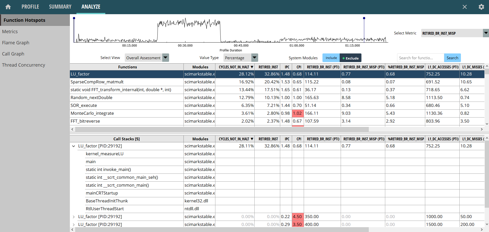

## AMD uProf

The [uProf](https://www.amd.com/en/developer/uprof.html) profiler is a tool developed by AMD for monitoring performance of applications running on AMD processors. While uProf can be used on Intel processors as well, you will be able to use only CPU-independent features. The profiler is available for free to download and can be used on Windows, Linux and FreeBSD. AMD uProf can be used for profiling on multiple virtual machines (VMs), including Microsoft Hyper-V, KVM, VMware ESXi, Citrix Xen, but not all features are available on all VMs. Also, uProf supports analyzing applications written in various languages, including C, C++, Java, .NET/CLR.

### How to configure it {.unlisted .unnumbered}

On Linux, uProf uses Linux perf for data collection. On Windows, uProf uses its own sampling driver that gets installed when you install uProf, no additional configuration is required. AMD uProf supports both command-line interface (CLI) and graphical interface (GUI). The CLI interface requires two separate steps - collect and report, similar to Linux perf.

### What you can do with it: {.unlisted .unnumbered}

- Find hotspots: functions, statements, instructions.
- Monitor various HW performance events and locate lines of code where these events happen.
- Filter data for a specific function or thread.
- Observe the workload behavior over time: view various performance events in timeline chart.
- Analyze hot callpaths: call-graph, flame-graph and bottom-up charts.

In addition, uProf can monitor various OS events on Linux: thread state, thread synchronization, system calls, page faults, and others. You can use it to analyze OpenMP applications to detect thread imbalance, and analyze MPI[^3] applications to detect the load imbalance among the nodes of MPI cluster. More details on various features of uProf can be found in the [User Guide](https://www.amd.com/en/developer/uprof.html#documentation)[^1].

### What you cannot do with it: {.unlisted .unnumbered}

Due to the sampling nature of the tool, it will eventually miss events with a very short duration. The reported samples are statistically estimated numbers, which are most of the time sufficient to analyze the performance but not the exact count of the events.

### Example {.unlisted .unnumbered}

To demonstrate the look-and-feel of the AMD uProf tool, we ran the dense LU matrix factorization component from the [Scimark2](https://math.nist.gov/scimark2/index.html)[^2] benchmark on an AMD Ryzen 9 7950X, running Windows 11, with 64 GB RAM.

Figure @fig:uProfHotspots shows *Function Hotpots* analysis (selected in the menu list on the left side of the image). At the top of the image, you can see an event timeline showing the number of events observed at various times of the application execution. On the right, you can select which metric to plot, we selected `RETIRED_BR_INST_MISP`. Notice a spike in branch mispredictions in the time range from 20s to 40s. You can select this region to analyze closely what's going on there. Once you do that, it will update the bottom panels to show statistics only for that time interval.

{#fig:uProfHotspots width=100% }

Below the timeline graph, you can see a list of hot functions, along with corresponding sampled performance events and calculated metrics. Event counts can be viewed as: sample count, raw event count, and percentage. There are many interesting numbers to look at, but we will not dive deep into the analysis. Instead, readers are encouraged to figure out the performance impact of branch mispredictions and find their source.

Below the functions table, you can see a bottom-up callstack view for the selected function in the functions table. As we can see, the selected `LU_factor` function is called from `kernel_measureLU`, which in turn is called from `main`. In the Scimark2 benchmark, this is the only call stack for `LU_factor`, even though it shows `Call Stacks [5]`. This is an artifact of collection that can be ignored. But in other applications, a hot function can be called from many different places, so you would want to examine other call stacks as well. 

If you double-click on any function, uProf will open the source/assembly view for that function. We don't show this view for brevity. On the left panel, there are other views available, like Metrics, Flame Graph, Call Graph view, and Thread Concurrency. They are useful for analysis as well, however we decided to skip them. Readers can experiment and look at those views on their own.

[^1]: AMD uProf User Guide - [https://www.amd.com/en/developer/uprof.html#documentation](https://www.amd.com/en/developer/uprof.html#documentation)
[^2]: Scimark2 - [https://math.nist.gov/scimark2/index.html](https://math.nist.gov/scimark2/index.html)
[^3]: MPI - Message Passing Interface, a standard for parallel programming on distributed memory systems.