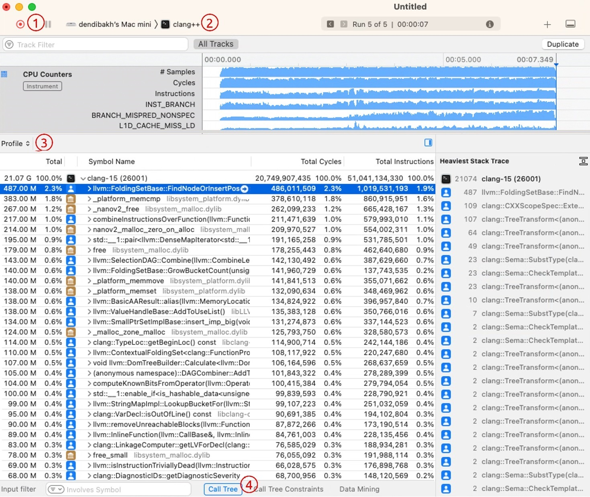
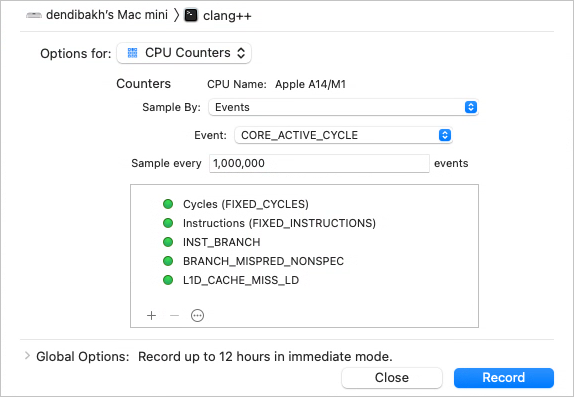

## Apple Xcode Instruments

The most convenient way to do similar performance analysis on MacOS is to use Xcode Instruments. This is an application performance analyzer and visualizer that comes for free with Xcode. The Instruments profiler is built on top of the DTrace tracing framework that was ported to MacOS from Solaris. It has many tools to inspect the performance of an application and enables us to do most of the basic things that other profilers like Intel VTune can do. The easiest way to get the profiler is to install Xcode from the Apple App Store. The tool requires no configuration; once you install it you're ready to go.

In Instruments, you use specialized tools, known as instruments, to trace different aspects of your apps, processes, and devices over time. Instruments has a powerful visualization mechanism. It collects data as it profiles and presents the results to you in real time. You can gather different types of data and view them side by side, which enables you to see patterns in the execution, correlate system events and find very subtle performance issues. 

In this chapter, we will only showcase the "CPU Counters" instrument, which is the most relevant for this book. Instruments can also visualize GPU, network, and disk activity, track memory allocations, and releases, capture user events, such as mouse clicks, provide insights into power efficiency, and more. You can read more about those use cases in the Instruments [documentation](https://help.apple.com/instruments/mac/current).[^1]

### What you can do with it: {.unlisted .unnumbered}

- Access hardware performance counters on Apple processors.
- Find hotspots in a program along with their call stacks.
- Inspect generated ARM assembly code side-by-side with the source code.
- Filter data for a selected interval on the timeline.

### What you cannot do with it: {.unlisted .unnumbered}

Similar to other sampling-based profilers, Xcode Instruments has the same blind spots as VTune and uProf.

### Example: Profiling Clang Compilation {.unlisted .unnumbered}

In this example, we will show how to collect hardware performance counters on an Apple Mac mini with the M1 processor, macOS 13.5.1 Ventura, and 16 GB RAM. We took one of the largest files in the LLVM codebase and profiled its compilation using version 15.0 of the Clang C++ compiler. Here is the command line that we used:

```bash
$ clang++ -O3 -DNDEBUG -arch arm64 <other options ...> -c llvm/lib/Transforms/Vectorize/LoopVectorize.cpp
```

Figure @fig:InstrumentsView shows the main timeline view of Xcode Instruments. This screenshot was taken after the compilation had finished. We will get back to it a bit later, but first, let us show how to start the profiling session.

{#fig:InstrumentsView width=100% }

To begin, open *Instruments* and choose the *CPU Counters* analysis type. The first step you need to do is configure the collection. Click and hold the red target icon (see \circled{1} in Figure @fig:InstrumentsView), then select *Recording Options...* from the menu. It will display the dialog window shown in Figure @fig:InstrumentsDialog. This is where you can add hardware performance monitoring events for collection. Apple has documented its hardware performance monitoring events in its manual [@AppleOptimizationGuide, Section 6.2 Performance Monitoring Events].

{#fig:InstrumentsDialog width=70% }

The second step is to set the profiling target. To do that, click and hold the name of an application (marked \circled{2} in Figure @fig:InstrumentsView) and choose the one you're interested in. Set the arguments and environment variables if needed. Now, you're ready to start the collection; press the red target icon \circled{1}.

Instruments shows a timeline and constantly updates statistics about the running application. Once the program finishes, Instruments will display the results like those shown in Figure @fig:InstrumentsView. The compilation took 7.3 seconds and we can see how the volume of events changed over time. For example, the number of executed branch instructions and mispredictions increased towards the end of the runtime. You can zoom in to that interval on the timeline to examine the functions involved.

The bottom panel shows numerical statistics. To inspect the hotspots similar to Intel VTune's bottom-up view, select *Profile* in the menu \circled{3}, then click the *Call Tree* menu \circled{4} and check the *Invert Call Tree* box. This is exactly what we did in Figure @fig:InstrumentsView.

Instruments show raw counts along with the percentages of the total, which is useful if you want to calculate secondary metrics like IPC, MPKI, etc. On the right side, we have the hottest call stack for the function `llvm::FoldingSetBase::FindNodeOrInsertPos`. If you double-click on a function, you can inspect ARM assembly instructions generated for the source code.

To the best of my knowledge, there are no alternative profiling tools of similar quality available on MacOS platforms. Power users could use the `dtrace` framework itself by writing short (or long) command-line scripts, but a discussion of how to do so is beyond the scope of this book.

[^1]: Instruments documentation - [https://help.apple.com/instruments/mac/current](https://help.apple.com/instruments/mac/current)
