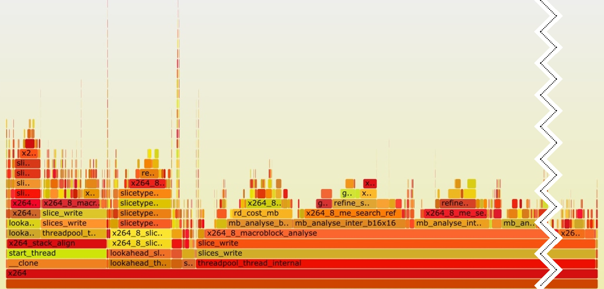

## Flame Graphs {#sec:secFlameGraphs}

A flame graph is a popular way of visualizing profiling data and the most frequent code-paths in a program. It enables us to see which function calls take the largest portion of execution time. Figure @fig:FlameGraph shows an example of a flame graph for the [x264](https://openbenchmarking.org/test/pts/x264) video encoding benchmark, generated with open-source [scripts](https://github.com/brendangregg/FlameGraph)[^1] developed by Brendan Gregg. Nowadays, nearly all profilers can automatically generate a flame graph as long as the call stacks were collected during the profiling session.

{#fig:FlameGraph width=100%}

On the flame graph, each rectangle (horizontal bar) represents a function call, the width of the rectangle indicates the relative execution time taken by the function itself and by its callees. The function calls happen from bottom to the top, so we can see that the hottest path in the program is `x264 -> threadpool_thread_internal -> ... -> x264_8_macroblock_analyse`. The function `threadpool_thread_internal` and its callees account for 74% of the time spent in the program. But the self time, i.e., time spent in the function itself is rather small. Similarly, we can do the same analysis for `x264_8_macroblock_analyse`, which accounts for 66% of the runtime. This visualization gives you a very good intuition on where the most time is spent.

Flame graphs are interactive, you can click on any bar on the image and it will zoom into that particular code path. You can keep zooming until you find a place that doesn't look according to your expectations or you reach a leaf/tail function - now you have actionable information you can use in your analysis. Another strategy is to figure our what is the hottest function in the program (not immediately clear from this flame graph) and go bottom-up through the flame graph, trying to understand from where this hottest function gets called.

[TODO]: mention icicle graphs, refer to section with continuous profiling

[^1]: Flame graphs by Brendan Gregg - [https://github.com/brendangregg/FlameGraph](https://github.com/brendangregg/FlameGraph)
[^2]: x264 video encoding benchmark - [https://openbenchmarking.org/test/pts/x264](https://openbenchmarking.org/test/pts/x264)