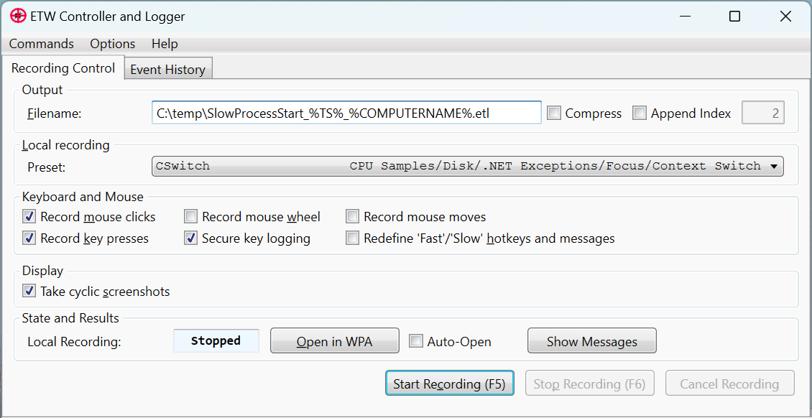
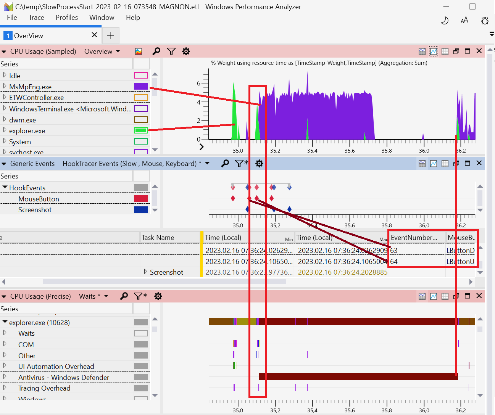
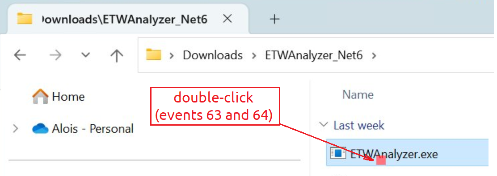

## Event Tracing for Windows {#sec:ETW}

Microsoft has developed a system-wide tracing facility named Event Tracing for Windows (ETW). It was originally intended for helping device driver developers, but later found use in analyzing general-purpose applications as well. ETW is available on all supported Windows platforms (x86 and ARM) with the corresponding platform-dependent installation packages. ETW records structured events in user and kernel code with full call stack trace support, which enables you to observe software dynamics in a running system and solve many challenging performance issues.

### How to configure it {.unlisted .unnumbered}

Recording ETW data is possible without any extra download since Windows 10 with `Wpr.exe`. But to enable system-wide profiling you must be an administrator and have the `SeSystemProfilePrivilege` enabled. The \underline{W}indows \underline{P}erformance \underline{R}ecorder tool supports a set of built-in recording profiles that are suitable for common performance issues. You can tailor your recording needs by authoring a custom performance recorder profile xml file with the `.wprp` extension.

If you want to not only record but also view the recorded ETW data you need to install the Windows Performance Toolkit (WPT). You can download it from the Windows SDK[^1] or ADK[^2] download page. The Windows SDK is huge; you don't necessarily need all its parts. In our case, we just enabled the checkbox of the Windows Performance Toolkit. You are allowed to redistribute WPT as a part of your own application.

### What you can do with it: {.unlisted .unnumbered}

- Look at CPU hotspots with a configurable CPU sampling rate from 125 microseconds up to 10 seconds. The default is 1 millisecond which costs approximately 5--10% runtime overhead.
- Determine what blocks a certain thread and for how long (e.g., late event signals, unnecessary thread sleep, etc).
- Examine how fast a disk serves read/write requests and discover what initiates that work.
- Check file access performance and patterns (including cached read/writes that lead to no disk IO).
- Trace the TCP/IP stack to see how packets flow between network interfaces and computers.

All the items listed above are recorded system-wide for all processes with configurable call stack traces (kernel and user mode call stacks are combined). It's also possible to add your own ETW provider to correlate the system-wide traces with your application behavior. You can extend the amount of data collected by instrumenting your code. For example, you can inject enter/leave ETW tracing hooks in functions into your source code to measure how often a certain function was executed.

### What you cannot do with it: {.unlisted .unnumbered}

ETW traces are not useful for examining CPU microarchitectural bottlenecks. For that, use vendor-specific tools like Intel VTune, AMD uProf, Apple Instruments, etc.

ETW traces capture the dynamics of all processes at the system level, however, it may generate a lot of data. For example, capturing thread context switching data to observe various waits and delays can easily generate 1-2 GB per minute. That's why it is not practical to record high-volume events for hours without overriding previously stored traces.

### Tools to Record ETW traces {.unlisted .unnumbered}

Here is the list of tools one can use to capture ETW traces:

- `wpr.exe`: a command line recording tool, part of Windows 10 and Windows Performance Toolkit.
- `WPRUI.exe`: a simple UI for recording ETW data, part of Windows Performance Toolkit
- `xperf`: a command line predecessor of wpr, part of Windows Performance Toolkit.
- `PerfView`:[^3] a graphical recording and analysis tool with the main focus on .NET Applications. This is an open-source application developed by Microsoft.
- `Performance HUD`:[^7] a little-known but very powerful GUI tool to track UI delays, and user/handle leaks via live ETW recording of all unbalanced resource allocations with a live display of leaking/blocking call stack traces.
- `ETWController`:[^4] a recording tool with the ability to record keyboard input and screenshots along with ETW data. This open-source application, developed by Alois Kraus, also supports distributed profiling on two machines simultaneously.
- `UIForETW`:[^6] this open-source application, developed by Bruce Dawson, is a wrapper around `xperf` with special options to record data for Google Chrome issues. It can also record keyboard and mouse input.

### Tools to View and Analyze ETW traces {.unlisted .unnumbered}

- `Windows Performance Analyzer` (WPA): the most powerful UI for viewing ETW data. WPA can visualize and overlay disk, CPU, GPU, network, memory, process, and many more data sources to get a holistic understanding of how your system behaves and what it is doing. Although the UI is very powerful, it may also be quite complex for beginners. WPA supports plugins to process data from other sources, not just ETW traces. It's possible to import Linux/Android[^8] profiling data that was generated by tools like Linux perf, LTTNG, Perfetto, and several log file formats: dmesg, Cloud-Init, WaLinuxAgent and AndroidLogcat.
- `ETWAnalyzer`:[^5] reads ETW data and generates aggregate summary JSON files that can be queried, filtered, and sorted at the command line or exported to a CSV file.
- `PerfView`: mainly used to troubleshoot .NET applications. The ETW events fired for Garbage Collection and JIT compilation are parsed and easily accessible as reports or CSV data. 

### Case Study - Slow Program Start {.unlisted .unnumbered}

Now we will take a look at an example of using ETWController to capture ETW traces and WPA to visualize them.

**Problem statement**: When double-clicking on a downloaded executable in Windows Explorer it is started with a noticeable delay. Something seems to delay the process start. What could be the reason for this? Slow disk? 

#### Setup {.unlisted .unnumbered}

- Download ETWController to record ETW data and screenshots.
- Download the latest Windows 11 Performance Toolkit[^1] to be able to view the data with WPA. Make sure that the newer Win 11 `wpr.exe` comes first in your path by moving the install folder of the WPT before the `C:\\Windows\\system32` in the System Environment dialog. This is how it should look like: 

```
C> where wpr 
C:\Program Files (x86)\Windows Kits\10\Windows Performance Toolkit\wpr.exe
C:\Windows\System32\wpr.exe
```

#### Capture traces {.unlisted .unnumbered}

- Start ETWController.
- Select the CSwitch profile to track thread wait times along with the other default recording settings. Ensure the check boxes *Record mouse clicks* and *Take cyclic screenshots* are ticked (see Figure @fig:ETWController_Dialog) so later you will be able to navigate to the slow spots with the help of the screenshots.
 - Download an application from the internet, and unpack it if needed. It doesn't matter what program you use, the goal is to see the delay when starting it.
 - Start profiling by pressing the *Start Recording* button.
 - Double-click the executable to start it. 
 - Once a program has started, stop profiling by pressing the *Stop Recording* button. 

{#fig:ETWController_Dialog width=100%}

Stopping profiling the first time takes a bit longer because Program-Debug Data Base files (PDBs) are generated for all managed code, which is a one-time operation. After profiling has reached the Stopped state you can press the *Open in WPA* button to load the ETL file into the Windows Performance Analyzer with an ETWController supplied profile. The CSwitch profile generates a large amount of data that is stored in a 4 GB ring buffer, which allows you to record 1-2 minutes before the oldest events are overwritten. Sometimes it is a bit of an art to stop profiling at the right time point. If you have sporadic issues you can keep recording enabled for hours and stop it when an event like a log entry in a file shows up, which is checked by a polling script, to stop profiling when the issue has occurred.

Windows supports Event Log and Performance Counter triggers that can start a script when a performance counter reaches a threshold value or a specific event is written to an event log. If you need more sophisticated stop triggers, you should take a look at PerfView; this enables you to define a Performance Counter threshold that must be reached and stay there for `N` seconds before profiling is stopped. This way, random spikes are no longer triggering false positives. 

#### Analysis in WPA {.unlisted .unnumbered}

\hfill \break

Figure @fig:WPA_MainView shows the recorded ETW data opened in Windows Performance Analyzer (WPA). The WPA view is divided into three vertically layered parts: *CPU Usage (Sampled)*, *Generic Events*, and *CPU Usage (Precise)*. To understand the difference between them, let's dive deeper. The upper graph *CPU Usage (Sampled)* is useful for identifying where the CPU time is spent. The data is collected by sampling all the running threads at a regular time interval. This *CPU Usage (Sampled)* graph is very similar to the *Hotspots* view in other profiling tools.

{#fig:WPA_MainView width=100% }

Next comes the *Generic Events* view, which displays events such as mouse clicks and captured screenshots. Remember that we enabled interception of those events in the ETWController window. Because events are placed on the timeline, it is easy to correlate UI interactions with how the system reacts to them.

The bottom Graph *CPU Usage (Precise)* uses a different source of data than the *Sampled* view. While sampling data only captures running threads, CSwitch collection takes into account time intervals during which a process was not running. The data for the *CPU Usage (Precise)* view comes from the Windows Thread Scheduler. This graph traces how long, and on which CPU, a thread was running (CPU Usage), how long it was blocked in a kernel call (Waits), in which priority, and how long the thread had been waiting for a CPU to become free (Ready Time), etc. Consequently, the *CPU Usage (Precise)* view doesn't show the top CPU consumers, but this view is very helpful for understanding how long and *why* a certain process was blocked.

Now that we have familiarized ourselves with the WPA interface, let's observe the charts. First, we can find the `MouseButton` events 63 and 64 on the timeline. ETWController saves all the screenshots taken during collection in a newly created folder. The profiling data itself is saved in the file named `SlowProcessStart.etl` and there is a new folder named `SlowProcessStart.etl.Screenshots`. This folder contains the screenshots and a `Report.html` file that you can view in a web browser. Every recorded keyboard/mouse interaction is saved in a file with the event number in its name, e.g., `Screenshot_63.jpg`. Figure @fig:ETWController_ClickScreenshot (cropped) displays the mouse double-click (events 63 and 64). The mouse pointer position is marked as a green square, except if a click event did occur, then it is red. This makes it easy to spot when and where a mouse click was performed.

{#fig:ETWController_ClickScreenshot width=70% }

The double click marks the beginning of a 1.2-second delay when our application was waiting for something. At timestamp `35.1`, `explorer.exe` is active as it attempts to launch the new application. But then it wasn't doing much work and the application didn't start. Instead, `MsMpEng.exe` takes over the execution up until the time `35.7`. So far, it looks like an antivirus scan before the downloaded executable is allowed to start. But we are not 100% sure that `MsMpEng.exe` is blocking the start of a new application.

Since we are dealing with delays, we are interested in wait times. These are available on the *CPU Usage (Precise)* panel with *Waits* selected in the dropdown menu. There we find the list of processes that our `explorer.exe` was waiting for, visualized as a bar chart that aligns with the timeline on the upper panel. It's not hard to spot the long bar corresponding to *Antivirus - Windows Defender*, which accounts for a waiting time of 1.068s. So, we can conclude that the delay in starting our application is caused by Defender scanning activity. If you drill into the call stack (not shown), you'll see that the `CreateProcess` system call is delayed in the kernel by `WDFilter.sys`, the Windows Defender Filter Driver. It blocks the process from starting until the potentially malicious file contents are scanned. Antivirus software can intercept everything, resulting in unpredictable performance issues that are difficult to diagnose without a comprehensive kernel view, such as with ETW. Mystery solved? Well, not just yet.

Knowing that Defender was the issue is just the first step. If you look at the top panel again, you'll see that the delay is not entirely caused by busy antivirus scanning. The `MsMpEng.exe` process was active from the time `35.1` until `35.7`, but the application didn't start immediately after that. There is an additional delay of 0.5 sec from time `35.7`until `36.2`, during which the CPU was mostly idle, not doing anything. To find the root cause of this, you would need to follow the thread wakeup history across processes, which we will not present here. In the end, you would find a blocking web service call to `MpClient.dll!MpClient::CMpSpyNetContext::UpdateSpynetMetrics` which did wait for some Microsoft Defender web service to respond. If you enable TCP/IP or socket ETW traces you can also find out with which remote endpoint Microsoft Defender was communicating. So, the second part of the delay is caused by the `MsMpEng.exe` process waiting for the network, which also blocked our application from running.

This case study shows only one example of what type of issues you can effectively analyze with WPA, but there are many others. The WPA interface is very rich and highly customizable. It supports custom profiles to configure the graphs and tables for visualizing event data in the way you like best. Originally, WPA was developed for device driver developers and there are built-in profiles that do not focus on application development. ETWController brings its own profile (*Overview.wpaprofile*) that you can set as the default profile under *Profiles &rarr; Save Startup Profile* to always use the performance overview profile.

[^1]: Windows SDK Downloads - [https://developer.microsoft.com/en-us/windows/downloads/sdk-archive/](https://developer.microsoft.com/en-us/windows/downloads/sdk-archive/)
[^2]: Windows ADK Downloads - [https://learn.microsoft.com/en-us/windows-hardware/get-started/adk-install#other-adk-downloads](https://learn.microsoft.com/en-us/windows-hardware/get-started/adk-install#other-adk-downloads)
[^3]: PerfView - [https://github.com/microsoft/perfview](https://github.com/microsoft/perfview)
[^4]: ETWController - [https://github.com/alois-xx/etwcontroller](https://github.com/alois-xx/etwcontroller)
[^5]: ETWAnalyzer - [https://github.com/Siemens-Healthineers/ETWAnalyzer](https://github.com/Siemens-Healthineers/ETWAnalyzer)
[^6]: UIforETW - [https://github.com/google/UIforETW](https://github.com/google/UIforETW)
[^7]: Performance HUD - [https://www.microsoft.com/en-us/download/100813](https://www.microsoft.com/en-us/download/100813)
[^8]: Microsoft Performance Tools Linux / Android - [https://github.com/microsoft/Microsoft-Performance-Tools-Linux-Android](https://github.com/microsoft/Microsoft-Performance-Tools-Linux-Android)
