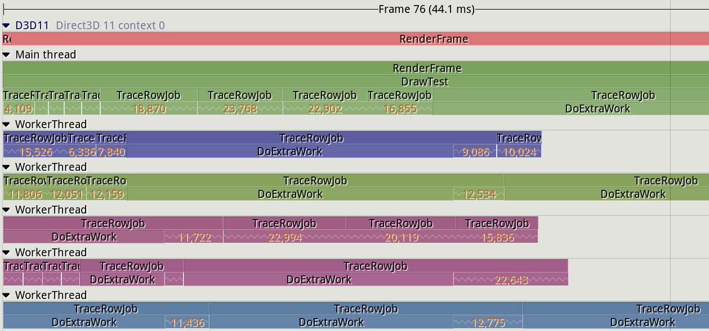
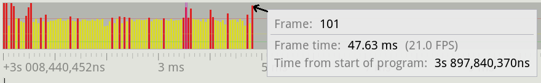
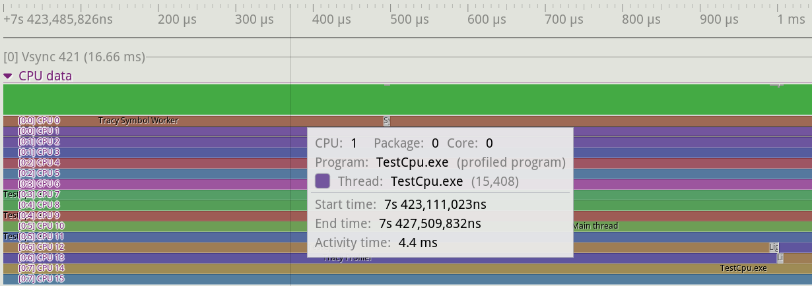
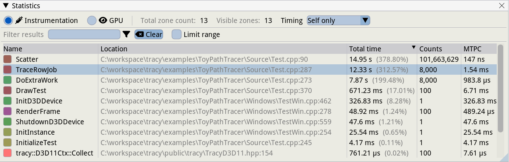

## Specialized and Hybrid Profilers {#sec:Tracy}

Most of the tools explored so far fall under the category of sampling profilers. These are great when you want to identify hot spots in your code, but in some cases, they might not provide the required granularity for analysis. Depending on the profiler sampling frequency and the behavior of your program, most functions could be fast enough that they don't show up in a profiler. In some scenarios, you might want to manually define which parts of your program need to be measured consistently. Video games, for instance, render frames (the final image shown on screen) on average at 60 frames per second (FPS); some monitors allow up to 144 FPS. At 60 FPS, each frame has as little as 16 milliseconds to complete the work before moving on to the next one. Developers pay particular attention to frames that go above this threshold, as this causes visible stutter in games and can ruin the player experience. This situation is hard to capture with a sampling profiler, as they usually only provide the total time taken for a given function.

Developers have created profilers that provide features helpful in specific environments, usually with a marker API that you can use to manually instrument your code. This enables you to observe the performance of a particular function or a block of code (later referred to as a *zone*). Continuing with the game industry, there are several tools in this space: some are integrated directly into game engines like Unreal, while others are provided as external libraries and tools that can be integrated into your project. Some of the most commonly used profilers are Tracy, RAD Telemetry, [Remotery](https://github.com/Celtoys/Remotery), and [Optick](https://github.com/bombomby/optick) (Windows only). Next, we showcase [Tracy](https://github.com/wolfpld/tracy),[^1] as this seems to be one of the most popular projects; however, these concepts apply to the other profilers as well.

### What you can do with Tracy: {.unlisted .unnumbered}

- Debug performance anomalies in a program, e.g., slow frames.
- Correlate slow events with other events in a system.
- Find common characteristics among slow events.
- Inspect source code and assembly.
- Do a "before/after" comparison after a code change.

### What you cannot do with Tracy: {.unlisted .unnumbered}

- Examine CPU microarchitectural issues, e.g., collect various performance counters.

### Case Study: Analyzing Slow Frames with Tracy {.unlisted .unnumbered}

In this example, we will use the [ToyPathTracer](https://github.com/wolfpld/tracy/tree/master/examples/ToyPathTracer)[^2] program, a simple path tracer, which is a simplified ray-tracing technique that shoots thousands of rays per pixel into the scene to render a realistic image. To process a frame, the implementation distributes the processing of each row of pixels to a separate thread.

To emulate a typical scenario where Tracy can help to diagnose the root cause of the problem, we have manually modified the code so that some frames will consume more time than others. [@lst:TracyInstrumentation] shows an outline of the code along with added Tracy instrumentation. Notice, that we randomly select frames to slow down. Also, we included Tracy's header and added the `ZoneScoped` and `FrameMark` macros to the functions that we want to track. The `FrameMark` macro can be inserted to identify individual frames in the profiler. The duration of each frame will be visible on the timeline, which is very useful.

Listing: Tracy Instrumentation

~~~~ {#lst:TracyInstrumentation .cpp}
#include "tracy/Tracy.hpp"

void DoExtraWork() {
  ZoneScoped;
  // imitate useful work
}

void TraceRowJob() {
  ZoneScoped;
  if (frameCount == randomlySelected)
    DoExtraWork();
  // ...
}

void RenderFrame() {
  ZoneScoped;
  for (...) {
    TraceRowJob();
  }
  FrameMark;
}
~~~~~~~~~~~~~~~~~~~~~~~~~~~~~~~~~~~~~~~~~~~~~~~~~

Each frame can contain many zones, designated by the `ZoneScoped` macro. Similar to frames, there are many instances of a zone. Every time we enter a zone, Tracy captures statistics for a new instance of that zone. The `ZoneScoped` macro creates a C++ object on the stack that will record the runtime activity of the code within the scope of the object's lifetime. Tracy refers to this scope as a "zone". At the zone entry, the current timestamp is captured. Once the function exits, the object's destructor will record a new timestamp and store this timing data, along with the function name.

Tracy has two operation modes: it can store all the timing data until the profiler is connected to the application (the default mode), or it can only start recording when a profiler is connected. The latter option can be enabled by specifying the `TRACY_ON_DEMAND` pre-processor macro when compiling the application. This mode should be preferred if you want to distribute an application that can be profiled as needed. With this option, the tracing code can be compiled into the application and it will cause little to no overhead to the running program unless the profiler is attached. The profiler is a separate application that connects to a running application to capture and display the live profiling data, also known as the "flight recorder" mode. The profiler can be run on a separate machine so that it doesn't interfere with the running application. Note, however, that this doesn't mean that the runtime overhead caused by the instrumentation code disappears. It is still there, but the overhead of visualizing the data is avoided in this case.

We used Tracy to debug the program and find the reason why some frames are slower than others. The data was captured on a Windows 11 machine, equipped with a Ryzen 7 5800X processor. The program was compiled with MSVC 19.36.32532. Tracy's graphical interface is quite rich, but unfortunately contains too much detail to fit on a single screenshot, so we break it down into pieces. At the top, there is a timeline view as shown in Figure @fig:Tracy_Main_View, cropped to fit onto the page. It shows only a portion of frame 76, which took 44.1 ms to render. On that diagram, we see the `Main thread` and five `WorkerThread`s that were active during that frame. All threads, including the main thread, are performing work to advance progress in rendering the final image. As we said earlier, each thread processes a row of pixels inside the `TraceRowJob` zone. Each `TraceRowJob` zone instance contains many smaller zones, that are not visible. Tracy collapses inner zones and only shows the number of collapsed instances. This is what, for example, number `4,109` means under the first `TraceRowJob` in the Main Thread. Notice the instances of `DoExtraWork` zones, nested under `TraceRowJob` zones. This observation already can lead to a discovery, but in a real application, it may not be so obvious. Let's leave this for now.

{#fig:Tracy_Main_View width=100%}

Right above the main panel, there is a histogram that displays the times for all the recorded frames (see Figure @fig:Tracy_Frame_Time_View). It makes it easier to spot a long-running frame that could cause a stutter. It makes it easier to spot those frames that took longer than average to complete. In this example, most frames take around 33 ms (the yellow bars). However, some frames take longer than this and are marked in red. As seen in the screenshot, a tooltip showing the details of a given frame is displayed when hovering the mouse on the bar in the histogram. In this example, we are showing the details for the last frame, highlighted in green.

{#fig:Tracy_Frame_Time_View width=90%}

Figure @fig:Tracy_CPU_Data illustrates the CPU data section of the profiler. This area shows which core a given thread is executing on and it also displays context switches. This section will also display other programs that are running on the CPU. As seen in the image, the details for a given thread are displayed when hovering the mouse on a given section in the CPU data view. Details include the CPU the thread is running on, the parent program, the individual thread, and timing information. We can see that the `TestCpu.exe` thread was active for 4.4 ms on CPU 1.

{#fig:Tracy_CPU_Data width=100%}

Next comes the panel that provides information on where our program spends its time, also known as hotspots. Figure @fig:Tracy_Hotspots is a screenshot of Tracy's statistics window. We can check the recorded data, including the total time a given function was active, how many times it was invoked, etc. It's also possible to select a time range in the main view to filter information corresponding to a time interval.

{#fig:Tracy_Hotspots width=100%}

The last set of panels that we show, enables us to analyze individual zone instances in more depth. Once you click on any zone instance, say, on the main timeline view or on the *CPU data* view, Tracy will open a *Zone Info* window (see the left panel in Figure @fig:Tracy_Zone_Details) with the details for this zone instance. It shows how much of the execution time is consumed by the zone itself or its children. In this example, execution of the `TraceRowJob` function took 19.24 ms, but the time consumed by the function itself without its callees takes 1.36 ms, which is only 7%. The rest of the time is consumed by the child zones.

It's easy to spot a call to `DoExtraWork` that takes the bulk of the time, 16.99 ms out of 19.24 ms. Notice that this particular `TraceRowJob` instance runs almost 4.4 times as long as the average case (indicated by "437.93% of the mean time" on the image). Bingo! We found one of the slow instances where the `TraceRowJob` function was slowed down because of some extra work. One way to proceed would be to click on the `DoExtraWork` row to inspect this zone instance. This will update the Zone Info view with the details of the `DoExtraWork` instance so that we can dig down to understand what caused the performance issue. This view also shows the source file and line of code where the zone starts. So, another strategy would be to check the source code to understand why the current `TraceRowJob` instance takes more time than usual.

{#fig:Tracy_Zone_Details width=100%}

Remember, we saw in Figure @fig:Tracy_Frame_Time_View, that there are other slow frames. Let's see if this is the common problem among all the slow frames. If we click on the *Statistics* button, it will display the *Find Zone* panel (on the right of Figure @fig:Tracy_Zone_Details). Here we can see the time histogram that aggregates all zone instances. This is particularly useful to determine how much variation there is when executing a function. Looking at the histogram on the right, we see that the median duration for the `TraceRowJob` function is 3.59 ms, with most calls taking between 1 and 7 ms. However, there are a few instances that take longer than 10 ms, with a peak of 23 ms. Note that the time axis is logarithmic. The Find Zone window also provides other data points, including the mean, median, and standard deviation for the inspected zone.

Now we can examine other slow instances to find what is common between them, which will help us to determine the root cause of the issue. From this view, you can select one of the slow zones. This will update the *Zone Info* window with the details of that zone instance and by clicking the *Zoom to zone* button, the main window will focus on this slow zone. From here we can check if the selected `TraceRowJob` instance has similar characteristics as the one that we just analyzed.

### Other Features of Tracy {.unlisted .unnumbered}

Tracy monitors the performance of the whole system, not just the application itself. It also behaves like a traditional sampling profiler as it reports data for applications that are running concurrently with the profiled program. The tool monitors thread migration and idle time by tracing kernel context switches (administrator privileges are required). Zone statistics (call counts, time, histogram) are exact because Tracy captures every zone entry/exit, but system-level data and source-code-level data are sampled.

In the example, we used manual markup of interesting areas in the code. However, doing this is not a strict requirement to start using Tracy. You can profile an unmodified application and add instrumentation later when you know where it’s needed. Tracy provides many other features, too many to cover in this overview. Here are some of the notable ones:

* Tracking memory allocations and locks.
* Session comparison. This is vital to ensure a change provides the expected benefits. It's possible to load two profiling sessions and compare zone data before and after the change was made.
* Source code and assembly view. If debug symbols are available, Tracy can also display hotspots in the source code and related assembly just like Intel VTune and other profilers.

In comparison with other tools like Intel VTune and AMD uProf, with Tracy, you cannot get the same level of CPU microarchitectural insights (e.g., various performance events). This is because Tracy does not leverage the hardware features specific to a particular platform.

The overhead of profiling with Tracy depends on how many zones you have activated. The author of Tracy provides some data points that he measured on a program that does image compression: an overhead of 18% and 34% with two different compression schemes. A total of 200M zones were profiled, with an average overhead of 2.25 ns per zone. This test instrumented a very hot function. In other scenarios, the overhead will be much lower. While it's possible to keep the overhead small, you need to be careful about which sections of code you want to instrument, especially if you decide to use it in production.

[^1]: Tracy - [https://github.com/wolfpld/tracy](https://github.com/wolfpld/tracy)
[^2]: ToyPathTracer - [https://github.com/wolfpld/tracy/tree/master/examples/ToyPathTracer](https://github.com/wolfpld/tracy/tree/master/examples/ToyPathTracer)
