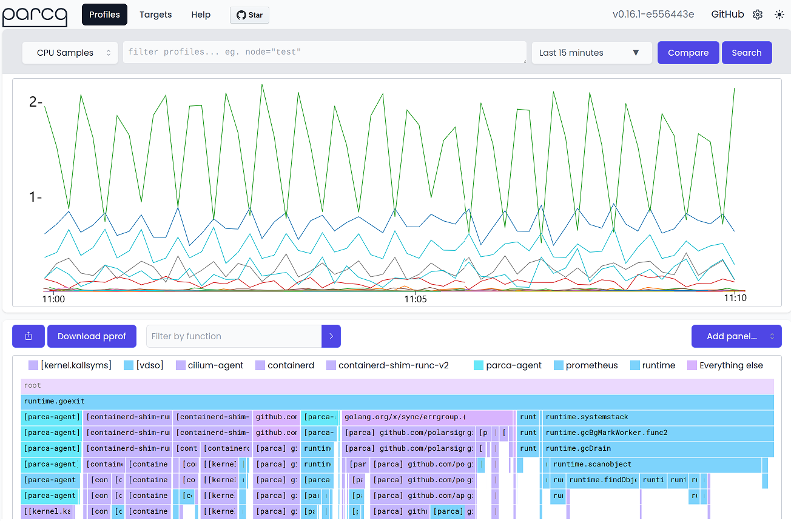

## Continuous Profiling

In Chapter 6, we covered the various approaches available for conducting a performance analysis, including but not limited to instrumentation, tracing, and sampling. Among these three approaches, sampling imposes relatively minor runtime overhead and requires the least amount of upfront work while still offering valuable insight into application hotspots. But this insight is limited to the specific point in time when the samples are gathered. What if we could add a time dimension to this sampling? Instead of knowing that FunctionA consumes 30% of CPU cycles at one particular point in time, what if we could track changes in FunctionA’s CPU usage over days, weeks, or months? Or detect changes in its stack trace over that same timespan, all in production? Continuous Profiling has emerged to turn these goals into reality.

Continuous Profiling (CP) is a systemwide, sample-based profiler that is always on, albeit at a low sample rate to minimize runtime impact. Continuously collecting data from all processes facilitates analysis of why execution of code was different at different times, and also aids debugging of incidents even after they have happened. CP tools provide valuable insights into which code uses the most resources, and this helps engineers to reduce resource usage in their production environments and thus save money. Unlike typical profilers like Linux perf or Intel VTune, CP can pinpoint a performance issue from the application stack down to the kernel stack from *any* given date and time, and supports call stack comparisons between any two arbitrary dates/times to highlight performance differences.

{#fig:Continuous_profiling width=100%}

To showcase the look-and-feel of a typical CP tool, let’s look at the Web UI of [Parca](https://github.com/parca-dev/parca),[^1] one of the open-source CP tools, depicted in Figure @fig:Continuous_profiling. The top panel displays a timeseries graph of the number of CPU samples gathered from various processes on the machine during the period selected from the time window dropdown list, which in this case is "Last 15 minutes". However, to make it fit on the page, the image was cut to show only the last 10 minutes. By default, Parca collects 19 samples per second. For each sample, it collects stack traces from all the processes that run on the host system. The more samples are attributed to a certain process, the more CPU activity it had during a period of time. In our example, you can see the hottest process (top line) had a bursty behavior with spikes and dips in CPU activity. If you were the lead developer behind this application you would probably be curious why this happens. When you roll out a new version of your application and suddenly see an unexpected spike in the CPU samples attributed to the process, that is an indication that something is going wrong.

Continuous profiling tools make it easier not only to spot the point in time when performance change occured, but also to determine the root cause of the issue. Once you click on any point of interest on the chart, the tool displays an icicle graph associated with that period in the bottom panel. An icicle graph is the upside-down version of a flame graph. Using it, you can compare call stacks before and after to help you find what is causing performance problems.

Imagine, you merged a code change into production and after it has been running for a while, you receive reports of intermittent response time spikes. These may or may not correlate with user traffic or with any particular time of day. This is an area where CP shines. You can pull up the CP Web UI and do a search for stack traces at the dates and times of those response time spikes, and then compare them to stack traces of other dates and times to identify anomalous executions at the application and/or kernel stack level. This type of “visual diff” is supported directly in the UI, like a graphical “perf diff” or a [differential flamegraph](https://www.brendangregg.com/blog/2014-11-09/differential-flame-graphs.html).

Google introduced the CP concept in the 2010 paper “Google-Wide Profiling” [@GoogleWideProfiling], which championed the value of always-on profiling in production environments. However, it took nearly a decade before it gained traction in the industry:

1. In March 2019, Google Cloud released its Continuous Profiler.
2. In July 2020, AWS released CodeGuru Profiler.
3. In August 2020, Datadog released its Continuous Profiler.
4. In December 2020, New Relic acquired the Pixie Continuous Profiler.
5. In Jan 2021, Pyroscope released its open-source Continuous Profiler.
6. In October 2021, Elastic acquired Optimyze and its Continuous Profiler (Prodfiler); Polar Signals released its open-source Parca Continuous Profiler. It was open-source in April 2024.
7. In December 2021, Splunk releases its AlwaysOn Profiler.
8. In March 2022, Intel acquired Granulate and its Continuous Profiler (gProfiler). It was open-source in March 2024.

New entrants into this space continue to pop up in both open-source and commercial varieties. Some of these offerings require more hand-holding than others. For example, some require source code or configuration file changes to begin profiling. Others require different agents for different language runtimes (e.g., Ruby, Python, Golang, C/C++/Rust). The best of them have crafted a secret sauce around eBPF so that nothing other than simply installing the runtime agent is necessary.

They also differ in the number of language runtimes supported, the work required for obtaining debug symbols for readable stack traces, and the type of system resources that can be profiled aside from CPU (e.g., memory, I/O, or locking). While Continuous Profilers differ in the aforementioned aspects, they all share the common function of providing low-overhead, sample-based profiling for various language runtimes, along with remote stack trace storage for web-based search and query capability.

Where is Continuous Profiling headed? Thomas Dullien, co-founder of Optimyze which developed the innovative Continuous Profiler Prodfiler, delivered the Keynote at QCon London 2023 in which he expressed his wish for a cluster-wide tool that could answer the questions, “Why is this request slow?” or “Why is this request expensive?” In a multithreaded application, one particular function may show up on a profile as the highest CPU and memory consumer, yet its duties might be completely outside an application's critical path, e.g., a house-keeping thread. Meanwhile, another function with such insignificant CPU execution time that it barely registers in a profile may exhibit an outsized effect on overall application latency and/or throughput. Typical profilers fail to address this shortcoming. And since CP tools are basically profilers that run at all times, they inherit this same blind spot.

Thankfully, a new generation of CP tools has emerged that employ AI with Large Language Model-inspired architectures to process profile samples, analyze the relationships between functions, and finally pinpoint with high accuracy the functions and libraries that directly impact overall throughput and latency. One such company that offers this today is Raven.io. And as competition intensifies in this space, innovative capabilities will continue to grow so that CP tooling becomes as powerful and robust as that of typical profilers.

[^1]: Parca - [https://github.com/parca-dev/parca](https://github.com/parca-dev/parca)