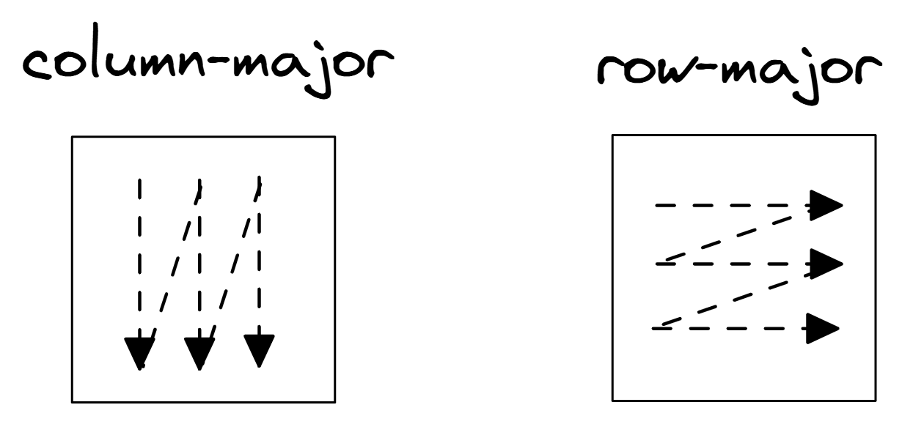
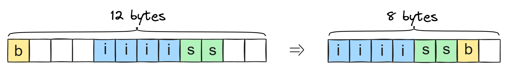
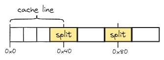

## Cache-Friendly Data Structures {#sec:secCacheFriendly}

Writing cache-friendly algorithms and data structures is one of the key items in the recipe for a well-performing application. The key pillars of cache-friendly code are the principles of temporal and spatial locality that we introduced in [@sec:MemHierar]. The goal here is to have a predictable memory access pattern and store data efficiently.

The cache line is the smallest unit of data that can be transferred between the cache and the main memory. When designing cache-friendly code, it's helpful to think not only of individual variables and their locations in memory, but also of cache lines.

Next, we will discuss several techniques to make data structures more cache-friendly.

### Access Data Sequentially.

The best way to exploit the spatial locality of the caches is to make sequential memory accesses. By doing so, we enable the HW prefetching mechanism (see [@sec:HwPrefetch]) to recognize the memory access pattern and bring in the next chunk of data ahead of time. An example of Row-major versus Column-Major traversal is shown in [@lst:CacheFriend]. Notice, there is only one tiny change in the code (swapped `col` and `row` subscripts), but it has a significant impact on performance.

The code on the left is not cache-friendly because it skips `NCOLS` elements on every iteration of the inner loop. This results in a very inefficient use of caches. In contrast, the code on the right accesses elements of the matrix in the order in which they are laid out in memory. Row-major traversal exploits spatial locality and is cache-friendly. Figure @fig:ColRowMajor illustrates the difference between the two traversal patterns.

Listing: Cache-friendly memory accesses.

~~~~ {#lst:CacheFriend .cpp}
// Column-major order                              // Row-major order
for (row = 0; row < NROWS; row++)                  for (row = 0; row < NROWS; row++)
  for (col = 0; col < NCOLS; col++)                  for (col = 0; col < NCOLS; col++)
    matrix[col][row] = row + col;          =>          matrix[row][col] = row + col;
~~~~~~~~~~~~~~~~~~~~~~~~~~~~~~~~~~~~~~~~~~~~~~~~~

{#fig:ColRowMajor width=60%}

The example presented above is classical, but usually, real-world applications are much more complicated than this. Sometimes you need to go an additional mile to write cache-friendly code. If the data is not laid out in memory in a way that is optimal for the algorithm, it may require to rearrange the data first.

Consider a standard implementation of binary search in a large sorted array, where on each iteration, you access the middle element, compare it with the value you're searching for and go either left or right. This algorithm does not exploit spatial locality since it tests elements in different locations that are far away from each other and do not share the same cache line. The most famous way of solving this problem is storing elements of the array using the Eytzinger layout [@EytzingerArray]. The idea of it is to maintain an implicit binary search tree packed into an array using the BFS-like layout, usually seen with binary heaps. If the code performs a large number of binary searches in the array, it may be beneficial to convert it to the Eytzinger layout. 

### Use Appropriate Containers. 

There is a wide variety of ready-to-use containers in almost any language. But it's important to know their underlying storage and performance implications. Keep in mind how the data will be accessed and manipulated. You should consider not only the time and space complexity of operations with a data structure, but also the HW effects associated with them.

By default, stay away from data structures that rely on pointers, e.g. linked lists or trees. When traversing elements, they require additional memory accesses to follow the pointers. If the maximum number of elements is relatively small and known at compile time, C++ `std::array` might be a better option than `std::vector`. If you need associative container, but don't need to store the elements in a sorted order, `std::unordered_map` should be faster than `std::map`. A good step-by-step guide for choosing appropriate C++ containers can be found in [@fogOptimizeCpp, Section 9.7 Data structures, and container classes].

Sometimes, it's more efficient to store pointers to contained objects, instead of objects themselves. Consider a situation when you need store many objects in an array while the size of each object is big. In addition, the objects are frequently shuffled, removed, and inserted. Storing objects in an array will require moving large chunks of memory every time the order of objects is changed, which is expensive. In this case, it's better to store pointers to objects in the array. This way, only the pointers are moved, which is much cheaper. However, this approach has its own drawbacks. It requires additional memory for the pointers and introduces an additional level of indirection.

If your data structure is accessed by multiple threads, consider using lock-free data structures. They are designed to avoid the overhead of locks and are often faster than their lock-based counterparts. However, they are much more difficult to implement and debug.

### Packing the Data.

Utilization of data caches can be also improved by making data more compact. There are many ways to pack data. One of the classic examples is to use bitfields. An example of code when packing data might be profitable is shown in [@lst:DataPacking]. If we know that `a`, `b`, and `c` represent enum values that take a certain number of bits to encode, we can reduce the storage of the struct `S`.

Listing: Data Packing

~~~~ {#lst:DataPacking .cpp}
// S is `sizeof(unsigned int) * 3` bytes          // S is only 1 byte
struct S {                                        struct S {
  unsigned a;                                       unsigned a:4;
  unsigned b;                              =>       unsigned b:2;
  unsigned c;                                       unsigned c:2;
};                                                };
~~~~~~~~~~~~~~~~~~~~~~~~~~~~~~~~~~~~~~~~~~~~~~~~~

Notice the 12 times less space required to store an object of the packed version of `S`. This greatly reduces the amount of memory transferred back and forth and saves cache space. However, using bitfields comes with additional cost. Since the bits of `a`, `b`, and `c` are packed into a single byte, the compiler needs to perform additional bit manipulation operations to extract and insert them. For example, to load `b`, you need to shift the byte value right (`>>`) by 2 and do logical AND (`&`) with `0x3`. Similarly, shift left (`<<`) and logical OR (`|`) operations are needed to store the updated value back into the packed format. Data packing is beneficial in places where additional computation is cheaper than the delay caused by inefficient memory transfers.

Also, a programmer can reduce memory usage by rearranging fields in a struct or class when it avoids padding added by a compiler. The reason for a compiler to insert unused bytes of memory (pads) is to enable efficient storing and fetching of individual members of a struct. In the example in [@lst:AvoidPadding], the size of `S` can be reduced if its members are declared in the order of decreasing size. Figure @fig:AvoidPadding illustrates the effect of rearranging the fields in struct `S`.

Listing: Avoid compiler padding.

~~~~ {#lst:AvoidPadding .cpp}
// S is `sizeof(int) * 3` bytes          // S is `sizeof(int) * 2` bytes
struct S {                               struct S {
  bool b;                                  int i;
  int i;                         =>        short s;
  short s;                                 bool b;
};                                       };

~~~~~~~~~~~~~~~~~~~~~~~~~~~~~~~~~~~~~~~~~~~~~~~~~

{#fig:AvoidPadding width=80%}

[TODO]: maybe say a few words about Pointer tagging.

### Field Reordering

[TODO]: Search for a good example for a case study using `perf mem record && perf annotate --data-type`. 

Reordering fields in a data structure can also be beneficial for another reason. Consider an example in [@lst:FieldReordering]. Suppose that the `Soldier` structure is used to track thousands of units on the battlefield of a game. The game has three phases: battle, movement, and trade. During the battle phase, the `attack`, `defense`, and `health` fields are accessed together. During the movement phase, the `coords`, and `speed` fields are accessed. During the trade phase, only the `money` field is accessed. 

The problem with the organization of the `Soldier` struct in the code on the left is that the fields are not grouped according to the phases of the game. For example, during the battle phase, the program needs to access two different cache lines to fetch the required fields. The field `attack` and `defense` are very likely to reside on the same cache line, but the `health` field is always pushed to the next cache line. The same applies to the movement phase (`speed` and `coords` fields).

We can make the `Soldier` struct more cache-friendly by reordering the fields as shown in [@lst:FieldReordering] on the right. With that change, the fields that are accessed together are grouped together.

Listing: Field Reordering.

~~~~ {#lst:FieldReordering .cpp}
struct Soldier {                                   struct Soldier {
  2DCoords coords;   /*  8 bytes */                  unsigned attack;  // 1. battle
  unsigned attack;                                   unsigned defense; // 1. battle
  unsigned defense;                     =>           unsigned health;  // 1. battle
  /* other fields */ /* 64 bytes */                  2DCoords coords;  // 2. move
  unsigned speed;                                    unsigned speed;   // 2. move
  unsigned money;                                    // other fields
  unsigned health;                                   unsigned money;   // 3. trade
};                                                  };

~~~~~~~~~~~~~~~~~~~~~~~~~~~~~~~~~~~~~~~~~~~~~~~~~

Since Linux kernel 6.8, there is a new functionality in the `perf` tool that allows you to find data structure reordering opportunities. The `perf mem record` command can now be used to profile data structure access patterns. The `perf annotate --data-type` command will show you the data structure layout along with profiling samples attributed to each field of the data structure. Using this information you can identify fields that are accessed together.[^5]

### Aligning and Padding. {#sec:secMemAlign}

A variable is accessed most efficiently if it is stored at a memory address that is divisible by the size of the variable. In C++, it is called *natural alignment*, which occurs by default for fundamental data types, such as integer, float, or double. When you declare variables of these types, the compiler ensures that they are stored in memory at addresses that are multiples of their size. In contrast, arrays, structs and classes may require special alignment.

It is typical for SIMD code to load large chunks of data using a single load operation. Sometimes, such requests load data that starts on one cache line and end in the next cache line. In this case, fetching data requires two cache line reads. It also requires using so-called *split registers*, which keep the two parts and once both parts are fetched, they are combined into a single register. In the literature, you can encounter the term a *misaligned* or a *split* load to describe such a situation. Split loads may incur performance penalties, if many split loads in a row consume all available split registers. Intel's TMA methodology tracks this with the `Memory_Bound -> L1_Bound -> Split Loads` metric.

For instance, AVX2 memory operations can access up to 32 bytes. If an array starts at offset `0x30` (48 bytes), the first AVX2 load will fetch data from `0x30` to `0x4F`, the second load will fetch data from 0x50 to 0x6F, and so on. The first load crosses the cache line boundary (`0x40`). In fact, every second load will cross the cache line boundary which may slow down the execution. Figure @fig:SplitLoads illustrates this. Pushing the data forward by 16 bytes would align the array to the cache line boundary and eliminate the split loads.

{#fig:SplitLoads width=50%}

Once you confirm that split loads affect performance of your program in a negative way, you can get rid of them by *aligning* the data. “Aligning” here means the memory address is a multiple of a specific size. For example, when a 16-byte object is aligned on the 64-byte boundary, the low 6 bits of its address are zero. [@lst:AligningData] shows how to fix the example above using the C++11 `alignas` keyword.

Listing: Aligning data using the "alignas" keyword.

~~~~ {#lst:AligningData .cpp}
// Array of 16-bit integers aligned at 64-byte boundary
#define CACHELINE_ALIGN alignas(64) 
CACHELINE_ALIGN int16_t a[N];
~~~~~~~~~~~~~~~~~~~~~~~~~~~~~~~~~~~~~~~~~~~~~~~~~

Accesses that cross a 4 KB boundary introduce more complications, because virtual to physical address translations are usually handled in 4 KB pages. Handling such an access would require accessing two TLB entries as well. Unless a TLB supports multiple lookups per cycle, such loads can cause significant slowdown.

When it comes to dynamic allocations, C++17 made it much easier. Operator `new` now takes additional argument, which users can use to control alignment of dynamically allocated memory. [@lst:AlignedStdVector] shows a minimal example of defining a custom allocator for `std::vector` that aligns it at the cache line boundary. Other options include C11's standard [aligned_alloc](https://en.cppreference.com/w/c/memory/aligned_alloc)[^12], OS-specific functions like POSIX's [`memalign`](https://linux.die.net/man/3/memalign)[^13], or rolling your own allocation routine like described [here](https://embeddedartistry.com/blog/2017/02/22/generating-aligned-memory/)[^14].

Listing: Defining std::vector aligned at the cache line boundary.

~~~~ {#lst:AlignedStdVector .cpp}
// Returns aligned pointers when allocations are requested. 
template <typename T>
class CacheLineAlignedAllocator {
public:
  using value_type = T;
  static std::align_val_t constexpr ALIGNMENT{64};
  [[nodiscard]] T* allocate(std::size_t N) {
    return reinterpret_cast<T*>(::operator new, ALIGNMENT));
  }
  void deallocate(T* allocPtr, [[maybe_unused]] std::size_t N) {
    ::operator delete;
  }
};
template<typename T> 
using AlignedVector = std::vector<T, CacheLineAlignedAllocator<T> >;
~~~~~~~~~~~~~~~~~~~~~~~~~~~~~~~~~~~~~~~~~~~~~~~~~

Sometimes padding a data structure members is required to avoid edge cases like cache contentions [@fogOptimizeCpp, Section 9.10 Cache contentions] and false sharing (see [@sec:secFalseSharing]). The latter may occur in multithreaded applications when two threads, `A` and `B`, access different fields of the same structure. An example a data structure in which such a situation might happen is shown in [@lst:PadFalseSharing]. In the code on the left, members `a` and `b` of struct `S` are likely to reside on the same cache line. Even though threads `A` and `B` modify distinct fields of the data structure, a processor needs to maintain cache coherency, which causes additional overhead and might significantly slow down the program. To resolve this problem, one can pad `S` such that members `a` and `b` do not share a cache line as shown on the right.

Listing: Data padding to avoid false sharing.

~~~~ {#lst:PadFalseSharing .cpp}
                                                  #define CACHELINE_ALIGN alignas(64) 
struct S {                                        struct S {
  int a; /* modified by thread A */    =>           int a;
  int b; /* modified by thread B */                 CACHELINE_ALIGN int b;
};                                                };
~~~~~~~~~~~~~~~~~~~~~~~~~~~~~~~~~~~~~~~~~~~~~~~~~

Alignment and padding often cause holes of unused bytes, which potentially decreases memory bandwidth utilization. In the example above, original struct `S` (on the left) is only 8 bytes, while after the change (on the right) it becomes 128 bytes in size, which leaves a lot of unused bytes in every cache line. Use these techniques with care.

### Other Data Structure Reorganization Techniques

To close the topic of cache-friendly data structures, we will briefly mention two other techniques: *structure splitting* and *pointer inlining* that can be used to improve cache utilization.

**Structure splitting**. Splitting a large structure into smaller ones can improve cache utilization. For example, if you have a structure that contains a large number of fields, but only a few of them are accessed together, you can split the structure into two or more smaller ones. This way, you can avoid loading unnecessary data into the cache. An example of structure splitting is shown in [@lst:StructureSplitting]. By splitting the `Point` structure into `PointCoords` and `PointInfo`, we can avoid loading the `PointInfo` data into caches when we only need `PointCoords`. This way, we can fit more points on a single cache line.

Listing: Structure Splitting.

~~~~ {#lst:StructureSplitting .cpp}
struct Point {                                   struct PointCoords {
  int X;                                           int X;
  int Y;                                           int Y;
  int Z;                                           int Z;
  /*many other fields*/              =>          };
};                                               struct PointInfo {
std::vector<Point> points;                         /*many other fields*/
                                                 };
                                                 std::vector<PointCoords> pointCoords;
                                                 std::vector<PointInfo> pointInfos;
~~~~~~~~~~~~~~~~~~~~~~~~~~~~~~~~~~~~~~~~~~~~~~~~~

**Pointer inlining**. Inlining a pointer into a structure can improve cache utilization. For example, if you have a structure that contains a pointer to another structure, you can inline the pointer into the first structure. This way, you can avoid an additional memory access to fetch the second structure. An example of pointer inlining is shown in [@lst:PointerInlining]. The `weight` parameter is used in many graph algorithms, and thus, it is frequently accessed. However, in the original version on the left, retrieving the edge weight requires an additional memory access, which can result in a cache miss. By inlining the `weight` parameter into the `GraphEdge` structure, we avoid such issues.

Listing: Pointer inlining in a structure.

~~~~ {#lst:PointerInlining .cpp}
struct GraphEdge {                               struct GraphEdge {
  unsigned int from;                               unsigned int from;
  unsigned int to;                                 unsigned int to;
  GraphEdgeProperties* prop;                       float weight;
};                                   =>            GraphEdgeProperties* prop;
struct GraphEdgeProperties {                     };
  float weight;                                  struct GraphEdgeProperties {
  std::string label;                               std::string label;
  // ...                                           // ...
};                                               };
~~~~~~~~~~~~~~~~~~~~~~~~~~~~~~~~~~~~~~~~~~~~~~~~~

Data-type profiling is very effective at finding opportunities to improve cache utilization. Recent Linux kernel history contains many examples of commits that reorder structures,[^1] pad fields,[^3] or pack[^2] them to improve performance.

[^1]: Linux commit [54ff8ad69c6e93c0767451ae170b41c000e565dd](https://git.kernel.org/pub/scm/linux/kernel/git/torvalds/linux.git/commit/?id=54ff8ad69c6e93c0767451ae170b41c000e565dd)
[^2]: Linux commit [e5598d6ae62626d261b046a2f19347c38681ff51](https://git.kernel.org/pub/scm/linux/kernel/git/torvalds/linux.git/commit/?id=e5598d6ae62626d261b046a2f19347c38681ff51)
[^3]: Linux commit [aee79d4e5271cee4ffa89ed830189929a6272eb8](https://git.kernel.org/pub/scm/linux/kernel/git/torvalds/linux.git/commit/?id=aee79d4e5271cee4ffa89ed830189929a6272eb8)

[^5]: Linux `perf` data-type profiling - [https://lwn.net/Articles/955709/](https://lwn.net/Articles/955709/)

[^12]: aligned_alloc - [https://en.cppreference.com/w/c/memory/aligned_alloc](https://en.cppreference.com/w/c/memory/aligned_alloc)
[^13]: Linux manual page for `memalign` - [https://linux.die.net/man/3/memalign](https://linux.die.net/man/3/memalign)
[^14]: Generating aligned memory - [https://embeddedartistry.com/blog/2017/02/22/generating-aligned-memory/](https://embeddedartistry.com/blog/2017/02/22/generating-aligned-memory/)
