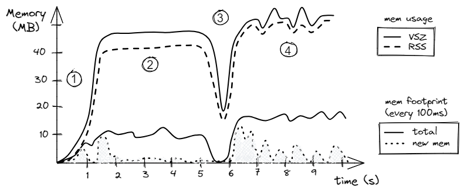
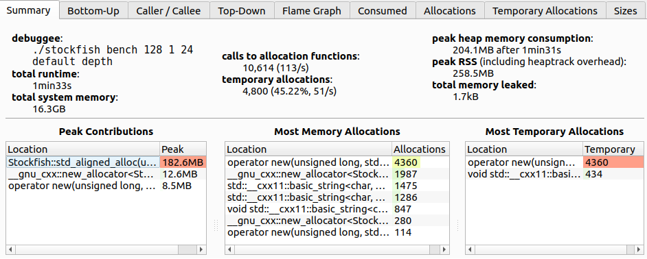
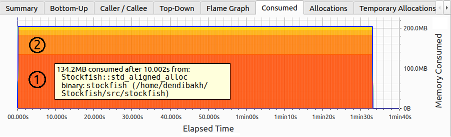
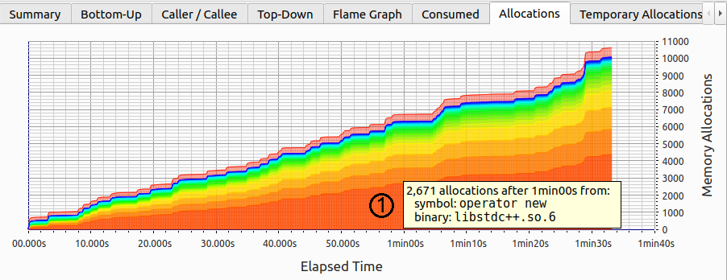
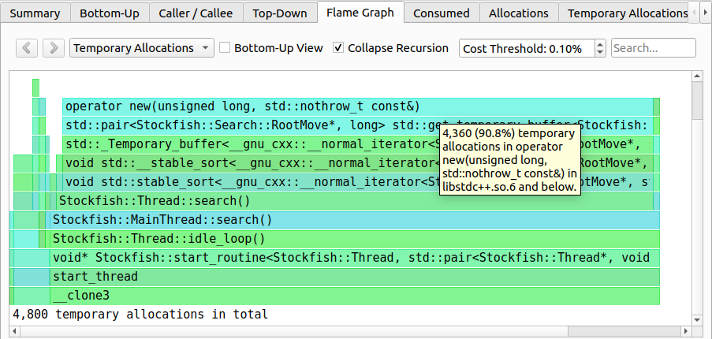
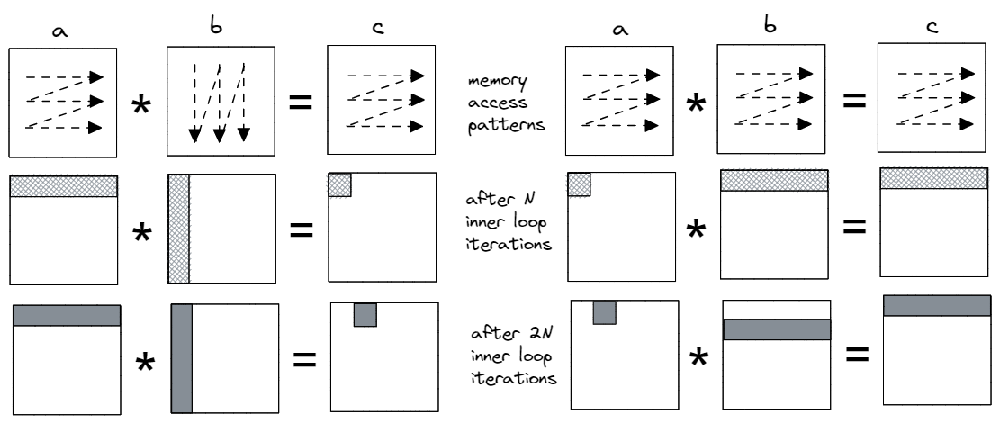
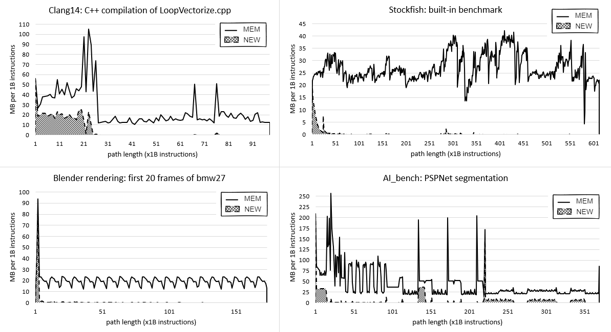
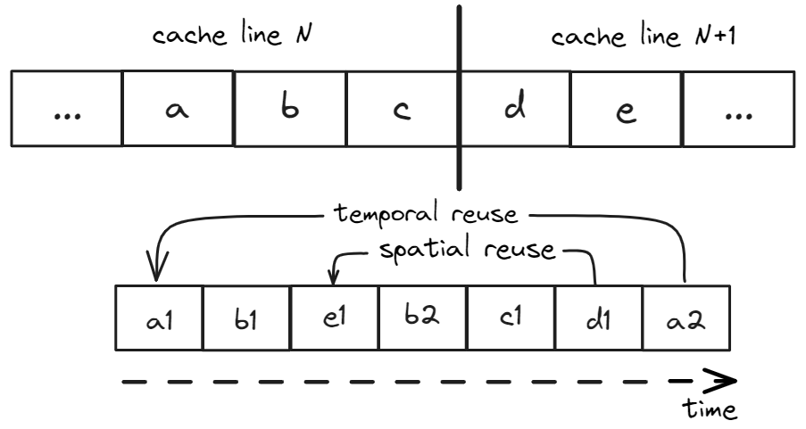
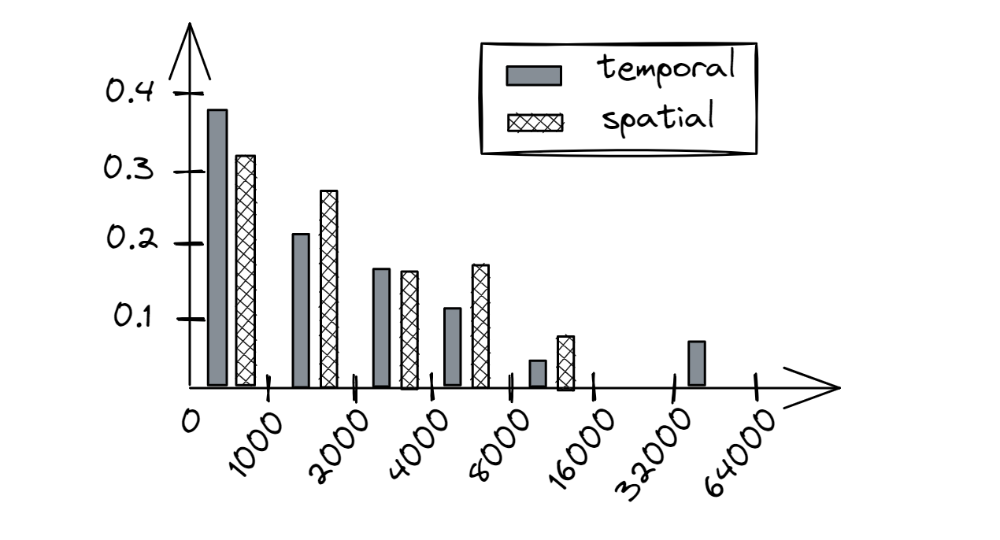

## Memory Profiling {#sec:MemoryProfiling}

So far in this chapter, we have discussed a few techniques to optimize memory accesses in a particular piece of code. In this section, we will learn how to collect high-level information about a program's interaction with memory. This process is usually called *memory profiling*. Memory profiling helps you understand how an application uses memory over time and helps you build the right mental model of a program's behavior. Here are some questions it can answer:

* What is a program's total memory consumption and how it changes over time?
* Where and when does a program make heap allocations?
* What are the code places with the largest amount of allocated memory?
* How much memory a program accesses every second?

When developers talk about memory consumption, they implicitly mean heap usage. Heap is, in fact, the biggest memory consumer in most applications as it accommodates all dynamically allocated objects. But heap is not the only memory consumer. For completeness, let's mention others:

* Stack: Memory used by frame stacks in an application. Each thread inside an application gets its own stack memory space. Usually, the stack size is only a few MB, and the application will crash if it exceeds the limit. The total stack memory consumption is proportional to the number of threads running in the system. [TODO]: give concrete examples for Linux, Windows, macOS.
* Code: Memory that is used to store the code (instructions) of an application and its libraries. In most cases, it doesn't contribute much to the memory consumption but there are exceptions. For example, the Clang C++ compiler and Chrome browser have large codebases and tens of MB code sections in their binaries. We show how to measure code footprint in [@sec:CodeFootprint]. [TODO]: give concrete examples for example for Windows Chrome binary.

Next, we will introduce the terms *memory usage* and *memory footprint* and see how to profile both.

### Memory Usage and Footprint

Memory usage is frequently described by Virtual Memory Size (VSZ) and Resident Set Size (RSS). VSZ includes all memory that a process can access, e.g., stack, heap, the memory used to encode instructions of an executable, and instructions from linked shared libraries, including the memory that is swapped out to disk. On the other hand, RSS measures how much memory allocated to a process resides in RAM. Thus, RSS does not include memory that is swapped out or was never touched yet by that process. Also, RSS does not include memory from shared libraries that were not loaded to memory.

[TODO]: mention that on Windows VSZ relates to Committed Memory Size and RSZ relates to Working Set.

Consider an example. Process `A` has 200K of stack and heap allocations of which 100K resides in the main memory, the rest is swapped out or unused. It has a 500K binary, from which only 400K was touched. Process `A` is linked against 2500K of shared libraries and has only loaded 1000K in the main memory.

```
VSZ: 200K + 500K + 2500K = 3200K
RSS: 100K + 400K + 1000K = 1500K
```

An example of visualizing the memory usage and footprint of a hypothetical program is shown in Figure @fig:MemUsageFootprint. The intention here is not to examine statistics of a particular program, but rather to set the framework for analyzing memory profiles. Later in this chapter, we will examine a few tools that let us collect such information.

[TODO]: "The solid line track" there are two solid lines. The legends work, but I suggest you use different types of lines or symbols for data points, or two separate figures.

{#fig:MemUsageFootprint width=90%}

Let's first look at the memory usage (upper two lines). As we would expect, the RSS is always less or equal to the VSZ. Looking at the chart, we can spot four phases in the program. Phase \circled{1} is the ramp-up of the program during which it allocates its memory. Phase \circled{2} is when the algorithm starts using this memory, notice that the memory usage stays constant. During phase \circled{3}, the program deallocates part of the memory and then allocates a slightly higher amount of memory. Phase \circled{4} is a lot more chaotic than phase \circled{2} with many objects allocated and deallocated. Notice, that the spikes in VSZ are not necessarily followed by corresponding spikes in RSS. That might happen when the memory was reserved by an object but never used.

[TODO]: restructure text in the follwoing form:
Phase 1: is the ramp-up of the program during which it allocates its memory.
Phase 2: ...

Now let's switch to *memory footprint*. It defines how much memory a process touches during a period, e.g., in MB per second. In our hypothetical scenario, visualized in Figure @fig:MemUsageFootprint, we plot memory usage per 100 milliseconds (10 times per second). The solid line tracks the number of bytes accessed during each 100 ms interval. Here, we don't count how many times a certain memory location was accessed. That is, if a memory location was loaded twice during a 100ms interval, we count the touched memory only once. For the same reason, we cannot aggregate time intervals. For example, we know that during the phase \circled{2}, the program was touching roughly 10MB every 100ms. However, we cannot aggregate ten consecutive 100ms intervals and say that the memory footprint was 100 MB per second because the same memory location could be loaded in adjacent 100ms time intervals. It would be true only if the program never repeated memory accesses within each of 1s intervals.

The dashed line tracks the size of the unique data accessed since the start of the program. Here, we count the number of bytes accessed during each 100 ms interval that have never been touched before by the program. For the first second of the program's lifetime, most of the accesses are unique, as we would expect. In the second phase, the algorithm starts using the allocated buffer. During the time interval from 1.3s to 1.8s, the program accesses most of the locations in the buffer, e.g., it was the first iteration of a loop in the algorithm. That's why we see a big spike in the newly seen memory locations from 1.3s to 1.8s, but we don't see many unique accesses after that. From the timestamp 2s up until 5s, the algorithm mostly utilizes an already-seen memory buffer and doesn't access any new data. However, the behavior of phase \circled{4} is different. First, during phase \circled{4}, the algorithm is more memory intensive than in phase \circled{2} as the total memory footprint (solid line) is roughly 15 MB per 100 ms. Second, the algorithm accesses new data (dashed line) in relatively large bursts. Such bursts may be related to the allocation of new memory regions, working on them, and then deallocating them.

We will show how to obtain such charts in the following two case studies, but for now, you may wonder how this data can be used. Well, first, if we sum up unique bytes (dotted lines) accessed during every interval, we will get the total memory footprint of a program. Also, by looking at the chart, you can observe phases and correlate them with the code that is running. Ask yourself: "Does it look according to your expectations, or the workload is doing something sneaky?" You may encounter unexpected spikes in memory footprint. Memory profiling techniques that we will discuss in this section do not necessarily point you to the problematic places similar to regular hotspot profiling but they certainly help you better understand the behavior of a workload. On many occasions, memory profiling helped identify a problem or served as an additional data point to support the conclusions that were made during regular profiling.

In some scenarios, memory footprint helps us estimate the pressure on the memory subsystem. For instance, if the memory footprint is small, say, 1 MB/s, and the RSS fits into the L3 cache, we might suspect that the pressure on the memory subsystem is low; remember that available memory bandwidth in modern processors is in GB/s and is getting close to 1 TB/s. On the other hand, when the memory footprint is rather large, e.g., 10 GB/s and the RSS is much bigger than the size of the L3 cache, then the workload might put significant pressure on the memory subsystem.

### Case Study: Memory Usage of Stockfish

Now, let's take a look at how to profile the memory usage of a real-world application. We will use [heaptrack](https://github.com/KDE/heaptrack)[^2], an open-sourced heap memory profiler for Linux developed by KDE. Ubuntu users can install it very easily with `apt install heaptrack heaptrack-gui`. Heaptrack can find places in the code where the largest and most frequent allocations happen among many other things. On Windows, you can use [Mtuner](https://github.com/milostosic/MTuner)[^3] which has similar capabilities as Heaptrack.

As an example, we took Stockfish's built-in benchmark, which we have already analyzed in Chapter 4. As before, we compiled it using the Clang 15 compiler with `-O3 -mavx2` options. We collected the Heaptrack memory profile of a single-threaded Stockfish built-in benchmark on an Intel Alderlake i7-1260P processor using the following command:

```bash
$ heaptrack ./stockfish bench 128 1 24 default depth
```

Figure @fig:StockfishSummary shows us a summary view of the Stockfish memory profile. Here are some interesting facts we can learn from it:

- The total number of allocations is 10614.
- Almost half of the allocations are temporary, i.e., allocations that are directly followed by their deallocation.
- Peak heap memory consumption is 204 MB.
- `Stockfish::std_aligned_alloc` is responsible for the largest portion of the allocated heap space (182 MB). But it is not among the most frequent allocation spots (middle table), so it is likely allocated once and stays alive until the end of the program.
- Almost half of all the allocation calls come from `operator new`, which are all temporary allocations. Can we get rid of temporary allocations?
- Leaked memory is not a concern for this case study.

{#fig:StockfishSummary width=90%}

Notice, that there are many tabs on the top of the image; next, we will explore some of them. Figure @fig:StockfishMemUsage shows the memory usage of the Stockfish built-in benchmark. The memory usage stays constant at 200 MB throughout the entire run of the program. Total consumed memory is broken into slices, e.g., regions 1 and 2 on the image. Each slice corresponds to a particular allocation. Interestingly, it was not a single big 182 MB allocation that was done through `Stockfish::std_aligned_alloc` as we thought earlier. Instead, there are two: slice \circled{1} 134.2 MB and slice \circled{2} 48.4 MB. Though both allocations stay alive until the very end of the benchmark. 

{#fig:StockfishMemUsage width=80%}

Does it mean that there are no memory allocations after the startup phase? Let's find out. Figure @fig:StockfishAllocations shows the accumulated number of allocations over time. Similar to the consumed memory chart (Figure @fig:StockfishMemUsage), allocations are sliced according to the accumulated number of memory allocations attributed to each function. As we can see, new allocations keep coming from not just a single place, but many. The most frequent allocations are done through `operator new` that corresponds to region \circled{1} on the image.

Notice, there are new allocations at a steady pace throughout the life of the program. However, as we just saw, memory consumption doesn't change; how is that possible? Well, it can be possible if we deallocate previously allocated buffers and allocate new ones of the same size (also known as *temporary allocations*).

{#fig:StockfishAllocations width=80%}

Since the number of allocations is growing but the total consumed memory doesn't change, we are dealing with temporary allocations. Let's find out where in the code they are coming from. It is easy to do with the help of a flame graph shown in Figure @fig:StockfishFlamegraph. There are 4800 temporary allocations in total with 90.8% of those coming from `operator new`. Thanks to the flame graph we know the entire call stack that leads to 4360 temporary allocations. Interestingly, those temporary allocations are initiated by `std::stable_sort` which allocates a temporary buffer to do the sorting. One way to get rid of those temporary allocations would be to use an in-place stable sorting algorithm. However, by doing so we observed an 8% drop in performance, so we discarded this change.

{#fig:StockfishFlamegraph width=80%}

Similar to temporary allocations, you can also find the paths that lead to the largest allocations in a program. In the dropdown menu at the top, you would need to select the "Consumed" flame graph. We encourage readers to explore other tabs as well.

### Analyzing Memory Footprint with SDE

Now let's take a look at how we can estimate the memory footprint. In this section, we will warm up by measuring the memory footprint of a simple program. In the next section, we will examine the memory footprint of four production workloads.

Consider a simple naive matrix multiplication code presented in [@lst:MemFootprint] on the left. The code multiplies two square 4Kx4K matrices `a` and `b` and writes the result into square 4Kx4K matrix `c`. Recall that to calculate one element of the result matrix `c`, we need to calculate the dot product of a corresponding row in the matrix `a` and a column in matrix `b`; this is what the innermost loop over `k` is doing.

Listing: Applying loop interchange to naive matrix multiplication code.

~~~~ {#lst:MemFootprint .cpp}
constexpr int N = 1024*4;                      // 4K
std::array<std::array<float, N>, N> a, b, c;   // 4K x 4K matrices
// init a, b, c
for (int i = 0; i < N; i++) {               for (int i = 0; i < N; i++) { 
  for (int j = 0; j < N; j++) {        =>     for (int k = 0; k < N; k++) {
    for (int k = 0; k < N; k++)        =>       for (int j = 0; j < N; j++) {
      c[i][j] += a[i][k] * b[k][j];               c[i][j] += a[i][k] * b[k][j];
    }                                           }
  }                                           }
}                                           }
~~~~~~~~~~~~~~~~~~~~~~~~~~~~~~~~~~~~~~~~~~~~~~~~~

To demonstrate the memory footprint reduction, we applied a simple loop interchange transformation that swaps the loops over `j` and `k` (lines marked with `=>`). Once we measure the memory footprint and compare it between the two versions, it will be easy to see the difference. The visual result of the change in memory access pattern is shown in Figure @fig:MemFootprint. We went from calculating each element of matrix `c` one by one to calculating partial results while maintaining row-major traversal in all three matrices. 

In the original code (on the left), matrix `b` is accessed in a column-major way, which is not cache-friendly. Look at the picture and observe the memory regions that are touched after the first N iterations of the inner loop. We calculate the dot product of row 0 in `a` and column 0 in `b`, and save it into the first element in matrix `c`. During the next N iterations of the inner loop, we access the same row 0 in `a` and column 1 in `b` to get the second result in matrix `c`.

In the transformed code on the right, the inner loop accesses just a single element in the matrix `a`. We multiply it by all the elements in the corresponding row in `b` and accumulate products into the corresponding row in `c`. Thus, the first N iterations of the inner loop calculate products of element 0 in `a` and row 0 in `b` and accumulate partial results in row 0 in `c`. Next N iterations multiply element 1 in `a` and row 1 in `b` and, again, accumulate partial results in row 0 in `c`.

{#fig:MemFootprint width=90%}

Let's confirm it with Intel [SDE](https://www.intel.com/content/www/us/en/developer/articles/tool/software-development-emulator.html)[^1], Software Development Emulator tool for x86-based platforms. SDE is built upon the dynamic binary instrumentation mechanism, which enables intercepting every single instruction. It comes with a huge cost. For the experiment we run, a slowdown of 100x is common.

To prevent compiler interference in our experiment, we disabled vectorization and unrolling optimizations, so that each version has only one hot loop with exactly 7 assembly instructions. We use this to uniformly compare memory footprint intervals. Instead of time intervals, we use intervals measured in machine instructions. The command line we used to collect memory footprint with SDE, along with the part of its output, is shown in [@lst:MemFootprintMatmul]. Notice we use the `-fp_icount 28K` option which indicates measuring memory footprint for each interval of 28K instructions. This value is specifically chosen because it matches one iteration of the inner loop in "before" and "after" cases: `4K inner loop iterations * 7 instructions = 28K`.

By default, SDE measures footprint in cache lines (64 KB), but it can also measure it in memory pages (4KB on x86). We combined the output and put it side by side. Also, a few non-relevant columns were removed from the output. The first column `PERIOD` marks the start of a new interval of 28K instructions. The difference between each period is 28K instructions. The column `LOAD` tells how many cache lines were accessed by load instructions. Recall from the previous discussion, the same cache line accessed twice counts only once. Similarly, the column `STORE` tells how many cache lines were stored. The column `CODE` counts accessed cache lines that contain instructions that were executed during that period. Finally, `NEW` counts cache lines touched during a period, that were not seen before by the program.

Important note before we proceed: the memory footprint reported by SDE does not equal to utilized memory bandwidth. It is because it doesn't account for whether a memory operation was served from cache or memory.

Listing: Memory footprint of naive Matmul (left) and with loop interchange (right)

~~~~ {#lst:MemFootprintMatmul .cpp}
$ sde64 -footprint -fp_icount 28K -- ./matrix_multiply.exe

============================= CACHE LINES =============================
PERIOD    LOAD  STORE  CODE  NEW   |   PERIOD    LOAD  STORE  CODE  NEW
-----------------------------------------------------------------------
...                                    ...
2982388   4351    1     2   4345   |   2982404   258    256    2    511
3011063   4351    1     2      0   |   3011081   258    256    2    256
3039738   4351    1     2      0   |   3039758   258    256    2    256
3068413   4351    1     2      0   |   3068435   258    256    2    256
3097088   4351    1     2      0   |   3097112   258    256    2    256
3125763   4351    1     2      0   |   3125789   258    256    2    256
3154438   4351    1     2      0   |   3154466   257    256    2    255
3183120   4352    1     2      0   |   3183150   257    256    2    256
3211802   4352    1     2      0   |   3211834   257    256    2    256
3240484   4352    1     2      0   |   3240518   257    256    2    256
3269166   4352    1     2      0   |   3269202   257    256    2    256
3297848   4352    1     2      0   |   3297886   257    256    2    256
3326530   4352    1     2      0   |   3326570   257    256    2    256
3355212   4352    1     2      0   |   3355254   257    256    2    256
3383894   4352    1     2      0   |   3383938   257    256    2    256
3412576   4352    1     2      0   |   3412622   257    256    2    256
3441258   4352    1     2   4097   |   3441306   257    256    2    257
3469940   4352    1     2      0   |   3469990   257    256    2    256
3498622   4352    1     2      0   |   3498674   257    256    2    256
...
~~~~~~~~~~~~~~~~~~~~~~~~~~~~~~~~~~~~~~~~~~~~~~~~~

Let's discuss the numbers that we see in [@lst:MemFootprintMatmul]. Look at the period that starts at instruction `2982388` on the left. That period corresponds to the first 4096 iterations of the inner loop in the original Matmul program. SDE reports that the algorithm has loaded 4351 cache lines during that period. Let's do the math and see if we get the same number. The original inner loop accesses row 0 in matrix `a`. Remember that the size of `float` is 4 bytes and the size of a cache line is 64 bytes. So, for matrix `a`, the algorithm loads `(4096 * 4 bytes) / 64 bytes = 256` cache lines. For matrix `b`, the algorithm accesses column 0. Every element resides on its own cache line, so for matrix `b` it loads 4096 cache lines. For matrix `c`, we accumulate all products into a single element, so 1 cache line is *stored* in matrix `c`. We calculated `4096 + 256 = 4352` cache lines loaded and 1 cache line stored. The difference in one cache line may be related to SDE starting counting 28K instruction interval not at the exact start of the first inner loop iteration. We see that there were two cache lines with instructions (`CODE`) accessed during that period. The seven instructions of the inner loop reside in a single cache line, but the 28K interval may also capture the middle loop, making it two cache lines in total. Lastly, since all the data that we access haven't been seen before, all the cache lines are `NEW`.

Now let's switch to the next 28K instructions period (`3011063`), which corresponds to the second set of 4096 iterations of the inner loop in the original Matmul program. We have the same number of `LOAD`, `STORE`, and `CODE` cache lines as in the previous period, which is expected. However, there are no `NEW` cache lines touched. Let's understand why that happens. Look again at the Figure @fig:MemFootprint. The second set of 4096 iterations of the inner loop accesses row 0 in matrix `a` again. But it also accesses column 1 in matrix `b`, which is new, but these elements reside on the same set of cache lines as column 0, so we have already touched them in the previous 28K period. The pattern repeats through 14 subsequent periods. Each cache line contains `64 bytes / 4 bytes (size of float) = 16` elements, which explains the pattern: we fetch a new set of cache lines in matrix `b` every 16 iterations. The last remaining question is why we have 4097 `NEW` lines after the first 16 iterations of the inner loop. The answer is simple: the algorithm keeps accessing row 0 in the matrix `a`, so all those new cache lines come from matrix `b`.

For the transformed version, the memory footprint looks much more consistent with all periods having very similar numbers, except the first. In the first period, we access 1 cache line in the matrix `a`; `(4096 * 4 bytes) / 64 bytes = 256` cache lines in `b`; `(4096 * 4 bytes) / 64 bytes = 256` cache line are stored into `c`, a total of 513 lines. Again, the difference in results is related to SDE starting counting 28K instruction interval not at the exact start of the first inner loop iteration. In the second period (`3011081`), we access the same cache line from matrix `a`, a new set of 256 cache lines from matrix `b`, and the same set of cache lines from matrix `c`. Only the lines from matrix `b` have not been seen before, that is why the second period has `NEW` 256 cache lines. The period that starts with the instruction `3441306` has 257 `NEW` lines accessed. One additional cache line comes from accessing element `a[0][17]` in the matrix `a`, as it hasn't been accessed before.

In the two scenarios that we explored, we confirmed our understanding of the algorithm by the SDE output. But be aware that you cannot tell whether the algorithm is cache-friendly just by looking at the output of the SDE footprint tool. In our case, we simply looked at the code and explained the numbers fairly easily. But without knowing what the algorithm is doing, it's impossible to make the right call. Here's why. The L1 cache in modern x86 processors can only accommodate up to ~1000 cache lines. When you look at the algorithm that accesses, say, 500 lines per 1M instructions, it may be tempting to conclude that the code must be cache-friendly, because 500 lines can easily fit into the L1 cache. But we know nothing about the nature of those accesses. If those accesses are made randomly, such code is far from being "friendly". The output of the SDE footprint tool merely tells us how much memory was accessed, but we don't know whether those accesses hit caches or not.

### Case Study: Memory Footprint of Four Workloads

In this case study we will use the Intel SDE tool to analyze the memory footprint of four production workloads: Blender ray tracing, Stockfish chess engine, Clang++ compilation, and AI_bench PSPNet segmentation. We hope that this study will give you an intuition of what you could expect to see in real-world applications. In the previous section, we collected memory footprint per intervals of 28K instructions, which is too small for applications running hundreds of billions of instructions. So, we will measure footprint per one billion instructions.

Figure @fig:MemFootCaseStudyFourBench shows the memory footprint of four selected workloads. You can see they all have very different behavior. Clang compilation has very high memory activity at the beginning, sometimes spiking to 100MB per 1B instructions, but after that, it decreases to about 15MB per 1B instructions. Any of the spikes on the chart may be concerning to a Clang developer: are they expected? Could they be related to some memory-hungry optimization pass? Can the accessed memory locations be compacted?

{#fig:MemFootCaseStudyFourBench width=100%}

The Blender benchmark is very stable; we can clearly see the start and the end of each rendered frame. This enables us to focus on just a single frame, without looking at the entire 1000+ frames. The Stockfish benchmark is a lot more chaotic, probably because the chess engine crunches different positions which require different amounts of resources. Finally, the AI_bench memory footprint is very interesting as we can spot repetitive patterns. After the initial startup, there are five or six sine waves from `40B` to `95B`, then three regions that end with a sharp spike to 200MB, and then again three mostly flat regions hovering around 25MB per 1B instructions. All this could be actionable information that can be used to optimize the application.

There could still be some confusion about instructions as a measure of time, so let us address that. You can approximately convert the timeline from instructions to seconds if you know the IPC of the workload and the frequency at which a processor was running. For instance, at IPC=1 and processor frequency of 4GHz, 1B instructions run in 250 milliseconds, at IPC=2, 1B instructions run in 125 ms, and so on. This way, you can convert the X-axis of a memory footprint chart from instructions to seconds. But keep in mind, that it will be accurate only if the workload has a steady IPC and the frequency of the CPU doesn't change while the workload is running.

### Data Locality and Reuse Distances

As you have seen from the previous case studies, there is a lot of information you can extract using modern memory profiling tools. Still, there are limitations which we will discuss next.

Consider memory footprint charts, shown in Figure @fig:MemFootCaseStudyFourBench. Such charts tell us how many bytes were accessed during periods of 1B instructions. However, looking at any of these charts, we couldn't tell if a memory location was accessed once, twice, or a hundred times during a period of 1B instructions. Each recorded memory access simply contributes to the total memory footprint for an interval, and is counted once per interval. Knowing how many times per interval each of the bytes was touched, would give us *some* intuition about memory access patterns in a program. For example, we can estimate the size of the hot memory region and see if it fits into the L3.

However, even this information is not enough to fully assess the temporal locality of the memory accesses. Imagine a scenario, where we have an interval of 1B instructions during which all memory locations were accessed two times. Is it good or bad? Well, we don't know because what matters is the distance between the first (use) and the second access (reuse) to each of those locations. If the distance is small, e.g., less than the number of cache lines that the L1 cache can keep (which is roughly 1000 today), then there is a high chance the data will be reused efficiently. Otherwise, the cache line with required data may already be evicted in the meantime.

Also, none of the memory profiling methods we discussed so far gave us insights into the spatial locality of a program. Memory usage and memory footprint only tell us how much memory was accessed, but we don't know whether those accesses were sequential, strided, or completely random. We need a better approach.

The topic of temporal and spatial locality of applications has been researched for a long time, unfortunately, as of early 2024, there are no production-quality tools available that would give us such information. The central metric in measuring the data locality of a program is *reuse distance*, which is the number of unique memory locations that are accessed between two consecutive accesses to a particular memory location. Reuse distance shows the likelihood of a cache hit for memory access in a typical least-recently-used (LRU) cache. If the reuse distance of a memory access is larger than the cache size, then the latter access (reuse) is likely to cause a cache miss.

Since a unit of memory access in a modern processor is a cache line, we define two additional terms: *temporal reuse* happens when both use and reuse access exactly the same address and *spatial reuse* occurs when its use and reuse access different addresses that are located in the same cache line. Consider a sequence of memory accesses shown in Figure @fig:ReuseDistances: `a1,b1,e1,b2,c1,d1,a2`, where locations `a`, `b`, and `c` occupy cache line `N`, and locations `d` and `e` reside on subsequent cache line `N+1`. In this example, the temporal reuse distance of access `a2` is four, because there are four unique locations accessed between the two consecutive accesses to `a`, namely, `b`, `c`, `d`, and `e`. Access `d1` is not a temporal reuse, however, it is a spatial reuse since we previously accessed location `e`, which resides on the same cache line as `d`. The spatial reuse distance of access `d1` is two.

Figure @fig:ReuseDistanceHisto provides an example of a reuse distance histogram of a hypothetical program. Its X-axis is clustered in `log2` bins each scaled by 1000. The Y-axis provides the rate of occurrence, i.e., how frequently we observed a certain reuse distance. Ideally, we would like to see all of the accesses in the first bin [0;1000], for both temporal and spatial reuses. For instance, for sequential access to a large array, we would see a big temporal reuse distance (bad), but a small spatial reuse distance (good). For a program that traverses a binary tree of 1000 elements (fits in L1 cache) many times, we would see relatively small temporal reuse distance (good), but big spatial reuse distance (bad). Random accesses to a large buffer represent both bad temporal and spatial locality. As a general rule, if a memory access has either a small temporal *or* spatial reuse distance, then it is likely to hit CPU caches. Consequently, if an access has both big temporal *and* big spatial reuse distances, then it is likely to miss CPU caches. 

<div id="fig:TemporalSpatialReuse">
{#fig:ReuseDistances width=50%}
{#fig:ReuseDistanceHisto width=45%}

Temporal and spatial reuse.
</div>

Several tools were developed during the years that attempt to analyze the temporal and spatial locality of programs. Here are the three most recent tools along with their short description and current state:

- **loca**, a reuse distance analysis tool implemented using PIN binary-instrumentation tool. It prints reuse distance histograms for an entire program, however it can't provide a similar breakdown for individual loads. Since it uses dynamic binary instrumentation, it incurs huge runtime (~50x) and memory (~40x) overheads, which makes the tool impractical to use in real-life applications. The tool is no longer maintained and requires some source code modifications to get it working on newer platforms. Github URL: [https://github.com/dcompiler/loca](https://github.com/dcompiler/loca); paper: [@LocaPaper].
- **RDX**, utilizes hardware performance counter sampling with hardware debug registers to produce reuse-distance histograms. In contrast to `loca`, it incurs an order of magnitude smaller overhead while maintaining 90% accuracy. The tool is no longer maintained and there is almost no documentation on how to use the tool. [@RDXpaper]
- **ReuseTracker**, is built upon `RDX`, but it extends it by taking cache-coherence and cache line invalidation effects into account. Using this tool we were able to produce meaningful results on a small program, however, it is not production quality yet and is not easy to use. Github URL: [https://github.com/ParCoreLab/ReuseTracker](https://github.com/ParCoreLab/ReuseTracker); paper: [@ReuseTrackerPaper].

Aggregating reuse distances for all memory accesses in a program may be useful in some cases, but future profiling tools should also be able to provide reuse distance histograms for individual loads. Luckily, not every load/store assembly instruction has to be thoroughly analyzed. A performance engineer should first find a problematic load or store instruction using a traditional sampling approach. After that, he/she should be able to request a temporal and spatial reuse distance histogram for that particular operation. Perhaps, it should be a separate collection since it may involve a relatively large overhead.

Temporal and spatial locality analysis provides unique insights that can be used for guiding performance optimizations. However, careful implementation is not straightforward and may become tricky once we start accounting for various cache-coherence effects. Also, a large overhead may become an obstacle to integrating this feature into production profilers.

[^1]: Intel SDE - [https://www.intel.com/content/www/us/en/developer/articles/tool/software-development-emulator.html](https://www.intel.com/content/www/us/en/developer/articles/tool/software-development-emulator.html).
[^2]: Heaptrack - [https://github.com/KDE/heaptrack](https://github.com/KDE/heaptrack).
[^3]: MTuner - [https://github.com/milostosic/MTuner](https://github.com/milostosic/MTuner).