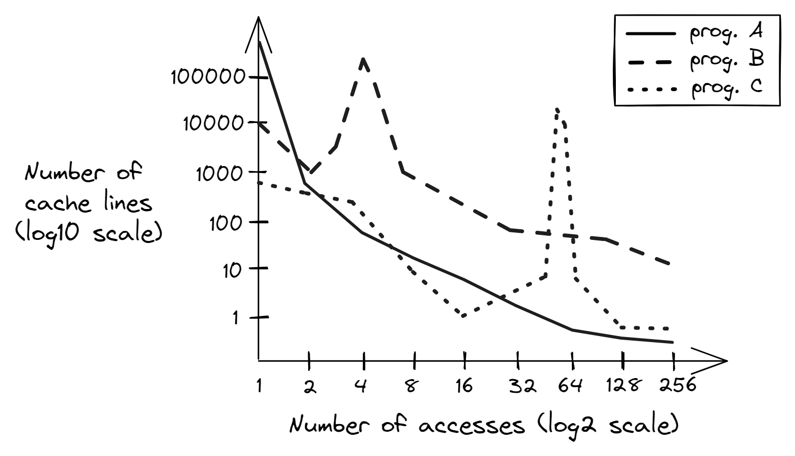

## Memory Profiling {#sec:MemoryProfiling}

So far in this chapter, we have discussed a few techniques to optimize memory accesses in a particular piece of code. In this section, we will learn how to collect high-level information about a program's interaction with memory. This process is usually called *memory profiling*. Memory profiling helps you understand how an application uses memory over time and helps you build the right mental model of a program's behavior. Here are some questions it can answer:

* What is a program's total memory consumption and how it changes over time?
* Where and when a program makes heap allocations?
* What are the code places with the largest amount of allocated memory?
* How much memory a program accesses every second?

When developers talk about memory consumption, they implicitly mean heap usage. Heap is, in fact, the biggest memory consumer in most applications as it accomodates all dynamically allocated objects. But heap is not the only memory consumer. For completeness, let's mention others:

* Stack: Memory used by frame stacks in an application. Each thread inside an application gets its own stack memory space. Usually the stack size is only a few MB, and the application will crush if it exceeds the limit. The total stack memory consumption is proportional to the number of threads running in the system.
* Code: Memory that is used to store the code (instructions) of an application and its libraries. In most cases it doesn't contribute much to the memory consumption but there are exceptions. For example, Clang C++ compiler and chrome have large codebases, and tens of MB code sections in their binaries. We show how to measure code footprint in [@sec:CodeFootprint].

Next, we will introduce terms *memory usage* and *memory footprint* and see how to profile both.

### Memory Usage and Footprint

Memory usage is frequently described by Virtual Memory Size (VSZ) and Resident Set Size (RSS). VSZ includes all memory that a process can access, e.g. stack, heap, the memory used to encode instructions of an executable and instructions from linked shared libraries, including the memory that is swapped out to disk. On the other hand, RSS measures how much memory allocated to a process resides in RAM. Thus, RSS does not include memory that is swapped out or was never touched yet by that process. Also, RSS does not include memory from shared libraries that were not loaded to memory.

Consider an example. Process `A` has 200K of stack and heap allocations of which 100K resides in the main memory, the rest is swapped out or unused. It has a 500K binary, from which only 400K was touched. Process `A` is linked against 2500K of shared libraries and has only loaded 1000K in the main memory.

```
VSZ: 200K + 500K + 2500K = 3200K
RSS: 100K + 400K + 1000K = 1500K
```

Example of visualizing the memory usage and footprint of a hypothetical program is shown in figure @fig:MemUsageFootprint. The intention here is not to examine statistics of a particular program, but rather to set the framework for analyzing memory profiles. Later in this chapter we will examine a few tools that let us collect such information.

Let's first look at the memory usage (upper two lines). As we would expect, the RSS is always less or equal than the VSZ. Looking at the chart, we can spot four phases in the program. Phase \circled{1} is the ramp up of the program during which it allocates its memory. Phase \circled{2} is when the algorithm starts using this memory, notice that the memory usage stays constant. During phase \circled{3}, the program deallocates part of the memory and then allocates a slightly higher amount of memory. Phase \circled{4} is a lot more chaotic than phase \circled{2} with many objects allocated and deallocated. Notice, the spikes in VSZ are not necessary followed by corresponding spikes in RSS. That might happen when the memory was reserved by an object but never used.

{#fig:MemUsageFootprint width=90%}

Now let's switch to *memory footprint*. It defines how much memory a process touches during a period of time, e.g. in MB per second. In our hypothetical scenario, visualized in figure @fig:MemUsageFootprint, we plot memory usage per 100 milliseconds (10 times per second). The solid line tracks the number of bytes accessed during each 100 ms interval. Here, we don't count how many times a certain memory location was accessed. That is, if a memory location was loaded twice during a 100ms interval, we count the touched memory only once. For the same reason, we cannot aggregate time intervals. For example, we know that during the phase \circled{2}, the program was touching roughly 10MB every 100ms. But we cannot aggregate ten consecutive 100ms intervals and say that the memory footprint was 100 MB per second, because the same memory location could be loaded in adjacent 100ms time intervals. It would be true only if the program never repeated memory accesses within each of 1s intervals.

The dashed line tracks the size of the unique data accessed since the start of the program. Here, we count the number of bytes accessed during each 100 ms interval that have never been touched before by the program. For the first second of the program's lifetime, most of the accesses are unique, as we would expect. In the second phase, the algorithm starts using the allocated buffer. During the time interval from 1.3s to 1.8s, the program accesses most of the locations in the buffer, e.g. it was the first iteration of a loop in the algorithm. That's why we see a big spike in the newly seen memory locations from 1.3s to 1.8s, but we don't see many unique accesses after that. From the timestamp 2s up until 5s, the algorithm mostly utilizes already seen memory buffer and doesn't access any new data. However, behavior of phase \circled{4} is different. First, during phase \circled{4}, the algorithm is more memory intensive than in phase \circled{2} as the total memory footprint (solid line) is roughly 15 MB per 100 ms. Second, the algorithm accesses new data (dashed line) in relatively large bursts. Such bursts may be related to allocation of new memory regions, working on them, and then deallocating them.

We will show how to obtain such charts in the following two case studies, but for now, you may wonder how this data can be used. Well, first, if we sum up unique bytes (dotted line) accessed during every interval, we will get a total memory footprint of a program. Also, by looking at the chart, you can observe phases and correlate it with the code that is running. Ask yourself: "Does it look according to your expectations, or the workload is doing something sneaky?" You may encounter unexpected spikes in memory footprint. Memory profiling techniques that we will discuss in this section do not necessary point you to the problematic places similar to regular hotspot profiling but they certainly help you better understand the behavior of a workload. In many occassions, memory profiling helped identify a problem or served as an additional data point to support the conclusions that were made during a regular profiling.

In some scenarios, memory footprint helps us estimate the pressure on the memory subsystem. For instance, if the memory footprint is small, say, 1 MB/s, and the RSS fits into the L3 cache, we might suspect that the pressure on the memory subsystem is low; remember that available memory bandwidth in modern processors is in GB/s and is getting close to 1 TB/s. On the other hand, when the memory footprint is rather large, e.g. 10 GB/s, and the RSS is much bigger than the size of the L3 cache, then the workload might put significant pressure on the memory subsystem.

### Case Study: Memory Usage of Stockfish

Now, let's take a look at how to profile the memory usage of a real-world application. We will use [heaptrack](https://github.com/KDE/heaptrack)[^2], an open-sourced heap memory profiler for Linux developed by KDE. It is not straightforward to build it from sources, luckily most users can install it very easily with e.g. `apt install heaptrack-gui`. Heaptrack can find places where biggest or most frequent allocations happend among many other things. On Windows, you can use [Mtuner](https://github.com/milostosic/MTuner)[^3] which has very similar capabilities as Heaptrack.

As an example, we will take Stockfish built-in benchmark, that we already analyzed in Chapter 4. Let's profile it with Heaptrack to see what we could find. Figure @fig:StockfishSummary shows us a summary view. Here are some interesting facts we can learn from it:

- Total number of allocations is 10614.
- Almost half of the allocations are temporary, i.e. allocations that are directly followed by their deallocation.
- Peak heap memory consumption is 204 MB.
- `Stockfish::std_aligned_alloc` is responsible for the largest portion of the allocated heap space (182 MB). But it is not among the most frequent allocation spots (middle table), so it is likely allocated once and stays alive until the end of the program.
- Almost half of all the allocation calls comes from `operator new`, which are all temporary allocations. Can we get rid of temporary allocations?
- Leaked memory is not interesting for this case study.

{#fig:StockfishSummary width=90%}

Figure @fig:StockfishMemUsage shows the memory usage of Stockfish built-in benchmark. The memory usage stays constant at 200 MB throughout the entire run of the program. Total consumed memory is broken into slices, e.g. regions 1 and 2 on the image. Each slice corresponds to a particular allocation. Interestingly, it was not a single big 182 MB allocation that was done through `Stockfish::std_aligned_alloc` as we hypothesized earlier. Instead, there are two: one 134.2 MB (region 1) and another 48.4 MB (region 2). Though both allocations stay alive until the very end of the benchmark. 

{#fig:StockfishMemUsage width=80%}

Does it mean that there are no memory allocations after the startup phase? Let's find out. Figure @fig:StockfishAllocations shows the accumulated number of allocations over time. This is interesting. There are new allocations at a steady pace throughout the life of the program. How is that possible that consumed memory doesn't change? Well, it can be possible if we deallocate previously allocated buffers and allocate new ones of the same size (aka temporary allocations).

Similar to the consumed memory chart, allocations are sliced according to the accumulated number of allocations attributed to each function. As we can see, new allocations keep coming from not just a single place, but many. The most frequent allocations are done through `operator new` that correspond to region 1 on the image.

{#fig:StockfishAllocations width=80%}

Since the number of allocations is growing but the total consumed memory doesn't change, we are dealing with temporary allocations. Let's find out where in the code they are coming from. It is easy to do with the help of a flame graph showed in figure @fig:StockfishFlamegraph. There are 4800 temporary allocations in total with 91% of those coming from `operator new`. Thanks to the flame graph we know the entire call stack that leads to 4360 temporary allocations. Interestingly, those temporary allocations are initiated by `std::stable_sort` which allocates a temporary buffer to do the sorting. One way to get rid of those temporary allocations would be to use inplace stable sorting algorithm. However, by doing so we observed 8% drop in performance, so this change is bad.

{#fig:StockfishFlamegraph width=80%}

Besides temporary allocations, you can also find the paths that lead to the biggest allocations. In the dropdown menu at the top you would need to select the "Consumed" flame graph.

[TODO]: Double-check that MTuner it can do similar things that heaptrack can.
[TODO]: Do I need a better example than Stockfish? I can also show an example how to find unnecessary reallocations, e.g. opportunities for inserting std::vector.reserve(N) to avoid array migration.

### Case Study: Memory Footprint

Now let's take a look at how we can estimate the memory footprint. For a warmup, let's consider a simple naive matrix multiplication code presented in [@lst:MemFootprint]. The code multiplies two square 4Kx4K matrices `a` and `b` and writes result into square 4Kx4K matrix `c`. Recall that to calculate every element of result matrix `c`, we need to calculate dot product of row in `a` and column in `b`; this is what the innermost loop over `k` is doing.

Listing: Applying loop interchange to naive matrix multiplication code.

~~~~ {#lst:MemFootprint .cpp}
constexpr int N = 1024*4;                      // 4K
std::array<std::array<float, N>, N> a, b, c;   // 4K x 4K matrices
// init a, b, c
for (int i = 0; i < N; i++) {               for (int i = 0; i < N; i++) { 
  for (int j = 0; j < N; j++) {        =>     for (int k = 0; k < N; k++) {
    for (int k = 0; k < N; k++)        =>       for (int j = 0; j < N; j++) {
      c[i][j] += a[i][k] * b[k][j];               c[i][j] += a[i][k] * b[k][j];
    }                                           }
  }                                           }
}                                           }
~~~~~~~~~~~~~~~~~~~~~~~~~~~~~~~~~~~~~~~~~~~~~~~~~

To demonstrate the memory footprint reduction, we applied a simple loop interchange transformation that swaps the two lines marked with `=>`. Once we measure the memory footprint and compare it between the two version, it will be easy to see the difference. The visual result of the change in memory access pattern is shown in figure @fig:MemFootprint. We went from calculating each element of matrix `c` one-by-one to calculating partial results while maintaining row-major traversal in all three matrices. 

In the original code (on the left), matrix `b` is accessed in a column-major way, which we know is not cache-friendly. Look at the picture and observe the cache lines that are touched after the first N iterations of the inner loop. We calculate dot product of row 0 in `a` and *column* 0 in `b`, and save it into the first element in matrix `c`. During the next N iterations of the inner loop, we will access the same row 0 in `a` and column 1 in `b` to get the second result in matrix `c`.

In the transformed code on the right, the inner loop accesses just a single element in matrix `a`. We multiply it by all the elements in corresponding row in `b` and accumulate products into the corresponding row in `c`. Thus, the first N iterations of the inner loop calculate products of element 0 in `a` and row 0 in `b` and accumulate results in row 0 in `c`. Next N iterations multiply element 0 in `a` and row 0 in `b` and accumulate results in row 0 in `c`.

{#fig:MemFootprint width=90%}

Let's confirm the effect under Intel [SDE](https://www.intel.com/content/www/us/en/developer/articles/tool/software-development-emulator.html)[^1], Software Development Emulator tool for x86-based platforms. SDE is built upon the dynamic binary instrumentation mechanism, which allows to intercept every single instruction. It obviously comes with a huge cost. For the experiment we run here, slowdown of 100x is common. 

To prevent compiler interference in our experiment, we disabled vectorization and unrolling optimizations, so that each version has only one hot loop with exactly 7 assembly instructions. We use this to uniformly compare memory footprint intervals. Instead of time intervals, we use intervals measured in machine instructions. Example of running SDE memory footprint tool is shown below. Notice we use `-fp_icount 28K` option which means measure memory footprint for each interval of 28K instructions. This value is specifically choosen, because it matches one iteration of the inner loop in "before" and "after" cases.

SDE measures footprint in cache lines (64 KB) by default, but it can also measure in memory pages (4KB on x86). We combined the output and put it side by side. Also, a few not relevant columns were removed from the output. The first column `PERIOD` marks the start of intervals of 28K instructions. The column `LOAD` tells how many cache lines were accessed by load instructions. Recall from the previous discussion, the same cache line accessed twice counts only once. Similarly, the column `STORE` tells how many cache lines were stored. The column `CODE` counts accessed cache lines that store instructions that were executed during that period. Finally, `NEW` counts cache lines touched during a period, and that were not seen before by the program.

Important note before we proceed, memory footprint reported by SDE does not equal to utilized memory bandwidth. It is because it doesn't account for which memory operations were served from memory.

```
$ sde64 -footprint -fp_icount 28K -- ./matrix_multiply.exe

============================= CACHE LINES =============================
PERIOD    LOAD  STORE  CODE  NEW   |   PERIOD    LOAD  STORE  CODE  NEW
-----------------------------------------------------------------------
...                                    ...
2982388   4351    1     2   4345   |   2982404   258    256    2    511
3011063   4351    1     2      0   |   3011081   258    256    2    256
3039738   4351    1     2      0   |   3039758   258    256    2    256
3068413   4351    1     2      0   |   3068435   258    256    2    256
3097088   4351    1     2      0   |   3097112   258    256    2    256
3125763   4351    1     2      0   |   3125789   258    256    2    256
3154438   4351    1     2      0   |   3154466   257    256    2    255
3183120   4352    1     2      0   |   3183150   257    256    2    256
3211802   4352    1     2      0   |   3211834   257    256    2    256
3240484   4352    1     2      0   |   3240518   257    256    2    256
3269166   4352    1     2      0   |   3269202   257    256    2    256
3297848   4352    1     2      0   |   3297886   257    256    2    256
3326530   4352    1     2      0   |   3326570   257    256    2    256
3355212   4352    1     2      0   |   3355254   257    256    2    256
3383894   4352    1     2      0   |   3383938   257    256    2    256
3412576   4352    1     2      0   |   3412622   257    256    2    256
3441258   4352    1     2   4097   |   3441306   257    256    2    257
3469940   4352    1     2      0   |   3469990   257    256    2    256
3498622   4352    1     2      0   |   3498674   257    256    2    256
...
```

Let's discuss the numbers that we see. For the original code (on the left), in the first period, SDE reports that the algorithm loads 4351 cache lines. Let's do the math and see if we get the same number. The oririnal inner loop accesses row 0 in matrix `a`. Remember that the size of `float` is 4 bytes and the size of a cache line is 64 bytes. So, for matrix `a`, the algorithms loads `(4096 * 4 bytes) / 64 bytes = 256` cache lines. For matrix `b`, the algorithm accesses column 0. Every element resides on it's own cache line, so for matrix `b` it loads 4096 cache lines. We accumulate all products into a single element in `c`, so 1 cache line is *stored* in `c`. We calculated `4096 + 256 = 4352` cache lines loaded and 1 cache line stored. The difference in one cache line may be related to SDE starting counting 28K instruction interval not at exact start of loop iteration. The seven instructions of the inner loop reside in a single cache line, but the 28K interval also captures the middle loop, that's why we see two cache lines (`CODE`) with instructions being accessed. Lastly, since all the data that we access haven't been seen before, all the cache lines are `NEW`.

Now let's switch to the second 28K instructions period. We have the same number of `LOAD`, `STORE`, and `CODE` cache lines, which is expected. However, there are no `NEW` cache lines touched. Let's understand why that happens. Look again at the figure @fig:MemFootprint. The second 4096 iterations of the inner loop will access row 0 in matrix `a` again. But the algorithm accesses column 1, which is new, but these elements reside on the same set of cache lines as column 0, so we have already accessed them in the previous 28K period. The pattern repeats through 14 more periods. Let's see why. In each cache line we have `64 bytes / 4 bytes (float) = 16` elements, which explains the pattern: we fetch new set of cache lines every 16 iterations. The last remaining question is why we have 4097 `NEW` lines after the first 16 iterations of the inner loop? The answer is simple: the algorithm keeps on accessing row 0 in matrix `a`, so all those new cache lines come from matrix `b`.

For the transformed version, it looks much more consistent with all periods having very similar numbers, except the first. In the first period, we access 1 cache line in matrix `a`; `(4096 * 4 bytes) / 64 bytes = 256` cache lines in `b`; `(4096 * 4 bytes) / 64 bytes = 256` cache line are stored into `c`, a total of 513 lines. In the second period, we access the same cache line from matrix `a`, new set of 256 cache lines from matrix `b` and the same set of cache lines from matrix `c`. Only the lines from matrix `b` have not been seen before, that is why the second period has `NEW` 256 cache lines. The period that starts with instruction `3441306` has 257 `NEW` lines accessed. One additional cache line comes from accessing element `a[0][17]` in matrix `a`, that hasn't been acccessed before.

In the two scenarios that we explored, we confirmed our understanding of the algorithm by the SDE output. But be aware that you cannot tell whether the algorithm is cache friendly just by looking at the output of the SDE footprint tool. In our case, we simply looked at the code and explained the numbers fairly easily. But without knowing what the algorithm is doing, it's impossible to make the right call. Here's why. The L1 cache in modern x86 processors can only accomodate up to ~1000 cache lines. When you look at the algorithm that accesses, say, 500 lines per 1M instructions, it may be tempting to conclude that the code must be cache friendly, because 500 lines can easily fit into L1 cache. But we know nothing about the nature of those accesses. If those accesses are made in a random fashion, such code is far being "friendly". The output of the SDE footprint tool merely tells us how much memory was accessed, but we don't know whether those accesses hit in caches or not. You've got to read the next case study for that one.

As an example of what you could expect to see in real applications, Figure @fig:MemFootCaseStudyFourBench shows the memory footprints of four popular benchmarks. You can see they all have very different behavior. Clang compilation has very high memory activity at the beginning, but decreases after that to about 15MB per 1B instructions. As a developer of Clang trying to improve it, I would be concerned about the two spikes around marks `67` and `76` billion instructions. Are those two spikes to 50MB expected? Could they be related to some memory-hungry optimization passes or they correspond to something else?

{#fig:MemFootCaseStudyFourBench width=100%}

Blender benchmark is very stable, where we can clearly see the start and end of rendering of each frame. This basically allows us to concentrate on just a single frame, without looking at the entire 1000+ frames. The Stockfish benchmark is a lot more chaotic, probably because the chess engine crunches different positions which require different amount of resources. Finally, the AI_bench memory footprint is very interesting as we can spot repetitive patterns. After the initial startup, there are five or six humps from `40B` to `95B`, then three regions that end with a sharp spike to 200MB, and then again three mostly flat regions hovering around 25MB per 1B instructions. All this could be actionable information that can be used to optimize the application.

Are you still confused about instructions as a measure of time? Let us address that. You can approximately convert the timeline from instructions to seconds if you know the overall IPC for a workload. For instance, at IPC=1 and processor frequency of 4GHz, 1B instructions run in 250 milliseconds, at IPC=2, 1B instructions run in 125 ms, and so on. You can port a memory footprint chart from MB per 1B instructions to MB/s if you measure the IPC of a workload on the target system and observe CPU frequency while it's running.

### Limitations and Future Research

As you have seen from the two case studies, there is already lots of information you can extract using modern memory profiling tools. Still, there are limitations which we will discuss next.

Consider memory footprint chart, for example, shown in Figure @fig:MemFootCaseStudyFourBench. This chart tells us how many bytes were accessed during periods of 1B instructions. However, it doesn't tell us how many times each of those bytes was touched. Recall that it doesn't matter if a memory location was accessed once or twice during a period of 1B intructions, for memory footprint it will be counted only once. 

A naive solution would be to plot a histogram for each period that will tell us how many cache lines were accessed a certain number of times. This will sched some light on the memory access patterns within a program. Figure @fig:MemFtHist shows what such a histogram might look like for three hypothetical programs. Program A (solid line) has bad temporal locality with most of the accesses never repeated (keep in mind the logarothmic scale on both X and Y axis), e.g. copying or streaming data. Program B (dashed line) has better temporal locality with majority of accesses being repeated 4-5 times, e.g. naive matrix multiplication. Program C (dotted line) reuses the same data ~50 times and has a good temporal locality, e.g. matrix multiplication with loop blocking.

<div id="fig:MemFootprintLimitations">
{#fig:MemFtHist width=45%}
{#fig:ReuseDistances width=45%}

Bla-bla-bla
</div>

Even though such approach gives you some intuition about memory access patterns in a program, it is not enough to fully assess temporal locality of the memory accesses. Suppose we have an interval of 1B instructions during which all memory locations were accessed twice. Is it good or bad? Well, we don't know because what matters is the distance between the first (use) and the second access (reuse) to each of those locations. If the distance is small, e.g. less than the number of cache lines that L1 cache can keep (which is roughly 1000 today), then there is a high chance the data will be reused efficiently. Otherwise, the cache line with required data may already be evicted in the meantime.

Another argument against histograms like the one shown in Figure @fig:MemFtHist, is that analyzing a histogram for every period is very time-consuming. Histograms may vary a lot depending on a time interval. As you can see from Figure @fig:MemFootCaseStudyFourBench, some applications (e.g. Stockfish) have very non-steady behavior.

Finally, none of the approaches we discussed so far gave us insights into spatial locality of a program. Memory usage and memory footprint only tell us how much memory was accessed, but we don't know whether those accesses were sequential, strided or completely random. 

I STOPPED HERE

Keep in mind that memory footprint doesn't tell us how much from the accessed memory was actually hot. For example, if the algorithm touches 10 MB/s, we might be interested to know how much of that was hot, i.e. accessed more frequently than the other. But even if we would know that, say, only 1 MB out of 10 MB was hot, it doesn't tell us how cache-friendly the code is. There could be hundreds of cache lines that were accessed only once but those accesses were not prefeteched by the HW and thus missed in caches and were very expensive. Again, we need a better approach to analyze locality of memory accesses.

[TODO]: give pointers 

[TODO]: From Aditya:
I think people do need temporal and spatial locality information for purposes such as predicting cache misses and deciding code transformations. However, the reason why there are fewer memory profilers supporting locality measurement is probably the difficulty to implement it and the overhead it might introduce. To measure data locality, the profiler needs to read the accessed memory addresses one by one and check if there is an exact match among the addresses or the cache lines. If using binary instrumentation, the overhead will be huge as each memory operation has to be intercepted. So this overhead and practicality problem might discourage developers of profilers from adding this feature.

### Case Study: Temporal And Spatial Locality Analysis 

[TODO]: Describe tracking reuse distances
[TODO]: Can we visualize memory access patterns? Aka memory heatmap over time. Probably no practical tool was ever developed.

[^1]: Intel SDE - [https://www.intel.com/content/www/us/en/developer/articles/tool/software-development-emulator.html](https://www.intel.com/content/www/us/en/developer/articles/tool/software-development-emulator.html).
[^2]: Heaptrack - [https://github.com/KDE/heaptrack](https://github.com/KDE/heaptrack).
[^3]: MTuner - [https://github.com/milostosic/MTuner](https://github.com/milostosic/MTuner).