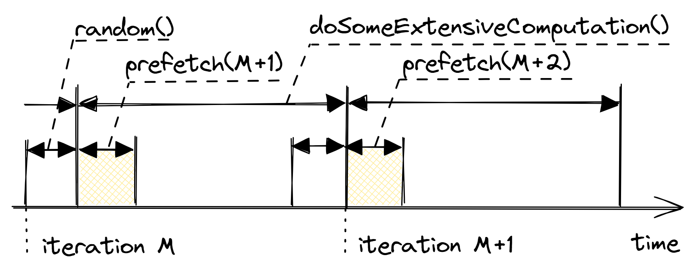

## Explicit Memory Prefetching {#sec:memPrefetch}

By now, you should know that memory accesses not resolved from caches are often very expensive. Modern CPUs try very hard to lower the penalty of cache misses by predicting which memory locations a program will access in the future and prefetch them ahead of time. If the requested memory location is not in the cache at the time a program demands it, then we will suffer the cache miss penalty as we have to go to the DRAM and fetch the data anyway. But if the CPU manages to bring that memory location into caches in time or if the request was predicted and data is underway, then the penalty of a cache miss will be much lower.

Modern CPUs have two automatic mechanisms for solving that problem: hardware prefetching and OOO execution. Hardware prefetchers help to hide the memory access latency by initiating prefetching requests on repetitive memory access patterns. An OOO engine looks `N` instructions into the future and issues loads early to enable the smooth execution of future instructions that will demand this data.

Hardware prefetchers fail when data access patterns are too complicated to predict. And there is nothing software developers can do about it as we cannot control the behavior of this unit. On the other hand, an OOO engine does not try to predict memory locations that will be needed in the future as hardware prefetching does. So, the only measure of success for it is how much latency it was able to hide by scheduling the load in advance.

Consider a small snippet of code in [@lst:MemPrefetch1], where `arr` is an array of one million integers. The index `idx`, which is assigned to a random value, is immediately used to access a location in `arr`, which almost certainly misses in caches as it is random. A hardware prefetcher can't predict it since every time the load goes to a completely new place in memory. The interval from the time the address of a memory location is known (returned from the function `random_distribution`) until the value of that memory location is demanded (call to `doSomeExtensiveComputation`) is called *prefetching window*. In this example, the OOO engine doesn't have the opportunity to issue the load early since the prefetching window is very small. This leads to the latency of the memory access `arr[idx]` to stand on a critical path while executing the loop as shown in Figure @fig:SWmemprefetch1. The program waits for the value to come back (the hatched fill rectangle in the diagram) without making forward progress.

You're probably thinking: "But the next iteration of the loop should start executing speculatively in parallel". That's true, and indeed, it is reflected in Figure @fig:SWmemprefetch1. The `doSomeExtensiveComputation` function requires a lot of work, and when execution gets closer to the finish of the first iteration, a CPU speculatively starts executing an instruction from the second iteration. It creates a positive overlap in the execution between iterations. In fact, we presented an optimistic scenario where a processor was able to generate the next random number and issue a load in parallel with the previous iteration of the loop. However, a CPU wasn't able to fully hide the latency of the load, because it cannot look that far ahead of the current iteration to issue the load early enough. Maybe future processors will have more powerful OOO engines, but for now, there are cases where a programmer's intervention is needed.

Listing: A random number is an index for a subsequent load.

~~~~ {#lst:MemPrefetch1 .cpp}
for (int i = 0; i < N; ++i) {
  size_t idx = random_distribution(generator);
  int x = arr[idx]; // cache miss
  doSomeExtensiveComputation(x);
}
~~~~~~~~~~~~~~~~~~~~~~~~~~~~~~~~~~~~~~~~~~~~~~~~~

{#fig:SWmemprefetch1 width=80%}

Luckily, it's not a dead end as there is a way to speed up this code by fully overlapping the load with the execution of `doSomeExtensiveComputation`, which will hide the latency of a cache miss. We can achieve this with techniques called *software pipelining* and *explicit memory prefetching*. Implementation of this idea is shown in [@lst:MemPrefetch2]. We pipeline generation of random numbers and start prefetching memory location for the next iteration in parallel with `doSomeExtensiveComputation`.

Listing: Utilizing Explicit Software Memory Prefetching hints.

~~~~ {#lst:MemPrefetch2 .cpp}
size_t idx = random_distribution(generator);
for (int i = 0; i < N; ++i) {
  int x = arr[idx]; 
  idx = random_distribution(generator);
  // prefetch the element for the next iteration
  __builtin_prefetch(&arr[idx]);
  doSomeExtensiveComputation(x);
}
~~~~~~~~~~~~~~~~~~~~~~~~~~~~~~~~~~~~~~~~~~~~~~~~~

A graphical illustration of this transformation is shown in Figure @fig:SWmemprefetch2. We utilized software pipelining to generate random numbers for the next iteration. In other words, on iteration `M`, we produce a random number that will be consumed on iteration `M+1`. This enables us to issue the memory request early since we already know the next index in the array. This transformation makes our prefetching window much larger and fully hides the latency of a cache miss. On the iteration `M+1`, the actual load has a very high chance to hit caches, because it was prefetched on iteration `M`.

{#fig:SWmemprefetch2 width=80%}

Notice the usage of [`__builtin_prefetch`](https://gcc.gnu.org/onlinedocs/gcc/Other-Builtins.html),[^4] a special hint that developers can use to explicitly request a CPU to prefetch a certain memory location. Another option is to use compiler intrinsics. For example, on x86 platforms there is `_mm_prefetch` intrinsic, see Intel Intrinsics Guide for more details. In any case, a compiler will generate the `PREFETCH` instruction for x86 and the `pld` instruction for ARM.

There are situations when software memory prefetching is not possible. For example, when traversing a linked list, the prefetching window is tiny and it is not possible to hide the latency of pointer chasing.

In [@lst:MemPrefetch2] we saw an example of prefetching for the next iteration, but also you may frequently encounter a need to prefetch for 2, 4, 8, and sometimes even more iterations. The code in [@lst:MemPrefetch3] is one of those cases when it could be beneficial. It presents a typical code for populating a graph with edges. If the graph is very sparse and has a lot of vertices, it is very likely that accesses to `this->out_neighbors` and `this->in_neighbors` vectors will frequently miss in caches. This happens because every edge is likely to connect new vertices that are not currently in caches.

This code is different from the previous example as there are no extensive computations on every iteration, so the penalty of cache misses likely dominates the latency of each iteration. But we can leverage the fact that we know all the elements that will be accessed in the future. The elements of vector `edges` are accessed sequentially and thus are likely to be timely brought to the L1 cache by the hardware prefetcher. Our goal here is to overlap the latency of a cache miss with executing enough iterations to completely hide it.

As a general rule, for a prefetch hint to be effective, it must be inserted well ahead of time so that by the time the loaded value is used in other calculations, it will be already in the cache. However, it also shouldn't be inserted too early since it may pollute the cache with data that is not used for a long time. Notice, in [@lst:MemPrefetch3], `lookAhead` is a template parameter, which enables a programmer to try different values and see which gives the best performance. More advanced users can try to estimate the prefetching window using the method described in [@sec:timed_lbr]; an example of using this method can be found on the Easyperf blog.[^5]

Listing: Example of a software prefetching for the next 8 iterations.

~~~~ {#lst:MemPrefetch3 .cpp}
template <int lookAhead = 8>
void Graph::update(const std::vector<Edge>& edges) {
  for(int i = 0; i + lookAhead < edges.size(); i++) {
    VertexID v = edges[i].from;
    VertexID u = edges[i].to;
    this->out_neighbors[u].push_back(v);
    this->in_neighbors[v].push_back(u);

    // prefetch elements for future iterations
    VertexID v_next = edges[i + lookAhead].from;
    VertexID u_next = edges[i + lookAhead].to;
    __builtin_prefetch(this->out_neighbors.data() + v_next);
    __builtin_prefetch(this->in_neighbors.data()  + u_next);
  }
  // process the remainder of the vector `edges` ...
}
~~~~~~~~~~~~~~~~~~~~~~~~~~~~~~~~~~~~~~~~~~~~~~~~~

Explicit memory prefetching is most frequently used in loops, but also one can insert those hints into a parent function; again, it all depends on the available prefetching window.

This technique is a powerful weapon, however, it should be used with extreme care as it is not easy to get it right. First of all, explicit memory prefetching is not portable, meaning that if it gives performance gains on one platform, it doesn't guarantee similar speedups on another platform. It is very implementation-specific and platforms are not required to honor those hints. In such a case it will likely degrade performance. My recommendation would be to verify that the impact is positive with all available tools. Not only check the performance numbers but also make sure that the number of cache misses (L3 in particular) went down. Once the change is committed into the code base, monitor performance on all the platforms that you run your application on, as it could be very sensitive to changes in the surrounding code. Consider dropping the idea if the benefits do not outweigh the potential maintenance burden.

For some complicated scenarios, make sure that the code prefetches the right memory locations. It can get tricky when a current iteration of a loop depends on the previous iteration, e.g., there is a `continue` statement or changing the next element to be processed is guarded by an `if` condition. In this case, my recommendation is to instrument the code to test the accuracy of your prefetching hints. Because when used badly, it can degrade the performance of caches by evicting other useful data.

Finally, explicit prefetching increases code size and adds pressure on the CPU Front-End. A prefetch hint is just a fake load that goes into the memory subsystem but does not have a destination register. And just like any other instruction, it consumes CPU resources. Apply it with extreme care, because when used wrong, it can pessimize the performance of a program.

[^4]: GCC builtins - [https://gcc.gnu.org/onlinedocs/gcc/Other-Builtins.html](https://gcc.gnu.org/onlinedocs/gcc/Other-Builtins.html).
[^5]: "Precise timing of machine code with Linux perf" - [https://easyperf.net/blog/2019/04/03/Precise-timing-of-machine-code-with-Linux-perf#application-estimating-prefetch-window](https://easyperf.net/blog/2019/04/03/Precise-timing-of-machine-code-with-Linux-perf#application-estimating-prefetch-window).
