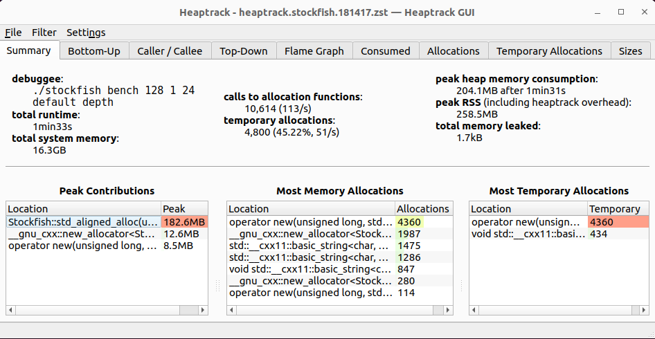
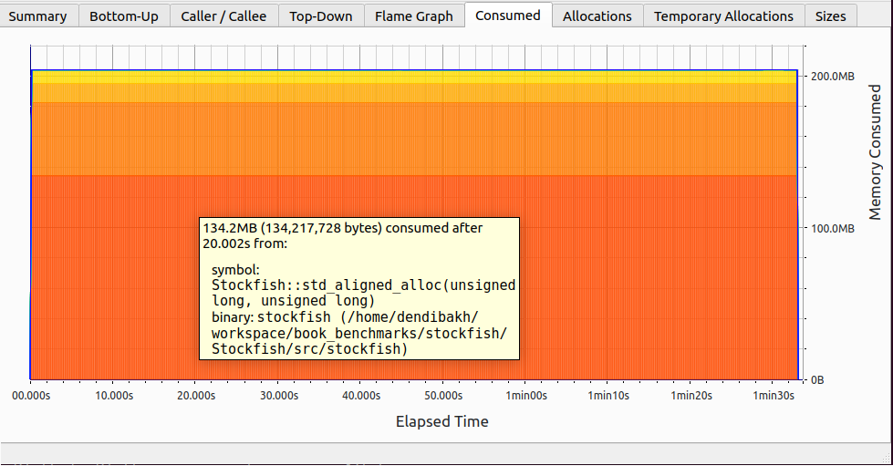
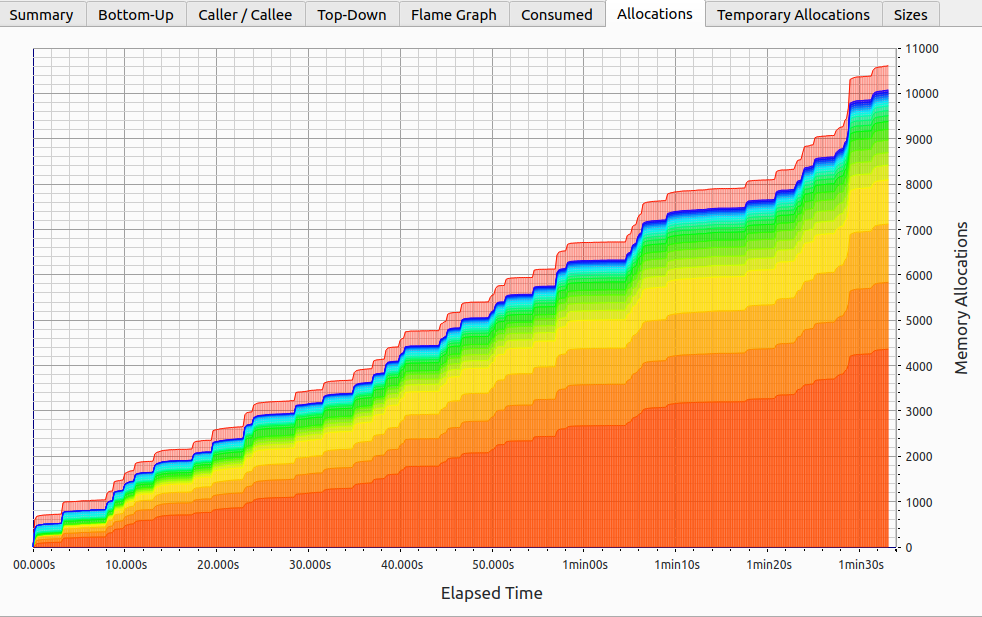

## Memory Profiling

So far in this chapter, we have discussed a few techniques to optimize memory accesses in a particular piece of code. In this section, we will learn how to collect high-level information about a program's interaction with memory. This process is usually called *memory profiling*. Memory profiling allows you to understand how an application interacts with the memory over time. It helps you build the right mental model of a program's behavior and can sched light on many aspects of the execution, for example:

* What is a program's total memory consumption and how it changes over time?
* Where and when a program makes heap allocations?
* What are the code places with the largest amount of allocated space?
* How much memory a program accesses every second?
* And others.

When developers talk about memory consumption, they implicitly mean heap usage. Heap is, in fact, the biggest memory consumer in most applications as it accomodates all dynamically allocated objects. For completeness, let's mention other memory consumers:

* Stack: Memory used by frame stacks in an application. Each application and each thread inside an application gets its own stack. Usually the stack size is only a few MB, and the application will crush if the limit is overflowed. The total stack memory consumption is proportional to the number of threads running in the system.
* Code: Memory that is used to store the code (instructions) of an application and its libraries. In most cases it doesn't contribute much to the memory consumption but there are exceptions. For example, Clang C++ compiler and chrome have large codebases, and tens of MB code sections in their binaries.

Next, we will introduce terms *memory usage* and *memory footprint* and see how to profile both.

### Memory Usage and Footprint

Memory usage is frequently described by Virtual Memory Size (VSZ) and Resident Set Size (RSS). VSZ includes all memory that a process can access, e.g. stack, heap, memory used to encode instructions of an executable and instructions from linked shared libraries, including memory that is swapped out to disk. On the other hand, RSS measures how much memory allocated to a process resides in RAM. Thus, RSS does not include memory that is swapped out or was never touched yet by that process. Also, RSS does not include memory from shared libraries that were not loaded to memory.

Consider an example. Process `A` has 200K of stack and heap allocations of which 100K is actually in memory, the rest is swapped or unused. It has a 500K binary, from which only 400K was touched. Process `A` is linked against 2500K of shared libraries and has only loaded 1000K in the main memory.

```
VSZ: 200K + 500K + 2500K = 3200K
RSS: 100K + 400K + 1000K = 1500K
```

Example of visualizing the memory usage and footprint of a hypothetical program is shown in figure @fig:MemUsageFootprint. The intention of this figure is not to examine statistics of a particular program, but rather to set the framework for analyzing memory profiles. Later in this chapter we will examine a few tools that let us collect these stats.

As we would expect, the RSS is always less or equal than the VSZ. Looking at the chart, we can spot four phases of the program. Phase 1 is the ramp up of the program during which it allocates its memory. Phase 2 is when the algorithm starts using this memory, notice that the memory usage stays constant. During phase 3, the program deallocates part of the memory and then allocates a slightly higher amount of memory. Phase 4 is a lot more chaotic than phase 2 with many objects allocated and deallocated. Notice, the spikes in VSZ are not necessary followed by corresponding spikes in RSS. That might happen when the memory was reserved by an object but never used.

{#fig:MemUsageFootprint width=100%}

Now let's switch to memory footprint. It defines how much memory a process touches during a period of time, e.g. in MB per second. In a hypothetical scenario, visualized on figure @fig:MemUsageFootprint, we plot memory usage per 100 milliseconds. The solid line tracks the total unique memory accessed per 100 ms. Here, we don't count how many times a certain memory location was accessed. That is, if a memory location was loaded twice during a 100ms interval, we count the touched memory only once. For the same reason, we cannot aggregate time intervals. In our example, we know that during the phase 2, the program was touching roughly 10MB every 100ms. But we cannot say that the memory footprint was 100 MB per second, because the same memory location could be loaded in adjacent 100ms time intervals. It would be true only if the program never repeated memory accesses within every one second interval.

The dashed line tracks the size of the unique data accessed since the start of the program. Here, we count the amount of memory that was accessed during 100 ms interval and has never been touched by the program before. For the first second of the program's lifetime, most of the accesses are unique, as we would expect. In the second phase, the algorithm starts using the allocated buffer. During the time interval from 1.3s to 1.8s, most of the buffer locations were touched (e.g. first iteration of the loop), that's why we don't see many unique accesses after that. That means that from the timestamp 2s up until 5s, the algorithm mostly utilizes already seen memory buffer and doesn't access any new data. However, behavior of the phase 4 is different. First, the algorithm in phase 4 is more memory intensive as the total memory footprint (solid line) is roughly 15 MB per 100 ms. Second, the algorithm accesses new data (dashed line) in relatively large bursts. Such bursts may be related to allocation of a new memory region, working on it, and then deallocating it.

You may wonder how we can use this data. Well, first, by looking at the chart, you can see observe phases and correlate it with the code that is running. Ask yourself if this goes according to your expectations, or the workload is doing something sneaky. Also, you may encounter unexpected spikes in memory footprint. Memory profiling techniques that we will discuss in this section do not necessary point you to the problematic places similar to regular hotspot profiling but they may help you better understand the behavior of a workload. In many occassions such data served as an additional data point to support the conclusions that we've made about a certain workload.

In some scenarios it can help us estimate the pressure on the memory subsystem. For instance, if the memory footprint is rather small, e.g. 1 MB/s, and the RSS fits into the L3 cache, we might suspect that the pressure on the memory subsystem is low; remember that available memory bandwidth in modern chips is in GB/s and is getting close to 1 TB/s. On the other hand, when the memory footprint is rather large, e.g. 10 GB/s, and the RSS is much bigger than the size of the L3 cache, then the workload might put significant pressure on the memory subsystem.

A few caveats before we proceed to the case studies. Memory usage and memory footprint doesn't tell us anything about temporal and spatial locality of memory accesses. Going back to the example in figure @fig:MemUsageFootprint, within each one second time interval, we only know how much memory was accessed, but we don't know whether those accesses were sequential, strided or completely random. We will address temporal and spatial locality analysis in a later case study.

Also, keep in mind that it doesn't tell us how much from the accessed memory was actually hot. For example, if the algorithm touches 10 MB/s, we might be interested to know how much of that was hot, i.e. accessed more frequently than the other. But even if we would know that, say, only 1 MB out of 10 MB was hot, it doesn't tell us how cache-friendly the code is. There could be hundreds of cache lines that were accessed only once but those accesses were not prefeteched by the HW and thus missed in caches and were very expensive. Again, we need a better approach to analyze locality of memory accesses.

### Case Study: Memory Usage of Stockfish

Now, let's take a look at how to profile the real-world application. As an example, we will take Stockfish, that we already analyzed in Chapter 4. 

[TODO]: showcase `heaptrack`. Mention Mtuner: check that it can do similar things that heaptrack can.
[TODO]: mention it can find opportunities for std::vector.reserve(N)
[TODO]: Do I need a better example than Stockfish. I can also deoptimize 

{#fig:StockfishMemProf1 width=100%}

<div id="fig:Memory Usage and Allocation">
{#fig:StockfishMemProf2 width=45%}

{#fig:StockfishMemProf3 width=45%}

Heaptrack charts.
</div>

### Case Study: Memory Footprint

Listing: Applying loop interchange to naive matrix multiplication code.

~~~~ {#lst:MemFootprint .cpp}
for (int i = 0; i < N; i++) {               for (int i = 0; i < N; i++) { 
  for (int j = 0; j < N; j++) {        =>     for (int k = 0; k < N; k++) {
    for (int k = 0; k < N; k++)        =>       for (int j = 0; j < N; j++) {
      c[i][j] += a[i][k] * b[k][j];               c[i][j] += a[i][k] * b[k][j];
    }                                           }
  }                                           }
}                                           }
~~~~~~~~~~~~~~~~~~~~~~~~~~~~~~~~~~~~~~~~~~~~~~~~~

{#fig:MemFootprint width=100%}

```
============================= CACHE LINES =============================
PERIOD    LOAD  STORE  CODE  NEW   |   PERIOD    LOAD  STORE  CODE  NEW
-----------------------------------------------------------------------
...                                    ...
2982388   4351    1     2   4345   |   2982404   258    256    2    511
3011063   4351    1     2      0   |   3011081   258    256    2    256
3039738   4351    1     2      0   |   3039758   258    256    2    256
3068413   4351    1     2      0   |   3068435   258    256    2    256
3097088   4351    1     2      0   |   3097112   258    256    2    256
3125763   4351    1     2      0   |   3125789   258    256    2    256
3154438   4351    1     2      0   |   3154466   257    256    2    255
3183120   4352    1     2      0   |   3183150   257    256    2    256
3211802   4352    1     2      0   |   3211834   257    256    2    256
3240484   4352    1     2      0   |   3240518   257    256    2    256
3269166   4352    1     2      0   |   3269202   257    256    2    256
3297848   4352    1     2      0   |   3297886   257    256    2    256
3326530   4352    1     2      0   |   3326570   257    256    2    256
3355212   4352    1     2      0   |   3355254   257    256    2    256
3383894   4352    1     2      0   |   3383938   257    256    2    256
3412576   4352    1     2      0   |   3412622   257    256    2    256
3441258   4352    1     2   4097   |   3441306   257    256    2    257
3469940   4352    1     2      0   |   3469990   257    256    2    256
3498622   4352    1     2      0   |   3498674   257    256    2    256
...
```

[TODO]: Here, memory footprint does not equal to utilized memory bandwidth.

[TODO]: Run four different benchmarks, look at their memory footprints.

### Case Study: Temporal And Spatial Locality Analysis 

[TODO]: Describe tracking reuse distances

[TODO]: Can we visualize memory access patterns? Aka memory heatmap over time.