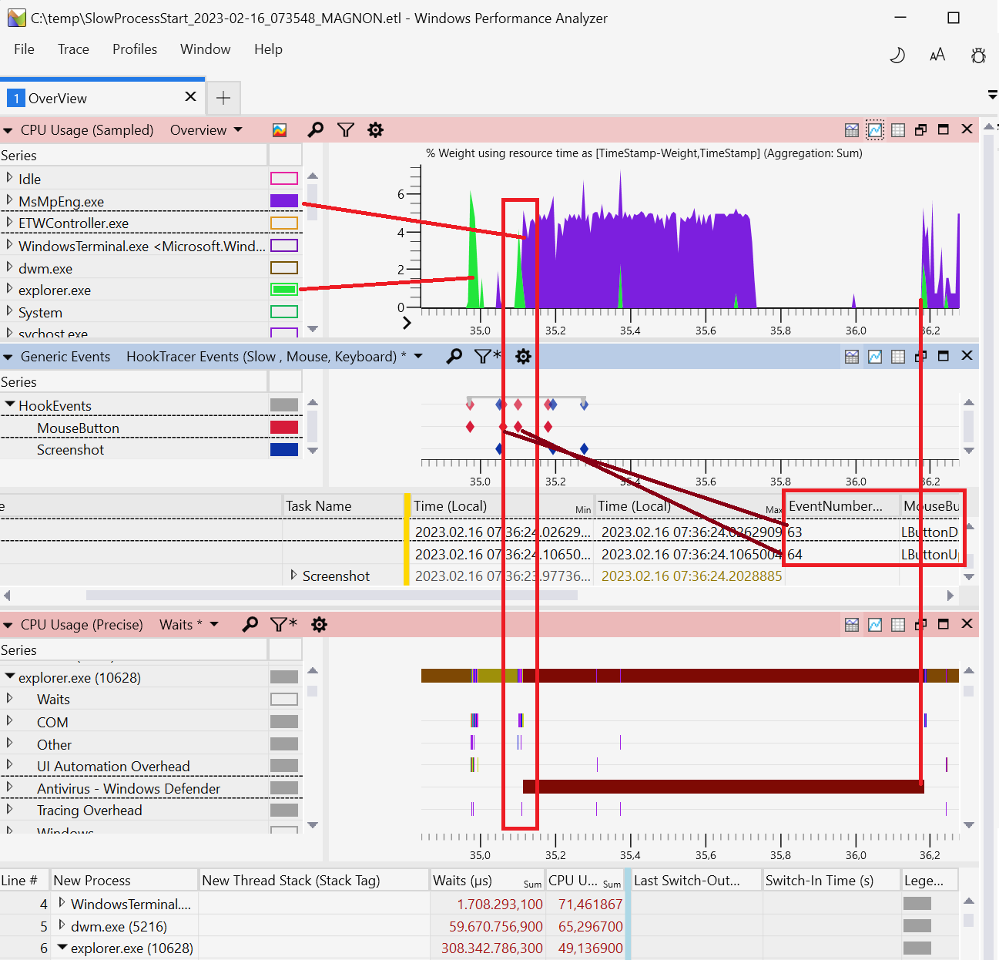

## Event Tracing for Windows

Microsoft has invested in a system-wide tracing facility named Event Tracing for Windows (ETW). The main difference to the many Linux tracers is its ability to write structured events in user and kernel code with full stack trace support. Stack traces are essential to solve many challenging performance issues. They are the difference between knowing that someone did consume all CPU/Disk/Network/... vs. who did it in which source file. ETW is available on all supported Windows platforms (x86, x64 and ARM) with the corresponding platform-dependent installation packages.
 
### What can you do with it: {.unlisted .unnumbered}

- Everything below is recorded system wide for all processes with configurable stack traces (kernel and user mode stacks combined).
- Look at CPU hotspots with a configurable CPU sampling rate from 1/8 ms = 8 kHz up to 10 s = 1/10 Hz. Default is 1ms which costs ca. 5-10% execution performance.
- Who blocks your threads and for how long (e.g. late event signals, unnecessary thread sleeps, ...) with Context Switch traces.
- Find system issues where you need to track multi process causality chains or even cross machine with the help of correlation events to sync timepoints.
- Examine how fast your disk/s serves read/write requests and who initiates that work.
- Check file access performance and patterns (includes cached read/writes which lead to no disk IO).
- Trace the TCP/IP stack how packets flow between network interfaces and computers.
- Add your own ETW Trace provider to correlate the system wide traces with your application behavior.

### What you cannot do with it: {.unlisted .unnumbered}

- Examine CPU bottlenecks in detail. Use VTune which offers much more details how the CPU accesses code and data.
- How often a method was executed. If you instrument your own methods with enter/leave ETW tracing it is possible.
- Record high volume events for hours like thread wait (Context Switch) tracing. ETW records at system level all processes which is great, but generates a lot (ca. 1-2 GB/minute) of data.

### Getting ETW Data

To enable system wide profiling you must be administrator and have the privilege *SeSystemProfilePrivilege* enabled. 

Recording ETW data is possible without any extra download since Windows 10 with Wpr.exe. The \underline{W}indows \underline{P}erformance \underline{R}ecorder tool supports a set of built-in recording profiles which are ok for common performance issues. You can tailor your recording needs by authoring a custom performance recorder profile xml file with the `.wprp` extension.

If you are running Windows 10 or you want not only record but also view the recorded ETW data you need to install the Windows Performance Toolkit.
You can download the Windows Performance Toolkit from the Windows SDK[^1] or ADK[^2] download page. The installation is a two step process. First you download a small installer which you start. There you can select in the SDK Installer UI just the parts of the huge Windows SDK you need. In our case we just enable the checkbox of the Windows Performance Toolkit and install it. You are allowed to redistribute WPT e.g. as part of your own application.

### ETW Recording Tools {.unlisted .unnumbered}

- wpr.exe: a command line recording tool, part of Windows 10 and Windows Performance Toolkit.
- WPRUI.exe: a simple UI for recording ETW data, part of Windows Performance Toolkit
- xperf: a command line predecessor of wpr, part of Windows Performance Toolkit.
- PerfView[^3]: a graphical recording and analysis tool with the main focus on .NET Applications. Open-source by Microsoft.
- Performance HUD[^7]: a little known but very powerful GUI tool to track UI delays, User/Handle leaks via live ETW recording all unbalanced resource allocations with a live display of leaking/blocking stack traces.
- ETWController[^4]: a recording tool with the ability to record keyboard input and screenshots along with ETW data. Supports also distributed profiling on two machines simultaneously. Open-sourced by Alois Kraus.
- UIForETW[^6]: a wrapper around xperf with special options to record data for Google Chrome issues. Can also record keyboard and mouse input. Open-sourced by Bruce Dawson.
  
### ETW Viewing/Analysis Tools {.unlisted .unnumbered}

- Windows Performance Analyzer (WPA): the most powerful UI for viewing ETW data.  WPA can visualize and overlay Disk, CPU, GPU, Network, Memory, Process and many more data sources to get a holistic understanding how your system behaves and what it was doing. Although the UI is very powerful it may also be quite complex for beginners.  WPA supports plugins to process any data, not just ETW traces. Today you can view Linux/Android[^8] profiling data with WPA generated from tools like Linux perf, LTTNG, Perfetto and the following log file formats: dmesg, Cloud-Init, WaLinuxAgent, AndoidLogcat.

- ETWAnalyzer[^5]: reads ETW data and generates aggregate summary Json files which can be queried, filtered and sorted at command line or exported to a CSV file.

- PerfView: mainly used to troubleshoot .NET applications. The ETW events fired for Garbage Collection and JIT compilation are parsed and easily accessible as reports or CSV data. 

Next, we will take a look at the example of using ETWController to capture ETW traces and WPA to visualize them.

### Case Study - Slow Program Start {.unlisted .unnumbered}

**Problem statement:** When double clicking on a downloaded executable in Windows Explorer it is started with a noticeable delay. Something seems to delay process start. What could be the reason for this? Slow disk? 

#### Setup {.unlisted .unnumbered}

- Download a tool to record ETW data and screenshots like ETWController[^4].
- Download the latest Windows 11 Performance Toolkit[^1] to be able to view the data with WPA. Make sure that the newer Win 11 `wpr.exe` comes first in your path by moving the install folder of the WPT before the `C:\\Windows\\system32` in the System Environment dialog. This is how it should look like: 

```
C>where wpr 
C:\Program Files (x86)\Windows Kits\10\Windows Performance Toolkit\wpr.exe
C:\Windows\System32\wpr.exe
```

#### Capture traces {.unlisted .unnumbered}

- Start ETWController
- Select the CSwitch profile to track thread wait times along with the other default recording settings. Keep the check boxes *"Record mouse clicks"* and *"Take cyclic screenshots"* enabled to be later able to navigate to the slow spots with the help of the screen shots. See @fig:ETWControllerUI.
 - Press *"Start Recording"*
 - Download some executable from the internet, unpack it and double click the executable to start it. 
 - After that you can stop profiling by pressing the *"Stop Recording"* button. 

{#fig:ETWControllerUI width=80%}

Stopping profiling the first time takes a bit longer because for all managed code synthetic pdbs are generated which is a one time operation. After profiling has reached the Stopped state you can press the *"Open in WPA"* button to load the ETL file into the Windows Performance Analyzer with an ETWController supplied profile. The CSwitch profile generates a large amount of data which is stored in a 4 GB ring buffer which allows you to record 1-2 minutes before the oldest events are overwritten. Sometimes it is a bit of an art to stop profiling at the right time point. If you have sporadic issues you can keep recording enabled for hours and stop it when an event like a log entry in a file shows up, which is checked by a polling script, to stop profiling when the issue has occurred.

Windows supports Event Log and Performance Counter triggers which allow one to start a script when a performance counter reaches a threshold value or a specific event is written to an event log. If you need more sophisticated stop triggers you should take a look at PerfView which allows one to define a Performance Counter threshold which must be reached and stay there for x seconds before profiling is stopped. This way random spikes are no longer triggering false positives. 

#### Analysis in WPA {.unlisted .unnumbered}

Figure @fig:ETWController_WPA shows the recorded ETW data opened in Windows Performance Analyzer (WPA).
The WPA view is divided into three parts: *CPU Usage (Sampled)*, *Generic Events* and *CPU Usage (Precise)*. To understand the difference between them, let's dive deeper. The upper graph *CPU Usage (Sampled)* is useful for identifying where the CPU time is spent. The data is collected by sampling all the running threads at a regular time interval. Very similar to the hotspots view in other profiling tools.

{#fig:ETWController_WPA width=100% }

Next comes *Generic Events* view which displays such events like mouse clicks and captured screenshots. Remember that we enabled interception of those events in the ETWController window. Because events are placed on the timeline, it is easy to correlate UI interactions with how the system reacts to them.

The bottom Graph *CPU Usage (Precise)* uses different source of data than *Sampled* view. While sampling data only captures running threads, *Precise* collection takes into account time intervals during which a process was not running. The data for precise view comes from the Windows Thread Scheduler. It traces how long and on which CPU a thread was running (CPU Usage), how long it was blocked in a kernel call (Wait), in which priority and how long the thread had been waiting for a CPU to become free (Ready Time), etc. Consequently, precise view doesn't show the top CPU consumers. But this view is very helpful for understanding for how long and *why* a certain process was blocked.

Now that we familiarized ourselves with the WPA interface, let's observe the charts. First, we can find the `MouseButton` events 63 and 64 on the timeline. ETWController saves all the screenshots taken during collection in a newly created folder. The profiling data itself is saved in the file named `SlowProcessStart.etl` and there is a new folder named `SlowProcessStart.etl.Screenshots`. This folder contains the screenshots and a `Report.html` file which you can view in the browser. Every recorded keyboard/mouse interaction is saved in a file with the event number in its name, e.g. `Screenshot_63.jpg`. Figure @fig:ETWController_Screenshot (cropped) displays the mouse double-click (events 63 and 64). The mouse pointer position is marked as a green square, except if a click event did occur, then it is red. This makes it easy to spot when and where a mouse click was performed.

{#fig:ETWController_Screenshot width=80% }

The double click marks the beginning of a 1.2 seconds delay when our application was waiting for something. At timestamp `35.1`, `explorer.exe` is active as it attempts to launch the new application. But then it wasn't doing much work and the application didn't start. Instead, `MsMpEng.exe` takes over the execution up until the time `35.7`. So far it looks like an antivirus scan before the downloaded executable is allowed to start. But we are not 100% sure that `MsMpEng.exe` is blocking the start of a new application.

Since we are dealing with delays, we are interested in wait times which are available on the *CPU Usage (Precise) Waits* Panel. There we find the list of processes that our `explorer.exe` was waiting for, visualized as a bar chart that aligns with the timeline on the upper panel. It's not hard to spot the long bar that corresponds to *Antivirus - Windows Defender* which accounts for a waitig time of 1.068s. So, we can conclude that the delay in starting our application is caused by Defender scanning activity. If you drill into the call stack (not shown), you'll see that `CreateProcess` system call is delayed in the kernel by `WDFilter.sys`, a Windows Defender Filter Driver. It blocks the process from starting until the potentially malicious file contents is scanned. Antivirus software can intercept everything, resulting in unpredictable performance issues that are difficult to diagnose without a comprehensive kernel view, such as with ETW. Mystery solved? Well, not just yet.

Knowing that Defender was the issue is just the first step. If you look at the top panel again, you'll see that the delay is not entirely caused by busy antivirus scanning. The `MsMpEng.exe` process was active from the time `35.1` till `35.7`, but the application didn't start immediately after that. There is an additional delay of 0.5 sec from the time `35.7` till `36.2`, during which the CPU was mostly idle, not doing anything. To root cause it, one needs to follow the thread wakeup history across processes, which we will not present here. In the end you would find a blocking web service call to `MpClient.dll!MpClient::CMpSpyNetContext::UpdateSpynetMetrics` which did wait for some Microsoft Defender web service to respond. If you enable additionally TCP/IP or socket ETW traces you can also find out to which remote endpoint Microsoft Defender was talking to. So, the second part of the delay is caused by the `MsMpEng.exe` process waiting for the network, which also blocked our application from running.

This case study shows only one example of what type of issue you can effectively analyze with WPA, but there are others. WPA interface is very reach and is highly customizable. It supports custom profiles to configure the graphs and tables for visualizing CPU, disk, files, etc. in the way you like best. Originally WPA was developed for device driver developers and there are built-in profiles which do not focus on application development. ETWController brings its own profile (*Overview.wpaprofile*) which you can set as default profile under *Profiles -> Save Startup Profile* to always use the performance overview profile.

[^1]: Windows SDK Downloads [https://developer.microsoft.com/en-us/windows/downloads/sdk-archive/](https://developer.microsoft.com/en-us/windows/downloads/sdk-archive/)
[^2]: Windows ADK Downloads [https://learn.microsoft.com/en-us/windows-hardware/get-started/adk-install#other-adk-downloads](https://learn.microsoft.com/en-us/windows-hardware/get-started/adk-install#other-adk-downloads)
[^3]: PerfView [https://github.com/microsoft/perfview](https://github.com/microsoft/perfview)
[^4]: ETWController [https://github.com/alois-xx/etwcontroller](https://github.com/alois-xx/etwcontroller)
[^5]: ETWAnalyzer [https://github.com/Siemens-Healthineers/ETWAnalyzer](https://github.com/Siemens-Healthineers/ETWAnalyzer)
[^6]: UIforETW [https://github.com/google/UIforETW](https://github.com/google/UIforETW)
[^7]: Performance HUD [https://www.microsoft.com/en-us/download/100813](https://www.microsoft.com/en-us/download/100813)
[^8]: Microsoft Performance Tools Linux / Android [https://github.com/microsoft/Microsoft-Performance-Tools-Linux-Android](https://github.com/microsoft/Microsoft-Performance-Tools-Linux-Android)