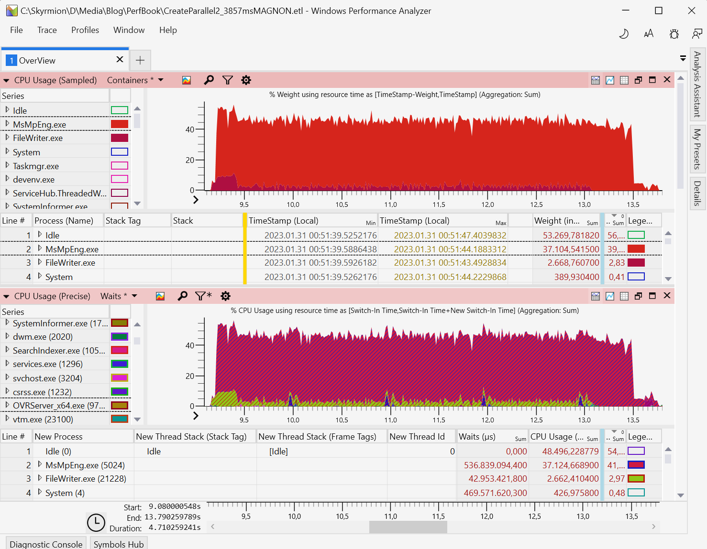
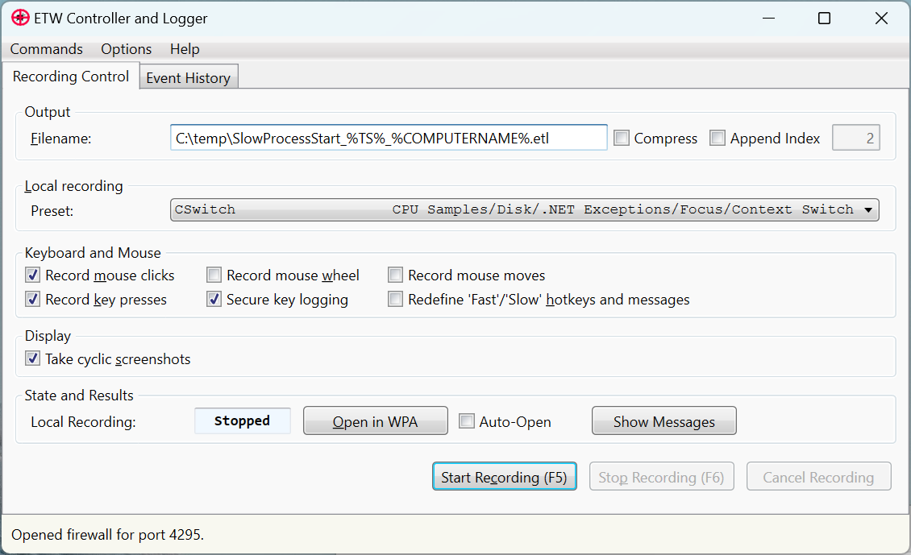
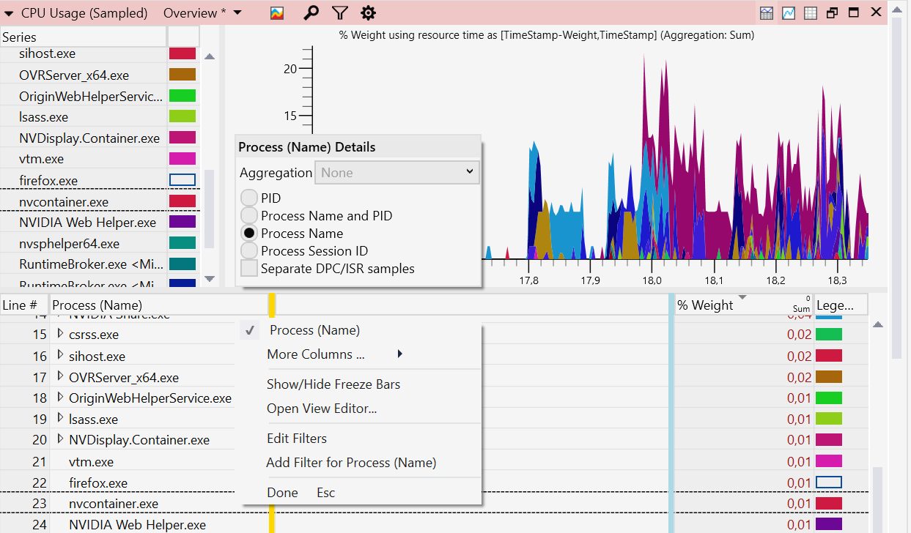
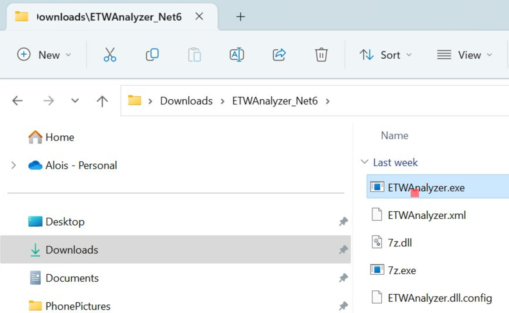
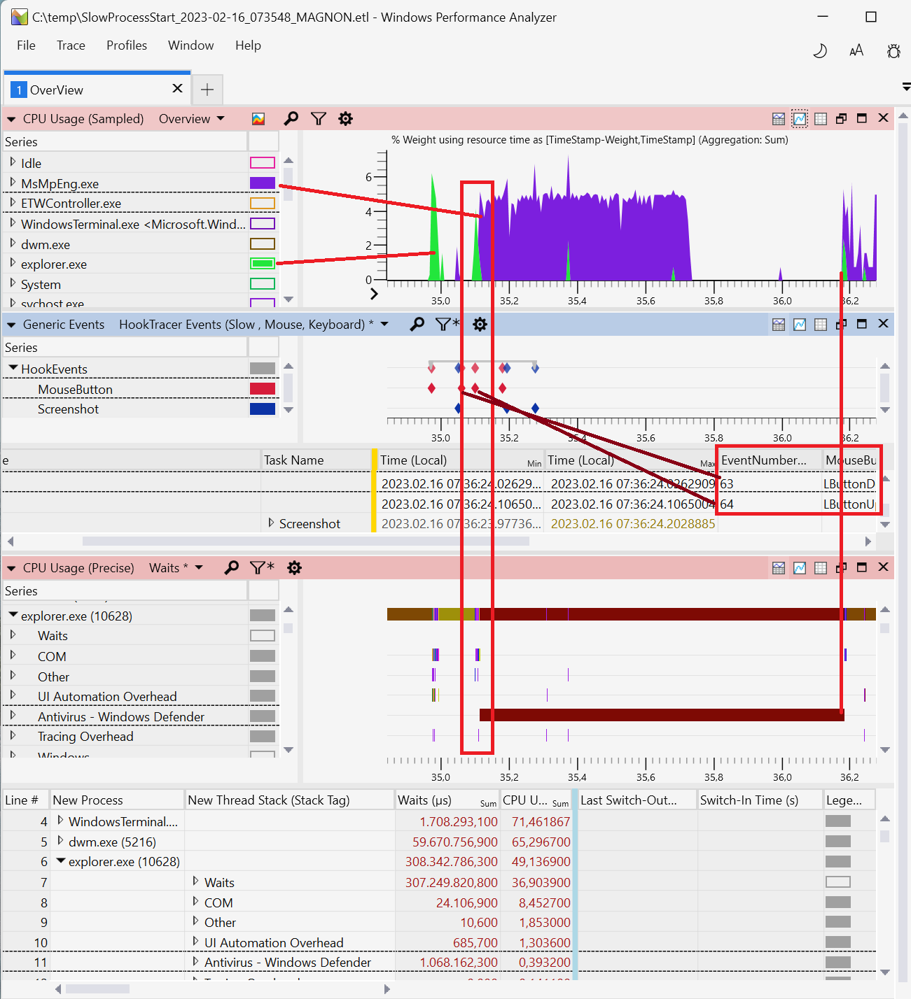
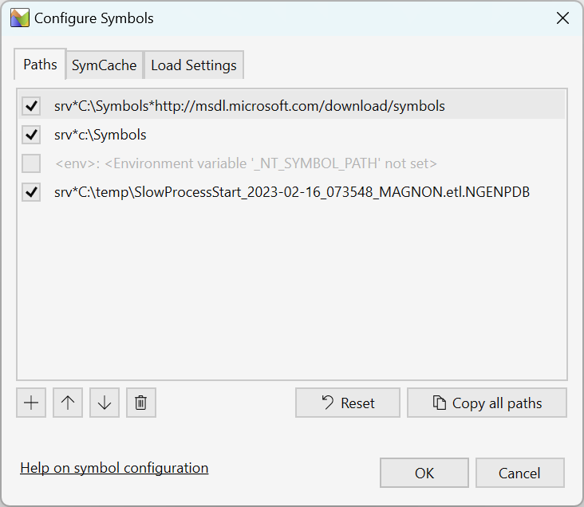
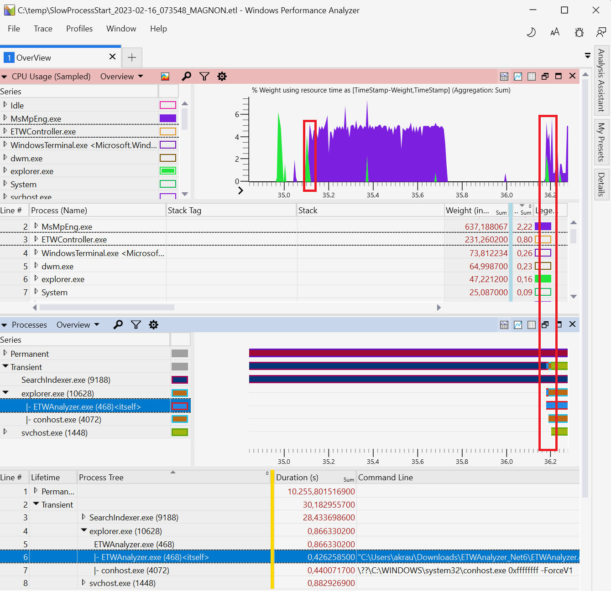
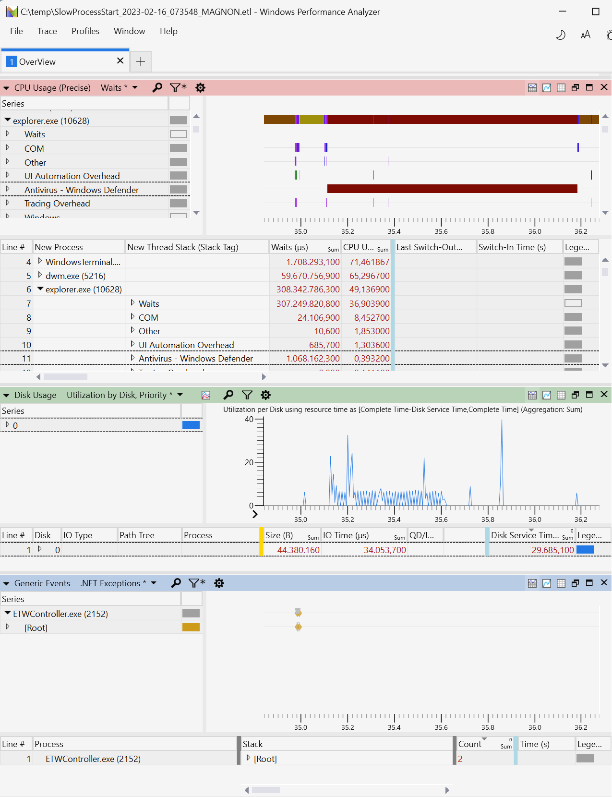

# Overview Of Performance Analysis Tools {#sec:secOverviewPerfTools}


## Event Tracing for Windows
Microsoft has invested in a system wide tracing facility named Event Tracing for Windows (ETW).
 The main difference to the many Linux tracers is its ability to write structured events in user and kernel code with full stack trace support. Stack traces are essential to solve many challenging performance issues. They are the difference between knowing that someone did consume all CPU/Disk/Network/... vs. who did it in which source file.
 ETW is available on all supported Windows platforms (x86, x64 and ARM) with the corresponding platform dependent installation packages.
 

### What can you do with it: {.unlisted .unnumbered}
- Everything below is recorded system wide for all processes with configurable stack traces (kernel and user mode stacks combined).
- Look at CPU hotspots with a configurable CPU sampling rate from 1/8 ms = 8 kHz up to 10 s = 1/10 Hz. Default is 1ms which costs ca. 5-10% execution performance.
- Who blocks your threads and for how long (e.g. late event signals, unnecessary thread sleeps, ...) with Context Switch traces.
- Find system issues where you need to track multi process causality chains or even cross machine with the help of correlation events to sync timepoints.
- Examine how fast your disk/s serves read/write requests and who initiates that work.
- Check file access performance and patterns (includes cached read/writes which lead to no disk IO).
- Trace the TCP/IP stack how packets flow between network interfaces and computers.
- Add your own ETW Trace provider to correlate the system wide traces with your application behavior.

### What you cannot do with it: {.unlisted .unnumbered}

 - Examine CPU bottlenecks in detail.
   - Use VTune which offers much more details how the CPU accesses code and data.
 - How often a method was executed 
   - If you instrument your own methods with enter/leave ETW tracing it is possible.
 - Record high volume events for hours like thread wait (Context Switch) tracing. ETW records at system level all processes which is great, but generates a lot 
   (ca. 1-2 GB/minute) of data.

## Getting ETW Data
To enable system wide profiling you must be administrator and have the privilege *SeSystemProfilePrivilege* enabled. 

Recording ETW data is possible without any extra download since Windows 10 with Wpr.exe. The \underline{W}indows \underline{P}erformance \underline{R}ecorder tool supports 
a set of built-in recording profiles which are ok for common performance issues. You can tailor your recording needs by authoring a custom performance recorder profile xml file (.wprp).

You can download the Windows Performance Toolkit from the Windows SDK[^1] or ADK[^2] download page. 
The installation is a two step process. First you download a small installer which will give you the options to download just the parts, in this case the Windows Performance Toolkit, you need.
You are allowed to redistribute WPT e.g. as part of your own application.

## ETW Recording Tools
- wpr.exe 

  Part of Windows 10 and Windows Performance Toolkit.
  
  Command line recording tool.
- WPRUI.exe 

  Part of Windows Performance Toolkit
  
  Simple UI for recording ETW data.
- xperf

  Part of Windows Performance Toolkit.
  
  Command line predecessor of Wpr.
- PerfView[^3]

  Open Source by Microsoft.
  
  Graphical recording and analysis tool with the main focus on .NET Applications.
  It can also process memory dumps to track .NET application leaks.
- Performance HUD[^7]

  Little known but very powerful UI to track UI delays, User/Handle leaks via live ETW recording all unbalanced
  resource allocations with a live display of leaking/blocking stack traces.
- ETWController[^4]  

  Open Source by Alois Kraus
  
  Recording tool with the ability to record keyboard input and screenshots along with ETW data.
  Supports also distributed profiling on two machines simultaneously.
- UIForETW[^6]    
   
  Open Source by Google (Bruce Dawson)
  Wrapper around xperf with special options to record data for Google Chrome issues. Can also record
  keyboard and mouse input.

## ETW Viewing/Analysis Tools
- Windows Performance Analyzer (WPA)
  It is the most powerful UI in existence for viewing ETW data. There are not many system wide analysis tools out there. One comparable tool is TraceCompass from the Eclipse foundation.

  {#fig:WPAOverview width=90%}

  WPA can visualize and overlay Disk, CPU, GPU, Network, Memory, Process and many more data sources to get a holistic understanding 
  how your system behaves and what it was doing. When people look at the charts of a visualized performance issue it might look too easy. Although the UI is very nice it is on a level with with Windbg in terms of complexity. You need to know how your application interacts with your language runtime (e.g. .NET Common Language Runtime, C-Runtime, JavaScript, ...), the operating system and other processes which constitute your system. 
  Figure @fig:WPAOverview shows e.g. how a test application (FileWriter.exe) that writes many small files is blocked by the parallel activity of Windows Defender (MsMpEng.exe). There are two CPU graphs which look similar, but show different data. The first graph shows *CPU Usage (Sampled)* which is useful to see where CPU is spent. The latter graph *CPU Usage (Precise)* is generated by visualizing data of the Windows Thread Scheduler (Context Switch Events) which contain a lot of data like how long on which CPU a thread was running (CPU Usage), how long it was blocked in a kernel call (Wait), in which priority and how long the thread had been waiting for a CPU to become free (Ready Time) just to name the most important ones. 

  Microsoft has invested also in Linux observability. As a result of this WPA has been opened up to support plugins to process any data, not just ETW traces. Today you can view Linux/Android[^8] profiling data with WPA generated from these tools
  - perf
  - LTTNG
  - Perfetto

  and the following log file formats

  - Dmesg
  - Cloud-Init
  - WaLinuxAgent
  - AndoidLogcat

- PerfView

  It is mainly used to troubleshoot .NET applications. The ETW events fired for Garbage Collection and JIT compilation are parsed and easily accessible as reports or CSV data. 

- ETWAnalyzer[^5]

  It reads ETW data and generates aggregate summary Json files which can be queried, filtered and sorted
  at command line or exported to a CSV file.
   
## Case Study - Slow Program Start

**Problem:** When double clicking on a downloaded executable in Windows Explorer it is started with a noticeable delay. Something seems to delay process start.

### Preparation
- Download a tool to record ETW data and screenshots like ETWController[^4].
- Download the latest Windows 11 Performance Toolkit[^1] to be able to view the data with WPA. 
  - Ensure that the newer Win 11 wpr.exe comes first in your path by moving the install folder of the WPT before the C:\\Windows\\system32 in the System Environment dialog. This is how it should look like: 
```
    C>where wpr 
    C:\Program Files (x86)\Windows Kits\10\Windows Performance Toolkit\wpr.exe
    C:\Windows\System32\wpr.exe
```

### Measurement

{#fig:ETWControllerUI width=90%}

- Start ETWController
- Select the CSwitch profile to track thread wait times along with the other default recording settings. 
   - Keep the check boxes *"Record mouse clicks"* and *"Take cyclic screenshots"* enabled to be later able to navigate to the slow spots with the help of the screen shots. See @fig:ETWControllerUI.
 - Press *"Start Recording"*
 - Download some executable from the internet, unpack it and double click the executable to start it. 
 - After that you can stop profiling by pressing the *"Stop Recording"* button. 

Stopping profiling the first time takes a bit longer because for all managed code synthetic pdbs are generated which is a one time operation. After profiling has reached the Stopped state you can press the *"Open in WPA"* button to load the ETL file into the Windows Performance Analyzer with an ETWController supplied profile. The CSwitch profile generates a large amount of data which is stored in a 4 GB ring buffer which allows you to record 1-2 minutes before the oldest events are overwritten. Sometimes it is a bit of an art to stop profiling at the right time point. If you have sporadic issues you can keep recording enabled for hours and stop it when an event like a log entry in a file shows up, which is checked by a polling script, to stop profiling when the issue has occurred.
Windows supports Event Log and Performance Counter triggers which allow one to start a script when a performance counter reaches a threshold value or a specific event is written to an event log. If you need more sophisticated stop triggers you should take a look at PerfView which allows one to define a Performance Counter threshold which must be reached and stay there for x seconds before profiling is stopped. This way random spikes are no longer triggering false positives. 

### WPA Tables

It is important to understand what data you are looking at in the tables. You certainly have noticed the yellow and blue vertical line in every WPA table. All columns right of the blue vertical line are used as input to graph data. Data left of the yellow line are groupings by the corresponding column values. Data between the yellow and blue line is the data of individual ETW events as table which you get when you unfold all groupings or you remove all grouped data columns.
To create custom views from CPU Sampling data you can drag and drop the columns around to create new visualizations of the data. The following visualizations

- CPU by executable name (no process id)
- CPU per process instance (process with pid) process and thread
- CPU by process instance (process with pid), thread, stack by thread.

need these WPA groupings which you can configure via the View Editor (Ctrl+E or by pressing the wheel button):

-----------------------------------------------------------------------------
Column 1                 Column 2      Column 3         Column 4      Column 5    Column 6
--------                 ----------    -----------      ----------    ---------   -------- 
Process                  Yellow Bar    Blue Bar         % Weight        -         -        

Process (Name and pid)   Thread Id     Yellow Bar       Blue Bar      % Weight    -             

Process (Name and pid)   Thread Id     Stack            Yellow Bar    Blue Bar    % Weight        

-----------------------------------------------------------------------------

Table: WPA Groupings  {#tbl:wpa_groupings}

{#fig:WPA_Grouping width=100% }

To switch between Process, Process Name with PID and Process PID you need to right click on the *"Process (Name)"* column. See figure @fig:WPA_Grouping.

### Analysis in WPA

After stopping the recording we can examine the screenshots taken by ETWController to find where slowness was observed. An example is shown in figure @fig:ETWControllerScreenshot. When the profiling data is saved (the file named xx.etl) another folder named *xx.etl.Screenshots* is created. This contains all screenshots and a *Report.html* file which you can view in the browser. Every recorded keyboard/mouse interaction gets a screenshot of the form Screenshot_EventNumber e.g. Screenhot_63.jpg. This is the screenshot file of the double click event where the process start was delayed. The mouse pointer position is marked as a green square, except if a click event did occur, then it is red. This makes it easy to spot when and where a mouse click was performed.

WPA supports custom profiles to configure the graph and table data for CPU, Disk, File, ... in the way you like best. Originally it was developed for device driver developers which is reflected by the built-in profiles which do not focus on application development. ETWController brings its own profile (*Overview.wpaprofile*) which you can set as default profile under *Profiles - Save Startup Profile* to always use the performance overview profile.

{#fig:ETWControllerScreenshot width=100% }

The slow click event number 63 we can locate in the profiling data in the WPA Overview view. Then you can zoom in to the interesting time region of a potentially longer recording. The event number is part of the *Generic Events HookTracer Events(Slow, Mouse, Keyboard)* WPA view which visualizes all keyboard, mouse and timer based screenshots. See figure @fig:DefenderOverhead.

{#fig:DefenderOverhead width=100% }

While the graph and stack traces of both CPU (Sampled/Precise) graphs look similar you need to understand what you are looking at. A beginners error is that the methods in the *CPU Usage (Precise)* graph with highest CPU are most likely not the actual CPU consumers. A Context switch event is (simplified!) generated when a thread hits a blocking OS call like WaitForSingle/MultipleObject/s. If a thread is e.g. in a busy for loop spinning billions of iterations but later taking a lock all CPU will be attributed to the lock call which calls into a blocking OS call. Only the blocking operation generates a Context Switch event and not high CPU. Although the CPU consumption of a thread is measured exactly it will not help you to locate busy CPU consumers. To find CPU bottlenecks you need to look into CPU sampling data. If you want to know why your thread was not running then you need Context Switch traces. What most users expect would be a combined view which show wait times and CPU hotspots in one tool, but this is so far not supported in WPA. ETWAnalyzer merges the data, but it is a console only application with no UI. 

When you double click in explorer to start an executable you would first check if a delay in explorer.exe is happening. Since we are dealing with delays it makes sense to look at the *CPU Usage (Precise) Waits* Graph. There you will find after the first column after process *New Thread Stack (Stack Tag)* which shows the summary of all threads and what they were doing. If we look deeper we find *Antivirus - Windows Defender* with a delay of 1.068s which can be visualized as bar chart to nicely display correlations across processes. See figure @fig:WpaSlowProcessStartOverview.
You might be familiar with stack traces, but not necessarily stack tags. When you read a call stack you try to understand what an application was doing and mentally map the call stack to the applications intent. That is exactly what stack tags are for without the need to unfold the call stack to find deep inside the one key frame that is telling you what the application was doing. See[^9] for a more detailed explanation how you can define your own stacktag definitions. The stacktags from the ETWController profile originate from ETWAnalyzer[^10] which is the result of hundreds of performance issues investigated over a decade in Windows, .NET, .NET Core, GPU and Antivirus device drivers. 

All stacktag definitions which refer to a method need symbols, otherwise the stack trace to stack tag mapping will not work and you will only see stack tags which refer to modules but not specific methods. To load symbols you need to add the Microsoft symbol server and potentially your own symbol server in the *Trace - Configure Symbol Paths* dialog. See @fig:WpaSymbolLoadDialog. After that you can start loading symbols by checking the *Trace - Load Symbols* menu entry. WPA has a reputation of being slow because most users leave the remote symbol servers enabled after having downloaded the matching symbols once. 

*Pro Tip: The next time you open a new or the same ETL file be sure to uncheck all remote symbol servers, before starting to load symbols. Symbol loading will then need < 1 minute without the large delay (up to 1h) to check all remote servers again for the same symbols even when no new symbols are downloaded.*

{#fig:WpaSymbolLoadDialog width=70%}

 WPA is also useful without symbols by looking at correlations between CPU activity where in the beginning explorer was processing the double click event and suddenly Windows Defender needs 637 ms CPU followed by some idle time where no process was active and then suddenly our double clicked process (ETWAnalyer) was started ca. 1s after the double click event. Correlation is not causation, but with Context Switch Tracing you can prove that explorer was waiting on Windows Defender which is not possible by looking at CPU sampling data. 

{#fig:WpaSlowProcessStartOverview width=100% }

 Figure @fig:WpaSlowProcessStartOverview shows that even without stack traces you can find interesting patterns by looking at CPU consumption of the explorer, Defender and when the double clicked executable is started. 

{#fig:ProcessStartDiskException width=100% }

The OverView profile allows you to quickly check if an issue correlates with

- CPU
- Disk
- Memory 
- .NET Exceptions

From the *"Disk Usage Utilization by Disk, Priority"* table in figure @fig:ProcessStartDiskException we find that the disk was 29 ms active. If disk IO is near zero then it cannot be related with our > 1000 ms observed delay of a process start.


## Footnotes

[^1]: Windows SDK Downloads [https://developer.microsoft.com/en-us/windows/downloads/sdk-archive/](https://developer.microsoft.com/en-us/windows/downloads/sdk-archive/)
[^2]: Windows ADK Downloads [https://learn.microsoft.com/en-us/windows-hardware/get-started/adk-install#other-adk-downloads](https://learn.microsoft.com/en-us/windows-hardware/get-started/adk-install#other-adk-downloads)
[^3]: PerfView [https://github.com/microsoft/perfview](https://github.com/microsoft/perfview)
[^4]: ETWController [https://github.com/alois-xx/etwcontroller](https://github.com/alois-xx/etwcontroller)
[^5]: ETWAnalyzer [https://github.com/Siemens-Healthineers/ETWAnalyzer](https://github.com/Siemens-Healthineers/ETWAnalyzer)
[^6]: UIforETW [https://github.com/google/UIforETW](https://github.com/google/UIforETW)
[^7]: Performance HUD [https://www.microsoft.com/en-us/download/100813](https://www.microsoft.com/en-us/download/100813)
[^8]: Microsoft Performance Tools Linux / Android [https://github.com/microsoft/Microsoft-Performance-Tools-Linux-Android](https://github.com/microsoft/Microsoft-Performance-Tools-Linux-Android)
[^9]: Stacktags [https://learn.microsoft.com/en-us/windows-hardware/test/wpt/stack-tags](https://learn.microsoft.com/en-us/windows-hardware/test/wpt/stack-tags)
[^10]: ETWAnalyzer Stacktags [https://github.com/Siemens-Healthineers/ETWAnalyzer/blob/main/ETWAnalyzer/Configuration/default.stacktags](https://github.com/Siemens-Healthineers/ETWAnalyzer/blob/main/ETWAnalyzer/Configuration/default.stacktags)


## Todo Move to -> Apendix 

Unfortunately wpr.exe is not working reliably on all Windows 10 versions and has not been patched during the lifetime of Windows 10 (including 22H2). The official answer from MS is that any tool which can be publicly downloaded (in this case from the ADK) no servicing via Windows Update is done. 
If you find the following error while stopping ETW recording
```
C>wpr -start cpu -start dotnet  
C>wpr -stop c:\temp\test.etl 
        Cannot change thread mode after it is set.
        Profile Id: RunningProfile
        Error code: 0x80010106
```

you need to install the Windows Performance Toolkit (WPT) which is part of the Windows SDK and also of the Windows Assessment and Deployment Kit (Windows ADK). Below is a table of the known to be working WPR versions from the Windows SDKs:

--------------------------------------------------------------------------
Windows Version        Description              Recommended WPT Version
------                 ---------------------    ---------------------------------------
Windows 11                                            
10.0.22000.194         Latest                   Windows SDK for Windows 11 (10.0.22621.755) or later

Windows 10 Consumer                                      
>=  10.0.17763         1809 - 22H2              "

Windows Server 2022                                 
10.0.20348.1194        Windows 10 based 21H2    "

Windows Server 2019                                   
10.0.17763             Windows 10 based 1809    "

Windows 10 LTSC                                         
10.0.17763             Windows 10 based 1809    "

Windows Server 2016                                   
10.0.14393.5427        Windows 10 based 1607    Windows 10 SDK version 2104 (10.0.20348.0)

--------------------------------------------------------------------------

Table: Recommended Windows Performance Toolkit (WPT) for all major Windows versions. {#tbl:wpt_versions}