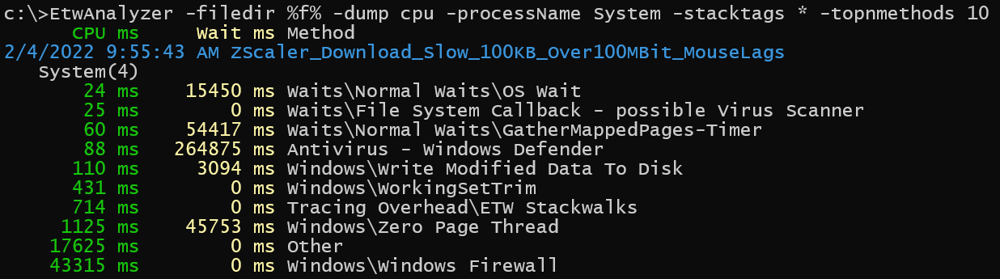

# Overview Of Performance Analysis Tools {#sec:secOverviewPerfTools}


# Windows
Microsoft has invested into a system wide tracing facility named Event Tracing for Windows (ETW).
 The main difference to the many Linux tracers is its ability to write structured events in user and kernel code with full stack trace support. 
 To enable system wide profiling you must be 
 administrator and have the privilege *SeSystemProfilePrivilege* enabled. Kernel events are always recorded system wide from all processes giving you a holistic view of the system.
 Stack traces are essential to solve many challenging performance issues which otherwise would be impossible to solve. 
 
Recording ETW data is possible without any extra download since Windows 10 with Wpr.exe. The \underline{W}indows \underline{P}erformance \underline{R}ecorder tool supports 
a set of builtin recording profiles which are ok for common performance issues. You can tailor your recording needs by authoring a custom performance recorder profile xml file (.wprp).

Unfortunately wpr.exe is not working reliably on all Windows 10 versions and has not been patched during the lifetime of Windows 10 (including 22H2). The official answer from MS is that any tool which can be publicly downloaded (in this case from the ADK) any servicing via Windows Update is be denied. 
If you find the following error while stopping ETW recording
```
C>wpr -start cpu -start dotnet  
C>wpr -stop c:\temp\test.etl 
        Cannot change thread mode after it is set.
        Profile Id: RunningProfile
        Error code: 0x80010106
```

you need to install the Windows Performance Toolkit (WPT) which is part of the Windows SDK and also of the Windows Assessment and Deployment Kit (Windows ADK). Below is a table of the known to be working WPR versions from the Windows SDKs:

--------------------------------------------------------------------------
Windows Version        Description              Recommended WPT Version
------                 ---------------------    ---------------------------------------
Windows 11                                            
10.0.22000.194         Latest                   Windows SDK for Windows 11 (10.0.22621.755) or later

Windows 10 Consumer                                      
>=  10.0.17763         1809 - 22H2              "

Windows Server 2022                                 
10.0.20348.1194        Windows 10 based 21H2    "

Windows Server 2019                                   
10.0.17763             Windows 10 based 1809    "

Windows 10 LTSC                                         
10.0.17763             Windows 10 based 1809    "

Windows Server 2016                                   
10.0.14393.5427        Windows 10 based 1607    Windows 10 SDK version 2104 (10.0.20348.0)

--------------------------------------------------------------------------

Table: Recommended Windows Performance Toolkit for all major Windows versions. {#tbl:wpt_versions}

You can download the Windows Performance Toolkit from the Windows SDK[^1] or ADK[^2] download page. 
The installation is a two step process. You download a small installer which will give you the options to download just the parts, in this case the Windows Performance Toolkit, you need.
You are allowed to redistribute WPT e.g. as part of your own application.

## ETW Recording Tools
- wpr.exe 

  Part of Windows 10 and Windows Performance Toolkit.
  
  Command line recording tool.
- WPRUI.exe 

  Part of Windows Performance Toolkit
  
  Simple UI for recording ETW data.
- xperf

  Part of Windows Performance Toolkit.
  
  Predecessor command line predecessor of Wpr.
- PerfView[^3]

  Open Source by Microsoft.
  
  Recording and analysis tool with the main focus on .NET Applications.
  It can also process memory dumps to track .NET application leaks.
- Performance HUD[^7]

  Track UI delays, User/Handle leaks by live ETW recording all unbalanced
  resource allocations with a live display of leaking/blocking stack traces.
- ETWController[^4]  

  Open Source by Alois Kraus
  
  Recording tool with the ability to record keyboard input and screenshots along with ETW data.
  Supports also distributed profiling on two machines simultaneously.
- UIForETW[^6]    
   
  Open Source by Google (Bruce Dawson)
  Wrapper around xperf with special options to record data for Google Chrome issues. Can also record
  keyboard and mouse input.

## ETW Viewing/Analysis Tools
- Windows Performance Analyzer (WPA)
  It is the most powerful UI in existence for viewing ETW data. It is comparable to TraceCompass from the Eclipse foundation.
  {#fig:WPAOverview width=90%}
  Since Microsoft invests also in Linux observability WPA has been opened up to support plugins to process any data, not just
  ETW traces. You can also view Linux/Android[^8] profiling data with WPA from these tools
  - perf
  - LTTNG
  - Perfetto

  and the following log file formats

  - Dmesg
  - Cloud-Init
  - WaLinuxAgent
  - AndoidLogcat

- PerfView

  It is mainly used to troubleshoot .NET applications. The ETW events fired for Garbage Collection and JIT compilation are parsed and easily accessible as reports or CSV data. 

- ETWAnalyzer[^5]

  It reads ETW data and generates aggregate summary Json files which can be queried, filtered and sorted
  at command line or exported to a CSV file.
   
  {#fig:DumpStackTags width=90%}

\sectionbreak


## Footnotes

[^1]: Windows SDK Downloads [https://developer.microsoft.com/en-us/windows/downloads/sdk-archive/](https://developer.microsoft.com/en-us/windows/downloads/sdk-archive/)
[^2]: Windows ADK Downloads [https://learn.microsoft.com/en-us/windows-hardware/get-started/adk-install#other-adk-downloads](https://learn.microsoft.com/en-us/windows-hardware/get-started/adk-install#other-adk-downloads)
[^3]: PerfView [https://github.com/microsoft/perfview](https://github.com/microsoft/perfview)
[^4]: ETWController [https://github.com/alois-xx/etwcontroller](https://github.com/alois-xx/etwcontroller)
[^5]: ETWAnalyzer [https://github.com/Siemens-Healthineers/ETWAnalyzer](https://github.com/Siemens-Healthineers/ETWAnalyzer)
[^6]: UIforETW [https://github.com/google/UIforETW](https://github.com/google/UIforETW)
[^7]: Performance HUD [https://www.microsoft.com/en-us/download/100813](https://www.microsoft.com/en-us/download/100813)
[^8]: Microsoft Performance Tools Linux / Android [https://github.com/microsoft/Microsoft-Performance-Tools-Linux-Android](https://github.com/microsoft/Microsoft-Performance-Tools-Linux-Android)

