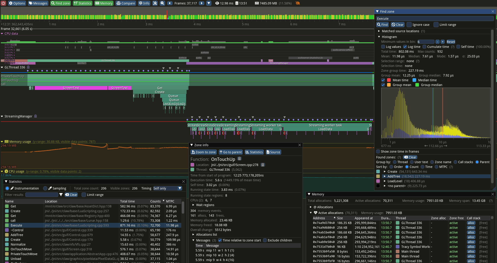
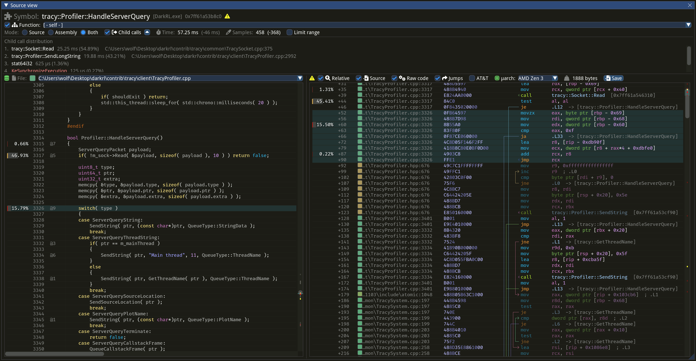

## Tracing profilers
Most of the tools explored so far fall under the category of sampling profilers. These are great when you want to identify hot-spots in your code, but in some cases they might not provide enough granularity for analysis. Depending on the profiler sampling frequency and the behavior of your program, most functions could be fast enough that they don't show up in a profiler. In some scenarios you might want to manually define which part of your program need to be measured consistently. This is true, for instance, with video games. As a brief overview, video games render frames (the final image shown on screen) on average at 30 of 60 frames per second (FPS). This means each frame has between 16 to 33ms to complete the work before moving on to the next one. Developers pay particular attention to frames that go above this threshold, as this causes visible stutter in game. This situation is hard to capture with a sampling profiler, as they usually provide the total time taken for a given function.

For this reasons, developers have created tracing profilers. These profilers allow them to manually insert profiling section in their program so that they can determine exactly which functions or methods to track. There are a few tools in this space: some are integrated directly into game engines like Unreal, while others are provided as external libraries that can be integrated into each project. Some of the most commonly used profilers are Tracy (https://github.com/wolfpld/tracy), Remotery (https://github.com/Celtoys/Remotery) and Optick (https://github.com/bombomby/optick, Windows only).

We are going to focus on Tracy, as this seems to be one the more popular projects, however the concepts apply to the other profilers as well. Profiling a section of code is really simple: you just need to import Tracy's header and mark the function to be profiled:
```c++
void my_function()
{
    ZoneScoped;

    ...
}
```
The `ZoneScoped` macro will create an object on the stack with an associated timestamp. Once the function exits, the object will record a new timestamp and will store this timing data along with a few other details, including the function name. The implementation has very little overhead, although care must be taken when profiling sections of the code like tight loops.

Tracy has two operation modes: it can store all the timing data until the profiler is connected to the application, or it can simply discard the data and start recording as soon as a profiler is connected. The latter is usually the preferred option, as it means the tracing code can be compiled into the code and will cause little to no overhead to the running program unless the profiler is attached.

The profiler is a separate application that attaches to a running program to record and display the profiling data. The profiler can be run on a separate machine so that it doesn't interfere with the running application. Here is an example of the profiler output:
{#fig:Tracy_Profiler width=90%}
As you can see, the profiler provides plenty of details. The main view shows the stack for all the zones that were active during a given frame. Above the main view, you can see the histogram for all the recorded frames, which makes it easier to spot a long running frame (the red bar in the picture) that could cause stutter. Below the main view CPU and memory usage are displayed. Memory allocations can be manually tracked as well, and are displayed in the memory window (bottom-right of the image). This can be useful to spot memory leaks or to determine which parts of the application are responsible for a given memory allocation. Tracy allows to track separate memory pools as well, which can be useful if multiple allocators are being used.

The window on the bottom-left of the image shows the statistics for the data recorded so far, including the total time a given function function was active, how many times it was invoked, etc. It's also possible to select a time range in the main view an analyze the statistics only for that time interval. The window of the bottom-mid of the image shows the details for a give zone. Finally, the window on the top-left shows the time histogram for a given zone. This is particularly useful to determine how much variation there is when executing a function. By default, Tracy also tracks other details about the profiled application, including threads that have not been explicitly profiled. It also tracks which core a given thread is executing and it displays context switches when hovering the mouse on a given section in the CPU data view.

If debug symbols are available, Tracy can also display hot spots in the source code and related assembly:
{#fig:Tracy_Profiler width=90%}

Tracy provides many other features, too many to cover in this overview. They include:
- session comparison: this is vital to ensure a change provides the expected benefits. It's possible to load two profiling sessions and compare the timings for a given zone.
- graphics API profiling: Tracy supports OpenGL, Vulkan and DirectX. Much like with CPU code, it's possible to insert markers in the GPU command stream. The driver will report the time taken to execute in between markers and Tracy will display the information in the profiler.

Tracy provides a detailed user manual which goes into each feature's detail: https://github.com/wolfpld/tracy/releases/download/v0.9/tracy.pdf. The author also provides an interactive demo if you'd like to get a feel for the capabilities of this tool: https://tracy.nereid.pl/.
